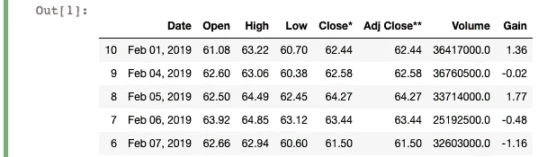
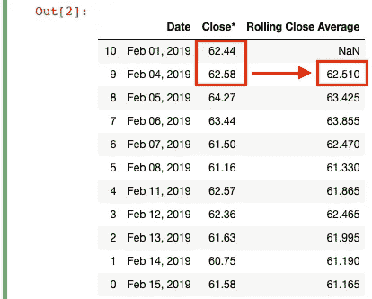
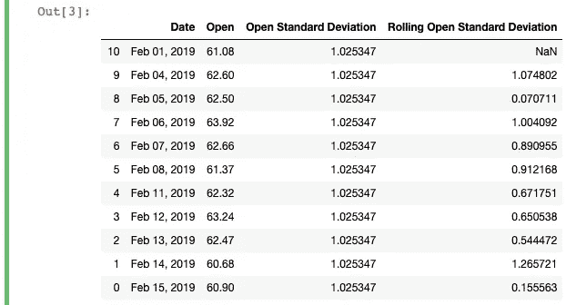
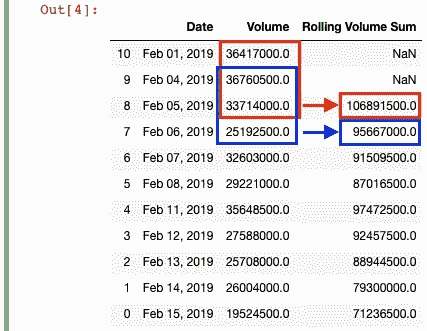

# 不要错过熊猫的滚动窗口功能

> 原文：<https://towardsdatascience.com/dont-miss-out-on-rolling-window-functions-in-pandas-850b817131db?source=collection_archive---------4----------------------->

## 大蟒

## 使用移动窗口计算深入研究您的数据


艺术由 [bythanproductions](https://www.instagram.com/bythanproductions/)

窗口计算可以增加数据分析的深度。

Pandas 库允许您执行许多不同的内置聚合计算，定义您的函数并在数据帧中应用它们，甚至可以同时处理数据帧中的多个列。Pandas 中有一个你以前可能没听说过的功能是内置的**窗口** **功能**。

窗口函数非常有用，因为您可以对数据子集执行许多不同种类的操作。滚动窗口函数专门用于计算数据帧中每一行的新值。这听起来可能有点抽象，所以让我们深入解释和例子。

这篇文章中的例子将使用雅虎财经的一些旧的特斯拉股票价格数据。如果您想继续，请随意运行下面的代码。关于`pd.read_html`和`df.sort_values`的更多信息，请查看本文末尾的链接。

```
import pandas as pddf = pd.read_html("[https://finance.yahoo.com/quote/TSLA/history?period1=1546300800&period2=1550275200&interval=1d&filter=history&frequency=1d](https://finance.yahoo.com/quote/TSLA/history?period1=1546300800&period2=1550275200&interval=1d&filter=history&frequency=1d)")[0]
df = df.head(11).sort_values(by='Date')
df = df.astype({"Open":'float',
                "High":'float',
                "Low":'float',
                "Close*":'float',
                "Adj Close**":'float',
                "Volume":'float'})
df['Gain'] = df['Close*'] - df['Open']
```



样本修改特斯拉股票数据来自[雅虎财经](https://finance.yahoo.com/quote/TSLA/history?period1=1546300800&period2=1550275200&interval=1d&filter=history&frequency=1d)

# 熊猫数据框架中的滚动函数

那么什么是滚动窗口计算呢？

处理时序数据时，通常会使用滚动计算。同样，**窗口**是您执行窗口计算的行的子集。在你定义了一个窗口之后，你可以执行诸如计算运行总数、移动平均、排名等操作。

让我们用一些例子来澄清这一点。

## 1.窗口滚动平均值(移动平均值)

移动平均值计算基于我们指定的窗口为每一行创建一个更新的平均值。这种计算也称为“滚动平均值”，因为它是在数据帧中计算每行在指定范围内的平均值。

这听起来有点抽象，所以让我们计算一段时间内“收盘”价格的滚动平均值。为此，我们将运行以下代码:

```
df['Rolling Close Average'] = df['Close*'].rolling(2).mean()
```



滚动平均结果

我们正在创建一个新的列“滚动收盘价平均值”,它采用一个窗口内收盘价的移动平均值。要做到这一点，我们只需编写`.rolling(2).mean()`，其中我们指定一个窗口“2”，并计算数据帧中每个窗口的平均值。每一行的“滚动收盘平均值”等于其“收盘*”值加上前一行的“收盘*”值除以 2(窗口)。本质上是`Moving Avg = ([t] + [t-1]) / 2`。

实际上，这意味着第一个计算值`(62.44 + 62.58) / 2 = 62.51`，即 2 月 4 日的“滚动收盘平均值”。数据帧中的第一行没有滚动平均值，因为在计算中没有可用的`[t-1]`或前期“收盘*”值，这就是 Pandas 用`NaN`值填充它的原因。

## 2.窗口滚动标准偏差

为了进一步了解常规计算和滚动计算之间的区别，让我们来看看“开盘价”的滚动标准差。为此，我们将运行以下代码:

```
df['Open Standard Deviation'] = df['Open'].std()
df['Rolling Open Standard Deviation'] = df['Open'].rolling(2).std()
```



滚动标准差结果

我还为标准偏差添加了一个新列“开放标准偏差”,它只是计算整个“开放”列的标准偏差。在它旁边，您会看到“滚动开放标准偏差”列，其中我定义了一个 2 的窗口，并计算了每行的标准偏差。

就像前面的例子一样，第一个非空值位于 DataFrame 的第二行，因为这是同时具有`[t`和`[t-1]`的第一行。你可以看到当你在表格中向下移动时，移动标准差是如何变化的，这对于跟踪一段时间内的波动性很有用。

Pandas 在计算标准差时使用 N-1 个自由度。您可以向`ddof`传递一个可选参数，该参数在`std`函数中默认设置为“1”。

## 3.窗口滚动和

作为最后一个例子，让我们计算“Volume”列的滚动总和。为此，我们运行以下代码:

```
df['Rolling Volume Sum'] = df['Volume'].rolling(3).sum()
```



滚动求和结果

我们定义了一个窗口“3”，所以第一个计算值出现在第三行。然后，求和计算“滚动”到每一行，这样您就可以跟踪当前行和前两行值的总和。

这里需要强调的是，这些*滚动*(移动)计算不应与*运行*计算混淆。如上图所示，滚动计算有一个移动窗口。因此，对于我们的移动总和，2 月 6 日(第四行)的计算值不包括 2 月 1 日(第一行)的值，因为指定的窗口(3)没有追溯到那么远。相比之下，运行计算需要不断将每一行的值添加到整个数据帧的运行总值中。你可以检查一下`cumsum`函数。

我希望您发现这个关于熊猫使用包装器进行逻辑比较的非常基本的介绍很有用。请记住，只比较可以比较的数据(即不要尝试将字符串与浮点数进行比较)，并手动复查结果，以确保您的计算产生了预期的结果。

往前走，比较一下！

```
**More by me:
*** [**2 Easy Ways to Get Tables From a Website**](/2-easy-ways-to-get-tables-from-a-website-with-pandas-b92fc835e741?source=friends_link&sk=9981ddaf0785a79be893b5a1dd3e03dd) ***** [**4 Different Ways to Efficiently Sort a Pandas DataFrame**](/4-different-ways-to-efficiently-sort-a-pandas-dataframe-9aba423f12db?source=friends_link&sk=97821818c45f0bdbdbc8d341a14ecddd)
- [Top 4 Repositories on GitHub to Learn Pandas](/top-4-repositories-on-github-to-learn-pandas-1008cb769f77?source=friends_link&sk=d3acc38062490a86ecb46875342224e6)
- [How to Quickly Create and Unpack Lists with Pandas](/how-to-quickly-create-and-unpack-lists-with-pandas-d0e78e487c75?source=friends_link&sk=32ea67b35fe90382dc719c1c78c5900c)
- [Learning to Forecast With Tableau in 5 Minutes Or Less](/learning-to-forecast-effectively-with-tableau-in-6-minutes-or-less-3d77a55930a0?source=friends_link&sk=9abdfd7533ee9a31ab8a036413450059)
```