# 不要过度规划您的数据可视化

> 原文：<https://towardsdatascience.com/dont-over-plan-your-data-visualization-737c7330d80f?source=collection_archive---------36----------------------->

## 通往伟大数据的道路充满了意想不到的事情


这篇文章解释了如何制作上面的动画地图。

这篇文章的标题很容易以“10 大经验”或“5 个简单的步骤”开始。我们，处理数据的人，喜欢遵循某种框架或实验测试的方法。但是想出一个用于数据可视化的将是一个很大的挑战。

复杂数据可视化的开发不是一个由许多标准化步骤连接在一起的起点和终点的过程。这更像是一个重复的、快速的原型制作过程，中间的步骤直到你完成后才能知道。数据可视化的这一特征可能会非常消极，尤其是对于那些喜欢遵循详细计划的人。

如果您陷入了又一个意想不到的错误，看起来像是又一个挫折，那么就像驾船航行一样创建数据可视化。当你在船上时，你可能会看到地平线上的目的港，并知道如何到达那里。但是你最终要走的路很可能会偏离你最初的计划。这将取决于不断变化的风，海浪的高度，水深，甚至其他船只的交通。与数据可视化一样，在完成之前，您不会真正知道您的路线是什么样子。

在过去的几周里，我重新创建了我最喜欢的可视化工具之一——由[卡梅隆·贝卡里奥](https://twitter.com/cambecc)设计的著名的[风地图](https://earth.nullschool.net/)。在这篇文章中，我想反思我的设计过程，特别是**描述所有我不可能计划到的小挫折，但这些挫折最终改善了我的视觉叙事**。如果你发现自己被困在使数据可视化的路上，如果你看不到你的目的地，你面前有一本好书。

但是如果阅读不是你的事情，而你只是想看代码——请，也欢迎。继续滚动到底部，在那里我用代码链接了可观察的笔记本。

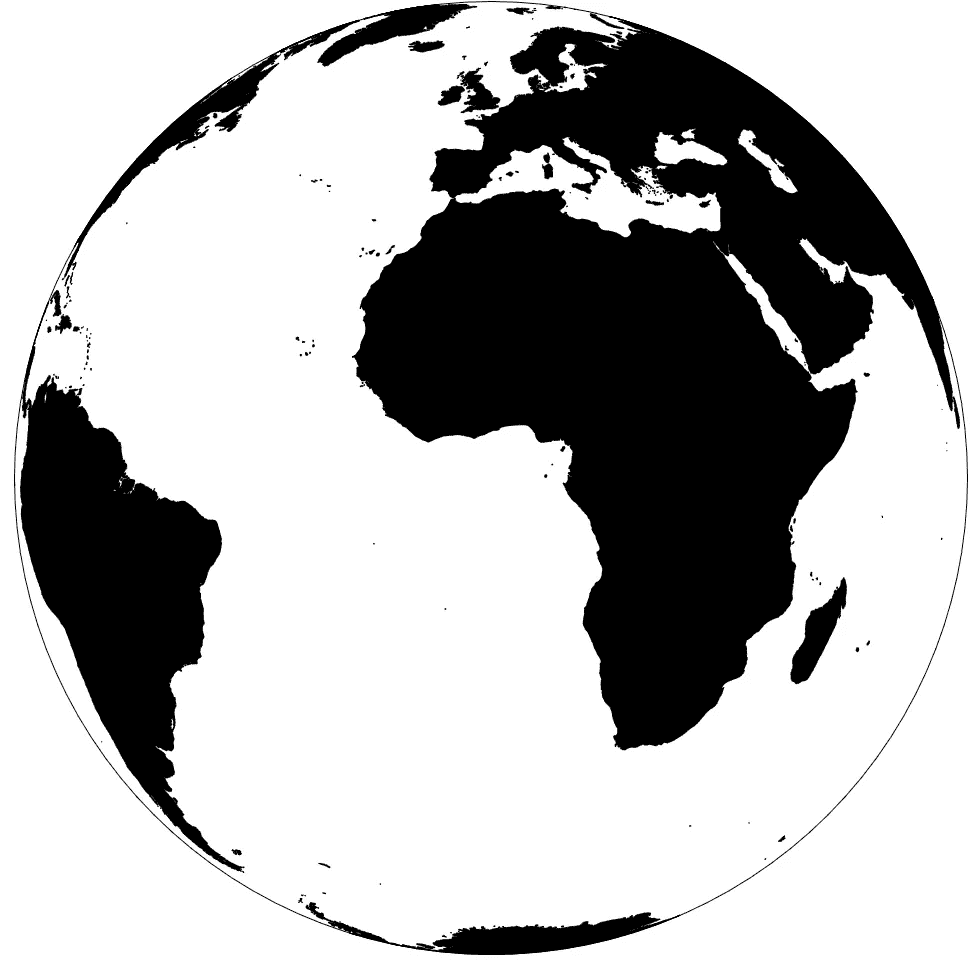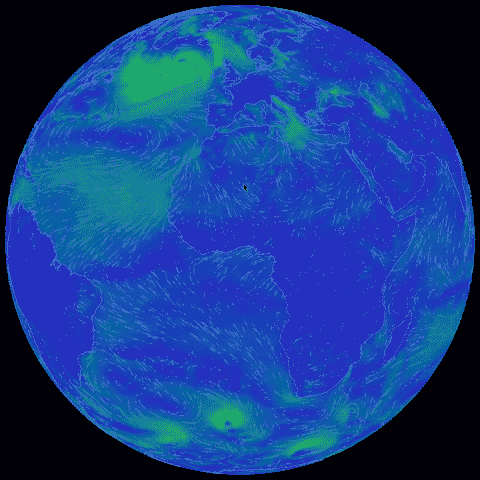

我们从一张空地图开始。我们将以一件美丽的事情结束。

# 实施基本功能和第一个减速带

我喜欢从实现基本功能开始我的设计。缩放、平移、滑动——它们越通用，我就越有可能在第一步中包括它们。在我的地图中，我想包含的前两件事是拖动和缩放行为。我构建了它们

```
wind_map = { const svg = d3.create('svg')
                .attr('viewBox', [0, 0, width, height])
                .attr("fill", "none")

  const map = svg.append("g")
                 .attr("id", "map")
                 .call(d3.drag()
                         .on("start", dragstarted)
                         .on("drag",  dragged)
                         .on("end", dragend)) //...
}
```

用`dragstarted()`、`dragged()`和`dragend()`作为助手函数，负责拖动事件开始、期间和结束时的行为。但是我很快注意到`d3.drag()`的默认行为允许向各个方向拖动。在地球仪的情况下，可以更改地球仪的滚动、俯仰和偏航，并将地球仪旋转到北方不面向可视化顶部的位置。看下面 gif 上我的意思。

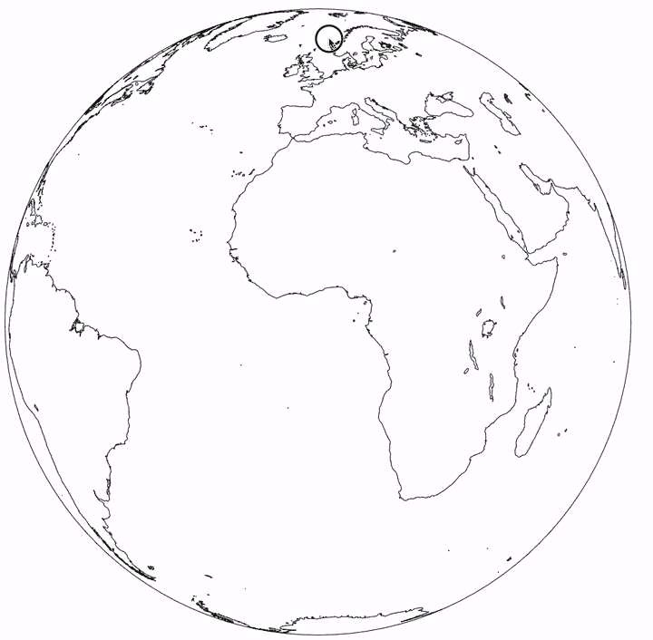

面对可视化的顶部，从北方偏离几乎是不合理的。

这种功能会引入不必要的混乱和干扰。我通过设置绕`y`轴的旋转(或者，更详细地说，将欧拉旋转角度 *γ* 设置为 0)来停止这个操作。

我用`d3.zoom()`实现了缩放行为，使用了与拖动行为相同的结构。我又添加了一个调用，使用`zoomstarted()`、`zoomed()`和`zoomend()`助手函数来实现缩放开始、期间和结束时的行为。

```
map.call(d3.zoom()
   .scaleExtent([400, 1000])
   .on("start", zoomstarted)
   .on("zoom", zoomed)
   .on("end", zoomend))
```

图表上的缩放比例一出现，很明显也需要调整。默认`d3.zoom()`允许在缩放过程中拖动。这看起来是一个多余的干扰，通过删除几行很快就解决了。

带着一个可以缩放和拖动的地球仪，我准备进入下一个阶段。

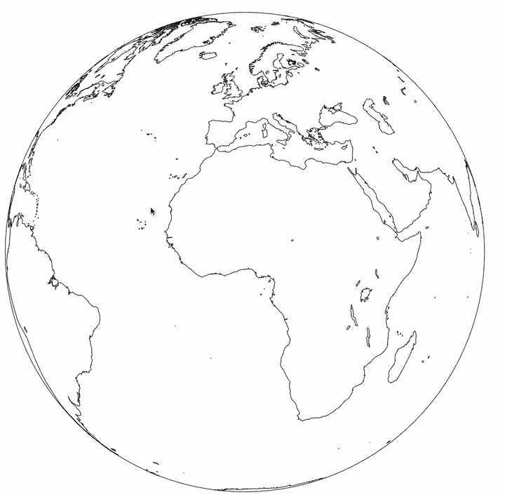

基本功能已经就绪。

# 获取数据

为了开始将颜色引入风地图的风叠加，我需要数据。获取包含数据的数据文件很容易，但是提取它却不容易。

在美国国家海洋和大气管理局(NOAA)的网站上，你可以找到一个[全球预报系统](https://www.ncdc.noaa.gov/data-access/model-data/model-datasets/global-forcast-system-gfs)。它可以预测地球上任何地方的一系列参数(如温度、云量、风力和风向)。

数据被打包成一种很难处理的 GRIB 格式。它在等距网格上对二维数据的值进行编码。例如，分辨率为 1 度的 GRIB 温度文件将给出以下各项的温度:

```
(0⁰E, 0⁰N), (1⁰E, 0⁰N),… (180⁰E, 0⁰N), (179⁰W, 0⁰N),… (2⁰W, 0⁰N), (1⁰W, 0⁰N) \n
(0⁰E, 1⁰N), (1⁰E, 1⁰N),… (180⁰E, 1⁰N), (179⁰W, 1⁰N),… (2⁰W, 1⁰N), (1⁰W, 1⁰N) \n
(0⁰E, 2⁰N), (1⁰E, 2⁰N),… (180⁰E, 2⁰N), (179⁰W, 2⁰N),… (2⁰W, 2⁰N), (1⁰W, 2⁰N) \n
...
```

但是使 GRIB 文件难以处理的是它们是以二进制编码的。除非你使用一个单独的程序或库来解码它，否则没有办法从原始的 GRIB 文件中理解它。这又引入了对后端解码和提供解码的 GRIB 文件的需求。

起初，我计划让我的可视化自动从 NOAA 网站下载最新的 GFS 数据，但是只使用 JavaScript 处理 GRIB 文件的复杂性降低了我的热情。我决定使用一个静态 JSON 文件，其中包含来自`2014-01-31T00:00:00.000Z`的风数据。为什么是这个特殊的日子？这看起来像是忙碌的一天，有许多小天气系统在地球上运行。

# 创建色标

乍一看，来自[earth.nullschool.net](https://earth.nullschool.net/)的原始色标由两部分组成:

1.  第一部分以蓝色开始，以粉色结束，是以洋红色结束的镜像 Sinebow 刻度。
2.  第二部分是品红色，其 alpha 逐渐增加，直到达到白色。


原始可视化中使用的色标

我偷看了一下风图的 Github repo，我发现色标背后的很多逻辑都是硬编码的。我开始创建自己的色标，最终得到了三个不同的版本:

*   使用默认`d3.interpolateSinebow`的基本、快速和脏秤。它基本上忽略了色阶中从品红色到白色的部分。

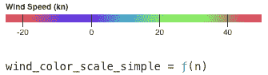

*   我使用自己的 Sinebow 插值器的精确色阶。它尽可能接近最初的实现。

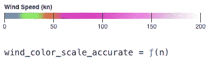

*   使用我自己的 Sinebow 插值器的高效色阶。它本质上是一个硬编码的`if`语句列表。我希望在用这种色阶生成风叠加时能达到更高的效率。

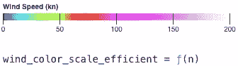

色标准备好了，除了开始上色(生成风覆盖)之外，没有什么要做的了。

# 第一次尝试添加风叠加

我经历了两次失败的尝试，才有效地将颜色添加到风图中，然后找到了我最终使用的第三个。这三种方法都有效，但是前两种不够有效，而且它们使可视化看起来不连贯和没有吸引力。

第一次尝试是快速扫描图表上的所有像素。我将检查该像素是否在可视化中。如果是，我会查找它的坐标，使用双线性插值法估计该点的风力，查找颜色，最后绘制像素。这个过程可以用下面的伪代码来描述:

```
for x in range(0, width):
  for y in range(0, height):
    flag1 = check_if_x_and_y_is_in_projection(x, y) if not flag1:
      color = black longitude, latitude = calculate_coordinates(x, y) wind_strength = calculate_wind_strength(longitude, latitude) color = color_scale(wind_strength)
```

这很有效，但是渲染要花很长时间。在缩放或拖动过程中生成图层是完全不可能的，必须将其关闭。即使使用超高效的色标也无济于事。你可以在下面的 gif 上看到实时的延迟:

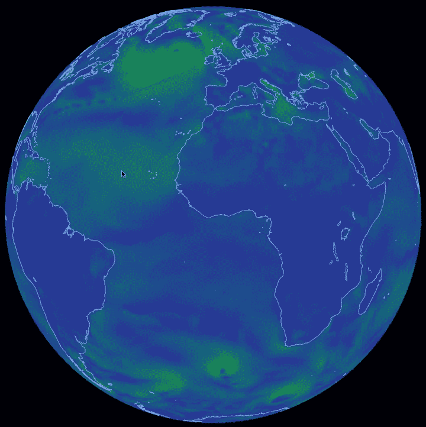

生成风覆盖图是低效的

我试图弄清楚卡梅隆·贝卡里奥是如何用一种非常相似的方法实现他的风力覆盖的，并且让它高效地运行。我无法找到它的根源，但我注意到的一件事是，他会每隔一个像素查找一次(因此渲染所需的时间减少了一半)。

我不想在拖动或缩放时被迫关闭颜色。我知道一定有办法实现它，于是我开始了下一步。

# 第二次尝试在画布上使用光栅重投影添加风叠加

这背后的逻辑是生成一个 2D 风覆盖一次，并将其保存为图像。然后，在更新时，我会调用*光栅重投影*——即将光栅图像编码的地图(如`.jpeg`或`.png`)转换为不同的地图投影(在我们的例子中，是正交地球)。

这里的假设是图像的重新投影比重新生成的计算量要小。事实证明这是真的。但是仍然不够快以允许平滑的拖动和缩放。你可以在下面的快速原型中看到这种起伏:

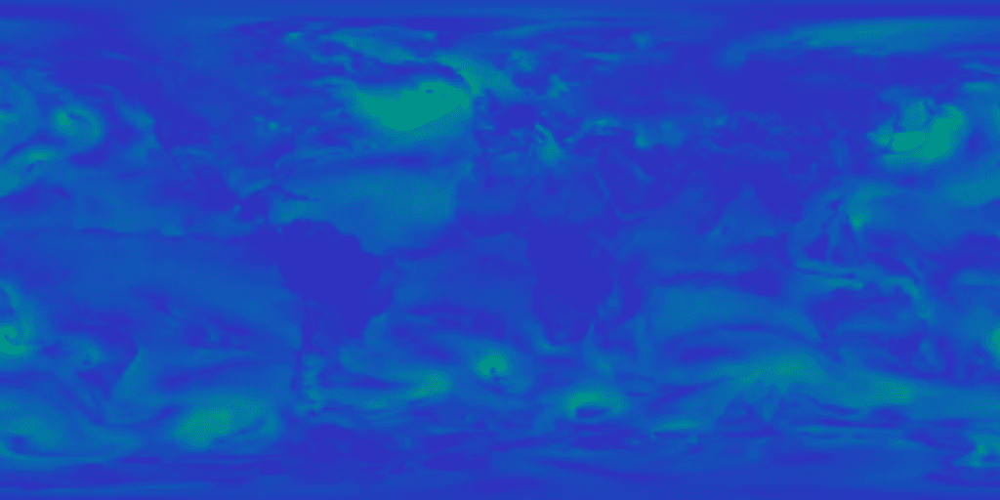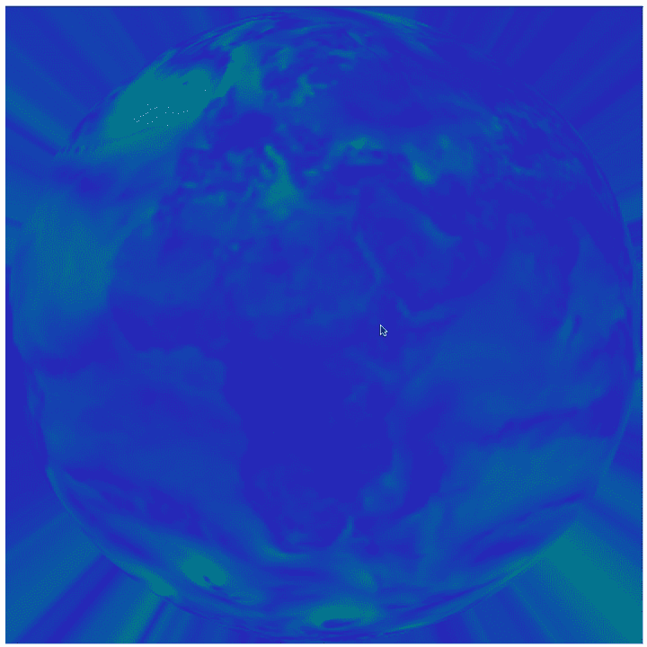

左边的 2D 地图将被重新投影到地球仪上。结果仍然不令人满意。

在这一点上，除了使用 [WebGL](https://en.wikipedia.org/wiki/WebGL) 之外，别无选择——这是一个允许 GPU 加速浏览器内动画的 JavaScript 库。

# 第三个，也是最后一个，尝试使用 WebGL 的光栅重投影来添加颜色

只有在绝对必要的时候才应该使用 WebGL。该库尽可能高效，但使用它需要掌握类似 C 的代码开发。幸运的是，我能够在 Observable 上的一些公共笔记本上找到大量相关代码。特别是在 WebGL 中实现的光栅重投影。

在调整代码并使其符合我的代码结构后，我以一个惊喜结束了——这是迄今为止最快最流畅的交互。

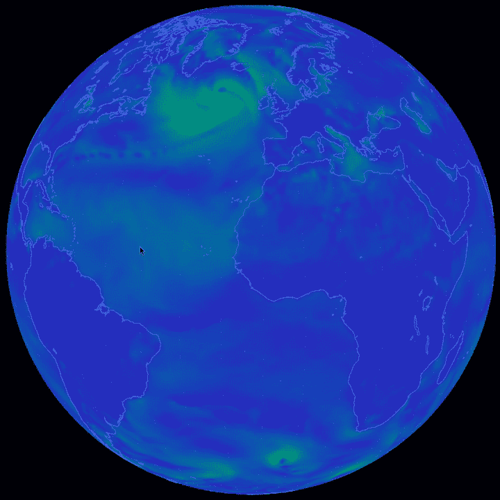

WebGL 及其对性能的影响

# 添加和调试风粒子

动画风粒子使风球如此令人难忘。我的第一直觉是找到一个可以实现粒子运动的库。我偶然发现了由 Mapbox 团队开发的基于 WebGL 的库。它看起来很吸引人，但是玩了一会儿之后发现，它的默认风格很难看，而且库的设计不允许简单的颜色操作。

我决定建立自己的风粒子动画逻辑。这看起来比实际上更困难。我用了一个基于`requestAnimationFrame()`的动画循环。在每个循环的开始，我会复制一个低透明度的旧框架，然后在它上面画一个新的框架。每一帧都重复这个过程，就产生了想要的拖尾效果


基于画布复制和重绘的动画

动画循环可以用类似 JavaScript 的伪代码来概括:

```
(function tick() {
    const x = get_next_position()

    context.stroke(); // Make a copy with lower opacity
    context.globalAlpha=0.97
    context.globalCompositeOperation='copy'
    context.drawImage(context.canvas, 0, 0) //Draw the new Canvas on top    
    context.globalAlpha=1.00;
    context.globalCompositeOperation='source-over';
    context.beginPath();
    context.arc(x, height / 2, radius, 0, 2 * Math.PI);
    context.fill(); //Go to the next frame
    frame = requestAnimationFrame(tick);
  })();
```

然后，我会随机产生 1000 个粒子。在每一帧上，我会计算它们的坐标，并根据该区域的风矢量将它们移动到一个新的位置。当粒子的年龄超过随机设置的`max_age`时，我会将其重置到初始位置。在伪代码中，它看起来像这样:

```
for x, y, age in particles_list:
  if age > max_age:
    age = 0
    x = x0
    y = y0 else:
      long, lat = get_coordinates(x, y)
      u, v = estimate_wind_vector(long, lat)
      long_new, lat_new = long + u*scale, lat + v*scale
      x_new, y_new = get_coordinates_inverse(long_new, lat_new)

  age += 1
  x = x_new
  y = y_new
```

即使在这一阶段之后，地图看起来已经准备好了，我注意到风粒子会以一种奇怪的方式绕着两极运动。他们沿着一条表明某种极端情况发生在极点周围的道路前进。

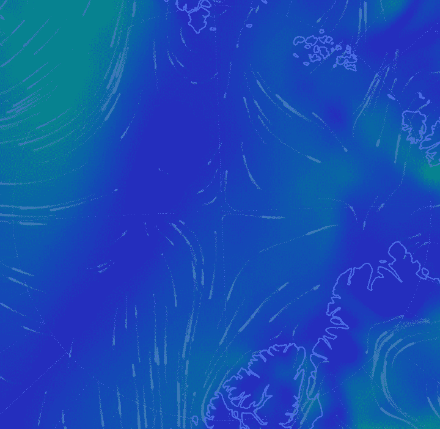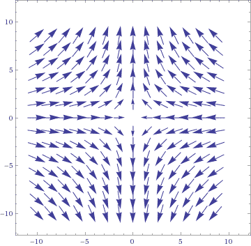

极点周围的粒子似乎遵循{-x/sqrt(x +y +4)，y/sqrt(x +y +4)}形式的向量场。这不太可能是靠近极点的风所发生的情况。用 Wolfram|Alpha 生成的矢量场。

找出导致这个问题的原因是构建这个数据可视化的最困难的部分。解决办法原来很简单。但是一开始，我错误地试图估算正投影的变形并解释它。

这种效应只发生在两极附近。我想这一定与我的投射有关。事实上，在正投影中，我们越靠近极点，经度就越短 1 度。

我在一本厚厚的教科书《T4 地图投影——美国地质调查局的工作手册》中寻找扭曲方程。我实现了一个相当复杂的函数，通过数值估计一阶导数来获得失真值。回顾过去——真是矫枉过正。它甚至没有解决问题。

解决办法原来很简单。移动质点时，忘了处理质点过 180°子午线的情况。两个声明足以解决这个问题。失真方程可以被废弃。

```
//handle edge cases for longitude
if (long_new > 180){
  long_new -= 360
}
else if (long_new < -180){
  long_new += 360
}
```

# 修饰和微调

最后，在调用可视化完成之前，需要查找和设置一些任意的参数。幸运的是，可观察的笔记本允许创建滑块，帮助找到视觉上令人愉悦的价值。

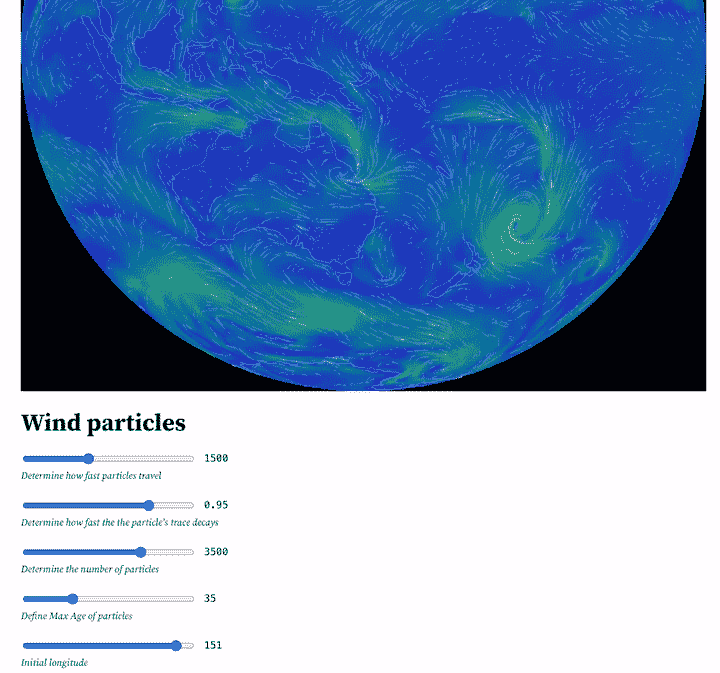

使用滑块进行微调

这是目的港。

回过头来看，有那么多地方看起来很简单。而且，每次我花额外的时间去解决意想不到的事情，视觉故事都有了显著的提高。强大的缩放和拖动、高效的基于 WebGL 的光栅重投影以及轻量级粒子动画都始于意外的挫折。

所以现在，给你自己弄杯咖啡，然后继续你的数据工作，即！

不要忘了在 Observable 上查看代码的实时可视化:[https://observablehq.com/@oskarkocol/animated-wind-map](https://observablehq.com/@oskarkocol/animated-wind-map)