# 不要过度配合！II-如何避免机器学习和深度学习模型中的过度拟合

> 原文：<https://towardsdatascience.com/dont-overfit-ii-how-to-avoid-overfitting-in-your-machine-learning-and-deep-learning-models-2ff903f4b36a?source=collection_archive---------19----------------------->

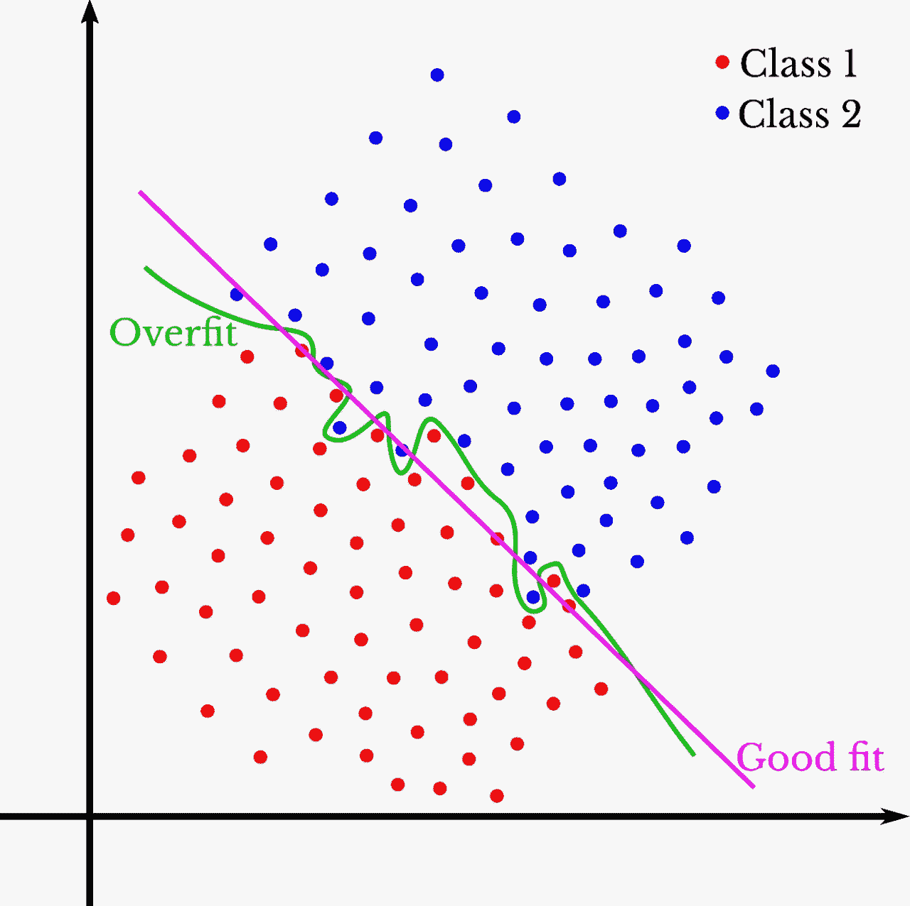

作者图片

O 预测建模的主要目标之一是建立一个模型，对看不见的数据做出准确的预测，这只有在我们确保它们没有过度拟合训练数据时才有可能。不幸的是，过度拟合是每个机器学习者在职业生涯中面临的常见绊脚石。这有许多原因，但我们想指出一些主要原因。首先是训练样本中存在较少的数据点，其次是数据集不平衡，最后但同样重要的是模型的复杂性。

在这篇博客中，我们将尝试几乎所有的机器学习和深度学习启发式方法，以避免 Kaggle 竞赛 [**之一的数据集中的过度拟合【不要过度拟合 II**](https://www.kaggle.com/c/dont-overfit-ii/) **。**

以下是该博客关注的内容列表。我们会一个接一个地探索每一个。

# 目录

1.  [Kaggle 问题陈述、数据集和评估指标](#b8db)
2.  [现有方法](#e69d)
3.  [过拟合的研究工作](#bd68)
4.  [我们的贡献](#d0f5)
5.  [探索性数据分析(EDA)](#4abb)
6.  [特征工程](#3324)
7.  [第一次切割方法](#7818)
8.  [机器学习模型](#588d)
9.  [深度学习模型](#8f0f)
10.  [结果](#df0c)
11.  [结论](#a94f)
12.  [未来工作](#7e01)
13.  [参考文献](#efa2)

# Kaggle 问题陈述、数据集和评估指标:

## 问题陈述

用训练集中的 250 个数据点建立模型，并对测试集中的 19750 个数据点准确预测二元目标。数据集包含 300 个连续变量的要素。

## 资料组

数据集可以从[这里](https://www.kaggle.com/c/dont-overfit-ii/data)获得。

文件:
● train.csv —训练集。250 行。
● test.csv —测试集。19750 行。
● sample_submission.csv —格式正确的样本提交文件
列:
● id-样本 id
● target-一个来源神秘的二进制目标。
●0–299-连续变量。

> ***注:***
> 
> kaggle 网站上目前可用的数据集是一个新版本，但评估仍在旧版本上进行。你可以在这里得到旧版本的

## 评估指标

[AUCROC](http://en.wikipedia.org/wiki/Receiver_operating_characteristic) (受试者工作特性/曲线下面积)

ROC 曲线总结了使用不同概率阈值的预测模型的真阳性率和假阳性率之间的权衡。但是，当数据集高度不平衡时，这种度量并不可取。ROC 曲线下的面积称为 AUC，AUC 越高，性能越高。对于无技能模型，AUC 将为 0.5。

# 现有方法:

我们已经知道这个比赛在一年前已经在 Kaggle 上完成了，大量的方法得到了应用。一些最好的方法阐述如下:

## 只是不要过度拟合[【1】](#e794):

这篇博客的关键方法是使用 LASSOCV(最小绝对收缩和选择操作符交叉验证)。它由两个术语 LASSO 和 CV 组成(其中 CV 是交叉验证)。LASSO 回归器的主要功能是添加一些偏差项，以最小化模型的方差。它执行 L1 正则化，即添加相当于系数幅度绝对值的惩罚。它的目标函数是:

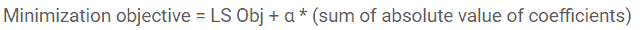

作者图片

其中唯一的参数是α。alpha 值越大，要素的权重越接近零。该算法的使用导致 Kaggle 领先板上的得分为 **0.843** 。

## 不要过度配合！—如何防止深度学习模型中的过度拟合[【2】](#8754):

这个博客试图训练一个深度神经网络模型，以避免我们拥有的相同数据集的过度拟合。首先，使用 RFE(递归特征消除)算法进行特征选择。接下来，训练一个简单的具有 2 个隐藏层和 2 个早期停止的丢弃层的 NN 模型，导致 **80%** 的测试准确度。

# 关于过度拟合的研究工作

## 过度拟合及其解决方案概述[【3】](#1bd6):

本文详细介绍了一些避免过拟合的启发式技术，并给出了如何以及何时应用它们的原因。

***网络缩减:***
模型的复杂性可以通过消除不太重要和不相关的数据(即噪声)来降低，这反过来将有助于模型防止过拟合，并对看不见的数据表现良好。这被称为剪枝，广泛应用于决策树算法中。已经提出了两种类型的*修剪*方法，一种是*预修剪*，另一种是*后修剪*。

预修剪方法试图在生成具有非常小样本的叶子之前尽早停止树构建过程。在分裂树的每个阶段，我们检查交叉验证错误。如果误差没有明显减小，我们就停止。这在学习算法中也称为提前停止。

后期修剪包括修剪树木。在树被构建之后，它被修剪回交叉验证误差最小的点。

***训练数据的扩展:***
由于有限的数据会导致模型过拟合，我们应该将其扩展出来，这可能有助于模型避免过拟合。本文提出的技术包括向现有数据集添加一些随机噪声，通过一些处理从现有数据集中重新获取一些数据，以及基于数据集的分布产生一些新数据。

***正则化:***
大量的特征使得模型更加复杂。如果我们在代价函数中加入一个正则项，而不是任意地丢弃一些特征，这将通过最小化它们的权重来减少无用特征的影响。L1 正则化项将不太重要的特征的权重设置为零，而 L2 正则化使该类型的权重太小。

## 变量选择方法比较中的过度拟合[【4】](#5070):

本文介绍了两种主要的特征选择方法，即顺序向前选择(SFS)和顺序向前浮动选择(SFFS)。覆盖了在声纳和蘑菇数据集上获得的结果，从而表明 SFFS 产生了比 SFS 更好的结果。在蘑菇数据集中，与 SFS 选择的几个特征相比，SFFS 在测试数据上给出了更好的结果，即使是一半的特征。

***顺序前向选择(SFS):***
在该方法中，首先选择最佳单个特征，并与未选择的特征配对，再次跟随最佳配对特征的选择。同样，制作具有最佳对和未选择特征的三元组，然后选择最佳三元组特征。这个过程一直持续到选择了所需数量的特征。

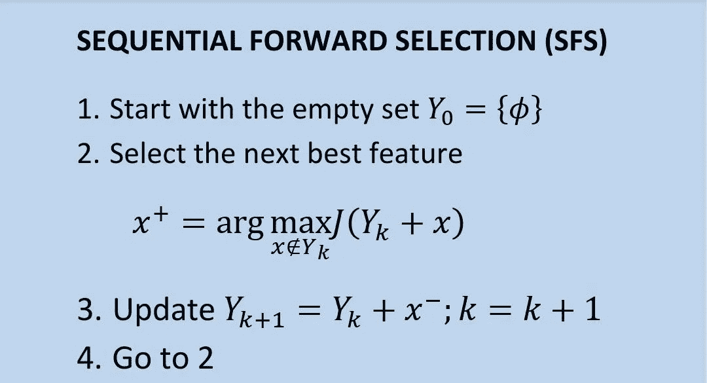

作者图片

这种方法的缺点是，一旦选择了一个特征，我们就不能删除它，即使我们可以通过另一个相对较小的特征子集获得良好的结果。SFFS 克服了这一限制。

***顺序向前浮动选择(SFFS):***
【SFFS】从空集开始。在每向前一步之后，只要目标函数保持升级，它就执行向后一步。这种方法的关键是使用回溯算法来选择最佳和最小的特征子集。这种方法的缺点是计算量大。

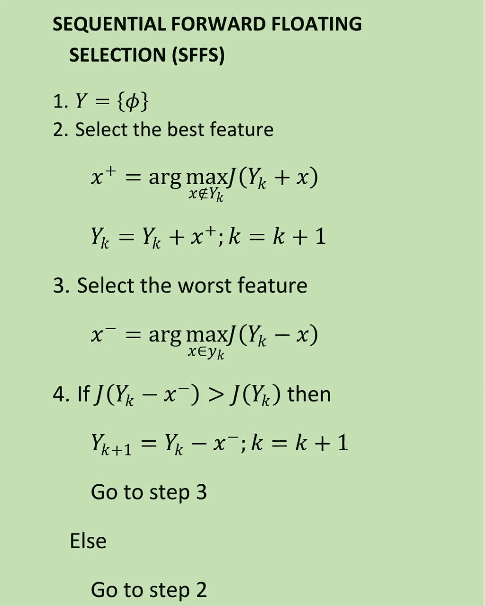

作者图片

## 多目标学习中的泛化改进[【5】](#f05e):

与上述处理过拟合的策略不同，本文提到了一种称为噪声注入(抖动)的启发式方法来消除此类问题。在本文中，已经证明 SO(单目标，例如均方误差)算法比 MO(多目标，例如 ROCAUC)算法更容易过拟合。这是因为，在 ROCAUC 中，成本函数算法试图同时最大化 TPR 和最小化 FPR，其作为调节器工作并阻止其过度拟合。
已经提到的第二件重要的事情是，神经网络对于训练模式中的微小变化更加稳健。因此，通过注入噪声和用神经网络训练这样的数据来扰动训练数据，使得模型不会过度拟合，并且在测试数据上表现得更好。

以下是本文中提到的扰动训练数据的两种方法。
***加性高斯噪声:***
在每一代中，通过向输入的每个元素添加正态分布随机数来生成新的人工训练数据集。
***通过平均添加噪声:***
在这种方法中，通过在局部邻域内平均原始图案来生成新的人工图案。

# 我们的贡献

已经应用了几种方法，产生了一些结果。然而，在迄今为止我们从各种研究论文中学到的许多相关技术中；我们会用重要的概念性想法来指导我们的项目。我们的方法分为两种:第一种是机器学习方法，另一种是神经网络方法。

## 机器学习方法:

1.  应用*过采样*和*欠采样*两种技术来平衡稍微不平衡的数据集。
2.  由于更多的特征可能导致过度拟合，因此只有重要特征的选择属于基于*过滤方法、包装方法和嵌入方法*的特征选择。
3.  由于*特征工程*是构建智能系统的重要组成部分，并且我们知道所有的特征值都是连续分布的，我们可以通过使用*宁滨技术*将连续数据转化为离散数据。我们将应用*自适应宁滨*来处理一些本质上*倾斜*的特征。

## 神经网络学习方法:

1.  Lars Gr 等人[【5】](#f05e)提到*噪声注入*会帮助模型防止过拟合。因此，我们将在我们的神经网络架构中添加*高斯噪声*层以及*下降*层。

让我们从数据集的探索性数据分析开始吧！！

# 探索性数据分析

数据集显示如下:

## 训练数据

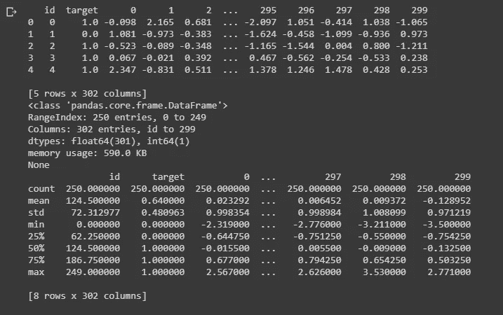

作者图片

> ***观察:***
> 
> 训练数据有 300 个自变量(0 到 299)和一个因变量(目标)以及一个唯一 id 和 250 行(数据点)。所有要素的值都是连续的，并且从描述表来看似乎具有相似的分布。

## 缺少值？

作者图片

> ***观察:***
> 
> 正如您所观察到的，这里没有空值。

## 单变量分析

***目标:***

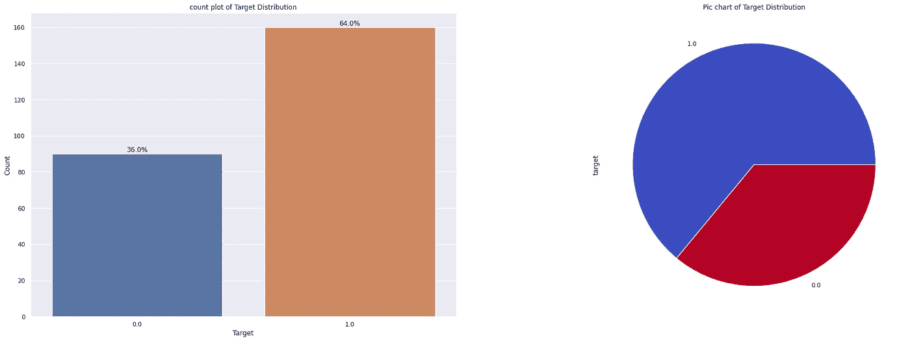

作者图片

> ***观察*** *:*
> 
> 可以清楚地看到，数据集是不平衡的，其中属于目标 0 的数据点是 36%,但是对于目标 1 是 64%。因此，可以说目标 1 大约是目标 0 的两倍。

***单帧中所有(0–299)独立特征的分布图:***

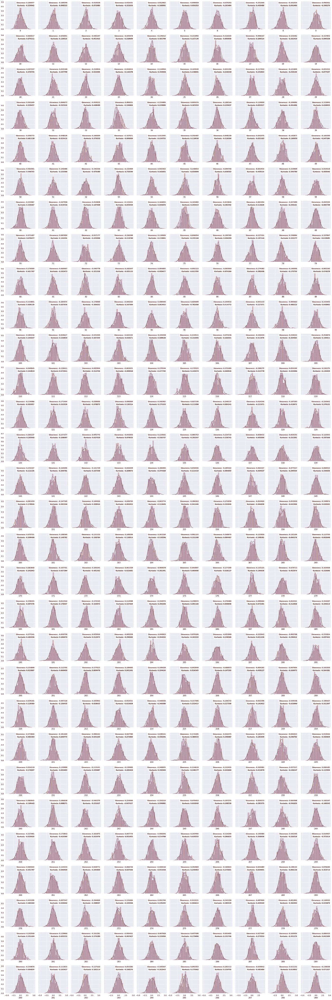

作者图片

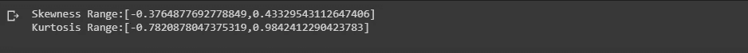

作者图片

> ***观察:***
> 
> 从上面两个图中，可以清楚地感知到，整个 300 个特征的分布几乎是相同的，并且都具有几乎相同的均值和标准差。
> 
> 如果我们更深入地研究每个特征图，我们会发现目标 0 和目标 1 点在它们的每个特征分布中的重叠。所有特征分布的偏斜值在[-0.37，0.43]的范围内，峰度值在[-0.78，0.98]的范围内。因此，我们可以说所有的分布都是近似对称的，但不是完美的正态分布。

## 双变量分析

***关联:***

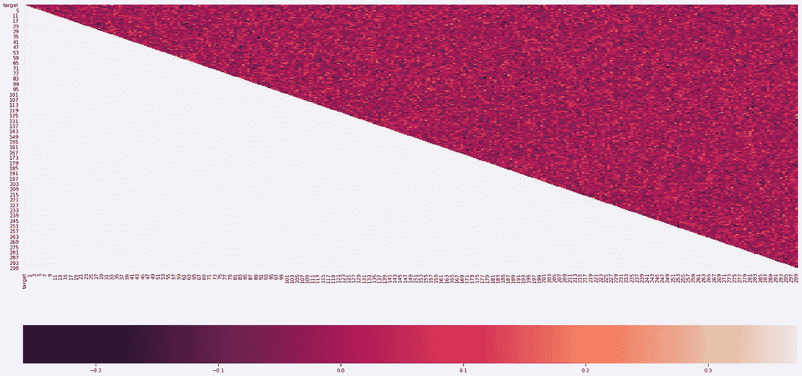

作者图片

> ***观察:***
> 
> *从上面的热图来看，要得到特征之间相关性的确切值是相当困难的。然而，从颜色条中，可以观察到特征并不高度相关，因为相关性的范围是[-0.2 到 0.2]*

***与目标相关的前 10 个特征:***

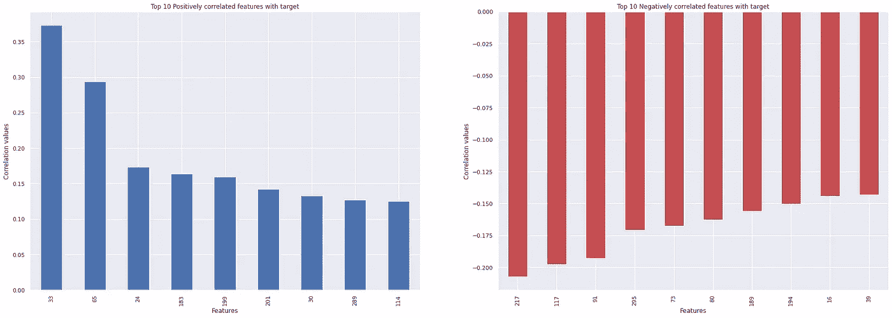

作者图片

> ***观察:***
> 
> 特征 33 和 217 分别与目标 1 和 0 最相关。

***对图中前 5 个与目标正相关的特征:***

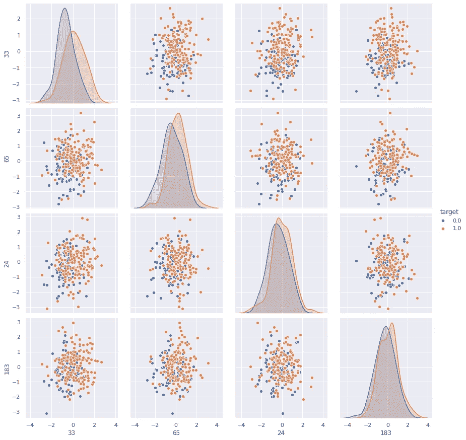

作者图片

> ***观察:***
> 
> 上述 4 个特征[33，65，24，183]将是对分类任务最重要的特征，因为很明显它们不是完全重叠的，而是完全分离的。

***对图中与目标负相关的前 5 个特征:***

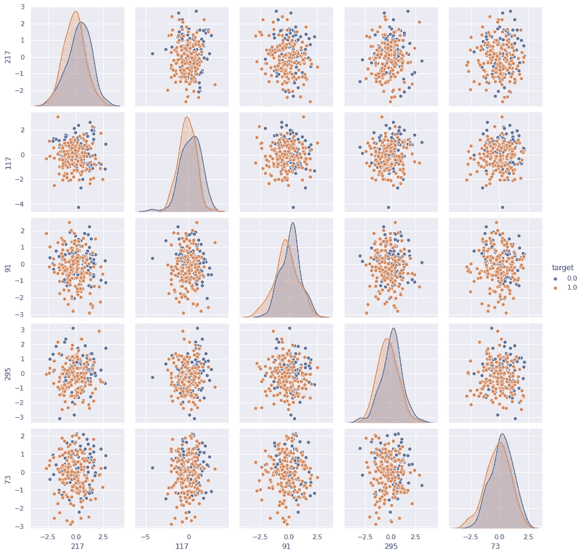

作者图片

> ***观察:***
> 
> 同样，特征[217，117，91，295，73]将是进行分类的重要特征，因为很明显它们不是完全重叠的，而是完全分离的。

## 多变量分析

***2D 300d 数据点可视化:***

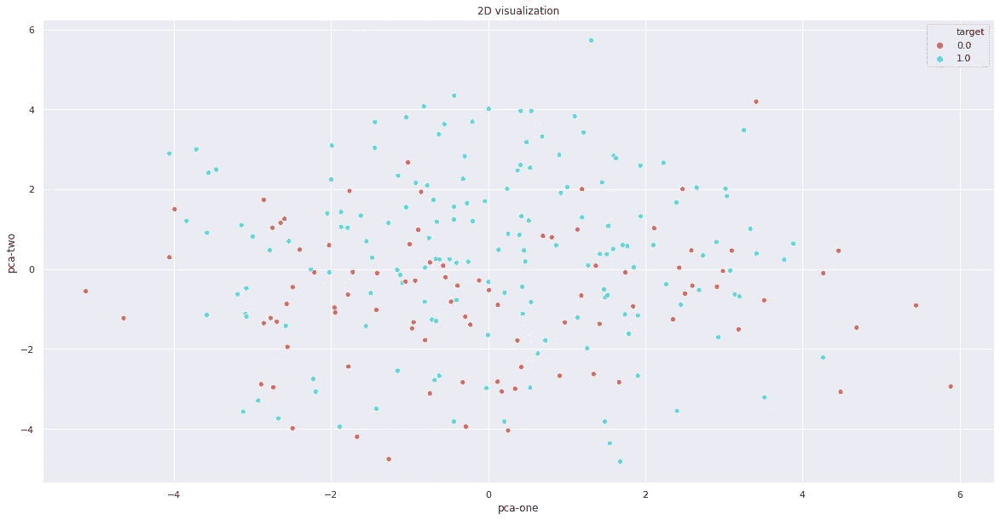

作者图片

> ***观察:***
> 
> 所有的点都杂乱无章地散布着。因此，它不是线性可分的。

***300d 数据点的三维可视化:***

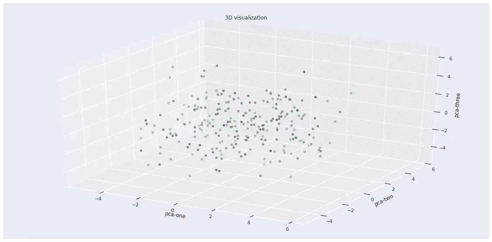

作者图片

> ***观察:***
> 
> 随着维度的增加，目标 0 和目标 1 点仅经历分离。因此，它们在更高的维度上更容易区分*。*

***所有特征的均值、标准差、偏度、峰度:***

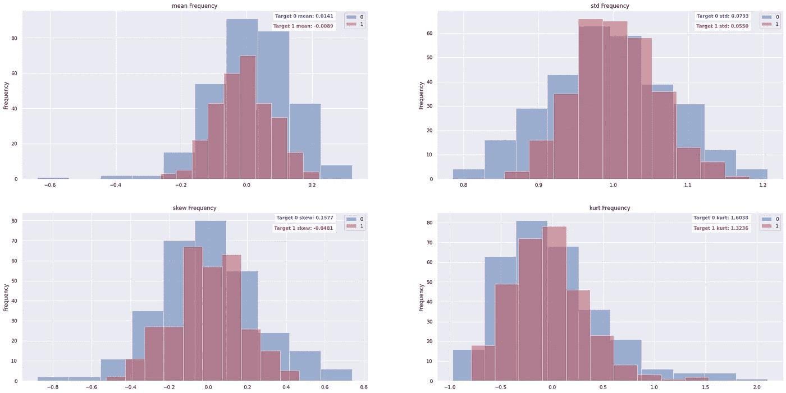

作者图片

> ***观察:***
> 
> 基于均值和标准差频率图的所有特征似乎都是归一化的，并且正态分布，均值= 0(近似值)和标准差=0.1(近似值)。
> 
> 如果我们观察偏斜度和峰度频率图，偏斜度= 0.15，峰度> 1.5(对于目标 1 数据点)，这表明它具有比正态分布更重的尾部。
> 
> 目标 0 和目标 1 数据点的分布重叠。
> 
> 因此，我们可以得出结论，随机分布不存在。

# 特征工程

*偏度> 0.3 或偏度< -0.3:* 的特征的基于四分位数的宁滨

> *代码:*
> 
> *首先我们搜索偏斜度>为 0.3 或偏斜度< -0.3 的特征，应用四分位数自适应宁滨，然后将所有这些特征保存到磁盘中。*

作者代码

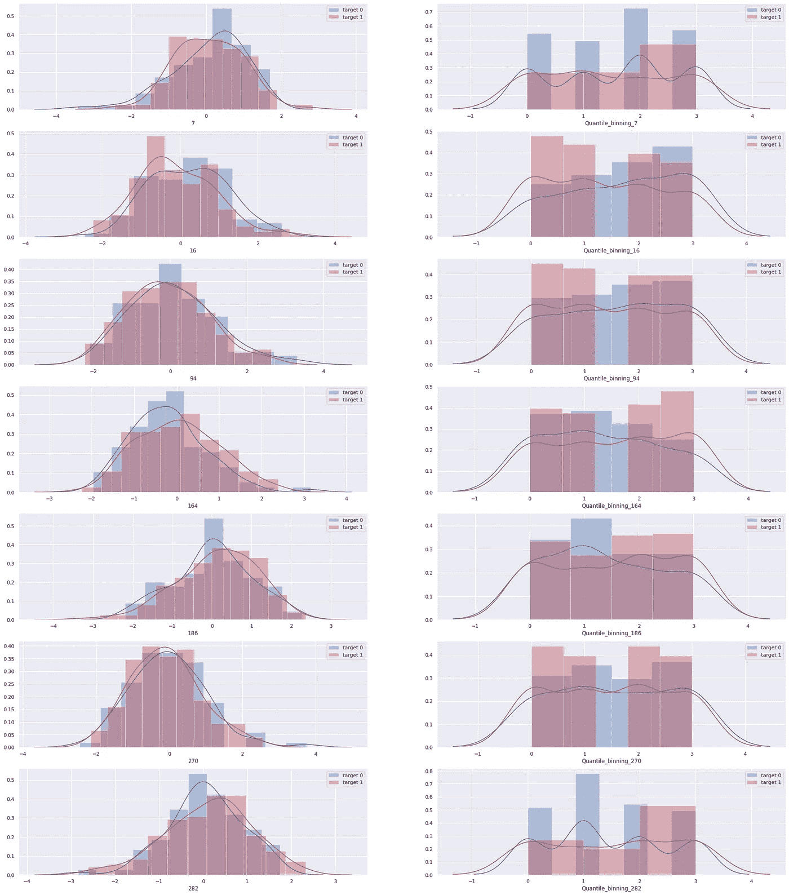

作者图片

> ***观察:***
> 
> 使用基于四分位数的自适应宁滨，我们将 7 个偏斜特征转换成分类特征。
> 
> 工程特征还显示目标 0 和目标 1 点之间的重叠。然而，在某个频率极限之上，目标 0 点是占优势的，这被证明是有用特征的证据。

# 首次切割方法

基于 EDA，以下是需要注意的核心要点:

*   数据集中的行数太少。
*   数据集不是高度不平衡的。因此，它不会对模型产生太大的影响。
*   所有特征值都是实数。没有明确的特征。甚至所有特征的分布几乎相同，并且它们接近正态分布。因此，我们不需要任何复杂的预处理。只有简单的标准化才行得通。

记住以上几点，我们的第一步方法是训练一个正则化的逻辑回归模型。我们将使用 RandomSearchCV 搜索合适的参数。

# 机器学习模型

所有的模型都被归类为一种类型，如基线模型、过样本模型、工程特征模型等。在每种类型下，有 8 种不同的分类算法，随后是给定数据集的校准训练。它们如下所列:

1.  逻辑回归(线性)
2.  线性判别分析(线性)
3.  k 近邻分类器(非线性)
4.  决策树(非线性)
5.  朴素贝叶斯(非线性)
6.  支持向量分类器(非线性)
7.  随机森林(非线性)
8.  XGBoost(非线性)

在直接进入每个模型之前，让我们先讨论一下设计的所有有用的功能。

***绘制受试者工作特征曲线下面积(AUC ROC):***

作者代码

***八种分类算法的流水线:***

作者代码

***八分类器模型训练模板:***

作者代码

现在让我们从建模和导入我们的火车测试数据开始！

作者代码

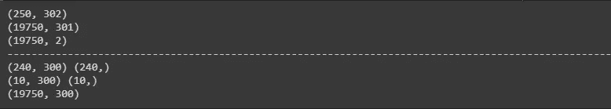

作者图片

## 1.基线模型

在该模型中，除了标准化/缩放原始数据集之外，没有进行其他修改。获得的数据集因此用 8 个提到的分类器训练。通过给出 0.818(私人得分)的**逻辑回归**获得最佳结果。从基线模型来看，这个结果绝对超过预期。

> 代码:

作者代码

> *基线模型 Kaggle 提交分数:*

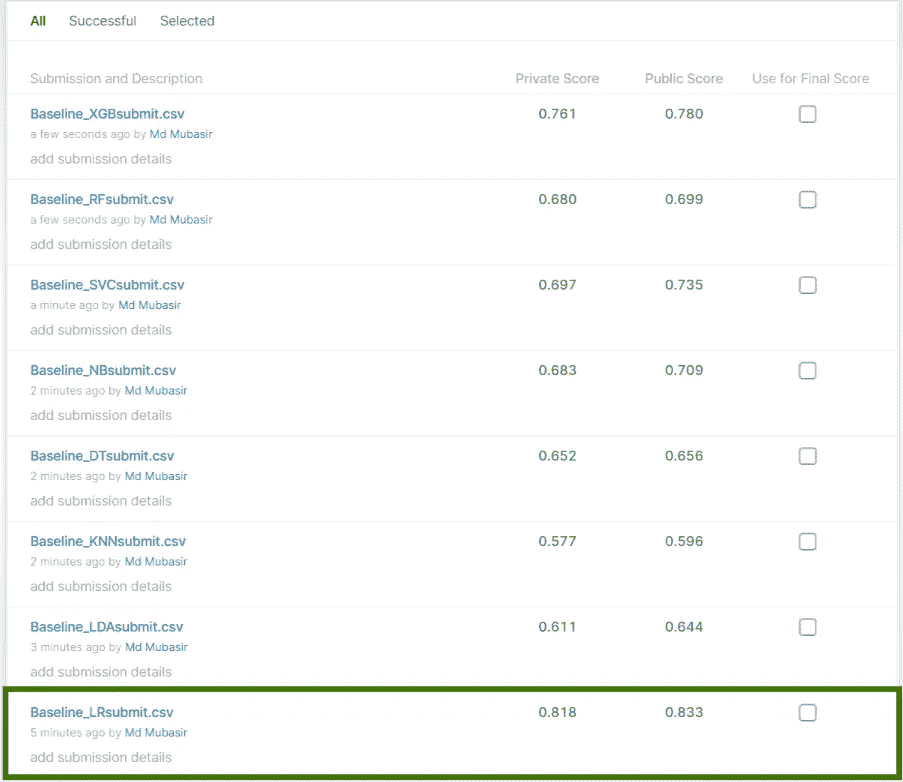

作者图片

> *最佳得分分类器的 ROC 曲线(即逻辑回归):*

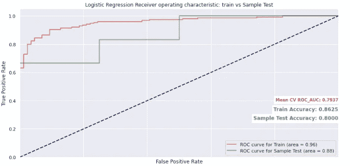

作者图片

## 2.过样本模型

在这个模型中，我们首先在 SMOTE 算法的帮助下对属于少数类的数据点进行上采样，以平衡数据集。然后，我们用所有的分类器训练它。使用得分为 0.754(私人得分)的 **XGBoost** 算法获得了显著的结果。然而，与基线模型相比，这一分数并未达标。

> 代码:

作者代码

> *过样模型 Kaggle 提交分数:*

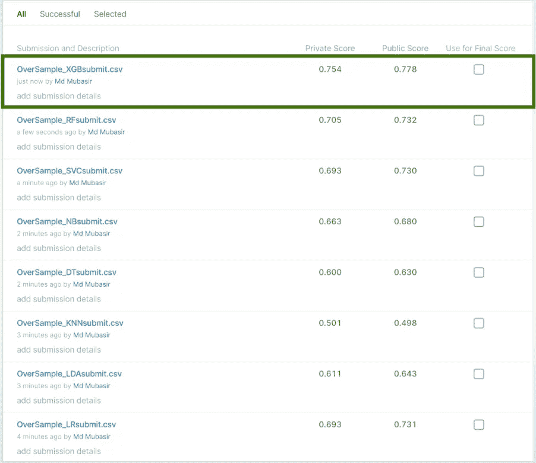

作者图片

> *最佳得分分类器的 ROC 曲线(即 XGBoost):*

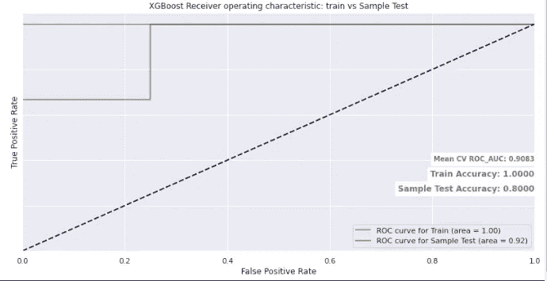

作者图片

## 3.样品型号不足

在该模型中，应用上采样和下采样来平衡数据集，然后用所有分类器训练数据集，从而由 **XGBoost** 产生最佳得分 0.694(私人得分)。与其他模型相比，这个分数证明了上采样和下采样同时进行可能是行不通的。

> 代码:

作者代码

> *样本模式下 Kaggle 提交分数超过:*

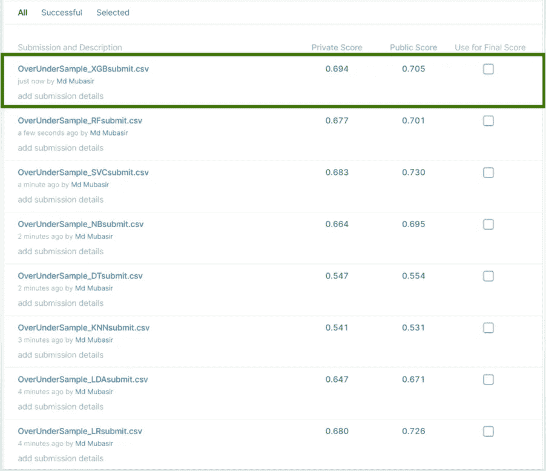

作者图片

> *最佳得分分类器的 ROC 曲线(即 XGBoost):*

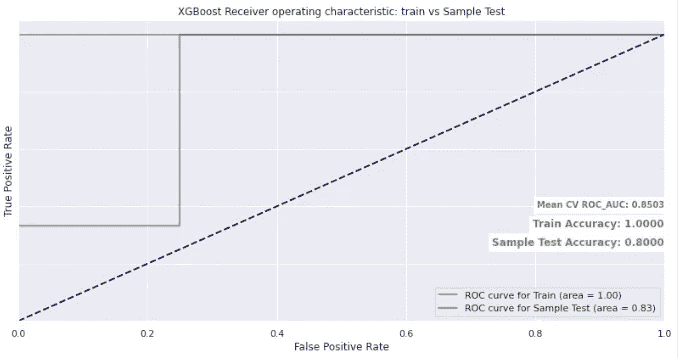

作者图片

## 4.工程特征模型

在这里，我们向原始数据集添加了 7 个宁滨编码的特征，并用所有分类器对其进行训练，通过**逻辑回归**算法获得了最高得分 0.762(私人得分)。显而易见，我们设计的功能甚至降低了性能，但并没有解决这个问题。

> 代码:

作者代码

> *工程特征模型 Kaggle 提交分数:*

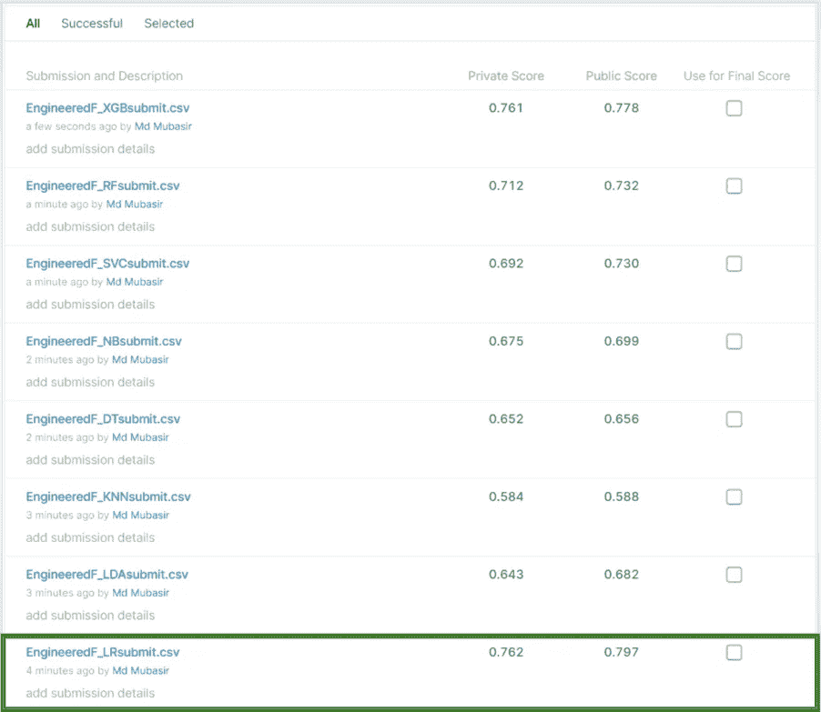

作者图片

> *最佳得分分类器的 ROC 曲线(即 Logistic 回归):*

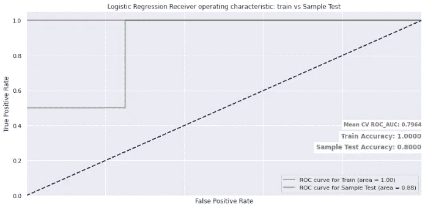

作者图片

## 5.互信息模型

在该模型中，互信息是一种基于过滤器的特征选择方法，用于选择最佳特征，然后与所有分类器一起训练它们。 **SVC** 算法给出了 0.666 的好成绩(私分)。将该分数与其他模型的分数进行比较，我们可以得出结论，这不是该问题的最佳特征选择方法。

> 代码:

作者代码

> *互信息模型 Kaggle 提交分数:*

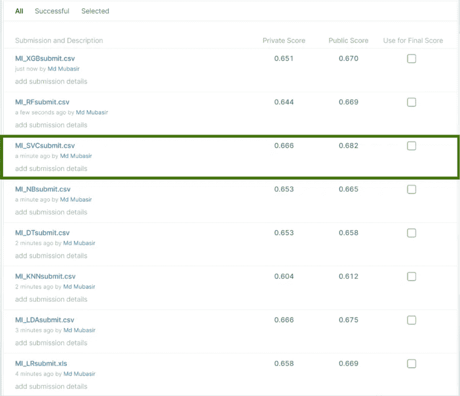

作者图片

> *最佳得分分类器(即支持向量分类器)的 ROC 曲线:*

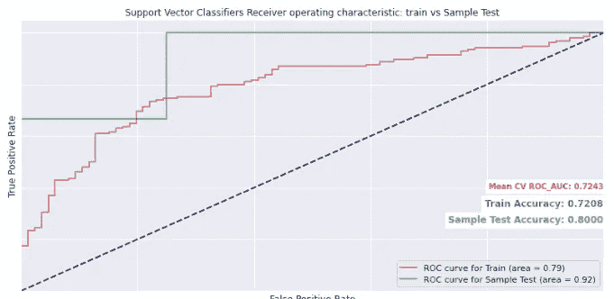

作者图片

## 6.顺序向前选择模型

在该模型中，SFS(一种基于包装器的特征选择方法)已被应用，随后是前 20 个特征的选择。所有的分类器只使用这些特征来训练数据。使用**随机森林**获得 0.710 的最佳分数(私人分数)。这个分数也证明了它并不是这个问题的最佳特征选择方法。

> 代码:

作者代码

> *SFS 图:*

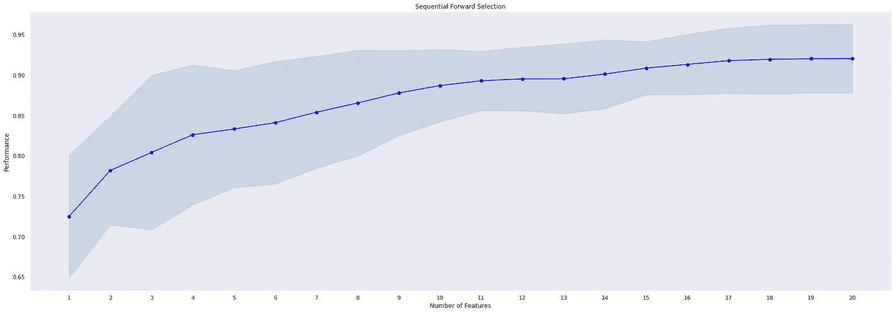

作者图片

> *SFS 模型的 Kaggle 提交分数:*

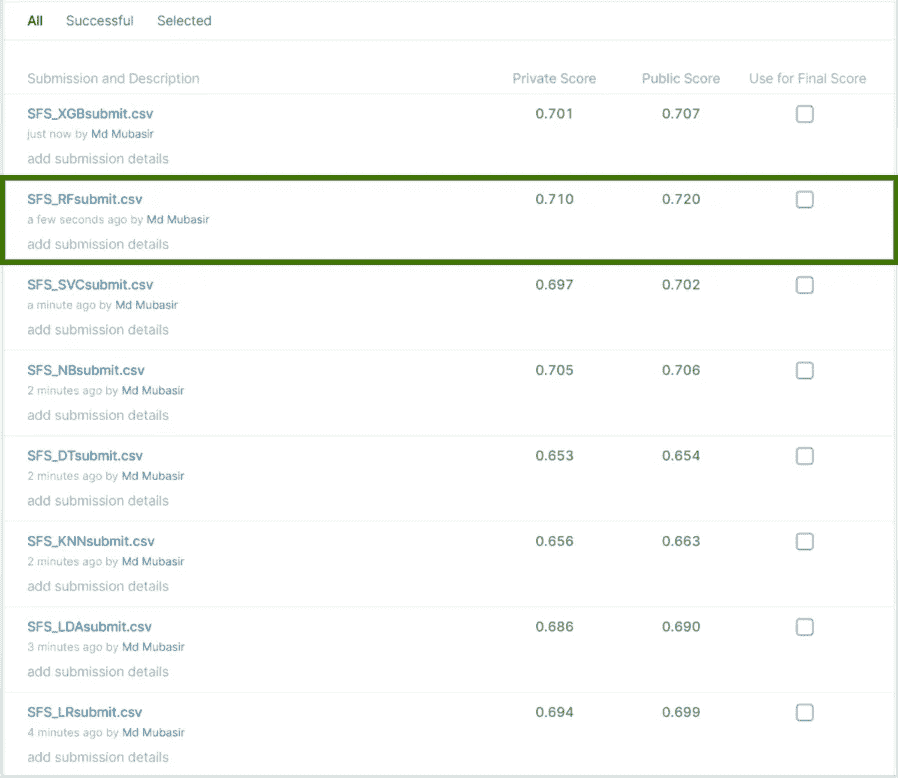

作者图片

> *最佳得分分类器(即随机森林)的 ROC 曲线:*

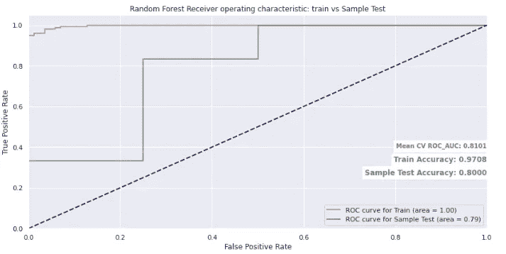

作者图片

## 7.序贯向前浮动选择(SFFS)模型

在该模型中，应用了基于包装器的特征选择方法 SFFS，随后选择了前 17 个特征。然后用具有这些特征的所有分类器来训练数据。最好成绩 0.712(私分)由**朴素贝叶斯**产生。与之前的模型相似，这种方法并没有导致分数的显著增加。

> 代码:

作者代码

> *SFFS 图:*

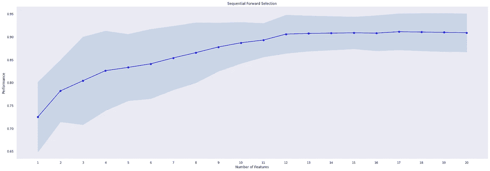

作者图片

> *SFFS 模型 Kaggle 提交分数:*

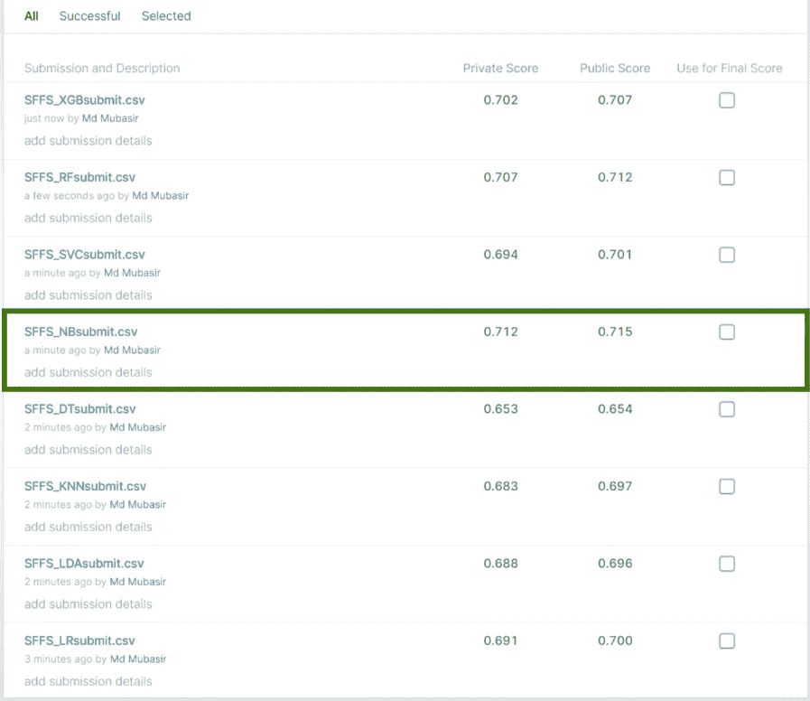

作者图片

> *最佳得分分类器(即朴素贝叶斯)的 ROC 曲线:*

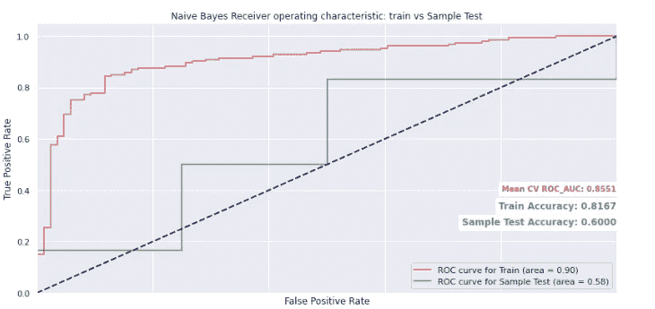

作者图片

## 8.递归特征消除(RFE)模型

在该模型中，应用了基于包装器的特征选择方法 RFE。最佳基线分类器被用作 RFE 方法的估计量，该方法产生 0.838 的显著分数(私人分数)。这就是我们期待的结果！这种特征选择的方法对于这个问题表现得很好。

> 代码:

作者代码

> *RFE 模型 Kaggle 提交分数:*

作者图片

> *RFE 模型的 ROC 曲线:*

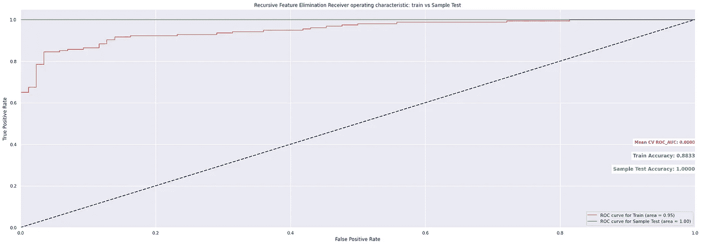

作者图片

## 9.嵌入式模型

在该模型中，采用了一种嵌入式的特征选择方法。使用的 3 种不同的嵌入式算法是 LassoCv、LassoLarsCV 和 RidgeCV。他们用 **LassoCV** 算法得到了 0.821 的显著分数！这种特征选择方法成为解决我们问题的最佳方法之一。

> 代码:

作者代码

> *嵌入模型 Kaggle 提交分数:*

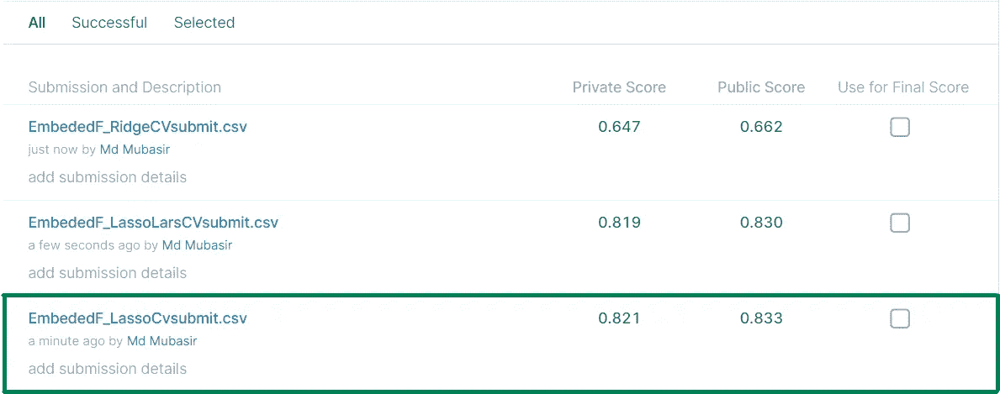

作者图片

> *最佳得分分类器(即 LassoCV)的 ROC 曲线:*

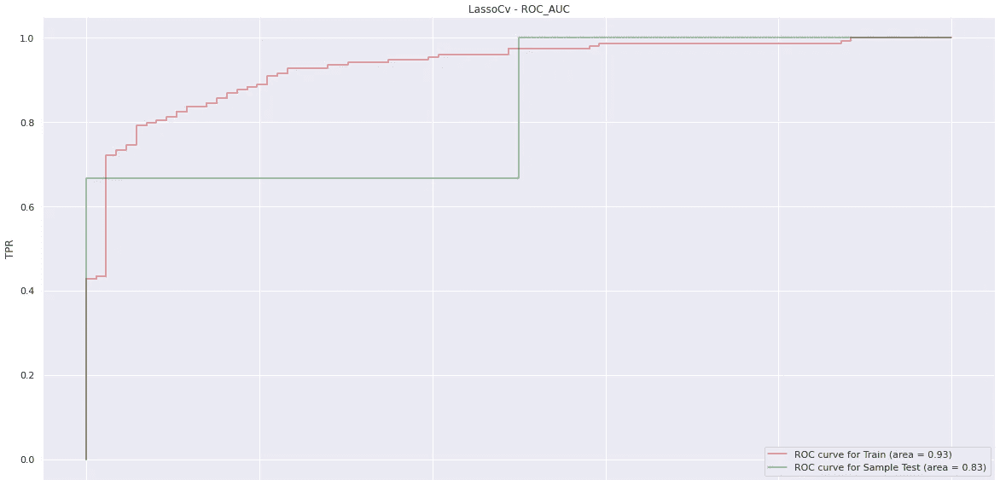

作者图片

# 深度学习模型

深度学习方法中有两种模型，基线模型和噪声模型。

让我们首先讨论 DL 模型的所有效用函数。

***列车功能:***

作者代码

***损失、准确性和 AUC 绘图功能:***

作者代码

## 1.基线模型

该模型仅使用两个分别为 40 和 20 个神经元的隐藏层进行训练，结果很差，得分为 0.608(私人得分)。

> 代码:

作者代码

> *基线指标图:*

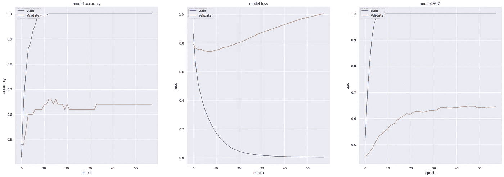

作者图片

> *DL 基线模型 Kaggle 提交得分:*

作者图片

## 2.高斯噪声模型

该模型已经用两个隐藏层进行了训练，每个隐藏层有 20 个神经元和两个噪声量为 0.01 的高斯噪声层以及两个丢弃率为 0.3 的丢弃层。获得了分数为 0.753(私人分数)的相对较好的结果。

> 代码:
> 
> 首先进行网格搜索以获得 aur 架构的最佳超参数，然后用该神经网络进行训练。

作者代码

> *噪声模型的度量图:*

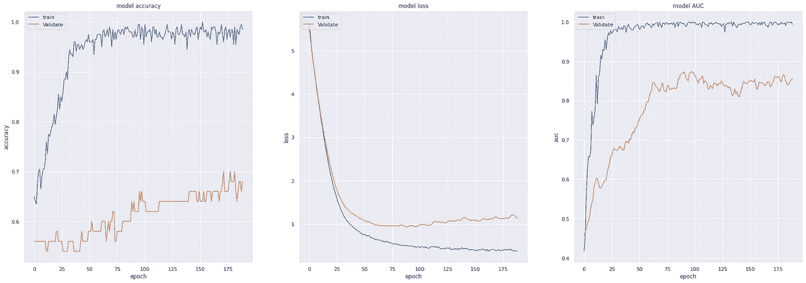

作者图片

> *DL 噪声模型 Kaggle 提交评分:*

作者图片

# 结果

> *根据私人评分对所有 ML 模型进行排名*

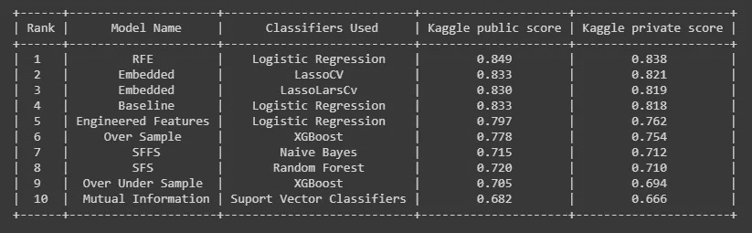

作者图片

> *根据私人评分对所有 DL 模型进行排名*

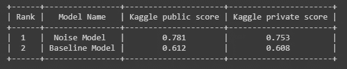

作者图片

> *迄今为止最好的 Kaggle 评分模型*

作者图片

# 结论

*   在所有的特征选择方法中，递归特征消除法在这个问题上做得很好。
*   由于特性的数量大于行数，添加更多的特性肯定是行不通的。
*   众所周知，即使有大量数据，神经网络也容易过度拟合。我们正在处理的数据非常少，这使得过度拟合的可能性最大。然而，噪声层的注入明显减少了这种担心，我们的模型比预期的要好得多。
*   由于所有嵌入式方法的性能都优于基于过滤器和包装器的方法，因此对不太重要的特征给予低权重被证明是一种更好的技术，而不是直接消除这些特征。

# 未来的工作

*   类似于排名前 3 的参赛者，可以应用 LB 探测技术。
*   神经网络模型的效果远远好于预期，因此我们的模型可以进一步改进，这样分数可以增加到 0.80 以上。
*   我们可以通过组合我们得到的所有执行模型来尝试堆叠和投票模型。

# 参考

[1] Brij Patel，[就是不要过度拟合](https://medium.com/analytics-vidhya/just-dont-overfit-e2fddd28eb29)，(2019)。

[2]尼尔斯·施吕特，[不要过度拟合！—如何防止深度学习模型中的过度拟合](/dont-overfit-how-to-prevent-overfitting-in-your-deep-learning-models-63274e552323)，(2019)

[3]薛颖，[北京市海淀区上地七街 1 号钟会大厦 1 号楼](https://iopscience.iop.org/article/10.1088/1742-6596/1168/2/022022/pdf)，邮编 10 0085

[4] Juha Reunanen，[在变量选择方法之间进行比较时过度拟合](http://www.jmlr.org/papers/volume3/reunanen03a/reunanen03a.pdf)，ABB，网络成像系统，邮政信箱 94，00381，芬兰赫尔辛基

[5] Lars Gr，jiao Chu Jin，IEEE 高级成员，和 Bernhard Sendhoff，IEEE 高级成员，[多目标学习中的泛化改进](https://static.aminer.org/pdf/PDF/000/265/793/a_noise_metric_on_binary_training_inputs_and_a_framework.pdf)，2006 年神经网络国际联合会议，加拿大温哥华喜来登酒店，温哥华，BC，2006 年 7 月 16-21 日

申请课程:[www.appliedaicourse.com](https://www.appliedaicourse.com/course/11/Applied-Machine-learning-course)

感谢您的阅读！这里是我在 GitHub 上的 [LinkedIn 简介](https://www.linkedin.com/in/mdmubasir1998)和[代码。](https://github.com/mdmub0587/Dont-Overfit-Self-Case-Study-1-)