# 不要一次剥完洋葱

> 原文：<https://towardsdatascience.com/dont-peel-the-onion-all-at-once-78935a9258ca?source=collection_archive---------18----------------------->

## 就有利可图的 Python 采访阿列克谢·格里戈里耶夫

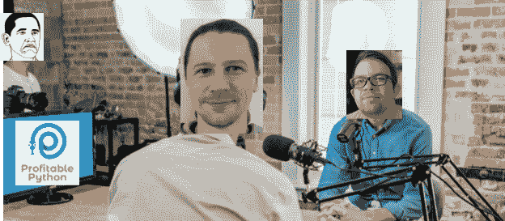

本和阿列克谢正在谈论有利可图的 Python(照片由[奥斯汀·迪斯特尔](https://unsplash.com/@austindistel?utm_source=unsplash&utm_medium=referral&utm_content=creditCopyText)在 [Unsplash](https://unsplash.com/?utm_source=unsplash&utm_medium=referral&utm_content=creditCopyText) 上拍摄)

我很高兴能在本的[盈利的 Python](https://www.profitablepython.fm/) 播客上与他交谈。在我们的谈话中，本问了许多有趣的问题，这就是为什么我决定在博客中总结我们的谈话。

我们涵盖以下主题:

*   我正在写的书(“机器学习图书营”)
*   通过做项目和在 Kaggle 上竞争来学习
*   成为机器学习专家
*   学习机器学习时保持正确的抽象水平
*   快速原型制作和将模型投入生产
*   和其他东西

开始吧！

**欢迎来到** [**盈利巨蟒**](https://www.profitablepython.fm/) **。我是本·麦克尼尔，今天我们采访阿列克谢·格里戈里耶夫。**

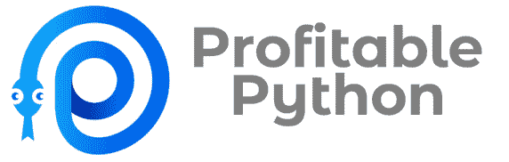

Alexey 与妻子和儿子住在柏林。他是一名专注于机器学习的软件工程师。他在 OLX 集团担任首席数据科学家。阿列克谢是一位纸牌大师，他写了几本书。其中一个是“ [**掌握数据科学的 Java**](https://www.packtpub.com/big-data-and-business-intelligence/mastering-java-data-science)**”，现在他正在做另一个——“**[**机器学习书营**](https://www.manning.com/books/machine-learning-bookcamp) **”。那不是错别字，那叫“书营”。**

阿列克谢，欢迎你！

嗨，本，很高兴来到这里。

很高兴有你。你能告诉我更多关于你正在写的书的事情吗？

是啊！想法是通过做项目来学习机器学习。每一章都是一个新项目:你得到一个数据集，准备它，建立一个模型。我们也观察每个模型的内部，看它如何做出预测，并试图理解它。这是相当实际的，我们将理论保持在最低限度。完全避免它并不总是可能的，这就是为什么这里那里仍然有公式，但重点是编码。

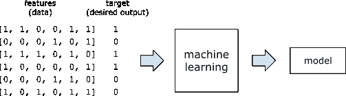

书中的插图:ML 算法的输入是特征和目标，输出是模型

目标读者是已经会编码的人，比如软件工程师，或者已经有编码经验的学生。当你浏览这本书时，你建立了一个项目组合，最终，你知道了足够多的信息，可以得到一份 ML 工程师的工作，并在工作中继续学习。

这本书仍在进展中，但已经有可能看一看里面，并决定你是否喜欢它。已经有三章一附录了。总共有十章，所以现在已经完成了 30%。

是什么激发了你写这本书的想法？

前段时间我写了另一本书——是关于数据科学的 Java。我真的很喜欢它，但是它变成了一个非常小众的话题:Java 对于 ML 来说并不是那么流行。今天，如果你想做 ML，你用 Python，而不是 Java。所以，我想，我还有想和世界分享的东西，但是世界对 Java 不感兴趣，我们再写一本书吧——这次用 Python。

通过做项目来学习的想法是我从 [Kaggle](https://www.kaggle.com) 那里学来的——这是一个举办数据科学竞赛的网站。在 Kaggle，一家公司准备了一个数据集，然后要求社区为他们训练最好的模型。

只有在 Kaggle 上我才真正学到了 ML。我在大学里花了几年时间学习理论，但如果没有适当的实践，这些理论是没有用的。而且，说实话，竞赛并不真的需要这种理论——参与是一种非常需要动手的活动，需要大量的编码:你生成新的功能，将它们放入库中，调整参数，查看结果，并不断重复，直到竞赛结束。

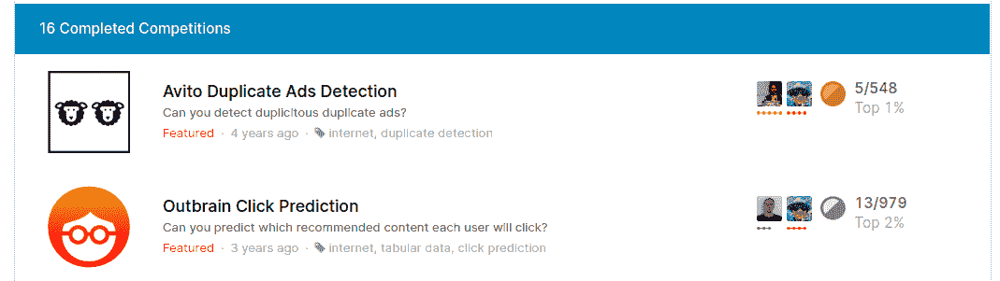

我参加了 10 多次比赛，每一次都非常有用

这让我意识到学习 ML 的最好方法不是研究它，而是做它:每个 Kaggle 比赛都是一个项目，通过做这些项目，我能够真正地学习 ML。对我来说，这比在黑板上看方程如何求解更有帮助。

这就是为什么我认为基于项目的方法是软件工程师和其他编码人员的最佳方式。这就是我决定写这本书的原因。

**酷。我很高兴看到这一进展。** **能否介绍一下你的背景，以及你是如何成为机器学习专家的？**

我来自俄罗斯远东的一个小城市。我所在的城市有一所小大学，我学的东西有点过时了:我在学习使用 Delphi 之类的东西。2006 年，我所在地区的组织需要的就是这些。然而，我们学到了一些基本的东西，如数据库和自动化业务流程。

那很有趣，但是我真正喜欢的科目是数学和统计学。不幸的是，没有办法应用这些技能:每个人都只需要一个数据库。

最终，我搬到了俄罗斯中部的一个更大的城市。那里的公司不需要 Delphi，他们需要 Java 和 web 服务。于是我把工作重心转到了 Java 上，做了一段时间的 Java 开发人员。

2012 年，Coursera 开始流行。其中一门课程是机器学习。我碰巧看了那门课，它改变了我的生活:Java 和数据库很有趣，但 ML 吸引了我，所以我决定走那条路。

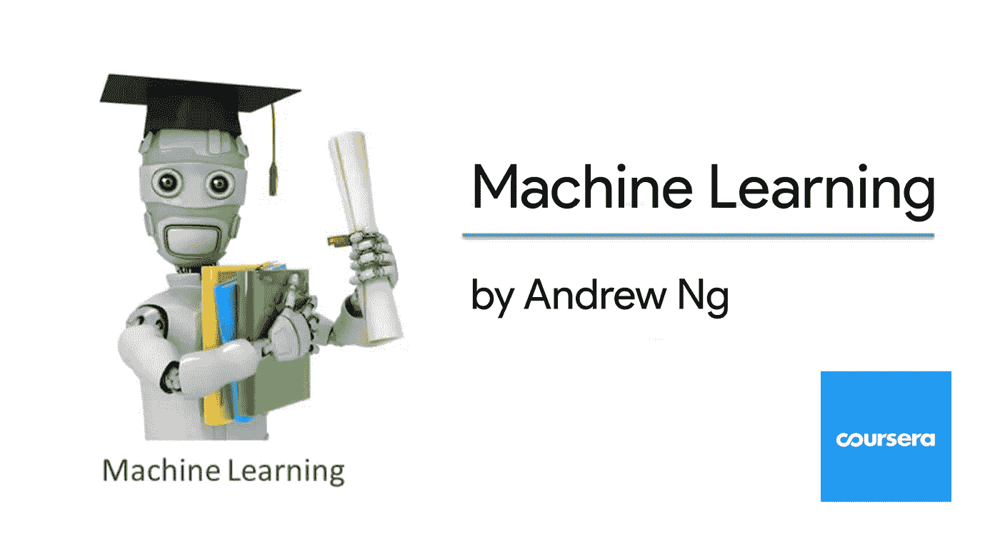

吴恩达著名的[机器学习教程](https://www.coursera.org/learn/machine-learning)

大约在那个时候，数据科学职位也开始出现在市场上，尽管数量很少。当时我住在波兰的克拉科夫，有几个职位空缺，但所有的职位都需要博士学位和五年的 Hadoop 经验。这些公司不明白他们想从数据科学中得到什么，他们只是听说了 ML，然后想，“让我们雇佣一个有博士学位的人，让他们弄清楚我们想要什么”。

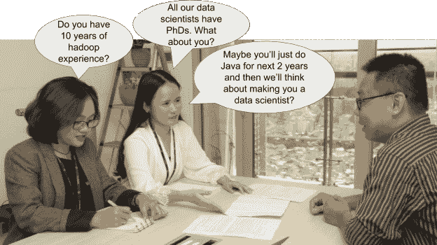

2013 年数据科学采访(由[凡泰传媒](https://unsplash.com/@vantaymedia?utm_source=unsplash&utm_medium=referral&utm_content=creditCopyText)在 [Unsplash](https://unsplash.com/?utm_source=unsplash&utm_medium=referral&utm_content=creditCopyText) 上拍摄)

从 Java 转向数据科学是一个艰难的时期。这就是为什么我决定接受一些额外的教育并攻读硕士学位。

毕业后，我突然发现公司不再需要博士了。市场想出了他们需要从数据科学家那里得到什么。他们明白拥有博士学位是件好事，但不是必须的。从那以后，对数据科学和 ML 的需求一直在增长。

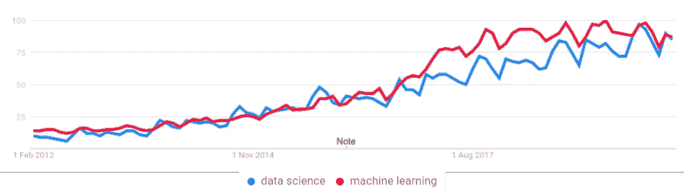

谷歌趋势:人们对数据科学和机器学习的兴趣正在稳步增长([链接](https://trends.google.com/trends/explore?date=2012-01-12%202020-02-12&geo=US&q=data%20science,machine%20learning))

当我开始做全职数据科学家时，我发现拥有软件工程背景非常有帮助。仅仅训练一个模型是不够的，你需要走向生产，而这是许多数据科学家纠结的事情。他们知道如何阅读论文，并从这些论文中实现算法，但走向生产是另一回事。这就是为什么接触一些软件工程有助于数据科学家利用他们的模型，更快地解决业务问题。

一名软件工程师正在生产中进行数据科学研究(图片由[阿洛拉·格里菲斯](https://unsplash.com/@aloragriffiths?utm_source=unsplash&utm_medium=referral&utm_content=creditCopyText)在 [Unsplash](https://unsplash.com/?utm_source=unsplash&utm_medium=referral&utm_content=creditCopyText) 上拍摄)

我还注意到，许多公司看到了这一点，并开始寻找这类人——了解 ML 的软件工程师，也许不深入，但足以实际训练一个模型，然后产生商业影响。

**这很有趣，也有点违反直觉。**

是的。我试图深入数学，但最终，并不需要。尽管研究它很有趣，但我和我的许多同事所做的工作是不同的。我们不解数学方程。我们花几个月的时间准备数据集，然后去图书馆，等十分钟训练结束，得到一个模型，然后再花几个月的时间生产这个模型。

训练一个模型并不需要花费太多时间，然而许多大学课程和在线课程的重点是 ML 背后的数学。是的，它仍然是需要的:作为一名数据科学家，你有时需要理解库内部发生了什么——就像软件工程师需要知道 TCP/IP 是如何工作的一样。然而，没有多少软件工程师需要每天深入网络堆栈。也许五年一次，当有问题的时候，但是日常工作通常不需要这样。

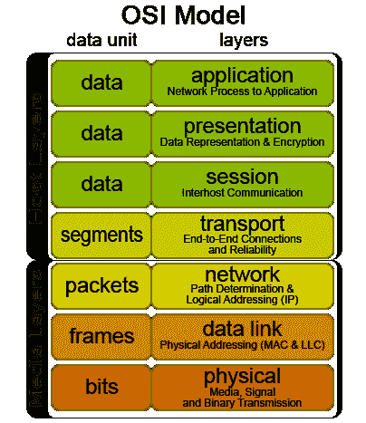

OSI 模型。对软件工程师来说非常有用，但在日常工作中可能不需要(来源:[https://commons.wikimedia.org/wiki/File:Osi-model.png](https://commons.wikimedia.org/wiki/File:Osi-model.png)

所以，你只需要有广泛的知识和良好的接触不同的技术。知道细节是好的，但并不总是必要的。你所需要的只是基础——能够注意到事情是否不对劲。但是当你面对一个问题时，你需要更深入。

我反其道而行之，试图提前了解一切。相反，我应该专注于实践技能，并在需要时深入挖掘。

我注意到你在简历中提到了“快速成型技能”。你如何使用它们？

对于软件工程项目，尤其是 ML，尽快验证想法是很重要的。

通常你甚至不需要编写任何代码就可以验证一个想法。

想象一下，我们想要建立一个系统来确定一幅图像是好是坏:它被恰当地框住，聚焦并且有良好的曝光。我们不需要在模型上花时间，我们自己可以只看图片就决定质量好不好。如果不是，我们就给卖家发邮件，看看他们有什么反应。如果他们的反应是积极的，并且这是他们所需要的，那么我们就投入时间来建立一个实际的模型。

快速原型制作过程中的我(图片:旧苏联卡通[https://www.youtube.com/watch?v=_39zAeiNXxo](https://www.youtube.com/watch?v=_39zAeiNXxo)——俄文，英文字幕)

当谈到原型时，你可以快速地构建一些东西，例如一个简单的 Python Flask 应用程序，它最初可能甚至没有遵循最好的工程标准。重点在于速度，因为你想在投入时间之前先验证这个想法。然后你把这个展示给用户，或者公司内部的利益相关者，看看他们是否对这个项目感兴趣。

快速行动也意味着快速失败和快速学习:决策者通常会说“这不是我们的意思，我们不需要这个东西”。尽早了解反馈是非常好的:花了半年时间却发现项目不被需要，这是非常令人沮丧的。

**如何成为快速原型制造专家？**

给你的任务设定时间框架。比方说，只给它五天时间，然后在这几天里尽可能多的做。动作要快，但不要让它比计划花费更多的时间。

如果你只有一周时间，那么你就开始考虑最重要的事情。然后在一周之内，你就有了一个工作系统并进行演示。

**如何不费吹灰之力就说服某人聘用你为机器学习专家？**

嗯，首先，买我的书(笑)。

但是，说真的，做项目。

然而，要得到一份工作，你可能也需要得到关注。如果你有一个想法，找到或收集一个数据集，实现这个想法，训练一个模型。不要就此打住。把代码放到 GitHub 上，写一篇关于它的博文，在社交媒体上分享。如果你在十个项目中这样做，你肯定会受到关注。

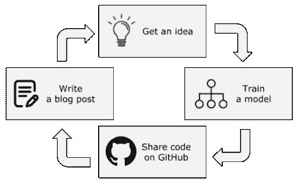

在互联网上引起注意(图标由 [Good Ware](https://www.flaticon.com/authors/good-ware) 、 [Smashicons](https://www.flaticon.com/authors/smashicons) 、 [Pixel perfect](https://www.flaticon.com/authors/pixel-perfect) 、[free pick](https://www.flaticon.com/authors/freepik)from[flat icon](https://www.flaticon.com)

**机器学习新人应该避免什么？**

在开始的时候，尽量避免陷入太深的理论。例如，有一些算法，像 SVM，需要很强的数学基础才能理解它们:两年的微积分，然后是一年的凸优化。这是相当严重的，你可能会想，“我什么都不懂，所以我要辞职”。人们放弃了。不要。不要让这些方程式吓到你。

一个试图理解 SVM 的数据科学新人(照片由[汤姆·普姆福德](https://unsplash.com/@tompumford?utm_source=unsplash&utm_medium=referral&utm_content=creditCopyText)在 [Unsplash](https://unsplash.com/?utm_source=unsplash&utm_medium=referral&utm_content=creditCopyText) 上拍摄)

ML 库隐藏了这种复杂性。您可以使用它们，而不用担心里面有什么——就像软件工程师可以在不知道 TCP/IP 如何工作的情况下创建 web 服务一样。当然，知道基础很重要，但作为新人，你应该把重点放在学得快而不是学得深。

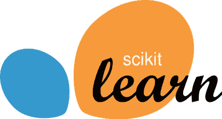

Scikit-Learn:一个很棒的机器学习库(【scikit-learn.org】T4)

所以停留在正确的抽象层次——对于初学者来说，这可能是一个你视为黑盒的库。当你需要的时候，再深入。不要试图一次剥掉洋葱皮。

**在生产中运行 ML 模型的主要收获是什么？**

尽可能快地去。尝试尽快部署一个模型。项目失败最常见的原因之一是在制作完美模型上花费了太多时间。不要。从简单的基线开始，然后尝试部署它——并将其用于生产，看看人们对它的反应。

不要把它弄得过于复杂。例如，如果您想要建立一个价格建议模型，从每个类别的平均价格开始。以汽车为例，它可以简单到每个品牌和型号的平均值。不要从神经网络或者同样复杂的东西开始。

如果你在一个系统上投入了大量的时间，就很难放手。这就是众所周知的宜家效应:如果你自己做了一件东西，你会喜欢它，即使对其他人来说这没什么特别的。想象一下，你在做一把椅子，你花了三个小时做好了，它没有散架，你可以坐在上面。你喜欢这把椅子，但对其他人来说，它可能看起来很丑。同样的事情也发生在软件上:如果人们长时间构建一个东西，他们很难放弃它。

这就是我自己做椅子时发生的事情(照片由[威廉·沃比](https://unsplash.com/@wwarby?utm_source=unsplash&utm_medium=referral&utm_content=creditCopyText)在 [Unsplash](https://unsplash.com/?utm_source=unsplash&utm_medium=referral&utm_content=creditCopyText) 上拍摄)

我有这个问题，所以意识到问题已经很有帮助了。在某些时候，继续做一个项目是没有意义的，你只需要停下来。

但是，如果一开始你只花了一周时间，却没有解决问题，你就停止了努力。你从早期的反馈中学习，然后继续前进。

**你收到过的最好的建议？**

“数学没有你想的那么重要，但解决商业问题比看起来更重要”。如果你的程序只是一堆“如果”语句，但它解决了一个问题——那就很好。所以从简单的启发开始，如果你看到它有帮助，继续做更复杂的事情。

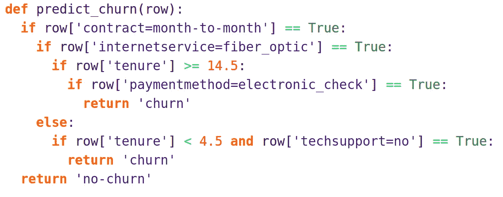

只要能解决业务问题，没人会关心你的服务里面有什么

你如何决定抓住什么样的演讲机会？

我几乎什么都愿意做，因为目前我没有太多的演讲机会。我还在学习如何让我的提议听起来令人兴奋，所以会议组织者接受了它们，让我在他们的活动中发言。

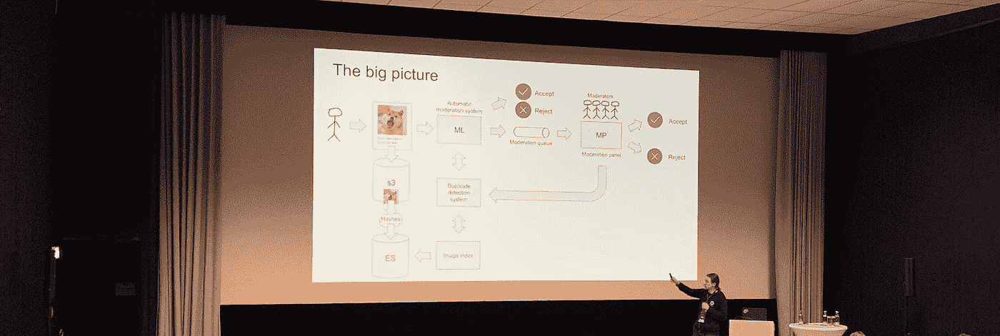

你知道我可以发言的会议吗？请伸出手来(Theofilos Papapanagiotou 拍摄)

**怎么和你联系？**

在 Twitter ( [@Al_Grigor](https://twitter.com/Al_Grigor) )和 LinkedIn ( [agrigorev](https://www.linkedin.com/in/agrigorev/) )上关注我。

Alexey，非常感谢你来参加我们的节目。

谢谢你邀请我。我喜欢和你谈话。

是的，这很有趣。和平了，伙计们。

谢谢你阅读它。如果你喜欢这篇文章，你可以在 [profitablepython.fm](http://profitablepython.fm) 上听完整集。这篇博文所涵盖的内容远不止这些！

对于盈利的 Python 的新剧集，在 Twitter 上关注 [@PyPodcast](https://twitter.com/PyPodcast) ，订阅 [YouTube 频道](https://www.youtube.com/channel/UCrUdn5lfdWae9-gwmRLS8pQ)，在 LinkedIn 上关注 [Ben](https://www.linkedin.com/in/bfmcneill) 。