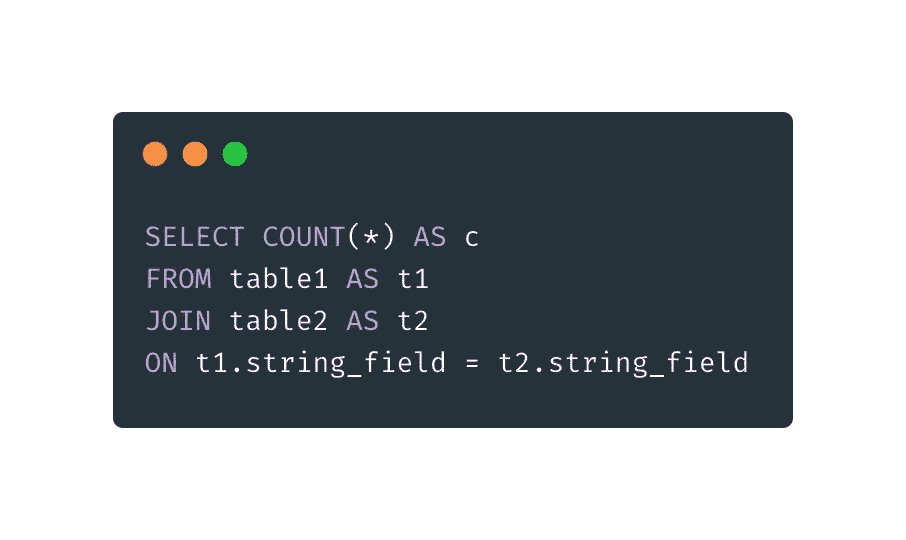

# 不要在 SQL 上犯这 5 个错误

> 原文：<https://towardsdatascience.com/dont-repeat-these-5-mistakes-with-sql-9f61d6f5324f?source=collection_archive---------12----------------------->

## 使用 SQL 进行数据分析非常简单……但事实并非如此！


由 [Unsplash](https://unsplash.com?utm_source=medium&utm_medium=referral) 上的 [krakenimages](https://unsplash.com/@krakenimages?utm_source=medium&utm_medium=referral) 拍摄的照片

SQL 和机器学习有一些共同点。从一个开始很容易，因为它不需要很多编码。此外，代码很少崩溃。

我关于 SQL 和机器学习的推文。

我认为 SQL 查询不会崩溃的事实使得数据分析更加困难。我从数据库中提取了多少数据集，结果发现有错误或丢失的数据？很多！

如果代码只是崩溃，我知道我搞砸了。数据科学家需要在数据验证上花费相当多的时间，因为 SQL 查询总是会返回一些东西。

> 这是你在编写 SQL 查询时应该避免的 5 个错误。

**这里有几个你可能会感兴趣的链接:**

```
- [Complete your Python analyses 10x faster with Mito](https://trymito.io/) [Product]- [Free skill tests for Data Scientists & ML Engineers](https://aigents.co/skills) [Test]- [All New Self-Driving Car Engineer Nanodegree](https://imp.i115008.net/c/2402645/1116216/11298)[Course]
```

您愿意阅读更多这样的文章吗？如果是这样，你可以点击上面的任何链接来支持我。其中一些是附属链接，但你不需要购买任何东西。

# 1.不知道查询执行的顺序


SQL 查询执行顺序

SQL 进入门槛低。您开始编写查询——到处使用连接，进行一些分组，您已经是专家了(至少有些人是这样认为的)。

**但是所谓的专家甚至不知道 SQL 查询以什么顺序执行吗？**

SQL 查询不是以 SELECT 开头的——当我们编写它们时，它们在编辑器中，但是数据库不是以 SELECT 开头的。

数据库开始使用 FROM 和 JOIN 执行查询。这就是为什么我们可以在 WHERE 中使用连接表中的字段。

为什么在 WHERE 中不能过滤 GROUP BY 的结果？因为 GROUP BY 在 WHERE 之后执行。因此我们有理由。

最后，我们来选择。它选择要包含的列，并定义要计算的聚合。此外，窗口函数在这里执行。

这就解释了为什么我们在 WHERE 中尝试使用窗口函数的输出进行过滤时会出现错误。

注意，数据库使用查询优化器来优化查询的执行。优化器可能会更改某些操作的顺序，以便查询运行得更快。此图是幕后发生的事情的高级概述。

# **2。窗口函数实际上是做什么的？**


使用求和窗口函数的变换示例

当我第一次遇到窗口函数时，我觉得它们很神秘。为什么使用窗口函数作为分组依据可以聚集数据？

在设计查询时，窗口函数(WF)简化了许多操作:

*   WF 允许访问当前记录之前和之后的记录。请参见超前和滞后函数。
*   WF 可以使用 GROUP BY 对已经聚合的数据执行额外的聚合。请看上图中的例子，我用 WF 计算销售额。
*   ROW_NUMBER WF 枚举行。我们还可以用它来删除重复的记录。或者随机抽取样本。
*   顾名思义，WF 可以计算给定窗口的统计数据:

```
sum(sales) OVER (PARTITION BY CustomerID BY ts ROWS BETWEEN UNBOUNDED PRECEDING AND CURRENT ROW) as cumulative_sum
```

上面的 WF 将计算从第一条记录到当前记录的累积和。

我在哪里做错了窗口函数？

我没有花时间去读一个教程来解释窗口函数的基础和功能。因此，我避免使用它们，查询变得过于复杂。然后虫子爬进来。

**运行上面的例子**


运行 SQL 中的例子[瞎搞](http://SQL Fiddle)

我收到了许多读者的请求，他们想玩上面的例子。现在，您可以在 [SQL Fiddle](http://sqlfiddle.com/#!15/9eecb7db59d16c80417c72d1e1f4fbf1/35342) 中在线运行该示例。

如果您想在本地数据库中尝试一下，下面是代码(它应该可以与 PostgreSQL 9.3 一起使用):

```
DROP TABLE IF EXISTS sales_table;
CREATE TEMPORARY TABLE sales_table
(
    key       varchar(6),
    customerID  varchar(10),
    productID   varchar(10),
    price     float
);INSERT INTO sales_table
VALUES ('1', 'Customer1', 'Product1', 100),
       ('2', 'Customer1', 'Product1', 200),
       ('3', 'Customer1', 'Product2', 100),
       ('4', 'Customer2', 'Product2', 200),
       ('5', 'Customer2', 'Product3', 100);SELECT customerID,
       productID,
       SUM(price) AS sales,
       SUM(SUM(price)) OVER (PARTITION BY customerID) AS sales_all
FROM sales_table
GROUP BY customerID, productID
ORDER BY customerID, productID
```

# 3.在下列情况下计算平均值


CASE WHEN 类似于编程语言中的 IF 语句。当我们需要计算某个数据子集的统计数据时，这很有用。

在上图中，我计算了在美国销售的产品的平均价格。我不小心碰到了其他的东西。

在第一个例子中，我对所有非美国产品使用 0，这降低了整体平均价格。如果有许多非美国产品，平均价格可能会接近 0。

```
SELECT product, AVG(CASE WHEN country = 'US' then price else 0 end) AS avg_price
FROM sales
GROUP BY product
```

在第二个例子中，我只计算在美国销售的产品的平均价格，这通常是我们想要的。
注意，使用 CASE WHEN 时不需要包含 ELSE，因为它默认为 NULL。

```
SELECT product, AVG(CASE WHEN country = 'US' then price else null end) AS avg_price
FROM sales
GROUP BY product
```

关键的要点是，在使用 CASE WHEN 时，应该小心使用“else 0”。它对 SUM 没有任何影响，但对 AVG 有巨大的影响。

# 4.对缺少值的列进行联接



两个字符串字段的简单内部连接

SQL 中有 4 种不同的连接:内连接、外连接、左连接和右连接。当我们在查询中使用 JOIN 时，它默认为内部连接。

幸运的是，我花时间阅读了一些关于连接的教程。但我还是犯了一个菜鸟的错误。

我编写了一个类似于上图中查询的核心查询。当我执行数据验证时，许多记录丢失了。这怎么可能呢？这是一个如此简单的连接！

结果是，表 1 和表 2 中的许多条目的 string_field 列为空值。我以为 JOIN 会保留空值的记录，因为 NULL 等于 NULL，不是吗？

然后我试着:

```
SELECT NULL = NULL
```

它返回 NULL。

获取所有条目的解决方案是在 COALESCE 中包装 string_field，将 NULL 转换为空字符串。

```
SELECT t1.*, 
       t2.price
FROM table1 AS t1
JOIN table2 AS t2
ON COALESCE(t1.string_field, '') = COALESCE(t2.string_field, '')
```

**但是要小心，因为这会将表 1 中带有空字符串的每个条目与表 2 中带有空字符串的每个条目连接起来。**

消除这些重复的一种方法是使用 ROW_NUMBER()窗口函数:

*   我假设每行都有一个惟一的标识符“some_id”和一个时间戳字段。
*   只需包装查询，并获取每个唯一标识符的第一行以删除重复项。

```
SELECT *
FROM (
SELECT t1.*, 
       t2.price,
       ROW_NUMBER() OVER(PARTITION by some_id ORDER BY timestamp_field) as row_count
FROM table1 AS t1
JOIN table2 AS t2
ON COALESCE(t1.string_field, '') = COALESCE(t2.string_field, '')
)
WHERE row_count = 1
```

# 5.复杂查询不使用临时表


在临时表中包装查询

如果我们能调试查询，SQL 就太好了。如果我告诉你可以调试它们呢！

您可以分解一个复杂的查询并创建多个临时表。然后，您可以对这些表运行“健全性检查”查询，以确保它们包含正确的条目。在设计新的重要查询或报告时，我强烈推荐这种方法。

```
DROP TABLE IF EXISTS trainset;
CREATE TEMPORARY TABLE trainset AS (
  SELECT *
  FROM table_1
  WHERE field = 1
);
```

临时表的唯一缺点是数据库中的查询优化器不能优化查询。

当需要性能时，我将使用临时表定义的查询重写为使用 with 语句定义的查询。

```
WITH helper_table1 AS (
  SELECT *
  FROM table_1
  WHERE field = 1
),helper_table2 AS (
  SELECT *
  FROM table_2
  WHERE field = 1
),helper_table3 AS (
  SELECT *
  FROM helper_table1 as ht1
  JOIN helper_table2 as ht2
  ON ht1.field = ht2.field
)SELECT * FROM helper_table3;
```

# 在你走之前

在[推特](https://twitter.com/romanorac)上关注我，在那里我定期[发关于数据科学和机器学习的推特](https://twitter.com/romanorac/status/1328952374447267843)。


照片由[Courtney hedge](https://unsplash.com/@cmhedger?utm_source=medium&utm_medium=referral)在 [Unsplash](https://unsplash.com/?utm_source=medium&utm_medium=referral) 上拍摄