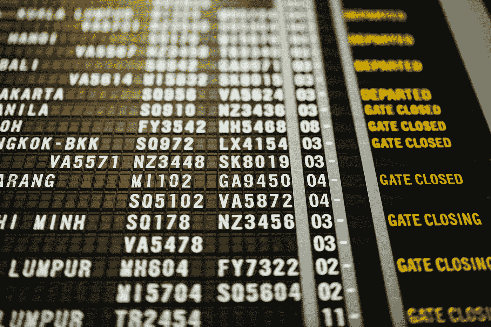
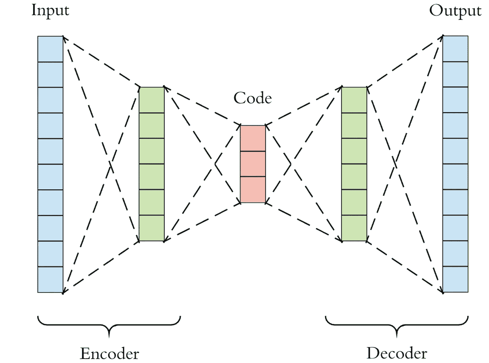
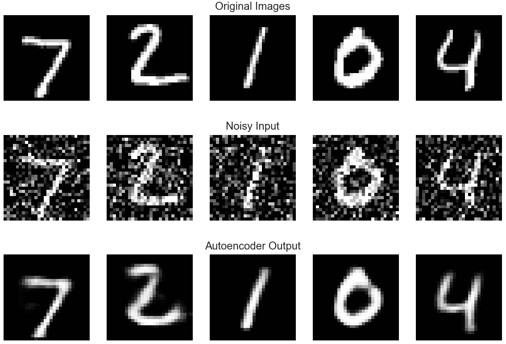
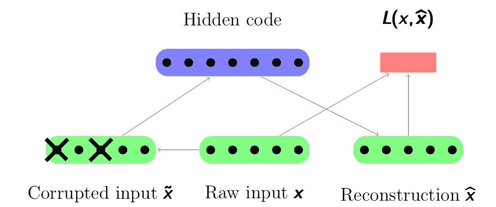

# 不要停留在集合上——针对表格数据的非常规深度学习技术

> 原文：<https://towardsdatascience.com/dont-stop-at-ensembles-unconventional-deep-learning-techniques-for-tabular-data-8d4e154f1053?source=collection_archive---------22----------------------->

## 使用深度学习学习表格数据的降维、去噪和合成数据生成



由 [Unsplash](https://unsplash.com?utm_source=medium&utm_medium=referral) 上的 [chuttersnap](https://unsplash.com/@chuttersnap?utm_source=medium&utm_medium=referral) 拍摄

近年来，深度学习在计算机视觉和自然语言处理领域取得了巨大进展。因此，深度学习技术通常局限于图像数据或序列(文本)数据。表格数据呢？对于业务用例来说，许多组织中传统的信息存储和检索方法无疑是最重要的。但我们表格/数据框架中的数据似乎满足于在深度学习领域使用简单的多层前馈网络。虽然有人认为递归神经网络(RNNs)通常用于表格时间序列数据，但这些方法在没有时间序列成分的数据上的应用非常有限。在这篇博客文章中，我们将看看一些深度学习技术的应用，通常用于图像或文本数据，在非时间序列表格数据上，在传统的递减水平上。

# 用于降维的自动编码器

传统上，自动编码器已经被用于非线性维度减少。假设我们有一个数据集，其中的要素数量远远超过我们的期望，我们可以使用自动编码器通过复杂的非线性函数将要素集调整到所需的要素大小，我们不必担心！与线性降维方法如 PCA(主成分分析)或其他传统的非线性技术如 LLE(局部线性嵌入)相比，这是一种更有效的技术。



自动编码器结构([来源](/generating-images-with-autoencoders-77fd3a8dd368))

自动编码器在没有任何标签的训练特征集上被训练，即，无论输入是什么，它们都试图预测输出。如果隐藏层足够宽，可以捕获所有的输入数据，这将是一个简单的任务。因此，对于作为自动编码器的神经网络的要求是，至少有一层，即瓶颈层，具有比输入或输出维度更低的维度。这通常是我们想要使用的嵌入层或缩减的特性集。训练网络时的度量可以是通常的均方误差或平均绝对误差。如果原始数据是 *x* 并且自动编码器生成的重构输出是 *x_hat，*我们试图最小化

> L(x，x_hat) = |x — x_hat|

在一起训练网络的编码器和解码器部分之后，我们仅使用模型的编码器部分作为我们的维度减少/特征提取算法。Keras 中的示例代码如下:

```
from keras.layers import Dense, Dropout
from keras.models import Sequential, Model
from keras import metrics, InputMETRICS = [
    metrics.RootMeanSquaredError(name='rms'),
    metrics.MeanAbsoluteError(name='mae')
]ENCODING_DIM = 16 #Desired Dimension
BATCH_SIZE = 64
EPOCHS = 100def make_and_train_autoencoder(X_train, metrics=METRICS):

    len_input_output = X_train.shape[-1]
    input_ = Input(shape=(len_input_output,))
    encoded = Dense(units=ENCODING_DIM*2, activation="relu")(input_)
    bottleneck = Dense(units=ENCODING_DIM, 
                       activation="relu")(encoded)
    decoded = Dense(units=ENCODING_DIM*2, 
                    activation="relu")(bottleneck)
    output = Dense(units=len_input_output, 
                    activation="linear")(decoded)
    #Training is performed on the entire autoencoder
    autoencoder = Model(inputs=input_, outputs=output)
    autoencoder.compile(optimizer='adam', loss='mean_squared_error',
                        metrics=[metrics])
    autoencoder.fit(X_train, X_train,
                    batch_size=BATCH_SIZE,
                    epochs=EPOCHS)
    #Use only the encoder part for dimensionality reduction
    encoder = Model(inputs=input_, outputs=bottleneck)
    return autoencoder, encoder
```

# 用于降噪的去噪自动编码器



MNIST 上的去噪自动编码器示例([来源](/applied-deep-learning-part-3-autoencoders-1c083af4d798)

去噪自动编码器的灵感来自计算机视觉领域。如上所述，它们可用于消除输入数据中的噪声。去噪自动编码器(DAE)可以类似地用于表格数据，因为大多数数据收集过程固有地具有一些噪声。这项技术已被证明是许多 Kaggle 比赛获胜解决方案的关键( [Porto Seguro 的安全驾驶员预测](https://www.kaggle.com/c/porto-seguro-safe-driver-prediction/discussion/44629))。与自动编码器不同，DAE 不需要满足将编码和解码部分连接到网络的要求。换句话说，不存在瓶颈，也就是说，它只是一个被训练用来消除噪声的神经网络。那么问题来了，我们如何训练网络？



去噪自动编码器的工作([来源](http://psyyz10.github.io/2015/11/SDA/)

如上图所示，我们首先破坏输入数据 *x* 。被破坏的数据𝑥̃通常是通过添加高斯噪声或者通过将一些输入特征值设置为零而获得的。这是我们试图模仿数据集中噪音的方式。然后，我们让𝑥̃通过我们设计的 DAE，以获得重构的输出 *x_hat* ，其尺寸与输入 *x 相同。*损失函数类似于常见的自动编码器。DAE 试图最小化输出 *x_hat* 和原始数据 *x，*之间的差异，从而使其能够消除噪声的影响并从损坏的数据中提取特征。示例代码如下:

```
#Change mean and scale of the noise according to your data
noise = np.random.normal(loc=0, scale=0.5, size=X_train.shape)
X_train_noisy = X_train + noiselen_input_output = X_train.shape[-1]def make_dae(metrics=METRICS):
    dae = Sequential([
        Dense(units=len_input_output*2, 
              activation="relu", input_shape=(len_input_output,)),
        Dropout(0.5), #Add dropout layers if required 
        Dense(units=len_input_output*2, activation="relu"),
        Dense(units=len_input_output*2, activation="relu"),
        Dense(units=len_input_output, activation="linear"),
    ])
    dae.compile(
        optimizer='adam', 
        loss='mean_squared_error',
        metrics=[metrics]
    )
    return daedae = make_dae()
history = dae.fit(
    X_train_noisy,
    X_train,
    batch_size = BATCH_SIZE,
    epochs = EPOCHS
    )
```

我们通常只在训练集上训练去噪自动编码器。一旦模型被训练，我们可以通过 DAE 传递原始数据 *x* 和测试集，比如说 *x`* ,以获得数据集的去噪版本。

# 使用语言模型的合成数据生成

我们很多人可能都遇到过著名的字符级语言模型，用于生成类似莎士比亚的文本。如果我们在训练数据(CSV/txt 格式)上训练一个语言模型会怎么样？首要问题是，我们为什么要这么做？简单的答案是——数据不平衡。大多数真实数据集在每个类/标签的训练样本数量上有很大差异。以欺诈检测为例。只有大约 0.05%的交易是欺诈性的。因此，我们可能希望生成更多的少数类训练示例来解决不平衡问题。

通过在我们的少数民族类数据(仅特征值)上训练字符级语言模型，我们可以生成类似于少数民族类的记录，就像我们通过在一组诗歌上训练模型来生成文本一样。我不会深入研究角色级语言模型的训练和采样细节，但我鼓励你浏览一下安德烈·卡帕西的博客(或者 Coursera 上的 T2 序列模型课程的第一周)。

谢天谢地，有像 [gretel-synthetics](https://github.com/gretelai/gretel-synthetics) 这样的库为我们做上述工作！Gretel 的图书馆也有其他选择，如在生成的合成数据集中启用差分隐私。他们的博客文章是了解和学习他们图书馆的好方法。以下示例代码可用于生成合成数据帧:

```
!pip install gretel-synthetics --upgradefrom pathlib import Path
from gretel_synthetics.batch import DataFrameBatch
import pandas as pdsource_df = pd.read_csv("diabetic_data.csv") #File Pathconfig_template = {
    "max_lines": 20000,     # maximum lines of training data. Set to ``0`` to train on entire dataframe
    "max_line_len": 2048,   # the max line length for input training data
    "epochs": 15,           # Gretel recommends 15-50 epochs with GPU for best performance
    "vocab_size": 20000,    # tokenizer model vocabulary size
    "gen_lines": 100,       # the number of generated text lines
    "dp": True,             # train with differential privacy enabled (privacy assurances, but reduced accuracy)
    "field_delimiter": ",", # Must be specified
    "overwrite": True,
    "checkpoint_dir": str(Path.cwd() / "checkpoints")
}batcher = DataFrameBatch(df=source_df, config=config_template)
batcher.create_training_data()
batcher.train_all_batches()
status = batcher.generate_all_batch_lines()
synthetic_df = batcher.batches_to_df()
synthetic_df.head(10)
```

上面讨论的所有深度学习技术都属于自我监督或无监督学习的范畴。在为我们的分类或回归任务训练实际模型之前，这些通常被用作预处理步骤。这些步骤的有效性将取决于您手头的数据和参数，如您希望对语言模型进行多长时间的训练，或者您希望在您的特征集中进行多大程度的压缩。

恭喜你坚持到了文章的最后！希望这篇文章能够为您提供处理表格数据的创新方法。所以，下次你认为 XGBoost 或 LightGBM 就是表格数据的全部时，请三思！

请继续关注类似的另一篇帖子，在那里我将讨论像[生成对抗网络(GANs)](https://arxiv.org/pdf/1406.2661.pdf) 和[潜在狄利克雷分配(LDA)](http://www.jmlr.org/papers/volume3/blei03a/blei03a.pdf) 这样的算法在表格数据上的应用。和我一起让表格数据再次变得伟大！

欢迎对帖子发表评论或在 [LinkedIn](https://www.linkedin.com/in/sanghamesh-vastrad/) 上与我联系。期待大家的反馈和建议。

**参考文献:**

[1] F. Chollet，Keras 博客，【https://blog.keras.io/building-autoencoders-in-keras.html 。

[2] A .沃森，j .迈尔斯，a .斯泰尔，格雷特尔.艾在培养基上，[https://medium.com/gretel-ai](https://medium.com/gretel-ai)。

[3] M. Jahrer，Kaggle，[https://www . ka ggle . com/c/Porto-seguro-safe-driver-prediction/discussion/44629](https://www.kaggle.com/c/porto-seguro-safe-driver-prediction/discussion/44629)。