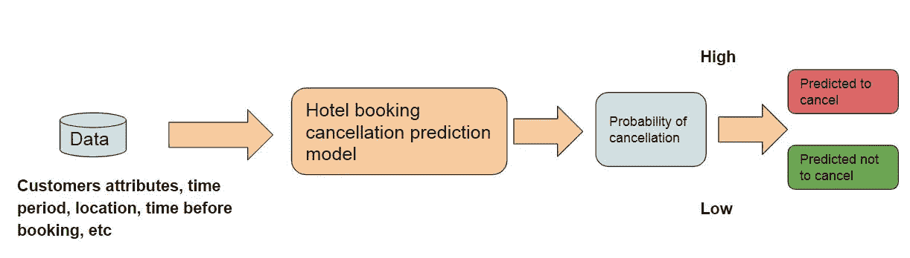
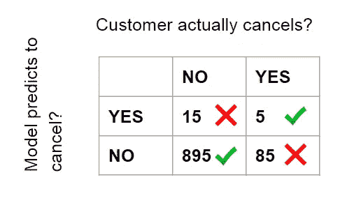
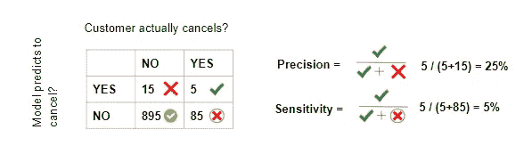
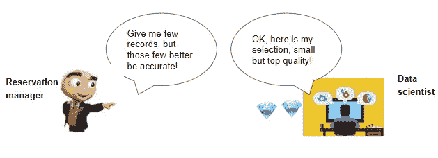

# 不要相信数据科学家会设定性能指标

> 原文：<https://towardsdatascience.com/dont-trust-data-scientists-to-set-performance-metrics-908bcd80bac6?source=collection_archive---------44----------------------->

## 如何将机器学习产品与业务结合起来

图片由 [Free-Photos](https://pixabay.com/photos/?utm_source=link-attribution&amp;utm_medium=referral&amp;utm_campaign=image&amp;utm_content=690161) 来自 [Pixabay](https://pixabay.com/?utm_source=link-attribution&amp;utm_medium=referral&amp;utm_campaign=image&amp;utm_content=690161)

# 选择正确指标的重要性

你是一家销售自行车和自行车配件的电子商务初创企业的创始人。你的网站现在对所有用户都是一样的，但是你想引入个性化功能，在页面顶部显示最相关的 3 个产品。

你走向数据科学团队的办公桌，向他们解释问题。“我应该如何决定展示哪些产品？”，他们问。“那些与用户更相关的”，你解释道。“在什么意义上相关？”“嗯，用户更有可能点击的网站”，你回答，因为这对你来说似乎很简单。

但是在新功能上线几周后，你的报告显示它产生了很多额外的点击，但是销量很少。显然，许多“点击诱饵”产品已经得到推广！它们可能是一个别致的自行车头盔，广告上打着大折扣，但是已经脱销了。这可不好。

来自 [Pixabay](https://pixabay.com/?utm_source=link-attribution&utm_medium=referral&utm_campaign=image&utm_content=2846147) 的[鲁迪和](https://pixabay.com/users/Skitterphoto-324082/?utm_source=link-attribution&utm_medium=referral&utm_campaign=image&utm_content=2846147)彼得·斯皮特兰

所以你向你的数据科学团队抱怨，要求他们改变相关性的概念。“当然，推广不转化的产品是没有意义的。我们只需要用户最终会购买的产品！”你解释。

图片由 [Evanscycles](https://www.evanscycles.com/m-part-standard-plastic-pedals-9-16-inch-thread-EV173724) 提供

很好，所以你的数据科学家回去工作，这一次他们的算法最大限度地增加了售出商品的数量。但是你会发现很多 3.99 美元的踏板就像这些被卖掉了！

你现在清楚地知道总收入需要最大化，因为出售大量廉价商品不会对你的底线有太大帮助。但是，等等，你想最大化的是物品的总价还是你的毛利？如果一般是毛利，但你仍然想销售某些低利润的产品，因为它们往往会带来高价值和更忠诚的客户，那该怎么办？

底线是，机器学习产品和你给它的目标一样好，这是一个商业驱动的决定，通常不是直截了当的。

但是你能控制的杠杆是什么呢？

# 在三维空间工作

每一款 ML 产品都需要决定三个关键因素:

1.  设置适当的绩效指标来衡量成功
2.  当建立模型时，为模型选择合适的优化(损失)函数
3.  当模型被部署到生产中时，着眼于产品如何帮助业务整体的更大图景

我们一个一个来看。

# 设定绩效指标，即定义成功

机器学习模型的性能度量可以表示业务变量，但不一定如此。当模型缺乏可解释性时，业务焦点特别有用，这可以通过更加用户友好的性能度量来弥补。

为预测模型设置指标和目标时，要考虑的一个关键方面是为业务犯错误的成本。让我们以分类引擎为例来看看这一点。

## 犯错的代价

一个在线酒店预订平台希望预测可能会取消预订的客户。

机器学习模型工作流程如下图所示，将每个客户标记为“可能取消”或“不太可能取消”。

数据科学团队推出了一个准确率为 90%的模型，即 90%的客户预测正确。你应该祝贺你的数据科学团队吗？

让我们更详细地看看结果。有 1000 个客户，其中 900 个预测正确。

但是当我们更仔细地观察时，我们意识到并非所有的错误都是生来平等的。犯了一个错误，一个客户预计会取消，但最终没有取消，与一个客户预计不会取消，但最终传播，这是有区别的。

我们特别想问两个问题:

1.  当模型显示预订将会取消时，我能有多自信？这被定义为**精度**
2.  被取消的预订中有多大比例被正确识别？这叫做**灵敏度**或**回忆**

在这种情况下，当模型预测客户将取消时，只有 25%的可能性是正确的。而在最终会取消的客户中，它只抓住了其中的 5%！很难说是一个好的分类器，尽管它有 90%的准确率。还要考虑一个虚拟分类器，简单地对所有客户预测“否”,在这种情况下准确率为 91 %( 895+15 的正确预测/1000)。这是一个典型的不平衡类问题，众所周知，例如那些设计医学测试以识别罕见疾病的人。

那么，最好的度量标准是什么呢？

*   衡量预测模型的“正确”指标完全取决于您的业务流程和您想要实现的目标
*   通常，您需要考虑至少两个指标，并在它们之间寻找合适的平衡。查看[精确回忆](https://medium.com/swlh/recall-precision-f1-roc-auc-and-everything-542aedf322b9)曲线，找到正确的平衡

现在让我们来看一下这个模型的几个业务应用程序，它们具有不同的业务优先级，因此需要优化不同的指标。

**超额预订用例的酒店取消预测**

优化团队希望对那些取消可能性非常高的客户进行超额预订。他们犯错误的代价很大(客户将没有地方睡觉！)但是不一定需要标记大量的客户列表。我们应该为了什么而优化这个模型？

这个模型将被优化为精确的，所以会标记很少的预订，但对那些人来说，它会超级自信。

**酒店客服提醒电话取消预测**

现在，考虑一下客户服务部门使用的相同模型，为更有可能取消的客户安排提醒电话，以便尝试与他们接触，防止他们取消电话。

在这种情况下，打电话的成本可能相当低，而犯错的成本(例如，打电话给甚至没有考虑取消的人)也不会太高。因此，您可能希望标记更大份额的具有不同置信度的客户，最终您将得到一个精度较低但召回率/灵敏度较高的分类器。

# 选择正确的优化函数

在这个阶段，您可能已经选择了一组理想的性能指标来事后测量您的机器学习模型，但您可能也希望模型在构建时就针对这些指标进行优化。

这是通过所谓的[损失函数](https://en.wikipedia.org/wiki/Loss_function)实现的，即模型在训练时(即在从过去的数据中学习时)试图最小化的误差函数，也可以被视为优化函数的逆函数。

这一步跨越了相当多的技术和数学方面的考虑，尽管许多预先构建的算法对于某些默认函数来说效果最好。例如，如果你正在运行一个线性回归，你很少想要偏离最小二乘[作为损失函数。](https://en.wikipedia.org/wiki/Least_squares)

但情况并非总是如此，在某些情况下，这也可能成为商业决策。

例如，如果您试图对彼此相似的商店进行聚类，您需要考虑“类别”维度(商店的类型)和地理成分(其位置)。

聚类模型将尝试基于*距离* *标准*来定义聚类，但是没有一种单一的方法来定义这样的*距离*:例如，根据您的业务用例，您可能希望使用更广泛的类别定义(例如，所有的食品商店在一起)与更广泛的聚类地理区域(例如，城市中的所有商店，而不是邻居)。

可能出现的一个问题是:

> 为什么我们需要根据性能指标单独定义一个损失函数，而不是简单地使用同一个函数？

这有两个原因:

1.  一个模型只能有一个损失函数，而你可以有几个性能指标。例如，正如我们所看到的，您可能希望衡量算法对毛利润和收入的影响，但算法无法同时最大化这两者
2.  模型是用代码实现的，并且需要考虑操作效率。当模型需要按比例运行时尤其如此。例如，在预测房价时，您可能希望最后通过百分比误差中值来评估您的算法。但是在实践中对中值进行优化可能会很棘手，所以您可能会选择另一个度量作为损失函数。

不过，一般来说，损失函数应该与评估指标保持一致。在一天结束时，模型在训练时只能看到它的损失函数，但您将在结束时使用评估指标来评估它。如果两者开始背离，那就不好了。

# 纵观全局

衡量机器学习产品的性能只是故事的一部分，因为最终目标通常是改善整体业务。业务和产品目标的不同可能有多种原因，但这里有两个常见的例子，一个是负面的，一个是正面的:

*   你的产品正在蚕食其他渠道的收入
*   你的产品正在推动其他渠道的交叉销售

让我们考虑一个个性化时事通讯的例子。当用户点击时事通讯并购买产品时，你也许能够通过归因于额外的销售来准确地测量特定于产品的指标，例如增加的收入、转换率等。

但是，如果客户在时事通讯中看到一个产品，没有点击它，但后来又记得它并直接在网站上购买它，该怎么办呢？在大多数归因模型中，这将被视为“直接渠道”购买，因此不归因于时事通讯。

另一方面，你的时事通讯可能会推动其他渠道可能已经发生的销售。

尝试衡量这些更广泛的影响的一种方法是根据客户整体来衡量提升性能，而不考虑渠道。在本例中，如果您要比较简讯中的治疗顾客和对照顾客，您需要衡量他们在整个平台上的活动(例如，他们当天是否在所有渠道购买了产品)

然而，这说起来容易做起来难，主要有两个原因:

*   从技术角度来看，全球属性可能需要更深层次的数据集成，而这在公司内部不一定能实现
*   更微妙的是，其他内部产品可能会运行类似的实验，以不同的方式对待相同的客户(例如，向相同的客户显示个性化的移动应用程序页面)

在任何情况下，即使不可能解释所有这些变量，重要的是至少从定性的角度记住它们，即使不可能量化它们。

# 关键要点

设置正确的性能指标可能是一项棘手的任务，需要成为一项业务决策。如果您来自业务部门，请让您的数据科学家参与进来，但请记住，最终这是您的决定，并且需要基于业务优先级。如果您是一名数据科学家，请确保您完全与业务保持一致，并在做出这些决定之前尝试设身处地地为他们着想。

关键要点总结:

*   考虑价值链不同层次的度量:一个 [CTR](https://en.wikipedia.org/wiki/Click-through_rate) 可能更容易衡量，但通常缺乏端到端的关注
*   一个单一的性能指标通常是不够的:您需要考虑多个指标，并经常评估它们之间的平衡和折衷
*   在设置指标时，请始终牢记做出错误预测的代价。通常，同一个预测模型可以很容易地调整，使其在预测结果时或多或少地保守(就像我们的酒店取消模型)
*   不管你看多少评价指标，记住一个机器学习模型只能对单一的优化(损失)函数起作用。您需要确保这与您的其他指标和目标保持一致
*   始终从业务的角度看全局，即使这需要考虑不可量化的方面，如客户保留、跨渠道互动或长期参与。