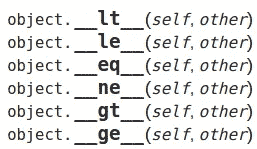

# 不要小看这些 Python dunder 方法！

> 原文：<https://towardsdatascience.com/dont-underestimate-these-python-dunder-methods-c7bc36a8c1c1?source=collection_archive---------46----------------------->


照片由[瑞德·卫斯理](https://unsplash.com/@rhett__noonan?utm_source=medium&utm_medium=referral)在 [Unsplash](https://unsplash.com?utm_source=medium&utm_medium=referral)

有大量关于使用 Python 进行面向对象编程的文章、书籍和视频，其中许多都涉及到了 *dunder* (也称为 *magic* )方法。在本文的最后，我会提供一些我认为对自己有用的资源的链接。

不过，请原谅我。

我现在要表明我的观点:在我看到它们有多有用之前，下面列出的这些方法似乎与我毫不相干。



来源:[https://docs.python.org/3/reference/datamodel.html](https://docs.python.org/3/reference/datamodel.html)

这些被称为 ***富比较*** 的方法。现在，事后看来，它们似乎有点多余，甚至毫无用处，因为 python 本身也提供了比较对象的函数。

事情是这样的，当你构建一个[类](https://docs.python.org/3/tutorial/classes.html)时，你可能希望它以某种特定的方式运行。现在，行为在许多方面不同于功能。

让我们看看它如何应用于数据科学的问题。

假设你正在为一个分类问题测试不同的监督学习 ***技术*** 。为简单起见，我假设您熟悉这些术语。

通常，您会有一组原始要素用作训练算法的输入变量。然而，重要的转换，比如填充缺失值、标准化变量等等，几乎肯定会发生。

就像在 [**scikit-learn 的管道**](https://scikit-learn.org/stable/modules/classes.html#module-sklearn.pipeline) *，*中一样，你可以为 ***，*** ， ***逻辑回归构建不同的变形金刚。***

请注意，即使这些步骤是相同的，并且具有相同的名称，也不可能说它们与 Python 中的常规比较是相等的。

```
>>> from sklearn.preprocessing import StandardScaler, MinMaxScaler
>>> from sklearn.impute import SimpleImputer
>>> from sklearn.pipeline import Pipeline
>>>
>>> mean_transformer_1 = Pipeline(steps=[
...     ('imputer', SimpleImputer(strategy='mean')),
...     ('scaler', StandardScaler())])
>>> 
>>> mean_transformer_2 = Pipeline(steps=[
...     ('imputer', SimpleImputer(strategy='mean')),
...     ('scaler', StandardScaler())])
>>> 
>>> mean_transformer_1==mean_transformer_2
False
```

这就对了。在应用不同的管道之前和之后比较模型可能相当麻烦。

比较它们的一种方法是比较每个步骤的类，看它们是否相同:

```
>>> class_1 = mean_transformer_1.steps[0][1].__class__
>>> class_2 = mean_transformer_2.steps[0][1].__class__
>>> class_1 == class_2
True
```

现在，除了难看和冗长，如果你有一个更大的管道，这可能是相当冗长的。老实说，这么小的管道在现实生活中很少投入生产。

> **警告:**为了注意广度，我只保留了类别的比较。但是传递的参数比如`'mean'`如果真的要深究比较的话也要比较一下。

正如[雷蒙德](https://github.com/rhettinger)的名言所说:一定有更好的方法！确实有。

让我们制作一个类来比较这些:

```
>>> class SmartCompare:
...     def __init__(self, pipeline):
...         self.pipeline = pipeline
...
...     def __eq__(self, other):
...         return [m1.__class__ for m1 in self.pipeline]==[m2.__class__ for m2 in other.pipeline]
... 
>>> mean_transformer_1_c = SmartCompare(mean_transformer_1)
>>> mean_transformer_2_c = SmartCompare(mean_transformer_2)
>>> mean_transformer_1_c==mean_transformer_2_c
True
```

当然，这并没有好到哪里去，但是这说明了一个问题！

您也可以继承`Pipeline`类，而不是让它成为您的类的一个属性。或者甚至使用其他方法进行比较。

在任何情况下，dunder 方法都超越了常规的比较方法，使您的代码更具可读性和愉悦性。

感谢您的耐心！！！欢迎批评，请随意发表评论。

## 一些有用的资源:

[](https://dbader.org/blog/python-dunder-methods) [## 用 Dunder(神奇的，特殊的)方法丰富你的 Python 类——dbader.org

### Python 的“神奇方法”是什么，以及如何使用它们使一个简单的 account 类更加 Python 化。在 Python 中…

dbader.org](https://dbader.org/blog/python-dunder-methods) [](https://medium.com/swlh/welcome-to-python-meet-the-dunders-41026b2a7e36) [## 欢迎来到 Python，认识一下邓德尔一家

### python 中几种 __magic__ 方法的快速介绍

medium.com](https://medium.com/swlh/welcome-to-python-meet-the-dunders-41026b2a7e36)