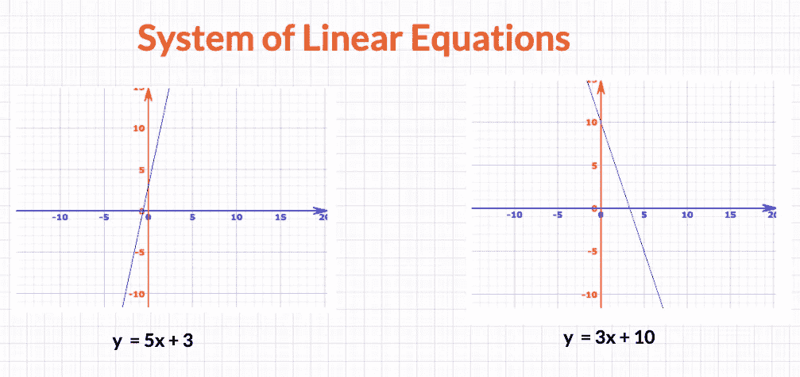

# 使用 Python 实现数据科学线性代数中的点积

> 原文：<https://towardsdatascience.com/dot-product-in-linear-algebra-for-data-science-using-python-f113fb60c8f?source=collection_archive---------23----------------------->

## 建立对矩阵如何帮助解决线性方程组以及回归问题的直觉

在这里你可以一步一步跟着我

在您很好地掌握了[向量、矩阵和张量之后，](/introduction-to-vectors-and-matrices-using-python-for-data-science-e836e014eb12?source=---------4------------------)是时候向您介绍线性代数的一个非常重要的基本概念了— **点积(矩阵乘法)以及它如何与求解线性方程组相关联**。我说它很重要，因为它被广泛应用于几乎所有主要的机器学习和深度学习算法中。

这为[学习数据科学的数学](/practical-reasons-to-learn-mathematics-for-data-science-1f6caec161ea?source=---------5------------------)提供了一个很好的案例。

因此，在这篇文章中，我们将使用 NumPy 来涵盖以下概念及其[代码:](/numpy-essentials-for-data-science-25dc39fae39?source=---------6------------------)

*   **矩阵和向量的点积**
*   **两个矩阵的点积**
*   **矩阵乘法的性质**
*   **线性方程组**
*   **线性回归预测模型方程**

让我们开始吧…

## **矩阵和向量的点积**

与加法或减法不同，两个矩阵的乘积不是通过将一个矩阵的每个单元与另一个矩阵的相应单元相乘来计算的，而是我们计算一个矩阵的行与另一个矩阵的列的乘积之和，如下图所示:

矩阵和向量的点积

这种矩阵乘法也叫**点积。**

下面是该方法的形式化描述:

矩阵乘法数学形式化

**重要规则:**只有第一个矩阵的列数等于第二个矩阵的行数，才能将两个矩阵相乘。

如果一个矩阵的形状是(m×n)，而另一个矩阵的形状应该是(n×t)(t ≥ 1)，那么得到的乘积矩阵将具有如下所示的形状(m×t):

如果我将矩阵 A (3×2)与向量 B(2×1)相乘，下面是矩阵和向量之间的点积的更全面的符号形式:

生成的矩阵将是一个 3×1 向量，计算如下:

[数]矩阵

让我们看一个例子:

将第一个 3×2 矩阵乘以一个向量

按照上述规则计算的结果矩阵

**代码:**

让我们使用 Numpy 对它们进行编码:

Colab 笔记本截图，可以在这里查看:[https://colab . research . Google . com/drive/1 jrqnk 5 pjlwbycvjf 2 jhjdu-dRvMXjXkD？usp =分享](https://colab.research.google.com/drive/1jrQnk5pjLWbYCvjF2JHjDu-dRvMXjXkD?usp=sharing)

首先，在您的工作区中导入 NumPy 包[，然后创建一个上面例子中讨论过的 2D 矩阵或任何其他您想尝试的矩阵结构，然后创建一个向量，确保矩阵中的行数和列数相等。](/ideal-python-environment-setup-for-data-science-cdb03a447de8?source=---------10------------------)

然后可以使用 numpy 包中的`dot()`方法，将矩阵和向量传递给它。它将为您返回合成向量，如图所示。

您可以查看整个笔记本，并使用以下代码进行试验:

 [## 谷歌联合实验室

colab.research.google.com](https://colab.research.google.com/drive/1jrQnk5pjLWbYCvjF2JHjDu-dRvMXjXkD?usp=sharing) 

## 两个矩阵的点积。

然后，我们可以将 2 个矩阵相乘，下面是一个 4×3 矩阵 ***A*** 乘以 3×2 矩阵 ***B*** 的示例:

遵循如下所示的方法:

**代码:**

就像我们编写上一个示例一样，这里您将创建两个 2D 数组，然后使用数组的点方法，您可以计算点积:

Colab 笔记本截图，可以在这里查看:[https://colab . research . Google . com/drive/1 jrqnk 5 pjlwbycvjf 2 jhjdu-dRvMXjXkD？usp =共享](https://colab.research.google.com/drive/1jrQnk5pjLWbYCvjF2JHjDu-dRvMXjXkD?usp=sharing)

## 矩阵乘法的性质

现在矩阵乘法都清楚了，让我们看看下图中解释的矩阵乘法的一些属性:

这里有一个**任务**给你:你可以根据你的想象创建矩阵(A、B 或 C ),然后通过首先计算 lhs 来检查每个规则，然后用它来评估 R.H.S。如果它们成立。

我将在这里检查点积的**变换规则:**

大家可以看到，我首先创建了两个矩阵 ***A*** 和 ***B*** ，然后首先通过计算两个矩阵的点积来求解 L.H.S .然后使用`**T**` **方法**转置它们，并根据 R.H.S .对其进行评估，其中矩阵的位置互换，它们首先被转置，然后使用`dot()`方法相乘。

## 线性方程组

在线性代数中起着至关重要的作用，以帮助解决各种各样的问题，方程系统基本上被定义为多个方程的集合。它们可以用矩阵进一步描述，让我们看看如何描述。

含有两个未知数的两个方程组。图表绘制使用:https://mathisfun.com

因此，方程组有两个主要部分:

1.  方程式的数量
2.  未知数的数量

未知数的数量是手头问题的维数，方程的数量是(2D)或 n 维平面中的线的数量。

这是一个由 4 个方程和 4 个未知数组成的系统:

含有 4 个未知数 x1，x2，x3，x4 的 4 个方程组。

## 线性方程组的矩阵表示

现在，我们可以使用矩阵来描述线性方程组，其形式为 ***Ax = b.*** 考虑这个线性方程组:

这里，我们有从 x₁到 xₙ的`**n**`个未知数，我们有`**m**` 个行数(这里是方程)。我们可以推断出变量(从 x₁到 xₙ)可以概括为一个向量 ***x.***

并且我们可以将**作为**(每个变量的系数(权重)】放在另一个矩阵 ***A*** 中:

然后，可以使用下面的符号来描述系统的 lhs:

***A*** 和矢量 ***x*** 的点积将给我们所需的输出矢量 ***b***

下面是一个两个方程的系统如何发生这种情况的例子:

## 线性回归

我们今天所学的一个实际例子可以在线性回归模型预测方程的实现中看到，如下所示:

这里，

*   *ŷ* 是预测值。
*   *n* 是特征的数量。
*   *xi* 是第 *i* 个特征值。
*   *θj* 是第 *j* 个模型参数(包括偏置项 *θ* 0 和特征权重 *θ* 1、 *θ* 2、⋯、 *θn* )。

它可以进一步写成矢量化的形式，如:

> yˇ= h**θ**(**x**)=**θ**x

*   **θ** 是带有特征权重的模型的*参数向量*。
*   **x** 是实例的*特征向量*，包含 *x* 0 到 *xn* ，其中 *x* 0 始终等于 1。
*   **θ** **x** 是矢量 **θ** 和 **x** 的点积，等于上式中的相对高度。
*   *h* **θ** 为假设函数，使用模型参数 **θ** 。

## 结论:

因此，你可以意识到点积和矩阵&向量在机器学习中的重要性，因为高层的每个操作都是由这些基础知识执行的。

# Harshit 的数据科学

通过这个渠道，我计划推出几个涵盖整个数据科学领域的[系列](/hitchhikers-guide-to-learning-data-science-2cc3d963b1a2?source=---------8------------------)。以下是你应该订阅[频道](https://www.youtube.com/channel/UCH-xwLTKQaABNs2QmGxK2bQ)的原因:

*   该系列将涵盖每个主题和子主题的所有必需/要求的高质量教程，如 [Python 数据科学基础](/python-fundamentals-for-data-science-6c7f9901e1c8?source=---------5------------------)。
*   解释了为什么我们在 ML 和深度学习中做这些事情的数学和推导。
*   与谷歌、微软、亚马逊等公司的数据科学家和工程师以及大数据驱动型公司的首席执行官的播客。
*   [项目和说明](/building-covid-19-analysis-dashboard-using-python-and-voila-ee091f65dcbb?source=---------2------------------)实施目前所学的课题。

你可以在 [Twitter](https://twitter.com/tyagi_harshit24) 、 [LinkedIn](https://www.linkedin.com/in/tyagiharshit/) 或 [Instagram](https://www.instagram.com/upgradewithharshit/?hl=en) 上与我联系(在那里我谈论健康和福祉。)