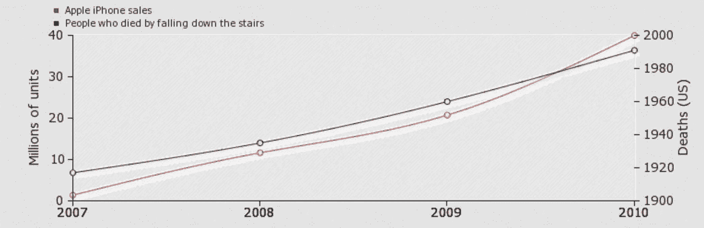
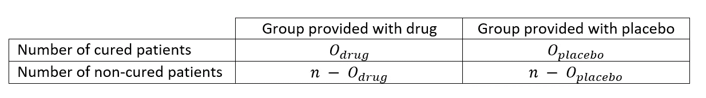
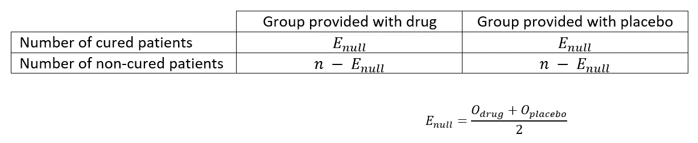
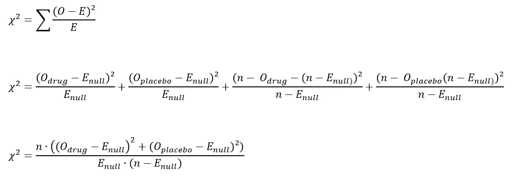
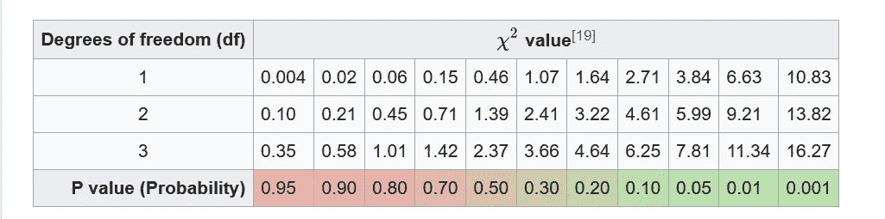
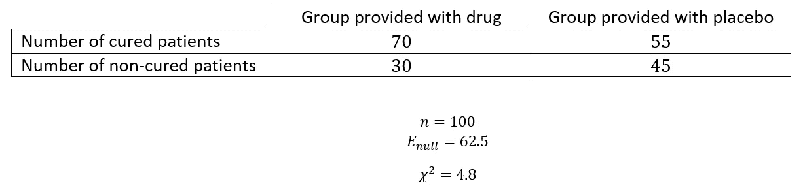
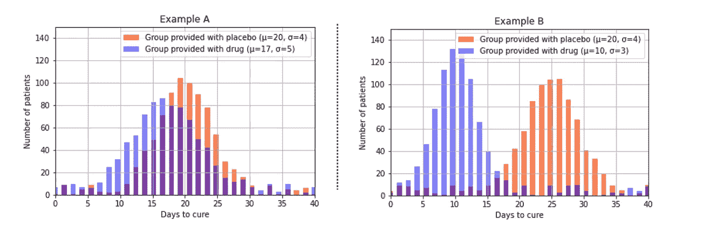
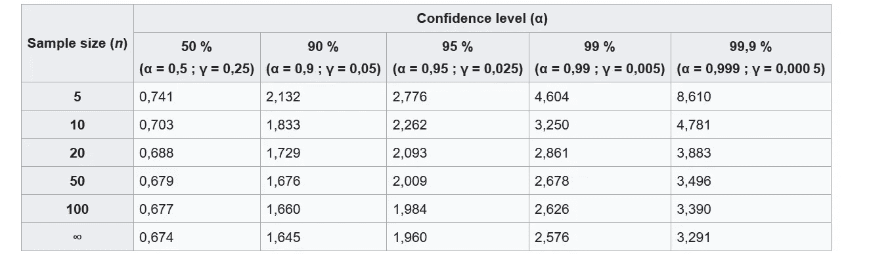
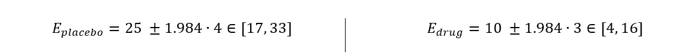

# 双盲随机研究:如何正确证明治疗有效

> 原文：<https://towardsdatascience.com/double-blind-random-studies-how-to-prove-properly-that-a-therapy-works-532ce47b0fd3?source=collection_archive---------47----------------------->

## 自从新冠肺炎病毒传播以来，我们已经听到各种各样的人在争论某些医学研究将某种药物作为治疗手段的有效性。在本帖中，我将展示一种最值得信赖的科学方法来证明一个事件对另一个事件的影响，例如，一种疗法对一种医疗状况的影响。

由 [Unsplash](https://unsplash.com?utm_source=medium&utm_medium=referral) 上的 [Taras Chernus](https://unsplash.com/@chernus_tr?utm_source=medium&utm_medium=referral) 拍摄的照片

# 用实验研究证明因果关系

证明因果关系的挑战，即一个事件(或特征)对另一个事件的影响，是数据科学家面临的一个著名挑战。很容易获得一个历史数据集，绘制数据点，并找到两个变量之间的相关性。然而，相关性并不意味着因果关系:

*   可能无法知道哪一个变量是另一个的原因，哪一个是结果；
*   相关可能是纯粹的巧合；
*   第三个未知变量可能是两个研究变量的原因。

人们在冲进苹果商店时会摔下楼梯吗？还是人口增长解释了这两个系列？也许这只是纯粹的巧合？更多好玩的例子看【tylervigen.com/spurious-correlations】

*为了解决这些问题，研究人员设计了实验研究。与研究历史数据的观察性研究不同，实验性研究是通过重复一个具有受控变量的实验来创建我们自己的数据:在两次实验之间只有一个变量发生变化，这就是我们想要研究的变量对目标变量的影响。如果目标值随着变量的变化而不断变化，那么就存在因果关系。*

# *定义双盲研究*

*现在，假设我们想证明一种新药治疗特定疾病的效率。典型的设置包括将患病患者分成两组，只给一组患者用药，并比较每组中治愈患者的数量。但是为了避免任何可能影响结果的偏差，我们将增加额外的步骤:*

*   *为了消除反应偏差，我们会给未治疗组的患者服用安慰剂，他们显然对治疗分配是不知情的；*
*   *为了消除统计偏差，我们将随机分组；*
*   *为了消除确认和观察者的偏见，研究者和医务人员也将对治疗分配视而不见。*

*该配置定义了一个**双盲随机研究**。*

# *实验结果分析*

*为了简单起见，我们的两个组被认为具有相同的大小*，但是对于不同大小的组，分析是非常相似的。**

****

**简化实验的观察结果**

**现在我们可以制定两个假设:**

*   ***无效假设*:药物无效，两组治愈率相近；**
*   ***替代假设*:该药物是有效的，并且在提供药物的组中治愈率明显更高。**

**在零假设下，理论结果会是这样的:**

****

**在零假设下的结果:组间无差异。**

**我们现在将执行 [**卡方检验**](https://en.wikipedia.org/wiki/Chi-squared_test) 。这种广泛使用的测试检查两个变量之间的统计联系(相关性)。这里，我们的两个二元变量是:**

1.  **药物的使用(表格各栏)**
2.  **病人的治疗(表格的行)**

**对于表中的每个像元，卡方统计是观测像元值与零假设下的像元值之间的平方差之和除以零假设下的值:**

****

**我们简化案例研究的卡方统计公式**

**最后要做的是将该值与参考表进行比较，以接受或拒绝零假设。*在我们的示例中，我们有 1 个自由度:一个变量的值的数量减 1 乘以另一个变量的值的数量减 1 等于 1。***

****

**来自[维基百科](https://en.wikipedia.org/wiki/Chi-square_distribution#Table_of_%CF%872_values_vs_p-values)的卡方值表**

**让我们以下面的例子为例，计算卡方值。起初，我们可能认为这种药物是有效的:**

****

**如果我们想要 95%的置信度(这是医学中的常见情况)，因为我们的卡方值是 4.8，4.8>3.84，我们可以拒绝零假设，认为药物与安慰剂相比有效果。**

****就是这样！**不要忘记寻找效果的类型(积极或消极)。**

***注意:为了使卡方检验有效，建议在零假设下，表中每个单元格的 E≥5。***

# **高级分析:数字目标变量**

**有时候，目标变量不是二元的，而是一个连续的数值变量:治愈天数、血糖水平、血压……这种情况下，建立一个结果表就无关紧要了。我们将使用不同的方法。**

**首先，我们将为每组中的每个患者注册目标变量的值。绘制每组的值分布图是评估药物是否对目标变量(此处为患者治愈的天数)有影响的第一条线索。**

****

**如果我们的结果看起来像例 A，我们是否应该认为药物有效果？例子 B 呢？**

**比较这两组的严格方法是比较它们分布的期望值。然而，我们只知道我们研究的病人的样本均值。所以我们要用[学生的 t 分布](https://en.wikipedia.org/wiki/Student%27s_t-distribution)的一个性质来估计两个分布的期望值(一个先决条件显然是检查分布是否正态)。此属性根据样本平均值定义分布期望值的置信区间:**

****

**期望值置信区间的学生定律**

**α是置信水平。 *n* 是样本量(患者数)。 *t* 是学生因素。我们可以在参考表中找到它的值:**

****

**来自[维基百科](https://en.wikipedia.org/wiki/Student's_t-distribution#Table_of_selected_values)的学生因子值表**

**例如，假设我们有 2 组 100 人( *n=100* )，我们想要 95%的置信度，我们研究前面看到的例子 B:**

****

**示例 B 的置信区间**

**期望值的置信区间不重叠，因此分布也不相同:我们可以认为，与安慰剂相比，药物在治愈天数上是有效的。**

# **一个结论**

**双盲随机研究是证明药物有效的最可靠的方法之一，但它的用途远远超出了医学研究。例如，你可能知道广告、UX 设计甚至机器学习中经常使用的 A/B 测试:哲学是相同的。这种研究可以在我们想知道一个变量是否对另一个变量有影响的任何时候使用。在 [Wavestone Consulting，](https://medium.com/u/29d9c11971ae?source=post_page-----532ce47b0fd3--------------------------------)我们使用类似的方法为我们的一个客户评估储罐特性对酒精蒸发的影响。**

**然而，当进行双盲研究是可能的时候(并不总是如此——你如何为外科手术提供安慰剂？)，一个主要的缺点出现了:如果测试的药物是有效的，这意味着“安慰剂”组没有从中受益，当然会后悔。给患有不治之症的病人服用安慰剂是否道德？也许有一天，在 A/B 测试的背景下，一些旨在解决这个*遗憾*问题的新方法，例如[基于强化学习的网飞艺术品个性化](https://netflixtechblog.com/artwork-personalization-c589f074ad76)系统，将有益于医学研究。**