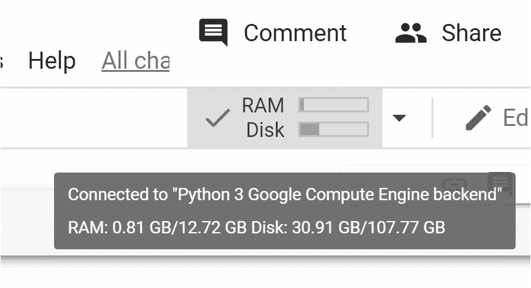
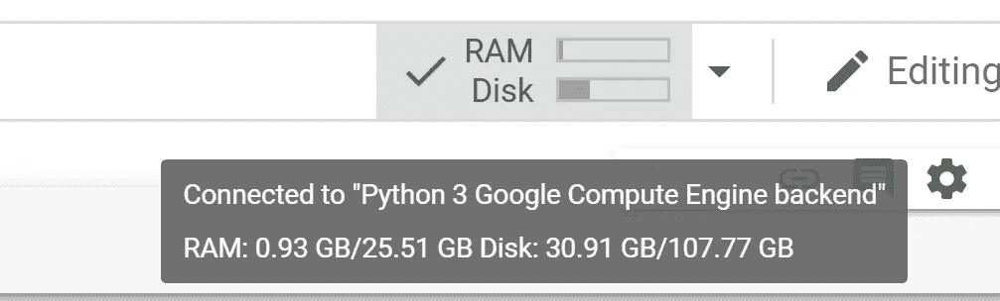

# 使用一小段代码在 10 秒钟内将你的 Google Colab 内存翻倍

> 原文：<https://towardsdatascience.com/double-your-google-colab-ram-in-10-seconds-using-these-10-characters-efa636e646ff?source=collection_archive---------2----------------------->

“我需要更多内存！”(图片鸣谢:布莱克·帕特森)

oogle Colab 是一个不可思议的工具。可以用三个字来形容:云中的 Python。好吧，四个字。但是重要的是，您不需要担心 Python 版本(Colab 既有 Python 2 又有 Python 3)，也不需要担心下载模块(最流行的已经安装了)、备份、文件系统和所有那些有时会导致您因堆栈溢出而浪费时间的管理工作。最好把多余的精力留给编码。

Google Colab 很棒，因为它很简单。这对于学习 Python，对于小型玩具项目，以及一些严肃的机器学习实践来说都是非常棒的。谷歌让你免费使用他们的 GPU 或 TPU！我发现它在大学环境中非常有用:我要求学生通过分享他们的 Google Colab 笔记本的链接来提交他们的作业。再也没有“我的笔记本电脑因为内存不足而死机”的借口了。

> 2020 年 5 月 20 日更新:一位[读者报告说](https://medium.com/@wangxianh940621/it-doesnt-work-for-me-i-don-t-know-why-4555d6ce0489)在免费的 Colab 运行时上加倍 RAM 的选项不再有效。胡乱猜测:这与谷歌最近以 9.99 美元/月的价格推出的 [Colab Pro](https://colab.research.google.com/signup) 有关，它提供了两倍的内存…

Colab 是 100%免费的，因此自然会有一些资源限制。正如你在下面的截图中看到的，Colab 的每个实例都有 12 GB 的 RAM(实际上是 12.7 GB，但是已经占用了 0.8 GB)。这已经足够了，尤其是考虑到你不需要为此付钱。但有时你需要更多的内存。

默认运行时间有 12 GB 的内存

幸运的是，谷歌很慷慨。非常慷慨。您可以将 RAM 增加一倍，达到 25 GB。你是怎么做到的？不幸的是，没有复选框或菜单选项来做到这一点。要让 25 GB 选项生效，首先需要用完所有会话内存。全部 12 GB。一旦您这样做，会话将崩溃，Colab 将在屏幕底部显示以下内容:

你耗尽了所有的内存！

单击“获取更多内存”将弹出一个对话框，允许您切换到“高内存”运行时:

是的，我有！

就是这样！一旦您批准，您的机器 RAM 现在将显示新的容量:25.5 GB。

双倍的内存！

有一个问题:在 25 GB 升级之后，您当前运行时的状态将会丢失，包括本地文件。你需要从头开始重新运行你的程序。也许再次上传文件等等。因此，如果你*知道*你肯定需要那块额外的 RAM，先分配它，然后再发现，否则就太晚了。

那么怎么分配这么多 RAM 呢？我在网上找到了一些解决方案，但是(1)它们需要大约 60 秒(2)它们需要多行代码。

所以我想出了一个更简单的解决方案:一行代码，由 10 个字符组成，就可以完成这个任务。此外，它非常快:仅在 10 秒钟内就消耗完了所有 12 GB 或 RAM。这是:

`[1]*10**10`

就是这样。这就是代码。它是如何工作的？Python 将尝试创建一个由 10 个⁰=10,000,000,000 整数组成的列表。然而，这样的列表需要超过 12 GB。事实上，存储这个列表需要大约 80 GB 的 RAM。因此，会话将崩溃，升级将很快可用。所以:如果你确定你的程序需要双 RAM，在暂存单元(Ctrl/⌘+Alt+N)中运行`[1]*10**10`，接受 ram 升级，就这样。你完了。

希望你喜欢这篇文章！现在，让我们开始 10x10 编码挑战:)

# 10x10 编码挑战

你能找到一段“更好”的代码来用完所有的内存吗？短一点的(少于 10 个字符)，还是快一点的(少于 10 秒)？或者最好两者都有！欢迎在评论区发表您的代码或任何其他反馈。谢谢大家！

**更新(2020 年 5 月 3 日):** Sumit Yadav 回应挑战，发布了一段更短的代码，只有 9 个字符:`[1]*9**10` (9 ⁰约为 3.5 10⁹，足以触发内存升级)。恭喜你 Sumit！