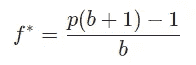
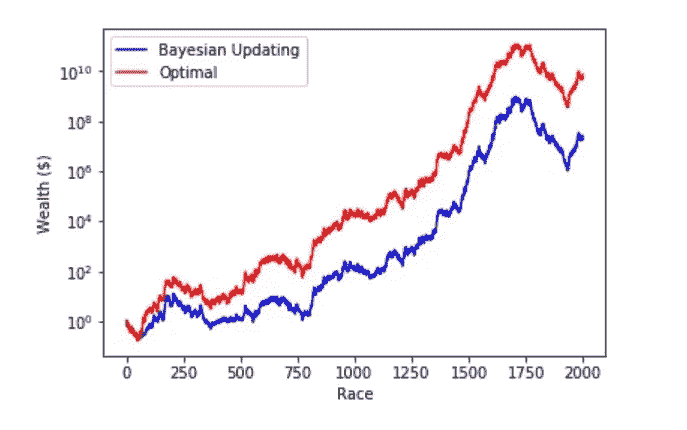

# 用凯利标准和贝叶斯统计让你的钱翻倍

> 原文：<https://towardsdatascience.com/doubling-your-money-with-the-kelly-criterion-and-bayesian-statistics-83ee407c0777?source=collection_archive---------10----------------------->

## 投资组合优化

## 如何确定赌注并获胜

彼得罗·马蒂亚在 [Unsplash](https://unsplash.com/s/photos/horse-racing?utm_source=unsplash&utm_medium=referral&utm_content=creditCopyText) 上拍摄的照片

***来自《走向数据科学》编辑的提示:*** *虽然我们允许独立作者根据我们的* [*规则和指导方针*](/questions-96667b06af5) *发表文章，但我们并不认可每个作者的贡献。你不应该在没有寻求专业建议的情况下依赖一个作者的作品。详见我们的* [*读者术语*](/readers-terms-b5d780a700a4) *。*

不久前，当我住在阿德莱德时，有客户找到我，他们想弄清楚如何分配赛马中的赌注，特别是一些奇特的赌注，如 trinella(以任何顺序挑选前三匹马)和 quinella(以任何顺序挑选前四匹马)。

他们想让我找出一种计算凯利标准(见下文)的方法，通过重复下注来成倍增加他们的资金池。一个巨大的复杂问题是，这是一个[同注分彩投注系统](https://en.wikipedia.org/wiki/Parimutuel_betting)，所以赛马的赔率甚至就在比赛开始前更新！

我可以说我解决了这个问题，但是我不能在我的咨询合同中透露这个解决方案。

然而，在这篇文章中，我将讨论凯利标准，以及如何将贝叶斯统计与它结合起来。

# 单次与重复下注

假设你想通过抛硬币和一个朋友打一次赌。假设你有一笔资金池 *M* ，那么，为了使你的赢款最大化，最佳策略是你应该下注 *M* 的全部股份。对于一枚公平的硬币，预期的回报是 M/2。

但是如果你和你的朋友多次打赌呢？

我们可以很容易地看到，在一次性赌注中使用的策略在这里并不适用。如果我们每一轮都下全额赌注，存活足够长时间以复合初始资金池的机会将非常渺茫，因此随着赌注数量的增加，我们的**预期奖励将趋向于 0** 。我们可以看到，最起码，重复下注的**游戏主名是生存**，而欣欣向荣。

那么，在这种情况下，什么是最佳策略呢？

# 输入凯利标准

凯利标准是由贝尔实验室的 John L. Kelly Jr .在其开创性的论文中提出的，是一种在重复下注的情况下优化下注规模的策略。凯利本人是一个有趣的人物:一个烟不离手的得克萨斯人，二战期间曾是海军的战斗机飞行员，也是一名出色的研究员。他发展了这个标准，作为他杰出的同事克劳德·香农对信息熵的另一种解释。你可以从《财富的公式》这本书里了解它的历史。

给定一个初始的财富池，目标是**在下注时最大化财富的翻倍率**。凯利论文中对赛马案例的最初分析假设投注者将她的投资组合完全投资于所有期权；后来出现了一些变化，赌者可以扣留一部分财富。有趣的是，可以从数学上证明(几乎可以肯定),从长期来看，没有其他策略能在更高的财富方面胜过凯利标准。

简而言之，凯利标准的目标是通过在每次下注时进行智能分配，最大化财富翻倍的速度。即使你知道胜算很大，全押也不是个好主意，因为有亏损的可能。

让我们考虑一下掷硬币场景中的重复下注。在这种情况下，凯利标准很简单(例子取自维基百科)

*   *f** 是当前财富要下注的分数(用分数表示)，
*   *b* 是在赌注上收到的净赔率(例如，下注 10 美元，赢了，奖励 14 美元，包括赌注；然后 *b* =0.4)，并且
*   p 是获胜的概率。如果我们让*q*= 1*p*，那么有趣的是，凯利准则建议，如果下注者有一条**边**，即*b*>*q*/*p*(注意，如果*b*<*，则 *f** 可以是负数它还说如果*b*=*q*/*p*就不要赌任何东西。*

为了得到下面的好东西，我不打算过多地钻研这个案例的公式。你可以在像托马斯和盖的经典文本这样的标准教科书中找到推导。

现在我们已经建立了对凯利标准的直觉，通过对比单次下注情况和重复下注情况，我们可以看到明显的差异:

*   如果赔率对你不利，就不要下注！这相当于在扑克游戏中经常弃牌，只对对你有利的赌注分配较大的份额，
*   对于一次性下注，我们最大化您赢款的平均值(或期望值)，但对于重复下注，我们**最大化您赢款的** [**几何平均值**](https://en.wikipedia.org/wiki/Geometric_mean)**。**

**这些共同帮助我们最大化我们的钱每一次翻一番的速度(或 T42 翻一番的速度)。**

**这已被应用于各种游戏，包括赛马，甚至股市投资。在后一种情况下，有人说沃伦·巴菲特本人就是凯利·bettor⁴(尽管我认为查理·芒格比巴菲特更像)。**

# **一个主要的警告**

**然而，应用该标准的主要困难在于，它假定事件发生的真实概率对于下注者来说是已知的。在上面掷硬币的例子中，下注者知道 *p* 的值是多少，她可以相应地确定赌注的大小。**

**实际上，这些通常是未知的，概率必须由下注者来估计。不幸的是，根据定义，任何估计都可能是错误的，因为这只是猜测。该标准对估计概率敏感，并且由于该标准使财富翻倍指数最大化，所以随着时间的推移，估计概率中的错误很容易毁掉投注者。**

**请注意，在我的咨询工作中，我的客户有一个系统来估计马匹获胜的概率，这使得我的工作简单了很多。**

**如果你没有这样的系统，这就是贝叶斯更新的用武之地。目标很简单:**我们希望根据所有可用信息估算事件发生的概率**。我们根据新的信息不断更新概率，然后用这些信息来决定我们的赌注。随着时间的推移，随着评估的适应，我们希望我们的分配表现得更好。**

# **例子:赛马！**

**具体来说，让我们把问题归结为在赛马场赌马的具体问题。**

**让我们假设有 *K* 匹马。在每一轮中，我们都想赌一匹获胜的马，一旦这一轮结束，获胜者就是这 *K* 匹马中的一匹。基于这些信息，我们想要更新一组概率 *p* ₁， *p* ₂，⋯， *pₖ* ，其中 *pᵢ* 是那匹马*我*的概率，随着时间的推移越来越接近真相。**

**点击链接[这里](https://github.com/ptuls/multiarm_kelly_portfolio)运行一个他们如何一起工作的模拟！假设你的机器上已经安装了 [Docker](https://www.docker.com/) ，只需在命令行上通过提供的脚本`run.sh`运行笔记本即可。笔记本在`docker/Kelly Multiarm Portfolio Simulation.ipynb`找到。**

**我们假设马独立地执行**。基于这个假设，我们可以用[狄利克雷分布](https://en.wikipedia.org/wiki/Dirichlet_distribution)来模拟马获胜的概率。这样做的理由如下:****

*   ****每匹马获胜都可以被视为一个**分类随机变量**，所以如果马 *k* 获胜，那么实现的随机变量就是 *k* ，那么****
*   ****作为伯努利过程的一般情况，分类分布的**共轭先验是狄利克雷分布**，因此选择了狄利克雷分布。这在朱庇特笔记本上会更清楚。****

********

****贝叶斯更新投资组合与最优凯利配置投资组合****

****我们将看到，在模拟中，在重复下注的情况下，由于估计概率中的误差，分配通常是不完美的，并且不接近最优分配，*即，*如果下注者知道潜在的马获胜概率。我们可以在下图中看到这一点，其中最优投资组合和贝叶斯投资组合的初始财富都是从 1 美元开始的。但是结果是不可否认的:随着评估变得更好，最终的分配也会变得更好！****

# ****最后一个音符****

****当然，现实要复杂得多:****

*   ****我们假设马的表现是相互独立的**:这在现实中可能不是真的，******
*   ******潜在的真实概率**在整个模拟过程中保持静态**:同样，概率在现实生活中会更加动态，更多地来自未知过程，******
*   ****目标函数假设在估计的概率中没有错误:考虑估计中的不确定性可以改善分配，并且****
*   ****在整个模拟过程中，赔率**保持不变**:这在同注分彩投注系统中显然是不正确的，因此在赔率变化的情况下不断更新概率会很有趣。****

****我还没有探索的一个途径是转换到非参数模型(也称为神经网络)来估计概率。这是令人兴奋的，因为人们可能会使用每匹马的更多上下文信息，例如它的骑师、过去在不同赛道上的表现等。来推导获胜的概率，而不是像上面那样附加一个经典的共轭先验。****

****另一个原因是，将它应用于股票市场更复杂，因为股票价格的范围更广，基本上可以用连续分布来建模。也就是说，可以想象的是，蒙特卡洛模拟的某种组合可能有助于估算。****

****我想总结的一个主要观点是，概率的建模和赌注的大小本质上分别是*估计*和*决策*任务。这与强化学习和控制系统有很强的联系，因此结合这些领域的知识将是一个令人兴奋的探索领域！****

*****原载* [*此处*](https://paultune.com/posts/kelly-bayesian) *稍加编辑。*****

# ****参考****

****[1]约翰·l·凯利，“信息率的新解释”，贝尔系统技术杂志。第 35 卷第 4 期:第 917–926 页，1956 年[链接](http://www.herrold.com/brokerage/kelly.pdf)****

****[2]威廉·庞德斯通，“财富的公式:击败赌场和华尔街的科学赌博系统的不为人知的故事”，2006 年[链接](https://www.amazon.com/Fortunes-Formula-Scientific-Betting-Casinos/dp/0809045990)****

****[3]托马斯·m·盖和乔伊·a·托马斯，“信息理论的要素”，第 2 版。，2006 年[链接](http://staff.ustc.edu.cn/~cgong821/Wiley.Interscience.Elements.of.Information.Theory.Jul.2006.eBook-DDU.pdf)****

****[4] Mohnish Pabrai，“The Dhandho Investor:The Low-Risk Value Method to High return”，Wiley，2007 年[链接](https://www.amazon.com/Dhandho-Investor-Low-risk-Method-Returns/dp/047004389X)****