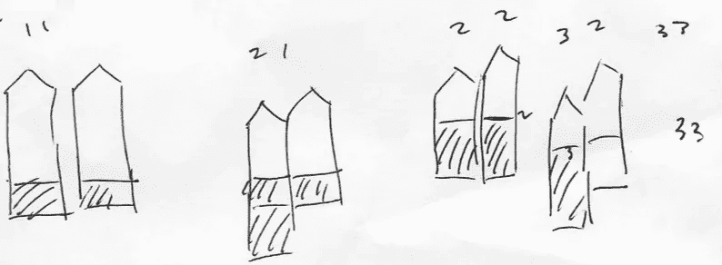
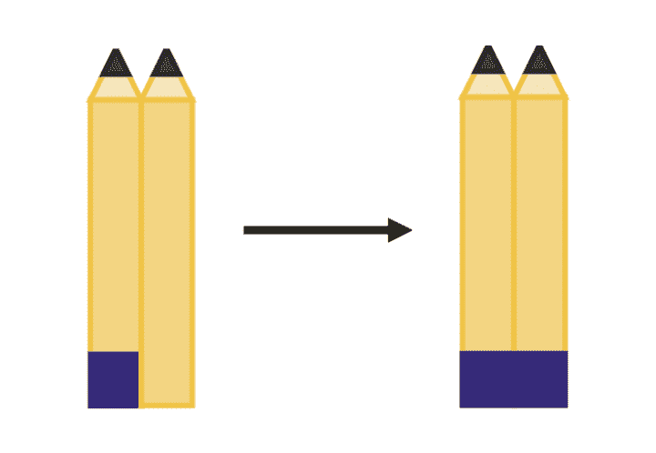
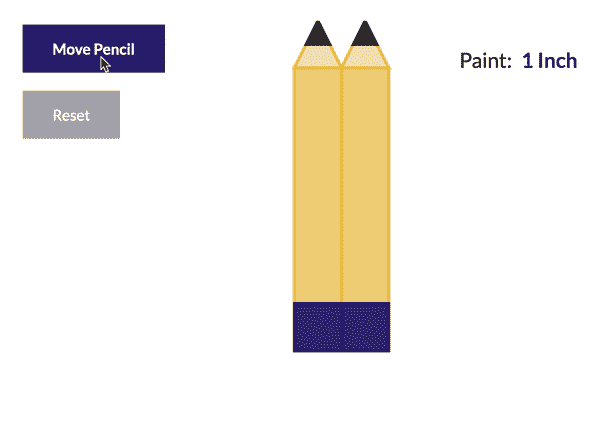
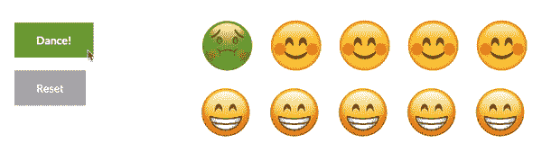

# 上下:用 D3.js 说明的谜题

> 原文：<https://towardsdatascience.com/down-and-up-a-puzzle-illustrated-with-d3-js-9aae2d52adcf?source=collection_archive---------21----------------------->

## 在面试中解决一个脑筋急转弯可能会令人害怕，但通常简单的视觉效果——就像这篇文章中的那些——会帮助你找到答案。

[由 Walimai.photo 拍摄的照片](https://flickr.com/photos/walimai/25229699484/in/photolist-ErsNEG-2gWfWJp-2h2dTYD-21e7kYh-2hMuoCA-7Jhrwt-2hJD2CU-2evZDJr-2g8Rf7k-2hatveD-2hD18ss-2hdjvm1-22h15Xm-2eXYJLx-28tkg66-C89Nd-2fc34SK-2hTcErb-PFZPhK-6Y9nMP-8M2wEz-2eFmLoj-8FH3DA-yPZMyU-2hx2fnv-ZbcBFY-2hDgx14-28RNTi6-2d3nad7-acNrjv-66MwUt-8MffnB-8ADcj3-QVTA6Z-8L4iJJ-2gfnsnF-8WH13a-8N95S2-26ow8US-TATXBW-8JHvtW-2hvZXQe-8xKHNy-8YQE61-2ezu7Yc-9NmEw7-2gb7m62-8Li514-2htc6uz-2bAKBtq)由作者裁剪并调整大小。

在最近的一次度假中，我和丈夫偶然发现了一家娱乐商店，里面有很多棋盘游戏、骰子、扑克牌等。我们很快找到了一件我们都绝对是书呆子的东西，被认为是必不可少的:Boris A. Kordemsky 写的一本书，书名是[The Moscow Puzzles:359 Mathematical Recreations](https://www.amazon.com/Moscow-Puzzles-Mathematical-Recreations-Recreational/dp/0486270785/)。不，我们没有花整个假期来解决所有 359 个问题，但我们确实把书带回家，并继续研究它们——通常在晚上喝一杯酒。

出于几个原因，最近有一个特别的谜题引起了我的注意。我一会儿会回到那些原因，但是现在，这个问题叫做“上下波动”,它是这样的:

> 假设你有两支铅笔压在一起并垂直握着。从铅笔的下端量起，左边有一英寸被涂上了油漆。右铅笔保持稳定，同时将左铅笔向下滑动 1 英寸，继续将两支铅笔压在一起。然后，将左边的铅笔向上移动，回到原来的位置，同时保持两支铅笔接触。你继续这些动作，直到你把左边的铅笔上下移动 5 次。假设油漆在此过程中不会干燥或耗尽。**在你最后的动作之后，每支铅笔有多少英寸被涂上了颜料？**

如果你愿意，在继续之前花一分钟解决这个问题——剧透在前面！

# 最初的想法

当我第一次听到这个问题时，我最初认为，也许油漆根本没有涂抹到右铅笔上，也许在整个过程中，只有一英寸的油漆出现在左铅笔上。(这也是你预料到的吗？)但是当我第二次阅读这个问题时，我开始想象可能会发生什么。一旦我在脑海中勾勒出这个过程，解决方案就变得清晰多了。因为我丈夫正在和我一起解决这个问题，所以我给他画了这个草图来分享我的想法:

我设法清晰地设想了情况，找到了解决方案，并用这个简单的草图表达了我的想法。对于许多数学难题来说，一张粗略的图片就能满足你寻找答案的所有需要，但是如果我粗糙的图画还没有完全传达给你答案，不要担心。让我们用一个更好的例子来更有条理地深入一下。

颜料立即从左边的铅笔转移到右边。

# 问题设置

从问题的方向，我们知道，最初只有左边的铅笔涂上了油漆。回想一下，左边的铅笔直接压在右边。这意味着当它们挤压在一起时，颜料立即转移到正确的铅笔上。所以两支铅笔在上下运动之前都涂了一英寸的颜料。

# 解决和说明整个问题

随着左铅笔上下移动，问题变得有点复杂，但是再次回到视觉解释非常有帮助。也可以随时重读问题陈述，重新找到你的方向。

两支铅笔目前都被涂上了一英寸厚的油漆。然后左边的铅笔向下移动一英寸，同时两支铅笔继续压在一起。你能想象当左边的铅笔向下移动时会发生什么吗？是啊！左铅笔的干净部分与右铅笔的底部接触；因此，另一英寸的油漆转移到左侧。

左边的铅笔现在比右边的低一英寸。右铅笔的一英寸被涂上了颜料，但是颜料覆盖了左铅笔的两英寸。左边的铅笔在问题的下一步向上移动，回到原来的位置。两支铅笔重新对齐，但是颜料会发生什么变化呢？由于左铅笔不断与右铅笔接触，在第一次上下循环结束时，油漆会涂抹到右铅笔上，并覆盖两个铅笔的两英寸。

其余四个循环过程类似，颜料先转移到左边的铅笔，然后转移到右边。**最后，在五轮运动之后，两支铅笔都被涂上了总共六英寸的颜料:最初的一英寸加上另外五英寸，每一个上下循环一次。**

这个问题最终取决于将问题陈述转化为解释性视觉效果的能力。为了进一步将这个解决方案放到上下文中，我用 D3.js 创建了一个交互式图形，展示在下面的 gif 中。下面两支铅笔都从一英寸的油漆开始，如问题设置中所述。

在每次上下移动的过程中，额外的颜料会涂抹到左边的铅笔上，然后是右边的。

*注:你可以在我的网站上* [*与这个视觉*](http://kimberlyfessel.com/visualizations/puzzles/down-and-up/#pencilContainer) *互动或者在 GitHub 上* [*看一下我的 D3 代码*](https://github.com/kimfetti/Blog/blob/master/pencil_paint.html) *。*

# 背景故事和问题扩展

之前我提到的这个问题引起了我的注意，原因有几个。第一个原因正是我们一直在讨论的。我惊讶于这个问题一开始听起来是多么棘手，而一旦你在脑海中构建了一个适当的情景，它就变得多么简单。

这个谜题激起我兴趣的第二个原因是它的历史。正如 Kordemsky 在书中解释的那样，生活在 20 世纪早期的苏联数学家 Leonid Mikhailovich Rybakov 创造了这个“上下”问题。我非常欣赏贯穿许多时间和地域的数学问题。解决这样的难题让我感觉与过去和世界上其他数学家有了更多的联系。

最后，这个问题引发了我的好奇心，因为 Rybakov 第一次想到这个问题是在一次成功的猎鸭回家的时候。Kordemsky 鼓励读者思考为什么会这样，但在他的“答案”部分继续解释。摘自*莫斯科谜题*一书:

> 看着他的靴子，Leonid Mikhailovich [Rybakov]注意到他走路时，他们通常互相摩擦的地方整个长度都是泥。
> 
> “真奇怪，”他想，“我没有在很深的泥里走，但我的靴子却泥到膝盖了。”
> 
> 现在你明白谜题的由来了。

就像油漆涂抹了两支铅笔的整个长度一样，Rybakov 的靴子从头到脚都是，因为当他走路时，泥浆从一只靴子转移到了另一只靴子。

我继续思考这个概念如何适用于其他情况，我想到了一个有趣但有点令人不快的例子。考虑两行魂斗罗舞者，其中第一行中的第一个舞者不幸感到不适。如果这位舞蹈演员的疾病具有高度传染性，她当然会将她的疾病传染给她对面的舞伴。有时在对舞中，参与者通过横向移动两条线来交换舞伴。令人遗憾的是，当这种情况发生时，新感染的舞蹈演员会将疾病传回到线上，最终整个舞蹈演员群体都会生病。

疾病从一个舞者传播到另一个舞者，就像颜料在铅笔之间转移一样。

*注:你可以在我的网站上* [*与这个视觉*](http://kimberlyfessel.com/visualizations/puzzles/down-and-up/#contraContainer) *互动或者在 GitHub 上* [*看一下我的 D3 代码*](https://github.com/kimfetti/Blog/blob/master/contra.html) *。*

# 结论

我希望你喜欢这个关于我最喜欢的数学智力题之一的讨论，以及这些说明性的 D3 图片。在脑海中形成一个数学难题的图像并不总是容易的，但是在解决这样的问题时，它是无价的——尤其是如果你像我一样是一个视觉学习者。下一次，当你在面试中遇到问题时，看看画草图或想象问题的物理结构是否有帮助。对我来说经常是这样。

我也希望你喜欢了解这个谜题背后的背景故事。一些世界上最好的数学智力题是在很久以前创造的，所以我相信当试图提高我们的思维时，回顾过去对我们大有好处。此外，将这类问题扩展到新的应用程序，就像我对魂斗罗舞者所做的那样，有助于巩固核心概念，并为未来的脑筋急转弯建立直觉。它也使数学问题变得更有趣，因为你把它们和你自己的生活联系起来。现在轮到你了——你能想到其他“上下”的场景吗？

*原载于 2020 年 1 月 5 日 http://kimberlyfessel.com***。**

# *参考*

*[1] B. A. Kordemsky，[莫斯科难题:359 种数学娱乐](https://www.amazon.com/Moscow-Puzzles-Mathematical-Recreations-Recreational/dp/0486270785/) (1992)，多佛。*