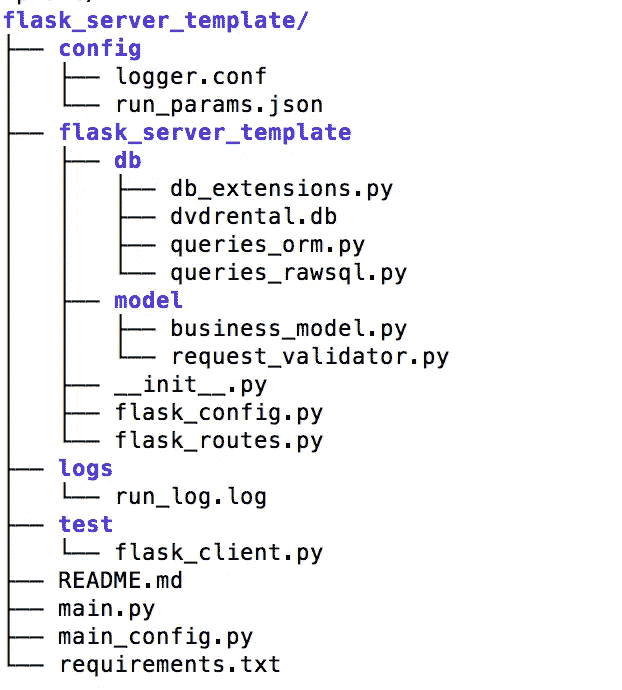
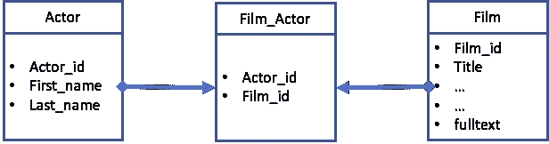

# 下载一个 Flask 模板，准备插入您的业务逻辑

> 原文：<https://towardsdatascience.com/download-a-flask-template-ready-to-plug-in-your-business-logic-bb9375e1be09?source=collection_archive---------32----------------------->


照片由 [Fotis Fotopoulos](https://unsplash.com/@ffstop?utm_source=medium&utm_medium=referral) 在 [Unsplash](https://unsplash.com?utm_source=medium&utm_medium=referral) 上拍摄

## 可用于日志记录、配置设置、URL 参数验证的预配置设置

让我们假设，经过大量艰苦的工作，你已经有了你的机器学习模型，它应该运行的方式。这种模型可以响应用户的请求，对推文情感进行分类，或识别图像中的对象，或推荐产品或其他符合您需求的算法。您现在想要快速部署这个模型。下面这篇文章解释了我创建的模板，它可以让你快速上手。

Flask micro 服务是一种部署应用程序的简单方法。然而，人们很快意识到，你不希望创建一个大的单片单文件程序。该计划应该是模块化的，以支持未来的增强，它应该是可配置的帮助下配置文件。这些配置参数不仅适用于 Flask，也适用于您的业务应用程序(还记得您创建的 tweet 分类应用程序)。理想情况下，服务器应该适当地记录一切。大多数应用程序还需要连接到数据库，最后，在调用模型 api(或返回错误)之前，需要验证入站请求参数。

听起来很多，对吧？这实际上是相当多的，人们可以很容易地花相当多的时间来构建一个提供这些特性的健壮框架。在这里，我提供了一个到 [github](https://github.com/alsm6169/flask_server_template) 的链接，它在一个模块化的应用程序中提供了所有上面提到的特性。

您应该能够克隆这个 Flask 服务器模板，并简单地运行它。一旦你让它运行起来，你就可以开始调整它来满足你的特定需求。

[](https://github.com/alsm6169/flask_server_template) [## alsm 6169/flask _ 服务器 _ 模板

### Flask 服务器模板准备插入业务逻辑。该模板的特点是:烧瓶配置模块…

github.com](https://github.com/alsm6169/flask_server_template) 

***在本文中，* *我将只解释为您的项目*定制这个烧瓶模板可能需要更改的部分。**我的基本假设是对 Flask、SQLAlchemy、Marshmallow 有一定程度的熟悉。只要足够熟悉，如果某些部分没有意义，可以谷歌一下。请在评论中自由提问，我可以回答/更新文章以涵盖要点。

如果您希望先安装并运行服务器，那么请跳过中间的解释部分，按照下面的命令顺序操作。

让我们从代码组织开始



Flask 服务器模板代码结构

现在解释代码文件

下面我将解释每个文件的用途以及你可能需要根据你的要求修改的相关代码部分(如果有的话)。

> **base _ dir/flask _ server _ template→**主模板目录

**flask _ server _ template/main . py**

这是服务器的入口点。它读取应用程序配置文件(run_params.json)，初始化记录器，初始化 flask 服务器并运行服务器。

```
**### flask_server_template/main.py ###***To use the template no changes are needed in this file.*
```

**flask _ server _ template/main _ config . py**

这个模块有两个作用。

1.读取应用程序配置文件，并创建一个可由应用程序的另一部分使用的字典。

2.创建数据库连接字符串。这个连接字符串利用了配置文件中的参数。该连接字符串因基础数据库而异。用于创建连接字符串的 SQLAlchemy 文档在这里是。

```
**### flask_server_template/main_config.py ###** def get_db_con_str():
pwd = os.getenv(**'DB_PWD'**)  *# get password from environment variable DB_PWD* db_con_str = **f'postgresql://'** \
                 **f'**{run_conf_data[**"DB_USER"**]}**:'** \
                 **f'**{pwd}**@'** \
                 **f'**{run_conf_data[**"DB_SERVER"**]}**:'** \
                 **f'**{run_conf_data[**"DB_PORT"**]}**/'** \
                 **f'**{run_conf_data[**"DB_NAME"**]}**'** os.environ[**'SQLALCHEMY_DATABASE_URI'**] = db_con_str
    return db_con_str
```

> ***flask _ server _ template/config*→**以下是记录器和业务逻辑应用程序的配置文件

**config/logger.conf**

有两个日志处理程序。“handler_consoleHandler”记录到屏幕，而“handler_fileHandler”记录到文件 run_log.log 中。每次服务器运行时，该文件都会被覆盖。但是，如果您想更改这一点并创建带有时间戳的新文件，您可以取消对第二行的注释，并对第一行进行注释

```
**### config/logger.conf ###** ...
...
[handler_fileHandler]
class=FileHandler
level=DEBUG
formatter=simpleFormatter
args=('logs/run_log.log','w')
*#args=('../logs/' + time.strftime('%%Y%%m%%d_%%HH%%MM') +'.log','a')*[handler_consoleHandler]
class=StreamHandler
level=INFO
formatter=simpleFormatter
args=(sys.stdout,)
...
...
```

**config/run_params.json**

“run_params”具有应用程序级配置，包含数据库服务器、用户名、运行 flask 的模式(开发/生产)等信息

```
**### config/run_params.json ###** {
  "LOGGER_CONFIG": "config/logger.conf",
  "FLASK_CONFIG": "flask_config.DevelopmentConfig",
  "DB_SERVER": "localhost",
  "DB_PORT": "5432",
  "DB_NAME": "dvdrental",
  "DB_USER": "dvdrental"
}
```

> ***flask _ server _ template/logs→***创建运行日志的目录

*要使用该模板，不需要对该目录进行任何更改。*

> ***flask _ server _ template/test→***您的测试脚本

**test/flask_client.py**

这个模板是一个工作模板，理想情况下，人们应该能够简单地下载和运行。测试客户端将测试这些功能。

```
**### test/flask_client.py ###***To use the template no changes are needed in this file. New additional test cases can be written in this file or new test file created in this test folder.*
```

> ***flask _ server _ template/flask _ server _ template→****包含 flask 初始化代码、配置设置以及适当功能的路径重定向的主 flask 目录。*

***flask _ server _ template/_ _ init _ _。py***

*__init__。py 包含 flask_server_template 包的初始化函数。它有一个主要功能“create_app”，创建 Flask 对象，设置 Flask 配置，初始化数据库并注册路线(其功能的 URL)*

```
***### flask_server_template/__init__.py ###***To use the template no changes are needed in this file.**
```

***flask _ server _ template/flask _ config . py***

*' flask_config.py '包含 flask 的配置设置。它提供了开发和生产环境的一般配置。*

*大部分常用参数都已经设置好了。如需更多设置选项，请查看官方文档。*

```
***### flask_server_template/flask_config.py ###***To use the template no changes are needed in this file.However, for quick reference, the default configurations*class Config(object):
    DEBUG = False
    TESTING = False
    CSRF_ENABLED = True
    SECRET_KEY = **'this-really-needs-to-be-changed'** SQLALCHEMY_DATABASE_URI = os.getenv(**'SQLALCHEMY_DATABASE_URI'**)
SQLALCHEMY_TRACK_MODIFICATIONS = False
    SQLALCHEMY_ECHO = False

class ProductionConfig(Config):
    DEBUG = False

class DevelopmentConfig(Config):
    DEVELOPMENT = True
    DEBUG = True*
```

***flask _ server _ template/flask _ routes . py***

*“flask_routes.py”包含 URL 到其相应实现的映射。*

***注意:**有一个调用对数据库进行适当的设置。@ routes . before _ app _ first _ request。如果我们希望使用 [SQLAlchemy ORM](https://docs.sqlalchemy.org/en/13/orm/) 特性，这是必需的。在下面对 flask_server_template/db 的描述中有更多的细节。*

***对于每个需要迎合的 REST API，都需要有一个到函数的映射。这里描述了映射到 URL 的单个函数的示例。***

```
***### flask_server_template/flask_routes.py ###** ...
...
@routes.route('/module/v01/functions/film_info_orm', methods=['GET']) ***#TODO:*** *change URL*
def get_film_info_orm(): ***#TODO****: change function name*
    try:
        log.debug('inside get_film_info_orm') ***#TODO:*** *change logging*
        film_df = bm.get_film_info_orm(request) ***#TODO:*** *change business logic function here*
        response_code = 200
        response_msg = film_df.to_json(orient='records') ***#TODO:*** *change response*
except RuntimeError as err:
        response_code = 700 response_msg = jsonify(str(err))
    return make_response(response_msg, response_code)
...
...*
```

> ****flask _ server _ template/model→****业务逻辑代码驻留在这里**

****model/business _ model . py****

**在模块“business_model.py”中添加了所需的业务逻辑。一般流程如下:验证输入参数，从数据库获取数据，执行所需的业务逻辑应用程序并返回结果。**

*****PS:*** *目前，我没有任何业务逻辑。我只是从数据库返回熊猫数据帧格式的数据。***

```
****### model/business_model.py ###** ...
...def get_film_info_orm(in_request): ***#TODO****: appropriate function name*
    try:
        *# validate the URL parameters* title_schema_obj = TitleValidator() ***#TODO****: appropriate validation object*
        title_schema_obj.load(in_request.args)
        *# verification passed, hence flask_server_template comes here else it would have gone to exception* title = in_request.args[**'title'**]
        log.debug(**'title: '** + title)
        *# get your data in pandas data frame format* df = queries_orm.get_film_info(title) ***#TODO****: appropriate function call here*
        *# apply business logic (if any)* return df
    except ValidationError as error:
        log.error(**f'get_all_film_df:** {error}**'**)
        raise RuntimeError(**'Invalid Request Parameter: '** + str(error))
...
...**
```

****model/request _ validator . py****

**模块' business_model.py '使用[棉花糖](https://marshmallow.readthedocs.io/en/stable/marshmallow.validate.html)来验证 URL 参数。与手动编写 if then else 语句来验证 URL 参数的每个组成部分相比，这是一种首选的验证方式。验证包括数据类型检查(整数、字符串)、数值范围或特定列表和/或一些完全定制的检查。**

```
****### model/request_validator.py ###** ...
...
def some_custom_check(data): ***#TODO****: common checks*
    *'''can be replaced with customised check'''* if not data:
        raise ValidationError(**'some_custom_check for title failed'**)class TitleValidator(Schema): ***#TODO****: appropriate class name*
***# URL should have title of type string between length 1 and 50\. After that call your custom check***title = fields.Str(required=True, validate=[validate.Length(min=1, max=50), some_custom_check])...
...**
```

> *****flask _ server _ template/db→****数据库的查询和操作都在这个文件夹里***

***在我详细介绍之前，我必须澄清几件事:***

*   ***我使用了来自[postgresql 教程](https://www.postgresqltutorial.com/postgresql-sample-database/)的 PostgreSQL 教程数据库***
*   ***出于演示目的，这里只有三个相关的表 a .电影 b .演员 c .电影 _ 演员***

******

***数据库模式***

*   ***由于不需要用户进行额外的安装就无法发布 postgresql db，所以我在 sqlite 中创建了这 3 个表，并将其与该模板一起发布(在目录 flask _ server _ template/db/dvdrental . db 中)。***
*   ***虽然上面我强调了 postgresql 连接，但是在 Github 上也有 sqlite 连接字符串，有了这个连接字符串，整个模板就可以开箱即用了。(简而言之，如果你从他们的网站上安装了 postgresql 和数据库，你可以使用 postgresql，否则你可以简单地使用 sqlite)。***
*   ***由于大多数数据科学家使用表格，查询返回熊猫数据框。***
*   ***我有两种格式的所有查询 a .使用 SQLAlchemy 核心，即原始 SQL(select * from…)b . SQLAlchemy ORM 将表反映到 python 对象中，并以 python 方式执行查询。这让人们可以根据自己的喜好自由选择。***

***唷！现在我解释代码文件***

*****db/dvdrental.db*****

***这是包含三个表的 sqlite 数据库***

*   ***电影:存储电影数据，如标题，发行年份，长度，评级等。***
*   ***actor:存储 actor 数据，包括名字和姓氏。***
*   ***film_actor:存储电影和演员之间的关系。***

```
*****### db/dvdrental.db ###***To use the template no changes are needed in this file.****
```

*****数据库/数据库 _ 扩展. py*****

***模块“db_extensions.py”具有数据库连接对象、数据库元数据、包含数据库反射(即数据库表到 python 对象的转换)的对象以及初始化对象关系映射的代码。***

```
*****### db/db_extensions.py ###***To use the template no changes are needed in this file.*def orm_init():
...
Base.prepare(db_obj.engine, reflect=True) #IMPORTANT for reflecting database into python objects***
```

*****db/query s _ ORM . py*****

***模块“queries_orm.py”包含使用 SQLAlchemy ORM 的查询，即访问数据库的 pythonic 方式。***

```
*****### db/queries_orm.py ###**def get_film_info(title):
    film_orm = Base.classes.film ***#TODO****: refer to correct table*
    qry = db_obj.session.query(film_orm).\
         filter(film_orm.title == title) ***#TODO****: your query*
    film_df = pd.read_sql(qry.statement, db_obj.session.bind)
    return film_df***#TODO****: Another sample query below with multiple joins and filter*
def get_film_actors(title):
    film_orm = Base.classes.film
    actor_orm = Base.classes.actor
    film_actor_orm = Base.classes.film_actor
qry = db_obj.session.query(actor_orm).\
            join(film_actor_orm,film_orm).\
            filter(film_orm.title == title)
    actor_df = pd.read_sql(qry.statement, db_obj.session.bind)
    return actor_df***
```

*****db/queries_rawsql.py*****

***模块“queries_rawsql.py”包含原始 sql 查询。***

****免责声明:在 queries_rawsql.py 中有示例参数化查询(where 子句带有参数)。但是，这种格式不适用于 sqlite。它在 postgresql 和 oracle 上都能很好地工作。****

```
*****### db/queries_rawsql.py ###**def get_all_films():
    query = **'''
    SELECT * FROM film
    '''  *#TODO****: your query*    film_df = pd.read_sql(query, db_obj.session.bind)
    return film_dfdef get_film_actors(title):
    query = **'''
        SELECT a.first_name, a.last_name FROM actor a 
        INNER JOIN film_actor fa on fa.actor_id = a.actor_id 
        INNER JOIN film f on f.film_id = fa.film_id 
        WHERE f.title = %(title)s
        ''' *#TODO****: your query*    actor_df = pd.read_sql(sql=query, params={**'title'**: title}, con=db_obj.session.bind)
    return actor_df***
```

# ***安装和运行***

***我认为快速启动并运行的最好方法是执行以下步骤***

*   ***克隆存储库***
*   ***创建虚拟环境***
*   ***激活虚拟环境***
*   ***在需求文本中安装库***
*   ***运行服务器***

```
*****### Terminal ###**$mkdir base
$cd base
$git clone [https://github.com/alsm6169/flask_server_template.git](https://github.com/alsm6169/flask_server_template.git)
$cd flask_server_template/
$conda create --name ptest
$conda activate ptest
$conda install --file requirements.txt
$python main.py***
```

*   ***在另一个 shell 中运行测试文件。或者可选地，***
*   ***打开浏览器运行请求***

```
*****### Browser ###**http://127.0.0.1:5000*http://127.0.0.1:5000/module/v01/functions/film_list_orm**http://127.0.0.1:5000/module/v01/functions/film_actors_orm?title=Alaska Phantom****
```

***这就把我带到了这篇文章的结尾。希望你会发现它很容易理解和使用。如果您有任何反馈/改进，请告诉我。***