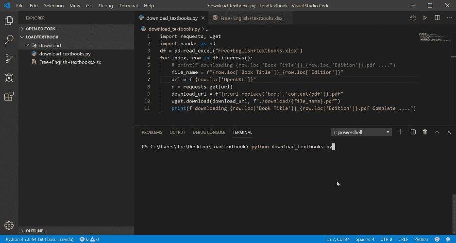
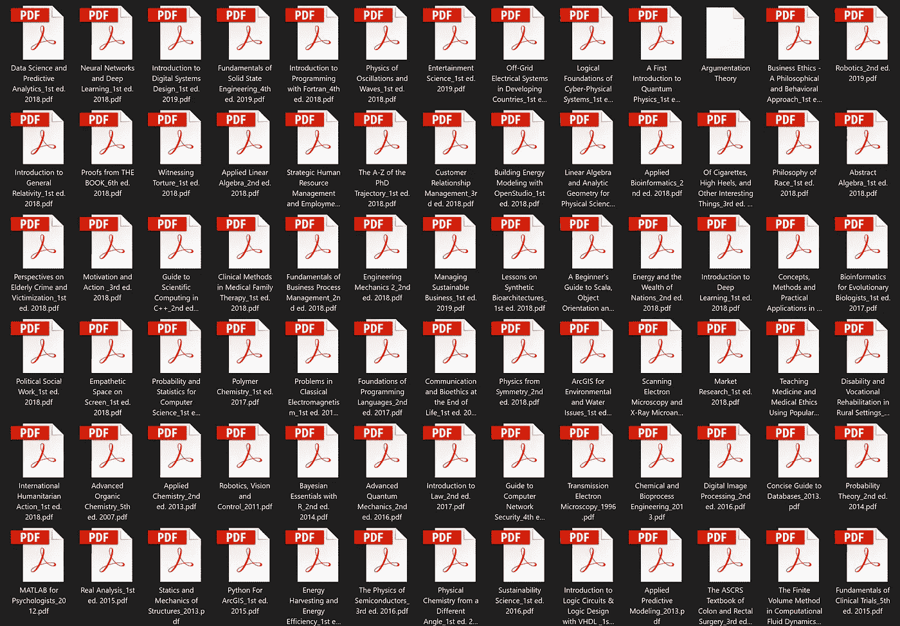
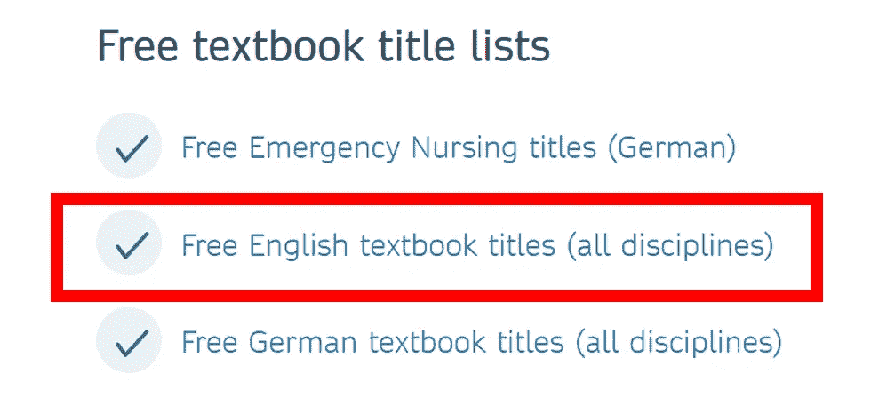
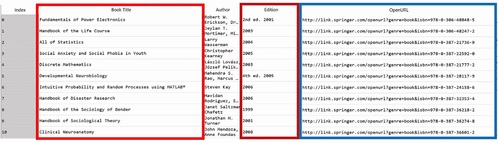
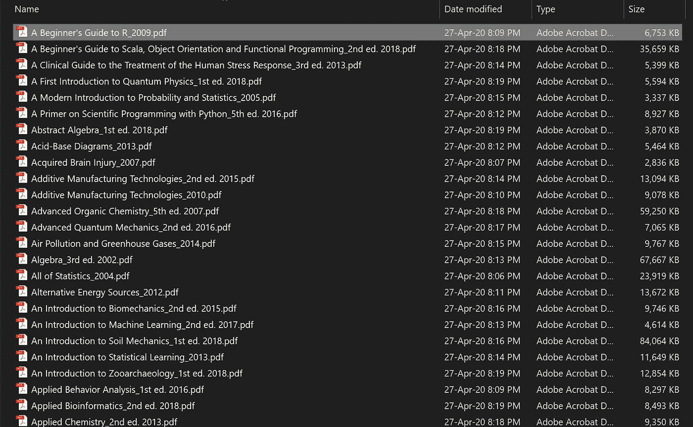

# 使用 Python 从 Springer 下载所有免费教材

> 原文：<https://towardsdatascience.com/download-all-free-textbooks-from-springer-using-python-bd0b10e0ccc?source=collection_archive---------6----------------------->

## 一个重要的 PYTHON 技巧

## 使用 Python 下载多个文件的分步指南


插图作者:金彩云

所有数据科学家和研究人员的好消息🎉🎉**斯普林格**宣布在新冠肺炎封锁期间提供数百本价值数千美元的昂贵科技书籍供免费下载。超过 500 本教科书可供选择！

如果你只对其中的一些书感兴趣，你可以一本书一本书地下载。但是这种机会不会经常出现，那把他们都弄到手呢？😊自己手动下载会很无聊。为什么不让 Python 来做这个工作呢？🤔根据这个帖子，这些春季教材只能买到七月底。根据疫情的情况，黄金时间可能会延长…

这篇文章将通过一步一步的指导向你展示如何使用 Python 从列表中自动下载所有的 **Springer** 教材。所以，如果你是编程或 Python 的新手，不用担心。

**证明:**



**从 Springer 下载教材的简单 Python 脚本(使用 VSCode 运行)**



**Python 脚本的示例输出**

如你所见，只有 11 行 Python 脚本可以在几分钟内为你下载所有这些教材。在你读完这篇文章之后，你将能够自己完成这个过程，并且将来也能够应用这个技术来下载任何项目或文件的列表。✌

# 为什么斯普林格现在给我们免费访问？

> 冠状病毒的爆发对教育产生了前所未有的影响，给学者和他们的学生带来了特别的压力。在诸多不确定性和快速变化的信息中，我们知道许多教育工作者正在努力向虚拟课堂环境过渡，寻找与学生在线互动的方法，并确保他们拥有继续学业所需的资源。为了缓解学术界目前面临的巨大压力， **Springer Nature 制作了一套** [**所有学科的基本教材，免费提供**](https://www.springernature.com/gp/librarians/news-events/all-news-articles/industry-news-initiatives/free-access-to-textbooks-for-institutions-affected-by-coronaviru/17855960) 以帮助支持世界各地的学生和教师。[1]
> 
> 斯普林格自然图书公司董事总经理尼尔斯·彼得·托马斯说:“随着危机的全球影响加剧，远程访问教育资源变得至关重要。在这个充满挑战的时期，我们希望为讲师、教师和学生提供支持，并希望这一举措(将有 500 多本关键教科书在网上免费提供)能够有所帮助。”[2]

# 我们开始吧

现在，让我们看看如何使用 Python 来完成这项工作！

首先，让我们准备好你的 python 的所有需求。如果你的电脑里还没有 Python，你可以在官方网站[这里](https://www.python.org/downloads/)下载。

请打开命令行并使用以下命令，使用`pip`准备 Python 库:

```
**$ pip install pandas
$ pip install wget
$ pip install requests
$ pip install xlrd**
```

安装完成后，创建一个项目文件夹，从 Springer(*Free+English+textbooks . xlsx*)[这里](https://resource-cms.springernature.com/springer-cms/rest/v1/content/17858272/data/v6)下载可用免费教材的 excel 列表。



从[这里](https://www.springernature.com/gp/librarians/news-events/all-news-articles/industry-news-initiatives/free-access-to-textbooks-for-institutions-affected-by-coronaviru/17855960)获取免费英语教材标题表。

链接 URL 可能会随着时间的推移而改变，您可以在此[页面](https://www.springernature.com/gp/librarians/news-events/all-news-articles/industry-news-initiatives/free-access-to-textbooks-for-institutions-affected-by-coronaviru/17855960)找到此 excel 表格的更新版本，并点击链接“免费英语教科书标题”，如下图所示。

然后，创建一个 Python 文件`download_textbooks.py`，并在项目文件夹中准备名为`download`的文件夹。在我们的项目文件夹中会是这样的:


**项目文件夹示例**

然后，使用您喜欢的编辑器编辑`download_textbook.py`,添加以下代码行以导入 Python 模块并将 Springer 教科书 excel 加载到`pandas dataframe`中。让我们使用`df.head(10)`命令来检查数据帧的前 10 行。

```
**import requests
import wget
import pandas as pd**
**df = pd.read_excel("Free+English+textbooks.xlsx")
print(df.head(10))**
```



**斯普林格公司教科书清单数据框**

在这个数据框架中，我们目前需要的主要列是用于形成文件名的“**书名**和“**版本**”，以及用于获得下载链接的“ **OpenURL** ”。所以我们现在的计划是使用`for loop`遍历 excel 列表的每一行。

**我们应该为每个循环做什么:**

*   通过“书名”和“版本”列为每本书创建一个`filename` 变量。请注意，我们可以使用任意混合的列来生成文件名。
*   使用`wget`命令下载一本书，并用`filename` 变量命名。

**所以我们可以将这个计划转换成 Python 脚本:**

```
**for index, row in df.iterrows():
    file_name = f"{row.loc['Book Title']}_{row.loc['Edition']}"
    url = f"{row.loc['OpenURL']}"
    wget.download(download_url, f"./download/{file_name}.pdf")**
```

看起来不错，对吧？然而，这种方法是行不通的，因为“OpenURL”列并不直接代表下载 PDF 文件的最终 URL。因此，我们需要将这个 OpenURL 更改为正确的端点 URL。
例如，如果我们在网络浏览器的“OpenURL”栏中打开一本教科书的链接:

```
**1.**[**http://link.springer.com/openurl?genre=book&isbn=978-0-306-48048-5**](http://link.springer.com/openurl?genre=book&isbn=978-0-306-48048-5)
```

哦，它被重定向了！🤨它会自动重定向到

```
**2.**[**https://link.springer.com/book/10.1007%2Fb100747**](https://link.springer.com/book/10.1007%2Fb100747)
```

然后，如果我们单击网站中的下载 PDF 按钮，真正的端点 PDF 文件将是:

```
**3.**[**https://link.springer.com/content/pdf/10.1007%2F0-387-36274-6.pdf**](https://link.springer.com/content/pdf/10.1007%2F0-387-36274-6.pdf)
```

这意味着我们应该从 1。敬 3。每个循环的第一个！因此，我们在`for loop` 中应该做的额外步骤是

*   从“OpenURL”列打开链接。
*   获得重定向的 URL:我发现最简单的方法是使用`request`模块。
*   将 URL 字符串的结构重新格式化为下载 PDF 文件的端点 URL。我们可以用`str.replace(old,new)`来做。
*   按计划用`wget`下载一本书。

然后，整个 Python 代码将如下所示:

`download_textbooks.py`

在用`python download_textbooks.py`运行 Python 脚本后，您会在`download`文件夹中获得所有的教科书。



**下载的施普林格教材**

所以，大概就是这样。我希望你喜欢这篇文章，并且能够在将来应用这个想法来自动化你的一些工作流程。请注意，使用 Python 有几种方法可以做到这一点，因为几个模块可以完成这项工作。如果您有任何问题、意见或建议，请随时与我分享。

安全**健康**健康**！**

感谢您的阅读。👋😄

## 参考

[1]露西·弗里希，[以下是在冠状病毒封锁期间如何免费获取教科书的方法](https://www.springernature.com/de/researchers/the-source/blog/blogposts-life-in-research/access-textbooks-for-free-during-the-coronavirus-lockdown/17897628)(2020 年 4 月 16 日)，斯普林格自然杂志

[2] Felicitas Behrendt，施普林格自然集团，[施普林格自然向受冠状病毒封锁影响的教育工作者、学生和学者免费提供关键教科书](https://group.springernature.com/fr/group/media/press-releases/freely-accessible-textbook-initiative-for-educators-and-students/17858180) (2020 年)，施普林格自然