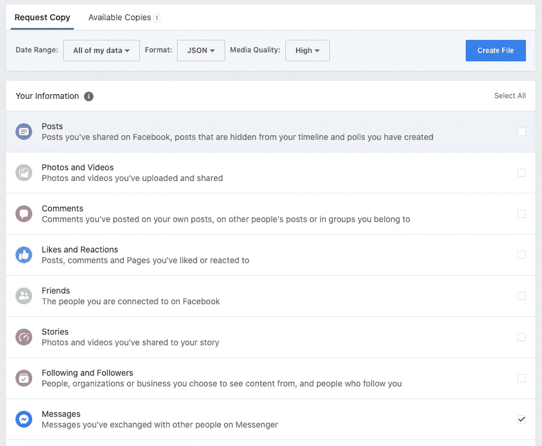
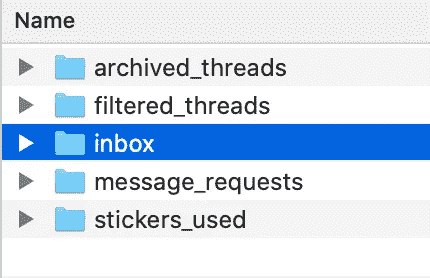
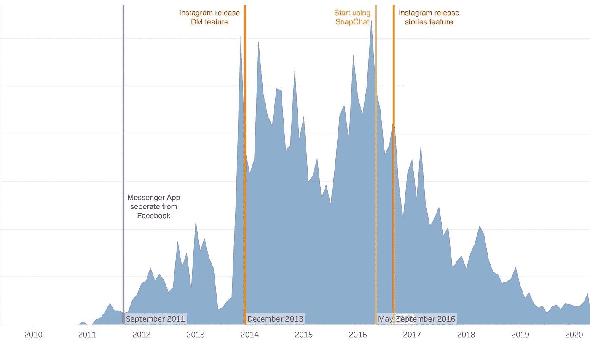

# 下载并分析您的 Facebook Messenger 数据

> 原文：<https://towardsdatascience.com/download-and-analyse-your-facebook-messenger-data-6d1b49404e09?source=collection_archive---------15----------------------->

## 其他社交媒体应用程序如何影响您在 Facebook Messenger 上的使用？你和谁聊得最多？


蒂姆·班尼特在 Unsplash[拍摄的照片](https://unsplash.com/s/photos/facebook?utm_source=unsplash&utm_medium=referral&utm_content=creditCopyText)

拥有超过 20 亿用户的脸书是当今最受欢迎的平台。大多数 facebook 用户使用 Facebook Messenger 应用程序相互交流，包括我。我真的很好奇我在这个平台上的行为，以及 Instagram、微信和 SnapChat 等其他社交媒体应用的兴起如何影响我在脸书的使用。

今天，我将向你展示如何下载你的脸书信息数据，以及如何分析它。

## 下载您的脸书数据

*   打开你的脸书，进入**设置&隐私** > **设置**
*   前往**您的脸书信息** > **下载您的信息**
*   选择数据范围“**我的所有数据**”、格式“ **JSON** ”和媒体质量“**高**”*(随意更改媒体质量，因为高媒体质量会消耗更多存储空间)*



*   仅选择**消息***(在这种情况下，我只对我的消息数据感兴趣，您也可以尝试其他数据)*
*   点击**创建文件**

脸书将在他们的服务器上创建一个 zip 文件，并在文件可以下载时通知您。我花了一天时间才拿到压缩文件。

## 预处理您的脸书消息数据

在进行任何分析之前，我们要做的第一件事是预处理数据。这些是我们解压缩下载文件后，邮件数据中的文件夹。



邮件数据中的文件夹

我们只对收件箱感兴趣。

```
Folder Structure of Inbox: 
📂 inbox  
┣ 📂 alex    
┃  ┗ 📜 message_1.json  
┃  ┗ 📂 photos
┗ 📂 brian    
   ┗ 📜 message_1.json
   ┗ 📜 message_2.json
   ┗ 📜 message_3.json
   ┗ 📂 photos
```

这是收件箱中的常规文件夹结构。如果你和某人有很多文本消息，你可能有多个消息 JSON 文件。

现在，我们必须编写一个 Python 脚本来提取所有这些 JSON 文件中我们需要的信息。

我将遍历收件箱中的所有子文件夹，读取文件名以“message”开头的所有 JSON 文件。

`folders.remove(".DS_Store")`此处用于删除 macOS 中的系统文件。这是为了防止以后循环中的错误。 *(Windows 用户可以忽略这个)*

`datetime.fromtimestamp(message[“timestamp_ms”] / 1000).strftime(“%Y-%m-%d %H:%M:%S”)`在这里用于将时间戳转换成人类可读的东西。我还把它转换成字符串，这样我就可以毫无问题地把它写入输出文件。

这是您将通过上面的 Python 脚本获得的示例输出文件。现在你可以用任何可视化工具分析你的脸书信息数据。

```
output.csv 
"2016-03-20 13:48:46",Brian,Okay
"2016-03-20 13:48:10",June,See you 
"2016-03-20 13:48:01",Matthew,We are at ....
```

## 分析我的脸书消息行为



我的 Facebook Messenger 活动趋势

*   Messenger 与脸书应用的分离确实增加了我在 Facebook Messenger 上的使用。起初，我真的很讨厌它，因为它迫使我使用 2 个不同的应用程序。但我发现它实际上减少了我被脸书分散的注意力，使我能够专注于发信息(发信息时不再不停地滚动脸书！).
*   有一段时间我迷上了 SnapChat，因为它花哨的面部过滤器和 24 小时故事功能。使用率的下降是由 SnapChat 开始的，但这不是持续下降的主要原因，因为 Instagram 也引入了 Stories 功能！
*   当 Instagram 开始引入 DM(直接消息)功能时，它没有成功吸引我，因为它没有我正在寻找的功能，如通话、特殊交互(贴纸、gif 等)。当 Instagram 也发布 Stories 功能时，它立即将我引入了该平台，因为我已经有很多朋友在使用 Instagram(我相信这也是 Instagram 能够战胜 SnapChat 的主要原因之一，Instagram 与 SnapChat 相比已经拥有庞大的用户群)。
*   2017 年后，my 被多元化为微信、WhatsApp、Telegram 等更多 App。这导致自 2017 年以来使用率持续下降。

除了这种分析，我们还可以进行一些分析，如

*   工作日与周末的使用情况
*   白天和晚上的使用情况
*   你最常用的短语/单词是什么？

现在你已经学会了如何**下载你的脸书信息数据**并分析它。希望这篇文章对你有用。如果我犯了任何错误或错别字，请给我留言。

可以在我的 [**Github**](https://github.com/chingjunetao/medium-article/blob/master/analyse-facebook-messenger-data/analyse-fb-message.py) 中查看完整的脚本。干杯！

**如果你喜欢读这篇文章，你可能也会喜欢这些:**

[](/how-to-master-python-command-line-arguments-5d5ad4bcf985) [## 如何掌握 Python 命令行参数

### 使用命令行参数创建自己的 Python 脚本的简单指南

towardsdatascience.com](/how-to-master-python-command-line-arguments-5d5ad4bcf985) [](/how-to-style-your-dataframe-with-python-eabf376d1efd) [## 如何用 Python 设计你的数据框架

### 如何使用 Python 高亮显示、格式化或着色您的数据框

towardsdatascience.com](/how-to-style-your-dataframe-with-python-eabf376d1efd) 

你可以在 Medium 上找到我其他作品的链接，关注我这里的[](https://medium.com/@chingjunetao)****。感谢阅读！****