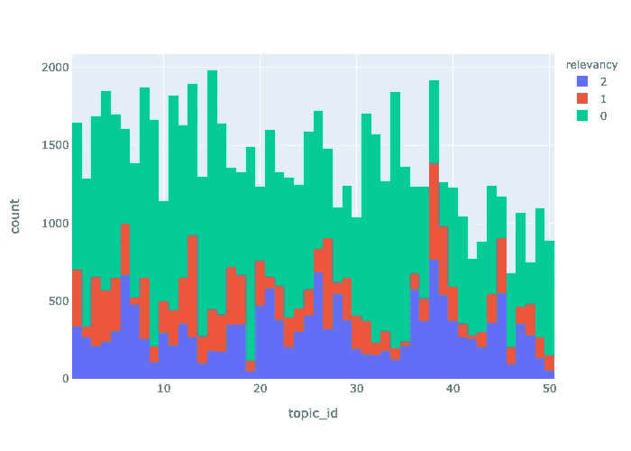

# 如何下载和解析 TREC-柯维德数据

> 原文：<https://towardsdatascience.com/download-and-parse-trec-covid-data-8f9840686c37?source=collection_archive---------48----------------------->

## 你改进 cord19 搜索应用的第一步。

*这是一系列博客文章中的第一篇，将向您展示如何改进文本搜索应用程序，从下载数据到微调 BERT 模型。*

您也可以从 [Google Colab](https://colab.research.google.com/github/vespa-engine/pyvespa/blob/master/docs/sphinx/source/use_cases/cord19/cord19_download_parse_trec_covid.ipynb) 运行这里包含的步骤。

vespa.ai 背后的团队已经构建并开源了一个 CORD-19 搜索引擎。得益于先进的 Vespa 功能，如[近似最近邻搜索](https://blog.vespa.ai/approximate-nearest-neighbor-search-in-vespa-part-1/)和[转换器支持 ONNX](https://blog.vespa.ai/introducing-nlp-with-transformers-on-vespa/) ，它采用了目前可用的最先进的 NLP 搜索方法。

我们的第一步是下载相关性判断，以便能够评估应用程序中部署的当前查询模型，并训练更好的模型来替换已经存在的模型。

## 下载数据

本节使用的文件可以在[https://ir.nist.gov/covidSubmit/data.html.](https://ir.nist.gov/covidSubmit/data.html.)找到。我们将下载主题和相关性判断数据。不要担心它们是什么，我们很快就会探索它们。

```
!wget https://ir.nist.gov/covidSubmit/data/topics-rnd5.xml
!wget [https://ir.nist.gov/covidSubmit/data/qrels-covid_d5_j0.5-5.txt](https://ir.nist.gov/covidSubmit/data/qrels-covid_d5_j0.5-5.txt)
```

## 解析数据

## 主题

主题文件是 XML 格式的。我们可以解析它并存储在一个名为`topics`的字典中。我们希望从每个主题中提取一个`query`、一个`question`和一个`narrative`。

```
import xml.etree.ElementTree as ET

topics = {}
root = ET.parse("topics-rnd5.xml").getroot()
for topic in root.findall("topic"):
    topic_number = topic.attrib["number"]
    topics[topic_number] = {}
    for query in topic.findall("query"):
        topics[topic_number]["query"] = query.text
    for question in topic.findall("question"):
        topics[topic_number]["question"] = question.text        
    for narrative in topic.findall("narrative"):
        topics[topic_number]["narrative"] = narrative.text
```

总共有 50 个话题。例如，我们可以看到下面的第一个主题:

```
topics["1"]{'query': 'coronavirus origin',
 'question': 'what is the origin of COVID-19',
 'narrative': "seeking range of information about the SARS-CoV-2 virus's origin, including its evolution, animal source, and first transmission into humans"}
```

每个主题都有许多相关的相关性判断。

## 相关性判断

我们可以将相关性判断数据直接加载到熊猫`DataFrame`中。

```
import pandas as pd

relevance_data = pd.read_csv("qrels-covid_d5_j0.5-5.txt", sep=" ", header=None)
relevance_data.columns = ["topic_id", "round_id", "cord_uid", "relevancy"]
```

相关性数据包含在 5 轮比赛中做出的所有相关性判断。`relevancy`等于 0 不相关，1 相关，2 高度相关。

```
relevance_data.head()
```


我们将删除关联度等于-1 的两行，我假设这是一个错误。

```
relevance_data[relevance_data.relevancy == -1]
```


```
relevance_data = relevance_data[relevance_data.relevancy >= 0]
```

下面的图表显示，每个主题有相当多的相关性判断，相关文档的数量在不同的主题之间变化很大。

```
import plotly.express as px

fig = px.histogram(relevance_data, x="topic_id", color = "relevancy")
fig.show()
```



接下来我们将讨论如何利用这些数据来评估和改进 cord19 搜索应用程序。