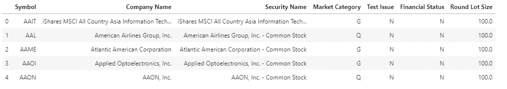
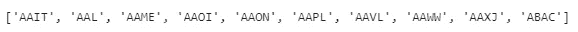
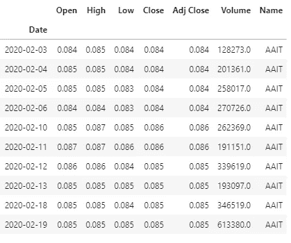

# 用 Python 下载历史股票价格

> 原文：<https://towardsdatascience.com/downloading-historical-stock-prices-in-python-93f85f059c1f?source=collection_archive---------0----------------------->

## 我们将寻找一种快速和自动化的方法来下载 Python 中的历史股票价格。本文将介绍如何创建分析数据集来帮助分析股票市场。


[https://unsplash.com/@m_b_m](https://unsplash.com/@m_b_m)在 [unsplash](https://unsplash.com/photos/ZzOa5G8hSPI) 拍摄的照片

打开笔记本，跟着做:

# **第一步:**下载需要的包。

我们需要的是***pandas***(python 中数据科学的面包和黄油) ***yfinance*** 用于从雅虎财经下载历史股票价格， ***datetime*** 和 ***time*** 提供操作日期和时间的函数， ***requests*** 用于发送 HTTP 请求， ***io***

```
import pandas as pd
import yfinance as yf
import datetime
import time
import requests
import io
```

# **第二步:设置日期范围**

接下来，我们希望提供开始和结束日期，在此期间，我们希望每天的股票价格。下面，我提供的开始日期为 2020 年 2 月 1 日(大约是今年痛苦的开始)，结束日期为 2020 年 10 月 11 日，即我执行此代码的当前日期。你可以设置任何你喜欢的开始和结束日期——但是我试图分析的是从疫情时代之前到现在的价格波动。

```
start = datetime.datetime(2020,2,1)
end = datetime.datetime(2020,10,11)
```

# **第三步:获取股票代码**

我们想获得纳斯达克上市的股票代码。如果你确切地知道你想要的公司的历史股价，你可以跳过这一步(例如:特斯拉-> ***、TSLA*** 、脸书- > ***、FB*** 等)。但这里的想法是超越流行的公司，发掘一些不太知名的公司有趣的价格变动。

下面的代码将访问包含带有公司名称和股票代码的 CSV 文件的 URL，并将其转换为 pandas 数据帧。

```
url="[https://pkgstore.datahub.io/core/nasdaq-listings/nasdaq-listed_csv/data/7665719fb51081ba0bd834fde71ce822/nasdaq-listed_csv.csv](https://pkgstore.datahub.io/core/nasdaq-listings/nasdaq-listed_csv/data/7665719fb51081ba0bd834fde71ce822/nasdaq-listed_csv.csv)"s = requests.get(url).contentcompanies = pd.read_csv(io.StringIO(s.decode('utf-8')))
```

该数据集中提供的一些公司可能已被除名或无法下载。

让我们来看看这个数据集是什么样子的:



包含公司符号和信息的数据帧

从这个数据集中，让我们只提取符号，并将它们转换成一个列表。

```
Symbols = companies['Symbol'].tolist()
```



显示前 10 个股票代号的列表

# 步骤 4:下载历史股票价格

迭代每个股票代码，使用 yahoo finance API，下载开始和结束日期之间的每日股票价格。

追加所有个股信息并创建分析数据集。另外，请注意，有些符号可能无法下载，为此我们添加了“try”和“except”子句来处理它们。

```
# create empty dataframe
stock_final = pd.DataFrame()# iterate over each symbol
for i in Symbols:  

    # print the symbol which is being downloaded
    print( str(Symbols.index(i)) + str(' : ') + i, sep=',', end=',', flush=True)  

    try:
        # download the stock price 
        stock = []
        stock = yf.download(i,start=start, end=end, progress=False)

        # append the individual stock prices 
        if len(stock) == 0:
            None
        else:
            stock['Name']=i
            stock_final = stock_final.append(stock,sort=False)
    except Exception:
        None
```

这是最终数据集的样子。

```
stock_final.head()
```



瞧啊。对于每个股票代码和日期，我们有开盘价、最高价、最低价、收盘价和调整后的收盘价，以及交易量。

本文涵盖了股票市场分析的第一步，即创建分析数据集。下一步将是通过探索性数据分析和机器学习模型，进一步深入这个数据集。

在 [**LinkedIn**](https://www.linkedin.com/in/rohan-joseph-b39a86aa/) 上连接，在**[**Github**](https://github.com/rohanjoseph93/Stock-Analysis-in-Python/blob/master/stock_download_yahoo.ipynb)**上找到笔记本。****