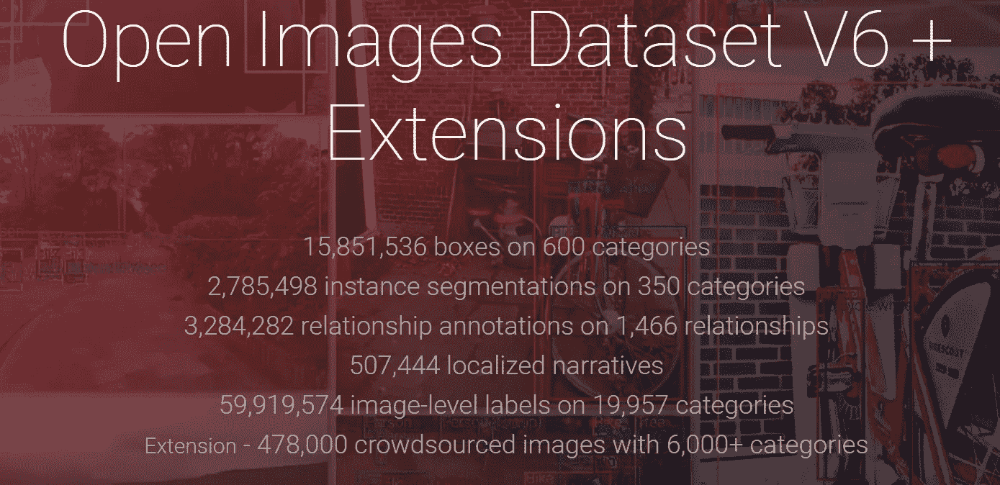
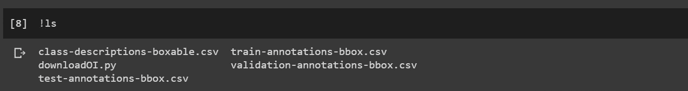
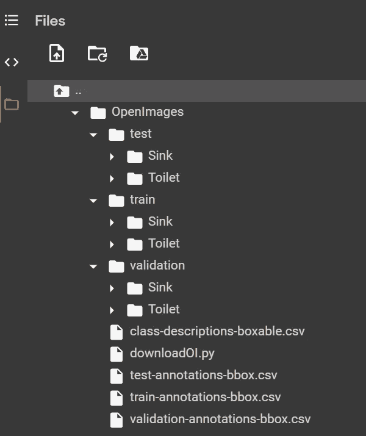

# 使用 Colab 下载 Google Drive 中的 OpenImages 数据集

> 原文：<https://towardsdatascience.com/downloading-openimages-dataset-in-google-drive-using-colab-132502f0dbde?source=collection_archive---------37----------------------->

## 下载您的自定义数据集



[https://storage.googleapis.com/openimages/web/index.html](https://storage.googleapis.com/openimages/web/index.html)

想要在自定义数据集上训练您的计算机视觉模型，但不想在网上搜索图像。试试 OpenImages 吧，这是一个开源数据集，拥有约 900 万张不同的图像，有 600 个对象类别和谷歌提供的丰富注释。数据集包含图像级标签注释、对象边界框、对象分段、视觉关系、本地化叙述等。

您可以根据自己的兴趣下载特定的类别，而不是下载整个数据集。在本文中，我们将使用 google colab 下载一些选定的类/类别，并将数据保存在 Google Drive 中。您也可以在本地运行时使用 jupyter notebook。

*对于这篇文章，你需要一个谷歌账户和谷歌硬盘空间来下载数据。*

1.  在 Colab 中安装您的 Google Drive。

2.创建一个存储数据的文件夹。在这里，我创建了一个名为 **OpenImages 的目录。**

```
!mkdir OpenImages
```

3.将工作目录更改为您刚刚创建的文件夹。使用“！pwd”命令。

```
cd OpenImages
```

4.运行以下命令，下载用于训练、测试和验证的注释文件以及类文件。

```
*# Download required meta-files*
*!wget https://storage.googleapis.com/openimages/2018_04/class-descriptions-boxable.csv*

*!wget https://storage.googleapis.com/openimages/2018_04/train/train-annotations-bbox.csv*

*!wget https://storage.googleapis.com/openimages/2018_04/validation/validation-annotations-bbox.csv*

*!wget https://storage.googleapis.com/openimages/2018_04/test/test-annotations-bbox.csv*
```

5.使用 GitHub 链接将 downloadOI.py 保存在您的工作目录中([https://GitHub . com/SPM lick/learnopencv/blob/master/download open images/download oi . py](https://github.com/spmallick/learnopencv/blob/master/downloadOpenImages/downloadOI.py))或者复制链接中的代码并直接创建文件，如下所示。(感谢**SATA ya mal lick**/**learnopencv**提供了这个令人惊叹的代码库。如果你对计算机视觉和 OpenCV 感兴趣，一定要看看这个神奇的 Github 库。

```
#This magic function is used to create the files.downloadOI.py is the file name
%%writefile downloadOI.py#Author : Sunita Nayak, Big Vision LLC

#### Usage example: python3 downloadOI.py --classes 'Ice_cream,Cookie' --mode train

import argparse
import csv
import subprocess
import os
from tqdm import tqdm
import multiprocessing
from multiprocessing import Pool as thread_pool

cpu_count = multiprocessing.cpu_count()

parser = argparse.ArgumentParser(description='Download Class specific images from OpenImagesV4')
parser.add_argument("--mode", help="Dataset category - train, validation or test", required=True)
parser.add_argument("--classes", help="Names of object classes to be downloaded", required=True)
parser.add_argument("--nthreads", help="Number of threads to use", required=False, type=int, default=cpu_count*2)
parser.add_argument("--occluded", help="Include occluded images", required=False, type=int, default=1)
parser.add_argument("--truncated", help="Include truncated images", required=False, type=int, default=1)
parser.add_argument("--groupOf", help="Include groupOf images", required=False, type=int, default=1)
parser.add_argument("--depiction", help="Include depiction images", required=False, type=int, default=1)
parser.add_argument("--inside", help="Include inside images", required=False, type=int, default=1)

args = parser.parse_args()

run_mode = args.mode

threads = args.nthreads

classes = []
for class_name in args.classes.split(','):
    classes.append(class_name)

with open('./class-descriptions-boxable.csv', mode='r') as infile:
    reader = csv.reader(infile)
    dict_list = {rows[1]:rows[0] for rows in reader}

subprocess.run(['rm', '-rf', run_mode])
subprocess.run([ 'mkdir', run_mode])

pool = thread_pool(threads)
commands = []
cnt = 0

for ind in range(0, len(classes)):

    class_name = classes[ind]
    print("Class "+str(ind) + " : " + class_name)

    subprocess.run([ 'mkdir', run_mode+'/'+class_name])

    command = "grep "+dict_list[class_name.replace('_', ' ')] + " ./" + run_mode + "-annotations-bbox.csv"
    class_annotations = subprocess.run(command.split(), stdout=subprocess.PIPE).stdout.decode('utf-8')
    class_annotations = class_annotations.splitlines()

    for line in class_annotations:

        line_parts = line.split(',')

        #IsOccluded,IsTruncated,IsGroupOf,IsDepiction,IsInside
        if (args.occluded==0 and int(line_parts[8])>0):
            print("Skipped %s",line_parts[0])
            continue
        if (args.truncated==0 and int(line_parts[9])>0):
            print("Skipped %s",line_parts[0])
            continue
        if (args.groupOf==0 and int(line_parts[10])>0):
            print("Skipped %s",line_parts[0])
            continue
        if (args.depiction==0 and int(line_parts[11])>0):
            print("Skipped %s",line_parts[0])
            continue
        if (args.inside==0 and int(line_parts[12])>0):
            print("Skipped %s",line_parts[0])
            continue

        cnt = cnt + 1

        command = 'aws s3 --no-sign-request --only-show-errors cp s3://open-images-dataset/'+run_mode+'/'+line_parts[0]+'.jpg '+ run_mode+'/'+class_name+'/'+line_parts[0]+'.jpg'
        commands.append(command)

        with open('%s/%s/%s.txt'%(run_mode,class_name,line_parts[0]),'a') as f:
            f.write(','.join([class_name, line_parts[4], line_parts[5], line_parts[6], line_parts[7]])+'\n')

print("Annotation Count : "+str(cnt))
commands = list(set(commands))
print("Number of images to be downloaded : "+str(len(commands)))

list(tqdm(pool.imap(os.system, commands), total = len(commands) ))

pool.close()
pool.join()
```

6.目录 **OpenImages** 中的内容应该是这样的



目录的内容

7.运行以下命令以避免“**AWS:not found sh:1:AWS:not found**”错误。

```
!pip install awscli
```

8.下载特定数据。在这里我下载了 2 个类**水槽**和**马桶**。您可以尝试多个类并下载数据。你可以在“***class-descriptions-box able . CSV****”中找到所有的类名。*

```
*# Download Sink and Toilet images for test* 
!python3 downloadOI.py --classes "Sink,Toilet" --mode test*# Download Sink and Toilet images for train* !python3 downloadOI.py --classes "Sink,Toilet" --mode train*# Download Sink and Toilet images for validation* !python3 downloadOI.py --classes "Sink,Toilet" --mode validation
```

有 3 种模式可供选择

*a)* ***—模式训练*** *:下载训练数据*

*b)* ***—模式测试*** *:下载测试数据*

*c)* ***—模式验证*** *:下载验证数据*



这是下载数据的外观

每个类别都有一个图像文件以及文本文件中的注释。

*   文件路径:`OpenImages/train/Sink/01681d52ad599ab4.jpg`
*   图像文件:`01681d52ad599ab4.jpg`
*   文本文件:`01681d52ad599ab4.txt`
*   文本文件内容:`Sink,0.249529,0.420054,0.659844,0.682363`

。txt 文件具有边界框的尺寸。如果图像有多个对象，它可以有多个条目。

注意:请记住，每次运行这个命令时，旧的数据都会被删除。因此，如果你想再次使用该命令，最好在其他文件夹中尝试，以避免删除之前下载的数据。

仅此而已。使用它并下载自定义数据来训练您的自定义计算机视觉模型。

Github 链接到代码[https://github . com/mringup/Colab/blob/master/Downloading _ open images _ Custom _ dataset . ipynb](https://github.com/mringupt/Colab/blob/master/Downloading_OpenImages_Custom_Dataset.ipynb)