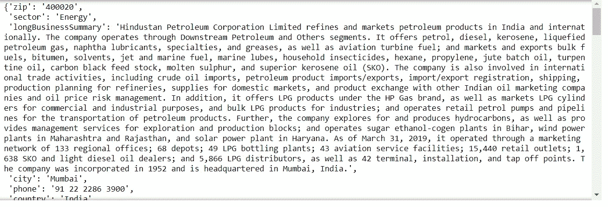
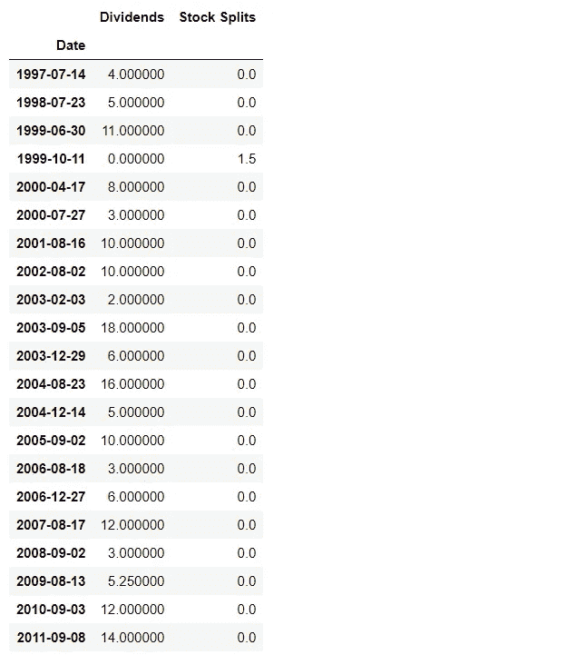
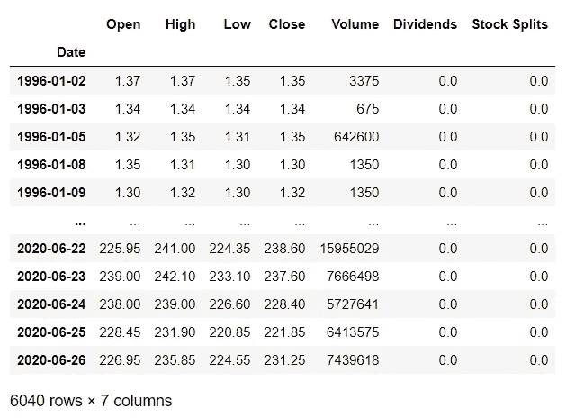
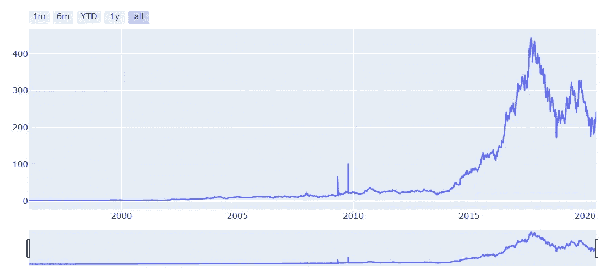
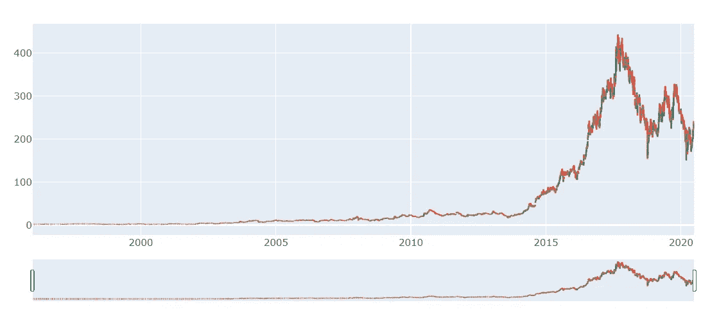
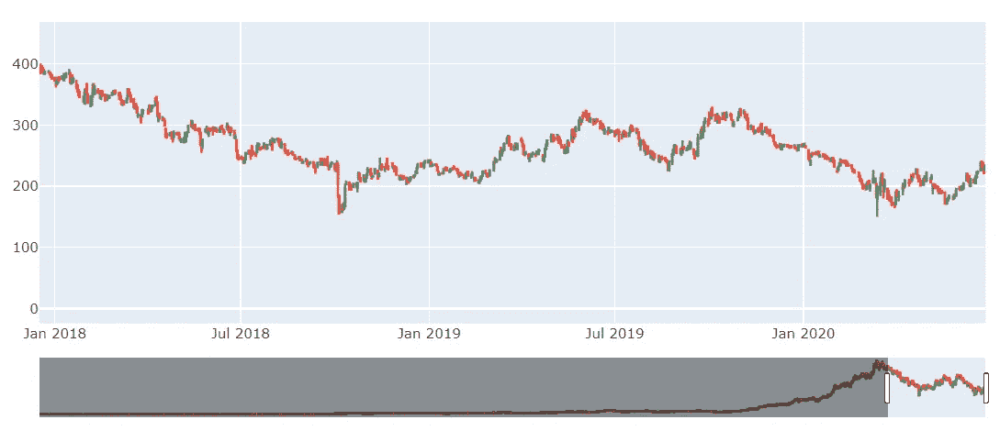
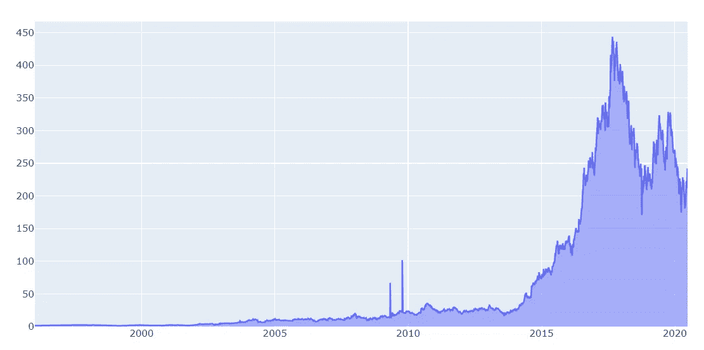

# 下载股票数据并直观地展示出来

> 原文：<https://towardsdatascience.com/downloading-stock-data-and-representing-it-visually-6433f7938f98?source=collection_archive---------31----------------------->

## 使用 YFinance 和 Plotly 库进行股票数据分析


Alec Favale 在 [Unsplash](https://unsplash.com?utm_source=medium&utm_medium=referral) 上的照片

在本文中，我将向您解释如何使用 python 库 **YFinance** ，该库旨在通过提供一种可靠的、线程化的 python 方式从 Yahoo！下载历史市场数据，从而解决下载股票数据的问题金融。

在后面的部分中，我们将看到如何使用这些数据，通过使用 python 库来绘制不同的视觉上吸引人且高度互动的财务图表。plotly Python 库是一个交互式的[开源](https://plotly.com/python/is-plotly-free)绘图库，支持 40 多种独特的图表类型，涵盖了广泛的统计、金融、地理、科学和三维用例。

让我们开始吧。最初，我们将从安装 YFinace 库开始，我们将使用它来下载股票数据并查看它的一些特性。

# 安装 YFinance

在命令提示符下运行下面给出的命令，使用 pip 安装 yfinance。

```
pip install yfinance
```

# **在 Jupyter 笔记本中探索 YFinance 库**

让我们从导入库和下载股票数据开始。这里我使用的股票代码是 HINDPETRO。这是印度斯坦石油公司，你可以选择任何股票进行分析，只需用你的股票代码替换股票代码。

```
 #importing Library
import yfinance as yf#setting the ticker 
hindpetro = yf.Ticker("HINDPETRO.NS")#Display stock information
hindpetro.info
```



这显示了与我们正在查看的公司相关的所有信息。

现在让我们探索一下 YFinance 库提供的一些功能。这只是一个小例子，还有更多，你可以在这里[探索](https://pypi.org/project/yfinance/)。

```
# Dsiplay all the actions taken in the lifetime of the stock i.e    # dividends and splits with the dates when they are providedhindpetro.actions
```



显示股票行为，即股息和拆分以及各自的日期

类似地，你可以使用下面给出的命令来分别显示查看股票股利和股票分割。

```
#Display Dividends
hindpetro.dividends#Display Splits
hindpetro.splits
```

现在让我们将数据下载到数据框中并显示出来。

```
df = hindpetro.history(period="max")
df
```



HindPetro 从上市之日到今天的历史数据。

为了执行进一步的操作，我们需要重置数据帧的索引，并将相应的列转换为 float 数据类型。下面给出的命令将解决我们的目的。

```
#Reseting the index
df = df.reset_index()#Converting the datatype to float
for i in ['Open', 'High', 'Close', 'Low']:
    df[i] = df[i].astype('float64')
```

在这之后，让我们从可视化部分开始。首先，我们需要安装 Plotly。

# 安装 Plotly

```
pip install plotly
```

# 使用带范围滑块和按钮的 Plotly Graph_objects 创建折线图

折线图常用于时间序列分析，用于查看一段时间内的股票趋势。在这里，我将向您解释如何使用 Plotly 创建交互式折线图。以下命令将创建在最大时间段内存储在数据框中的股票数据的折线图。

该代码还包括用于创建按钮的行，这些按钮可以被选择来显示特定时间段的折线图。

```
import plotly.graph_objects as go
import pandas as pdfig = go.Figure([go.Scatter(x=df['Date'], y=df['High'])])fig.update_xaxes(
    rangeslider_visible=True,
    rangeselector=dict(
        buttons=list([
            dict(count=1, label="1m", step="month",                                        
                 stepmode="backward"),
            dict(count=6, label="6m", step="month",  
                 stepmode="backward"),
            dict(count=1, label="YTD", step="year", 
                 stepmode="todate"),
            dict(count=1, label="1y", step="year", 
                 stepmode="backward"),
            dict(step="all")
        ])
    )
)
fig.show()
```



带有范围选择器和范围选择按钮的股票数据折线图。

# 创建 OHLC(开盘、盘高、盘低、收盘)图

**OHLC 图**是一种棒线**图**，显示每个时期的开盘价、最高价、最低价和收盘价。 **OHLC 图表**很有用，因为它们显示了一段时间内的四个主要数据点，收盘价被许多交易者认为是最重要的。

下面给出的代码将创建一个带有范围选择器的 OHLC 图表。



带范围选择器的 OHLC 图表

# 使用范围滑块创建烛台图表

烛台图表被交易者用来根据过去的模式决定可能的价格变动。烛台在交易时很有用，因为它们在交易者指定的时间内显示四个价格点(开盘价、收盘价、最高价和最低价)。



带有范围滑块的烛台图表

# 创建面积图

面积图或面积图以图形方式显示定量数据。它基于折线图。轴和线之间的区域通常用颜色、纹理和影线来强调。

下面给出的代码将创建股票数据的面积图。



股票数据面积图

所有这些图表都是使用 Plotly 创建的，以便您可以与图表进行交互。上面提到的所有图表都是用于财务分析的主要图表。

# 结论

在本文中，我们从下载股票数据开始，并使用 YFinance 执行不同的操作/功能。之后，我们使用 Plotly 绘制了不同的财务图表，用于财务/股票数据分析。

[](/understanding-data-analysis-step-by-step-48e604cb882) [## 逐步了解数据分析

### 对数据集应用数据分析以获得关于数据的见解。

towardsdatascience.com](/understanding-data-analysis-step-by-step-48e604cb882) [](/creating-streamlit-dashboard-from-scratch-59316a74fa1) [## 从头开始创建 Streamlit 仪表板。

### Streamlit 是一个很棒的工具，可以轻松构建视觉上吸引人的仪表板。

towardsdatascience.com](/creating-streamlit-dashboard-from-scratch-59316a74fa1) 

# 在你走之前

***感谢*** *的阅读！如果你想与我取得联系，请随时通过 hmix13@gmail.com 联系我或我的* [***LinkedIn 个人资料***](http://www.linkedin.com/in/himanshusharmads) *。也可以在我的*[***Github***](https://github.com/hmix13/YFinance)*中查看我在这里使用过的代码和数据集。另外，请随意浏览* [***我的简介***](https://medium.com/@hmix13) *并阅读我写的与数据科学相关的不同文章。*