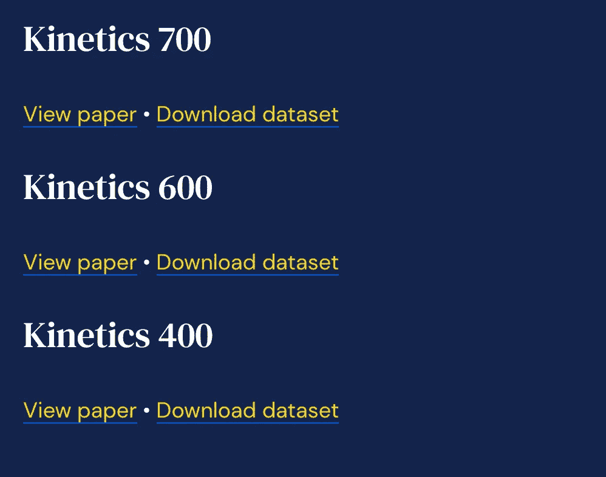
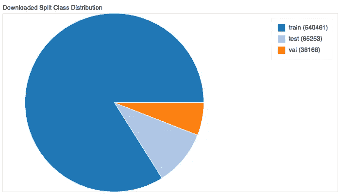
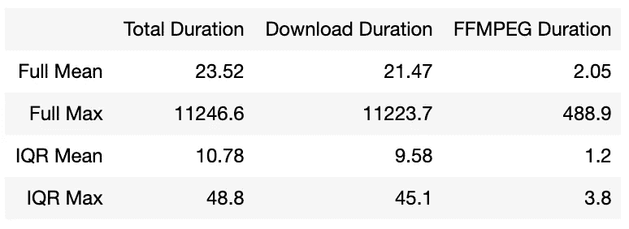
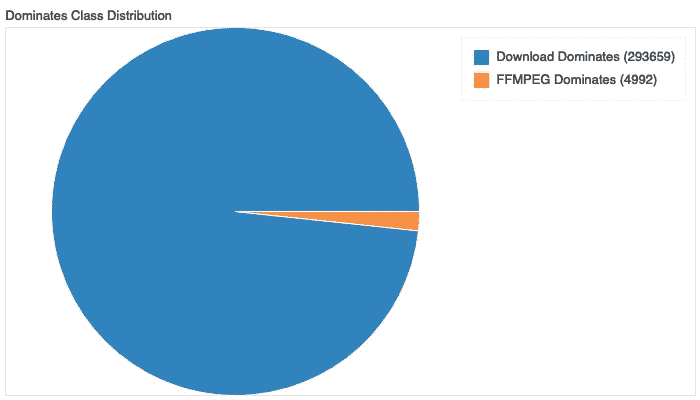
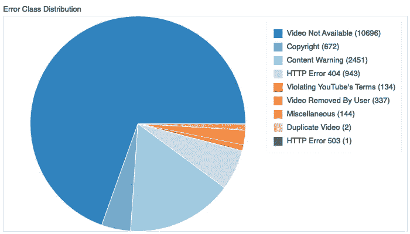
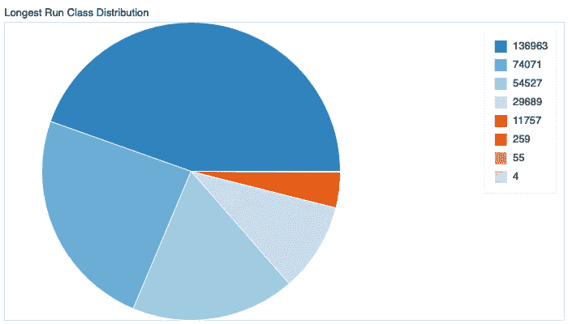

# 为深度学习中的人体动作识别下载动力学数据集

> 原文：<https://towardsdatascience.com/downloading-the-kinetics-dataset-for-human-action-recognition-in-deep-learning-500c3d50f776?source=collection_archive---------10----------------------->

## 关于下载程序的学习、挑战和见解


如果你有兴趣对人类活动或动作识别进行深度学习，你一定会遇到由 [deep mind](https://deepmind.com/) 发布的[动力学数据集](https://deepmind.com/research/open-source/kinetics)。数据集有 3 个主要版本；动力学 400、动力学 600 和动力学 700 版本。在写这篇博客的时候，Kinetics 700 是最新的版本。

deep mind 网站上对 Kinetics 700 数据集的描述是:

> 这是一个大规模、高质量的 URL 数据集，链接到大约 650，000 个视频剪辑，涵盖 700 个人类动作类别，包括演奏乐器等人机交互，以及握手和拥抱等人机交互。每个动作类至少有 600 个视频剪辑。每个剪辑都由人类用一个动作类进行注释，持续大约 10 秒钟。

上述上下文中的 *URL 链接*指的是 YouTube URL 链接，因此，这些视频就是 YouTube 视频。

该数据集正在成为人类活动识别的标准，并越来越多地被用作几篇动作识别论文的基准，以及用于处理视频数据的深度学习架构的基线。Kinetics 数据集的主要愿景是成为视频数据的 [ImageNet](http://www.image-net.org/) 等价物。

这篇博客将介绍从注释文件下载视频的步骤，以及面临的挑战和一些应对挑战的策略。它将突出显示一些关于数据的基本统计数据，如果您选择自己下载，这些数据有望帮助您做出明智的决定。然而，它不会进入关于注释数据集的太多细节，例如它是如何被收集的，不同类的分布等等。这些信息可以通过阅读以下文章找到:

*   人体运动视频数据集([https://arxiv.org/pdf/1705.06950.pdf](https://arxiv.org/pdf/1705.06950.pdf))
*   关于 Kinetics-700 人体动作数据集([https://arxiv.org/pdf/1907.06987.pdf](https://arxiv.org/pdf/1907.06987.pdf))的简短说明

创建了一个动力学数据集资源管理器，以便于可视化数据。探险家可以在[http://kinetics-explorer.com/](http://kinetics-explorer.com/#/)上找到

# 获取动力学注释数据集

相对于 ImageNet 或 COCO 等价物，处理动力学数据集时最大的难点是没有实际的视频可供下载。在适当的位置，提供一个注释文件，该文件包含 json 和 csv 格式的条目列表，这些条目包含 YouTube URL 链接、动作类别以及视频中动作类别的开始和结束时间。

这意味着你必须自己下载视频，并在正确的时间范围内进行裁剪。大约有 650，000 个视频，因此这不是一个容易的任务，因为我们将在后面讨论各种挑战。

注释文件可以从下面的[链接](https://deepmind.com/research/open-source/kinetics)下载。下面是你应该看到的截图。



动力学 700 是这个博客的焦点数据集。单击“下载数据集”链接，下载包含注释文件的 25 MB gzip 文件。提取 gzip 文件的内容后，有 3 个文件夹，其中包含两种文件格式(csv 和 json)的 train、val 和 test 数据集。csv 文件的结构是:

```
label,youtube_id,time_start,time_end,split
testifying,---QUuC4vJs,84,94,validate
washing feet,--GkrdYZ9Tc,0,10,validate
air drumming,--nQbRBEz2s,104,114,validate
.
.
.
```

CSV 文件中的项目可以细分如下:

*   `label`表示在视频中发现了什么类型的人类活动，例如`testifying`、`washing feet`、`air drumming`等。
*   `youtube_id`是 YouTube 为每个视频使用的唯一视频标识符。将`youtube_id`替换成下面的字符串`[https://www.youtube.com/watch?v=](https://www.youtube.com/watch?v=){youtube_id}`，可以下载完整的视频。
*   `time_start`和`time_end`(以秒为单位)表示在视频中发现由`label`表示的人类活动的部分。以标签为`testifying`的 csv 样本的第一行为例，[视频](https://www.youtube.com/watch?v=---QUuC4vJs)的长度为 95 秒(可以从[https://www.youtube.com/watch?v=-屈科维兹](https://www.youtube.com/watch?v=---QUuC4vJs)中验证)，因此感兴趣的标签将在 84-94 秒之间，这构成了时间范围。
*   `split`表示它是否属于训练、验证或测试数据集。

json 文件的结构如下，从 csv 上下文来看应该很容易理解:

```
{
 "---QUuC4vJs": {
  "annotations": {
   "label": "testifying",
   "segment": [
    84.0,
    94.0
   ]
  },
  "duration": 10.0,
  "subset": "validate",
  "url": "[https://www.youtube.com/watch?v=---QUuC4vJs](https://www.youtube.com/watch?v=---QUuC4vJs)"
 },
 "--GkrdYZ9Tc": {
  "annotations": {
   "label": "washing feet",
   "segment": [
    0.0,
    10.0
   ]
  },
  "duration": 10.0,
  "subset": "validate",
  "url": "[https://www.youtube.com/watch?v=--GkrdYZ9Tc](https://www.youtube.com/watch?v=--GkrdYZ9Tc)"
 },
.
.
.
.
}
```

json 文件比 csv 文件大得多，占用 197.5 MB 内存，而不是 24.5 MB，所以从 csv 文件读取数据可能比从 json 文件读取数据快一点。然而，大多数能够从注释文件下载动力学数据集的开源软件使用 json 格式，因此可能需要将 csv 数据预处理为正确的格式。就我个人而言，我选择了 JSON 格式，因为我最终使用了开源代码库。

# 技术环境

数据下载主要是在运行 Ubuntu 18.04 的台式电脑上进行的，该电脑具有稳定的互联网连接，下载速度约为 60 Mb/s，内存为 16 GB。然而，有些下载是在我不使用 MacBook Pro 的时候进行的。

我确实尝试过使用 AWS 和 Google Cloud，但是 YouTube 存在明显的节流问题，这将在错误部分解决。

# 下载数据的代码库

接下来要考虑的是下载数据的代码库。有两个主要选项:

*   自己写代码库。
*   找到一个现有的开源代码库，如有必要，根据需要修改它。

选择了第二个选项，选择的代码库是[showmax/kinetics-downloader](https://github.com/Showmax/kinetics-downloader)，它的一个分支是在[dance Logue/kinetics-datasets-downloader](https://github.com/dancelogue/kinetics-datasets-downloader)中创建的。使用代码库的主要要求是`python ≥ 3.4`、`[ffmpeg](https://www.ffmpeg.org/)`和`[youtube-dl](https://github.com/ytdl-org/youtube-dl)`。其中`[youtube-dl](https://github.com/ytdl-org/youtube-dl)`用于进行实际下载，而`[ffmpeg](https://www.ffmpeg.org/)`用于在所需的片段(即`time_start`和`time_end`时间)裁剪视频。

如何使用代码库包含在 [README.md](https://github.com/dancelogue/kinetics-datasets-downloader/blob/master/README.md) 文件中，因此我们不会深入研究代码。值得注意的是，它使用了 python 多重处理模块，我发现在下载如此大的数据集时这是必要的，我们将在这篇博客中解释原因。

根据下载数据集时遇到的问题进行了一些修改。对代码库的修改包括:

*   能够写入一个`stats.csv`文件，以跟踪每次下载花了多长时间，以及每个视频的 ffmpeg 裁剪时间的持续时间。不幸的是，创建这个功能的直觉只在数据集下载了一半之后才出现。因此，统计数据并没有覆盖整个样本，但应该足以深入了解下载过程。
*   能够写入一个`failed.csv`文件，以表明哪些视频有错误，以及返回的错误是什么。
*   一旦发生限制，能够暂停下载过程。

统计数据和失败日志用于生成关于数据的基本统计数据，如果您选择自己下载数据，它们有望帮助您做出明智的决策。

# 总体统计

YouTube 是一个动态的平台，这意味着视频会一直被添加和删除。因此，由于视频被删除，在不同时间下载动力学数据集将不会有一致的结果。下面的饼图显示了我的 kinetics 数据集中已下载和缺失的视频。


总下载视频数为 631604，而失败视频数为 15380，这意味着在总共 646984 个视频中，整个数据集的 2.37 %无法下载。假设这在可接受的误差范围内。

## 下载拆分

下面的饼图显示了在训练集、测试集和验证集之间下载的视频的划分。



正如所料，大多数视频由训练集数据组成，占数据集的 83.94 %。测试集占数据集的 10.13 %，而验证集占数据集的 5.93 %。

## 总下载持续时间

为了计算下载整个数据集需要多长时间，下载时间和生成裁剪视频所需的时间(FFMPEG 持续时间)以秒为单位进行记录。如前所述，仅记录了 298651 个视频的统计数据。下表显示了各个过程的平均值和最大值。



完整表示整个数据集，而 IQR 表示在[四分位数范围](https://en.wikipedia.org/wiki/Interquartile_range)内的数据。获取四分位数据对于防止极端异常值是必要的，如下载持续时间和 FFMPEG 持续时间的高最大值所示。按顺序下载 646984 个视频的理论时间是:

*   使用完整平均值，预计下载时间为 **176.1 天**。
*   根据 IQR 平均值，预计下载时间为 **80.7 天**。

这假设视频是同步下载的，没有任何中断。幸运的是，多重处理对我们有利。我使用 python `multiprocessing`模块运行 16 个独立的进程。

下面的饼图显示了下载主导任务和 ffmpeg(裁剪)主导任务之间的主导过程。



可以看出，对于大部分下载过程，实际下载过程占主导地位，而 ffmpeg 过程仅占 1.67 %的时间占主导地位。因此，整个过程中的主要瓶颈实际上是从 YouTube 下载视频。

## 最佳化

我在下载动力学数据集时犯的第一个错误是下载了比必要质量更高的视频(这可能表明为什么会有非常极端的异常值)。

最终我选定了最大分辨率为 360p 的视频，毕竟这些视频是给机器看的，而不是给人看的。这种质量的视频包含足够的信息来训练相关的深度学习算法，并且下载和裁剪速度明显更快，在存储期间占用的磁盘空间更少。可以认为，也可以尝试较低的分辨率，即 240p 或 144p，这将在下载期间节省大量空间和时间，同时保持相同的基线/基准精度。

## 空间要求

我们进行了一次快速计算，以确定空间需求，结果发现整个裁剪数据集占用了 628.43 GB 的磁盘空间。为了下载数据集，您可能需要大约 20 GB 的额外空间(取决于并发下载的数量)来容纳需要临时存储的完整的未裁剪视频。

# 失败的视频下载

2.37 %的视频下载失败的原因被记录下来，并显示在下面的饼状图中。图例中描述旁边的数字是发生特定错误的实例总数。



大多数错误都是基于 YouTube 的错误消息，描述是一组错误的指示器。这些是:

*   **视频不可用(10606)** 错误是目前最大的失败原因，包括各种原因，如上传者删除了他们的 YouTube 帐户或他们的帐户被 YouTube 删除，视频仅在某些国家可用，视频被设为私有等。
*   **内容警告(2451)** 错误
*   ****HTTP 错误**[**404**](https://en.wikipedia.org/wiki/HTTP_404)**(943)**错误可能是由于 Kinetics 视频`youtube_id`出错，因为 404 通常表示未找到页面错误代码。但是我没有时间去研究这个假设。**
*   ****Copyright (672)** 错误是由于版权索赔而被删除的视频。**
*   ****视频被用户删除(337)** 错误顾名思义，用户删除了视频。**
*   ****杂项(144)** 错误可能是由于与正在使用的库有关的错误，或者无法确定错误原因。**
*   ****违反 YouTube 条款(134)** 错误通常是因为违反了关于垃圾邮件、种族主义、欺凌、裸体等的社区准则而被删除的视频。**
*   ****重复视频(2)** 错误似乎表明 YouTube 不允许重复视频。**
*   ****HTTP 错误**[**503**](https://developer.mozilla.org/en-US/docs/Web/HTTP/Status/503)**(1)**错误仅出现一次，并且与服务未找到错误相关，不确定为什么会出现这种情况。**

**尽管下载视频存在问题，但失败的视频仅占整个数据集的 2.37 %，可以认为是在可接受的误差范围内。然而，值得注意的是，随着时间的推移，随着越来越多的视频被删除，失败视频的比例将会增加。**

**尽管这些是阻止视频下载的错误，但有一个错误被证明是下载 YouTube 视频时最令人沮丧的经历，那就是可怕的 **429 太多请求错误**。**

# **HTTP 错误 429:请求太多**

**这是迄今为止下载动力学数据集的最大难点，这也是我在下载过程中的感受。**

****

**[https://img flip . com/meme template/29364527/卢克-天行者-哭泣](https://imgflip.com/memetemplate/29364527/Luke-Skywalker-Crying)**

**这个错误的主要原因是由 YouTube 节流请求引起的，我认为这是通过将请求 ip 地址列入黑名单来实现的。YouTube 限制请求是有意义的，其中一些原因包括减少服务器的负载，防止恶意方访问数据等。但是下载 650 000 个视频剪辑是一件痛苦的事情。**

**尤其具有挑战性的是请求 ip 地址再次被允许所花费的时间，即“冷却”期。根据经验，这需要 12 小时到 5 天的时间。我找不到一个可辨别的模式来绕过它。在被限制之前，我在单个会话中能够下载的最大视频量是 136963，下面的饼状图显示了运行之间的分布(一些运行被手动终止，而不是被限制)。**

****

**节流问题已经在不同来源中被强调为从 YouTube 下载数据的主要障碍。**

*   **[https://github.com/activitynet/ActivityNet/issues/51](https://github.com/activitynet/ActivityNet/issues/51)**
*   **[https://github.com/activitynet/ActivityNet/issues/28](https://github.com/activitynet/ActivityNet/issues/28)**
*   **[https://stack overflow . com/questions/57488759/npmyoutube-dl-and-lamda-http-error-429-too-many-requests](https://stackoverflow.com/questions/57488759/npmyoutube-dl-and-lamda-http-error-429-too-many-requests)**
*   **【https://github.com/ytdl-org/youtube-dl/issues/21729 **

## **工作区**

**据我所知，一个 ip 地址被列入黑名单的标准还不清楚。在我的家庭桌面上，我可以在遇到 429 错误代码之前下载超过 50，0 00 个视频，然而，转移到 AWS 或 Google cloud，我可能会在遇到 429 错误之前下载 100 个视频。也许 YouTube 使用一些标准来立即将来自云虚拟机和个人机器的 ip 地址列入黑名单。**

**当遇到 HTTP 错误 429 时，最好停止下载，稍后重试或更改 IP 地址。**

**我能想到的主要可行方案是通过切换网络来改变 IP 地址。在同一台机器上运行两种不同的操作系统(例如 Windows 和 Ubuntu)已经有一段时间了。如果其他方法都失败了。，等待冷静期。**

**由于当时下载数据集并不是一个很重要的优先事项，当所有网络解决方案都遇到 HTTP 错误 429 状态时，数据集的下载就停止了，并在几天后进行了尝试。我没有探索其他选择，如使用 VPN 等。**

# **伦理学**

**到目前为止还没有涉及的一个主要话题是道德，即抓取 YouTube 视频。一方面，视频的注释文件是存在的，并且是由谷歌的子公司 [Deepmind](https://deepmind.com/) 提供的，另一方面，下载数据集的规则是什么，特别是对于深度学习研究。有相当多的报纸利用数据显示人们正在下载它。感觉就像头埋在沙子里一样。**

****

**这可能是数据没有公开的原因，因此，任何对深度学习感兴趣的人都必须自己下载。这种方法有几个问题，我认为是:**

*   **首先，它阻碍了利用视频数据的深度学习研究，因为动力学数据集不是下载的微不足道的数据集。**
*   **由于缺少视频，两个不同研究人员之间的数据集可能不同，这意味着研究论文中报告的结果可能不完全可重复。**

**不知道在公开数据的过程中，关于道德状况的解决办法是什么，但希望 Deepmind 能够让视频数据很容易被非商业用途获得。**

# **结论**

**希望这篇博客给了你一些关于下载动力学数据集的见解，以及你自己尝试时所面临的挑战。**

**动力学数据集是必要的，因为我在 2019 年全年开展了一个关于为舞蹈深度学习初创公司建立 Shazam 的个人项目。动力学数据用于预训练 dance 算法作为概念的证明。我将很快在博客上记录这个过程。**

**如果您有任何问题或任何需要澄清的事情，您可以在 https://mbele.io/mark[和我预约时间](https://mbele.io/mark)**