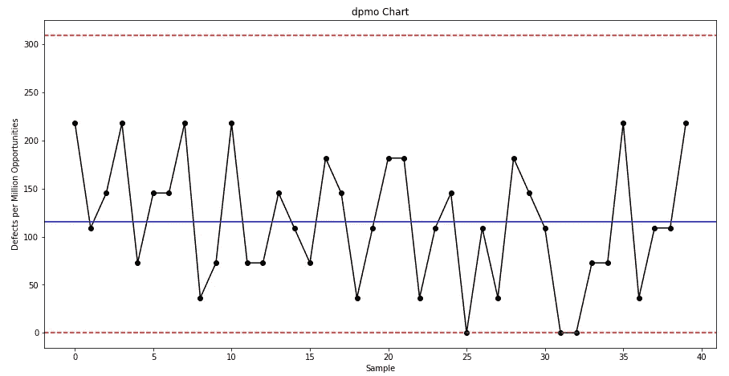

# 使用 Python 制作的 DPMO 海图

> 原文：<https://towardsdatascience.com/dpmo-chart-with-python-f495308905cc?source=collection_archive---------42----------------------->

## 面向工业工程师的 Python

## 使用 Python 库创建质量控制图

图片由 [chuttersnap](https://unsplash.com/@chuttersnap) 拍摄，可在 [Unsplash](https://unsplash.com/photos/Odc4dcsjUBw) 获得

# 质量控制图

质量控制图是工程师监控一个过程是否在**统计控制下**的重要工具。它们有助于可视化变化，发现并纠正出现的问题，预测预期的结果范围，并分析特殊或常见原因导致的流程变化模式。质量控制图常用于精益六适马项目和 DMAIC 项目的控制阶段，被认为是过程改进的七个基本质量工具之一。

# DPMO 控制图

DPMO(每百万个机会的缺陷)图代表了一种较新的属性控制图，用于在缺陷机会远大于一个时跟踪 dpmo 值。DPMO 图是为电子制造环境开发的，作为评估生产多种高度复杂产品的过程的一种方法。

## 相关计算

从每个样品中获得缺陷总数后，需要进行以下计算来构建 DPMO 图:

*   **每单位缺陷**:每单位发现的缺陷总数。

*   **每百万机会的缺陷数:**每百万机会的预期缺陷数。

## **控制线**

以下控制线包含在 dpmo 图表中，有助于确定流程是否处于统计控制之下:

*   **中心线:**

*   **控制上限:**

*   **控制下限:**

在下面的例子中，让我们为一个微电子元件建立一个 dpmo 图表，其中获得了 40 个样本，每个样本 10 个单元，每个单元有 2，751 个缺陷机会。让我们来看看 Python 代码！

根据上面的 dpmo 图，该过程似乎处于统计控制之下，因为没有一个 dpmo 点超过控制上限。甚至对于 40 个样品中的 3 个(即样品 25、31 和 32)也没有发现缺陷。考虑到本例的 dpmo 平均值约为 115 dpmo，流程σ(即流程相对于客户要求的变化量，表示为正态分布的标准偏差数)接近 5.30。

# 总结想法

质量控制图是分析流程稳定性和获取重要统计信息的重要工具，可用于精益六适马和 DMAIC 项目的流程改进。质量和工业工程师必须能够准确地解释它们，以识别可能导致潜在不合格的不良趋势，从而采取预防措施而不是纠正措施，从而减少废料和浪费。

本指南涵盖了如何使用多个 Python 库从头构建 DPMO 图表的分步教程。考虑到 Python 在专业人士和学者中的高受欢迎程度，Python 是一个很好的工具，能够为统计目的构建质量控制图表。虽然也有其他程序和软件可以构建它们(例如 Minitab、R、Microsoft Excel)，但质量和工业工程师应根据他们的编码和分析技能决定使用哪一种，同时符合组织的目标和客户的规格。

*—*

*如果你觉得这篇文章有用，欢迎在* [*GitHub*](https://github.com/rsalaza4/Python-for-Industrial-Engineering/blob/master/Quality%20Control%20Charts/dmpo%20chart.py) *上下载我的个人代码。你也可以直接在 rsalaza4@binghamton.edu 给我发邮件，在*[*LinkedIn*](https://www.linkedin.com/in/roberto-salazar-reyna/)*上找到我。有兴趣了解工程领域的数据分析、数据科学和机器学习应用的更多信息吗？通过访问我的媒体* [*简介*](https://robertosalazarr.medium.com/) *来探索我以前的文章。感谢阅读。*

*——罗伯特*