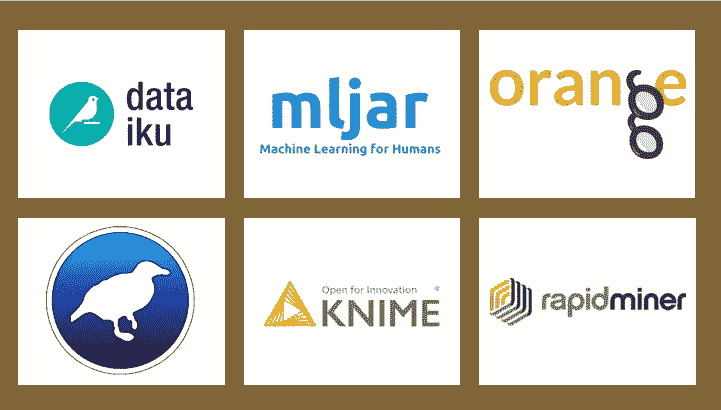
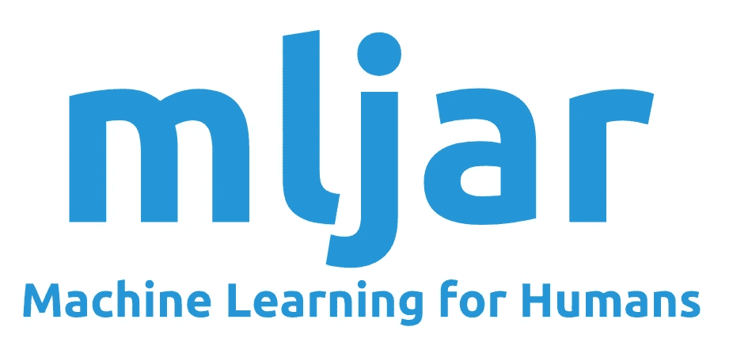

# 机器学习管道的拖放工具——值得一试吗？

> 原文：<https://towardsdatascience.com/drag-and-drop-tools-for-machine-learning-pipelines-worth-a-try-63ace4a18715?source=collection_archive---------30----------------------->

## 比较机器学习的 6 个免费可视化编程工具的免费版本限制、互操作性和模型动物园。

# 拖放式机器学习管道与数据科学工具

几周前，我会说拖放式机器学习工具永远不会比开源编程语言的灵活性更好，如果必要的话，结合笔记本。

像许多数据科学家一样，我一直在用 Python 和 R 进行机器学习:从数据探索到可视化、模型拟合和比较等。

最近，我看到我周围有多个人在使用拖放式机器学习工具，这让我很好奇。考虑了一下，我认为如果我能找到一个免费的拖放式机器学习工具，拥有所有重要的模型，并且可以很容易地将拟合的模型导出到其他语言，那么至少值得一试。

我花了一些时间列出这项工作的现有工具，并验证它们是否满足这些基本要求。我在这篇文章中分享我的基准。

基准测试的拖放工具(来源:dataiku.com，mljar.com，orange.biolab.si，cs.waikato.ac.nz/ml/weka/, knime.com，rapidminer.com)

# 拖放式机器学习管道—基准

我对这种工具的使用是模型比较。

**最低要求:**

*   机器学习管道的拖放基准测试。
*   比 Jupyter 笔记本更容易使用(相当有挑战性)。
*   AutoML 工具被排除在基准测试之外(因为这不是我们的目标)

除此之外，我将在以下几点测试产品:

1.  **免费或者至少有一个合理的免费版本** 因为如果我看不到免费版本的附加价值，我不会考虑购买它。
2.  **可与其他编程语言互操作**
    因为我显然不想强迫任何人使用该产品，所以需要一种简单的方法将我所做的导出到另一种语言。
3.  **好的模型动物园，**那包括深度学习

# 用于拖放机器学习管道的现有工具

浏览互联网，我发现了一些工具。其中一些人提议免费版本，而另一些人则没有。目前我真的在寻找一个免费的工具，所以我没有深入研究付费工具。

## **提出免费版本的:**

*   RapidMiner 工作室:[https://rapidminer.com/products/studio/](https://rapidminer.com/products/studio/)
*   大台库:[https://www.dataiku.com/product/features/machine-learning/](https://www.dataiku.com/product/features/machine-learning/)
*   韦卡:[https://www.cs.waikato.ac.nz/ml/weka/](https://www.cs.waikato.ac.nz/ml/weka/)
*   https://mljar.com/
*   https://www.knime.com/knime-analytics-platform
*   橙色:[https://orange.biolab.si/](https://orange.biolab.si/)

## 那些不推荐免费版本的(试用期不被认为是免费版本):

*   SPSS Modeler([https://www.ibm.com/products/spss-modeler](https://www.ibm.com/products/spss-modeler))
*   SAS 企业矿工([https://www.sas.com/en_us/software/enterprise-miner.html](https://www.sas.com/en_us/software/enterprise-miner.html))
*   IBM Watson Studio 结合 SPSS Modeler([https://www.ibm.com/cloud/watson-studio](https://www.ibm.com/cloud/watson-studio))
*   Alteryx 预测分析([https://www.alteryx.com/products/apa-platform](https://www.alteryx.com/products/apa-platform))

RapidMiner 标志(来源:rapidminer.com)

# 回顾 1 — RapidMiner 工作室

链接:[https://rapidminer.com/products/studio/](https://rapidminer.com/products/studio/)

## RapidMiner 定价或免费版本

*   免费版:10，000 个数据行，1 个逻辑处理器，社区支持，30 天企业试用
*   专业版:每用户每年 7，500 美元:100，000 个数据行，2 个逻辑处理器，企业支持，Turbo Prep，自动模式
*   企业版:每用户每年 15，000 美元:无限数据行、无限逻辑处理器、企业支持、Turbo Prep、自动模型、自动化模型操作、后台流程执行

## RapidMiner 互操作性/导出模型

根据他们网站上的支持页面，RapidMiner 似乎支持 PMML 的一些型号，但不是全部。

## RapidMiner 模型动物园

RapidMiner 模型动物园好像挺不错的。有人支持使用 H2O 进行深度学习。

## RapidMiner 结论

RapidMiner 的免费版本只支持 10000 个数据行和 1 个逻辑处理器。这是如此有限，以至于对我来说，不值得测试他们的解决方案。

达泰库标志(来源:dataiku.com)

# 审查 2 —大台库

链接:[https://www.dataiku.com/product/features/machine-learning/](https://www.dataiku.com/product/features/machine-learning/)

## 大台库定价或免费版

Dataiku 的免费版有两种可能:

*   安装它永远免费:无限的数据处理，数据在您的基础设施，多达 3 个用户
*   或者，让 Dataiku 托管它:有限的处理能力，只有文件，单用户

这个免费版我好像可以接受，那就来下一点吧。

## Dataiku 互操作性/导出模型

有几个导出模型的选项:

*   使用 Dataiku API 进行实时评分。
    很酷的功能，但是免费版当然没有。
*   使用 PMML
    对我来说很有趣，但不幸的是这需要一个“第二层支持级别”,我在免费版本中不会有。
*   导出到 Python 笔记本
    Dataiku 的警告通知让我有点害怕*“这个特性并不支持所有算法”*和*“这个生成的笔记本仅用于教育和解释目的。特别是，本笔记本没有再现 DSS 的所有预处理功能，而只是 DSS 中训练的模型的最佳近似值。”*

## 大台库模型动物园

Dataiku 可以使用 Python 的 scikitlearn 作为建模引擎。车型数量比较好。还有对深度学习的支持。

## 达泰库结论

Dataiku 似乎是一个很好的检查工具。如果我继续做下去，Dataiku 的互操作性将是第一个要测试的东西，但现在它还不是一个障碍。

Weka 标志(来源:https://www.cs.waikato.ac.nz/ml/weka/)

# 回顾 3 — Weka

链接:[https://www.cs.waikato.ac.nz/ml/weka/](https://www.cs.waikato.ac.nz/ml/weka/)

## Weka 定价或免费版

Weka 的 GUI 不如 RapidMiner 和 Dataik 流畅。它似乎介于 GUI 工具和代码的 GUI 包装器之间，所以我不确定它是否比使用 Python 笔记本有优势。

但是 Weka 是免费和开源的:这太棒了，这也是我把它放在列表中的原因。

## Weka 互操作性/导出模型

我没有发现 Weka 是否提出了一个按钮点击选项来导出模型。Weka 使用来自 scikit learn 的模型，因此使用 Weka 建立模型并使用 Scikit Learn 重新拟合模型会很容易。

## 3.3 Weka 模型动物园

如前一点所述，Weka 用的是 Scikit Learn 的模型，对我来说不错。还支持用 deaplearning4j 进行 deap 学习。

## 3.4 Weka 结论

Weka 似乎是一个可以接受的工具:最大的问题是，与使用 Jupyter 笔记本相比，它是否有附加值。我需要测试一下才能确定。

MLjar 标志(来源:mljar.com)

# 回顾 4 — MLjar

链接:[https://mljar.com/](https://mljar.com/)

## MLjar 定价或免费版本

MLjar 有一个免费版本，数据集限制为 0.25 GB，30 天的项目历史和 5 个积分。1 个信用是 1 个计算小时，所以只有 5 个小时的使用是完全免费的。这远远不足以做一些严肃的事情。

## MLjar 互操作性/导出模型

我没有找到从 MLjar 导出模型的方法。他们似乎有一个 API，但不清楚是仅用于模型构建还是也用于预测。

## MLjar 模型动物园

MLjar 模型动物园的分类模型只有二元分类。这个对我来说太局限了。

## MLjar 结论

MLjar 似乎开始了一些有趣的事情，但就目前而言，他们的解决方案对于价格和非常有限的免费版本来说似乎不够好。

Knime 标志(来源:knime.com)

# 回顾 5 — Knime 分析平台

链接:[https://www.knime.com/knime-analytics-platform](https://www.knime.com/knime-analytics-platform)

## Knime 定价或免费版本

Knime 有一个免费的开源版本，看起来相当强大:太棒了！

## Knime 互操作性/导出模型

Knime 有可能与 PMML 一起出口模型。在付费版本中构建 API 是可能的。

## 克尼梅模型动物园

Knime model zoo 看起来相对不错，还包括深度学习。

## Knime 结论

Knime 给我留下了非常好的印象，因为他们有一个非常精致的免费版本，良好的互操作性，以及一个很好的模型列表。GUI 看起来也很流畅。而且开源！这值得一查。

橙色标志(来源:orange.biolab.si)

# 审查 6—橙色

链接:【https://orange.biolab.si/getting-started/ 

## 橙色定价或免费版本

Orange 完全免费开源:牛逼！

## 橙色互操作性/导出模型

将模型保存为泡菜是可能的。然后这个泡菜就可以用 orange 导入 Python 了。使用 Pickle 似乎不是满足我需求的最佳解决方案:我希望存储模型并能够用另一个框架打开它。

## 橙色模型动物园

橘子模型动物园看起来可以接受，但是不支持深度学习。

## 橙色结论

橙色有一些很好的特点。它是开源的，看起来相当流畅。不幸的是，Orange 的互操作性部分非常糟糕。

# 获胜者是……Knime！

有两个工具我会考虑更详细地测试:

1.  Knime 似乎是最好的选择，因为我真的很喜欢它是开源的。Knime 给我留下了非常好的印象，因为他们有一个非常精致的免费版本，良好的互操作性，以及一个很好的模型列表。GUI 看起来也很流畅。而且开源！这值得一查。
2.  Dataiku 似乎是一个很好的检查工具。它的付费版本似乎没有太多的限制，它似乎很强大。

其他工具各有其特定的缺点:

*   RapidMiner 的免费版本只支持 10000 个数据行和 1 个逻辑处理器。这是如此有限，以至于对我来说，不值得测试他们的解决方案。
*   Weka 似乎是一个很好的产品:最大的问题是，与使用 Jupyter 笔记本相比，它是否有附加值。
*   MLjar 似乎开始了一些有趣的事情，但就目前而言，他们的解决方案对于所要求的价格和非常有限的免费版本来说似乎不够好。
*   橙色有一些很好的特点。它是开源的，看起来相当流畅。不幸的是，Orange 的互操作性部分非常糟糕。

感谢你阅读我的文章，希望对你有用。不要犹豫，继续关注更多！