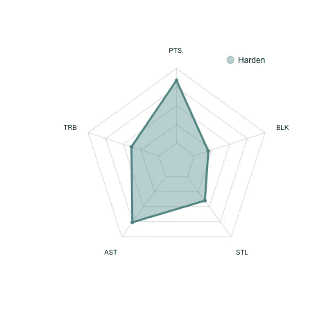
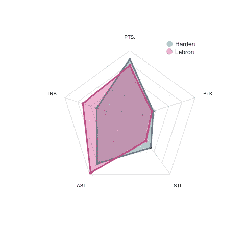
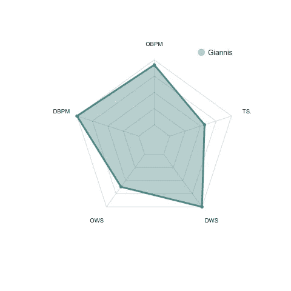
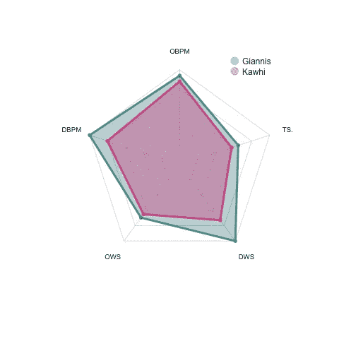

# 用 R 画一个雷达/蜘蛛图

> 原文：<https://towardsdatascience.com/draw-a-radar-spider-plot-with-r-4af9693c3237?source=collection_archive---------50----------------------->

## 工具

## 奥兰多泡沫中的 NBA 季后赛联盟老大是谁？


斯蒂芬·瓦伦丁在 [Unsplash](https://unsplash.com?utm_source=medium&utm_medium=referral) 上拍摄的照片

我在我的读者群中尝试了几种不同类型的 NBA 分析文章，他们是一群真正的篮球迷。我发现最受欢迎的文章是**而不是**那些具有最先进的机器学习技术的文章，而是那些带有直观而有意义的图表的文章。

在我作为数据科学家的职业生涯的某个阶段，我意识到传递信息比展示花哨的模型更重要。也许这就是为什么线性回归仍然是金融界最流行的模型之一。

在这篇文章中，我将谈论一个简单的话题。如何绘制蜘蛛图，或雷达图是比较分析中最重要的图形之一。我正在用 r 实现代码。

## 数据

2019–2020 NBA 季后赛 NBA 球员场均基本统计和高级统计。(来自[篮球参考](https://www.basketball-reference.com/))

## 密码

让我们首先在蜘蛛图中可视化詹姆斯·哈登的统计数据。我们只关注五个数据:得分，TRB，助攻，抢断和 BLK。

```
df = read.csv("playoff_stats.csv")
maxxx = apply(df[,c("PTS.","TRB","AST","STL","BLK")],2,max)
minnn = apply(df[,c("PTS.","TRB","AST","STL","BLK")],2,min)
```

在这个块的代码中，数据被读取到数据帧“df”中。并且计算每列的最大值和最小值，因为这些值对于定义蜘蛛图中数据的边界是有用的。

例如，我提取了詹姆斯·哈登和勒布朗的数据进行分析。

```
df_sel = df[c(3,10),c("PTS.","TRB","AST","STL","BLK")]
rownames(df_sel) = c("Harden","Lebron")
```

要定义蜘蛛图的功能，我们需要加载[***fmsb***](https://cran.r-project.org/web/packages/fmsb/fmsb.pdf)包。

```
comp_plot = function(data,maxxx,minnn){
    library(fmsb)
    data = rbind(maxxx, minnn, data)
    colors_border=c( rgb(0.2,0.5,0.5,0.9), rgb(0.8,0.2,0.5,0.9) , rgb(0.7,0.5,0.1,0.9) )
    colors_in=c( rgb(0.2,0.5,0.5,0.4), rgb(0.8,0.2,0.5,0.4) , rgb(0.7,0.5,0.1,0.4) )
    radarchart( data, axistype=1 , pcol=colors_border , pfcol=colors_in , plwd=4 , plty=1, cglcol="grey", cglty=1, axislabcol="grey", caxislabels=rep("",5), cglwd=0.8, vlcex=0.8)
    legend(x=0.5, y=1.2, legend = rownames(data[-c(1,2),]), bty = "n", pch=20 , col=colors_in , text.col = "black", cex=1, pt.cex=3)
}
```

在函数中，“radarchart”将绘制蜘蛛图，下面将解释其中的一些参数。

*pcol* 和 *pfcol* 分别定义线条颜色和填充颜色。 *plwd* 和 *plty* 分别给出了蜘蛛图的线宽和类型。网格线(或网)具有由 *cglcol* 和 *cglty* 定义的颜色和类型。我不想在蜘蛛图的中心放置任何标签，所以将 *caxislabels* 赋予空字符串(rep("，5))。

我们来看看哈登的统计怎么样。

```
comp_plot(df_sel[1,],maxxx,minnn)
```



詹姆斯·哈登季后赛数据的蜘蛛图

从上面的剧情可以看出，哈登不仅是一个优秀的得分手(高分)，还是一个组织者(高助攻)。这些解释与我们所知的詹姆斯·哈登完全一致。

为了比较詹姆斯·哈登和勒布朗的数据，让我们将两个球员的数据输入到函数中。

```
comp_plot(df_sel,maxxx,minnn)
```



詹姆斯·哈登和勒布朗·詹姆斯的蜘蛛图比较

我们可以看到，与哈登相比，勒布朗在数据上有更好的篮板和助攻数据，尽管他的得分不如哈登。

很直接，对吧？

让我们在扬尼斯·阿德托昆博和科怀·伦纳德的高级统计数据中做一个类似的比较，包括进攻框加减(OBPM)，防守框加减(DBPM)，进攻获胜份额(OWS)，防守获胜份额(DWS)，和真实投篮命中率(TS)。

```
df = read.csv("playoff_stats_adv.csv")
maxxx = apply(df[,c("OBPM","DBPM","OWS","DWS","TS.")],2,max)
minnn = apply(df[,c("OBPM","DBPM","OWS","DWS","TS.")],2,min)
df_sel = df[c(1,3),c("OBPM","DBPM","OWS","DWS","TS.")]
rownames(df_sel) = c("Giannis","Kawhi")
```

先来看看詹尼斯的统计。

```
comp_plot(df_sel[1,],maxxx,minnn)
```



扬尼斯·阿德托昆博季后赛先进数据的蜘蛛图

我们可以发现詹尼斯是一名全能球星，因为他几乎在各个方面都有不错的统计。难怪他赢得了 2019-2020 常规赛的第二个 MVP。

接下来，让我们比较一下詹尼斯和科怀·伦纳德的高级统计数据。

```
comp_plot(df_sel,maxxx,minnn)
```



扬尼斯·阿德托昆博与科怀·伦纳德的蜘蛛图比较

我们可以看到詹尼斯在高级统计的各个方面都超过了科怀。

你可以用这个简单的函数来比较任意数量的玩家，然而，我不建议使用蜘蛛图来比较超过 **3** 个人。

如果你确实需要比较一大群对象，那么*热图*可能是可视化的更好选择。这里是我以前在 r 中最好的热图函数的一个帖子。

[](/pheatmap-draws-pretty-heatmaps-483dab9a3cc) [## Pheatmap 绘制了漂亮的热图

### 一个关于如何在 r 中用 pheatmap 生成漂亮的热图的教程。

towardsdatascience.com](/pheatmap-draws-pretty-heatmaps-483dab9a3cc) 

作为一名数据科学家，我希望这篇短文能对您的工具箱有所帮助！

## 参考资料:

1.  [https://www.basketball-reference.com/](https://www.basketball-reference.com/)
2.  [https://www.r-graph-gallery.com/spider-or-radar-chart.html](https://www.r-graph-gallery.com/spider-or-radar-chart.html)


[Zan](https://unsplash.com/@zanilic?utm_source=medium&utm_medium=referral) 在 [Unsplash](https://unsplash.com?utm_source=medium&utm_medium=referral) 上的照片