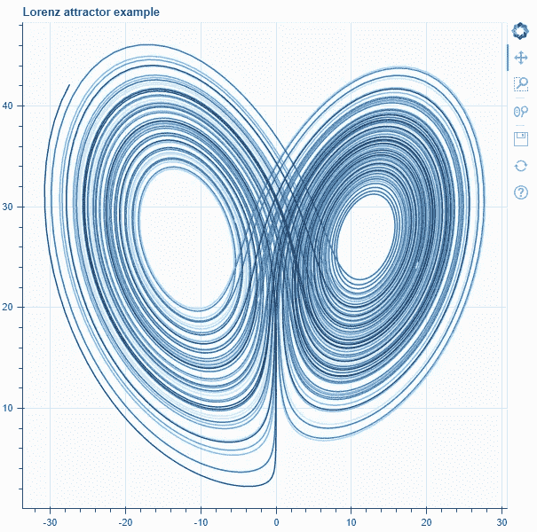
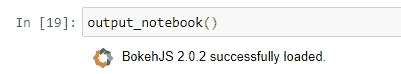
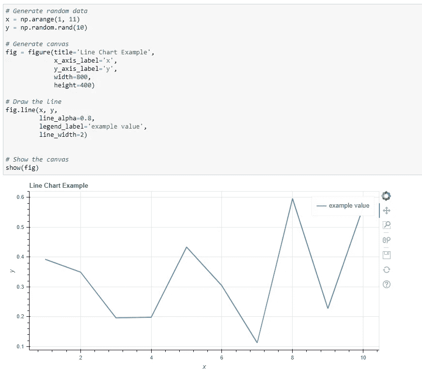
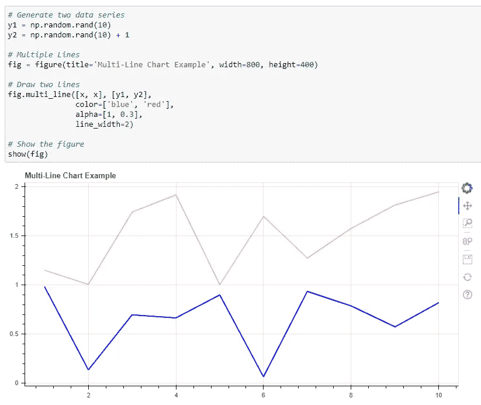
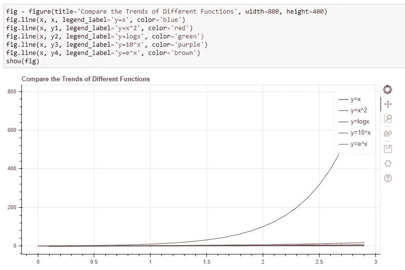
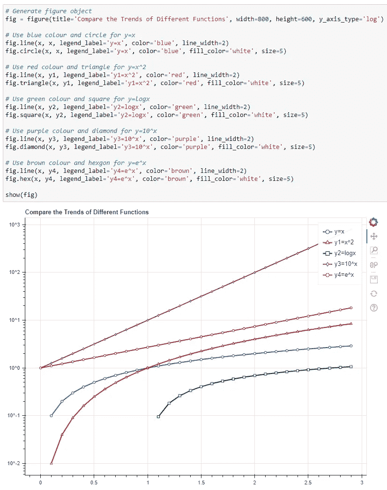
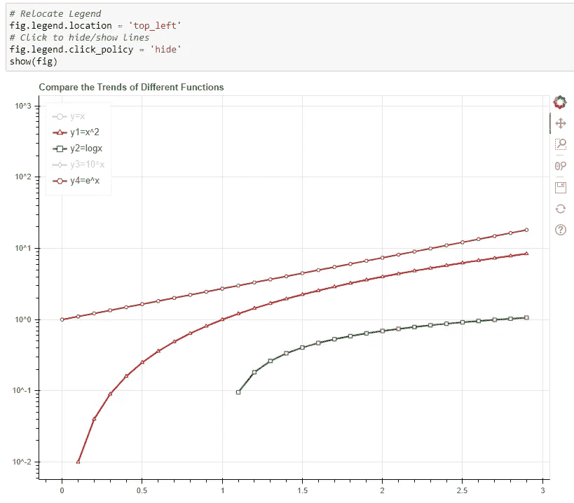
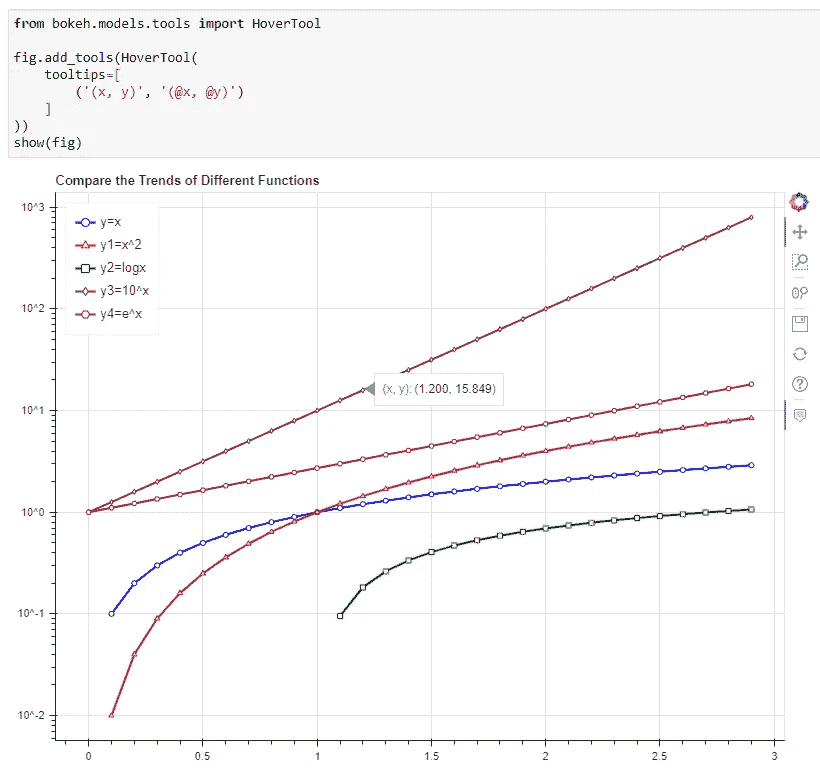
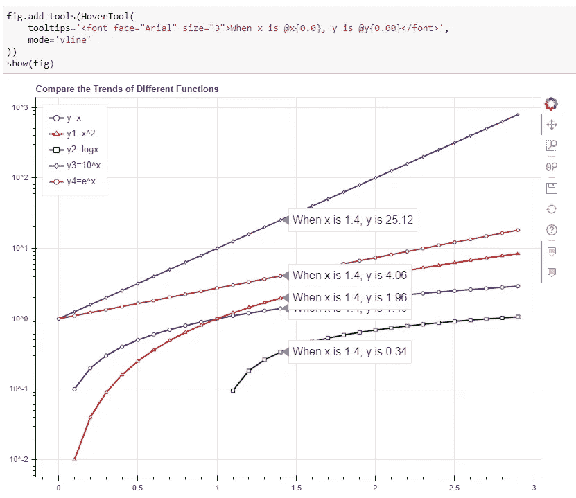
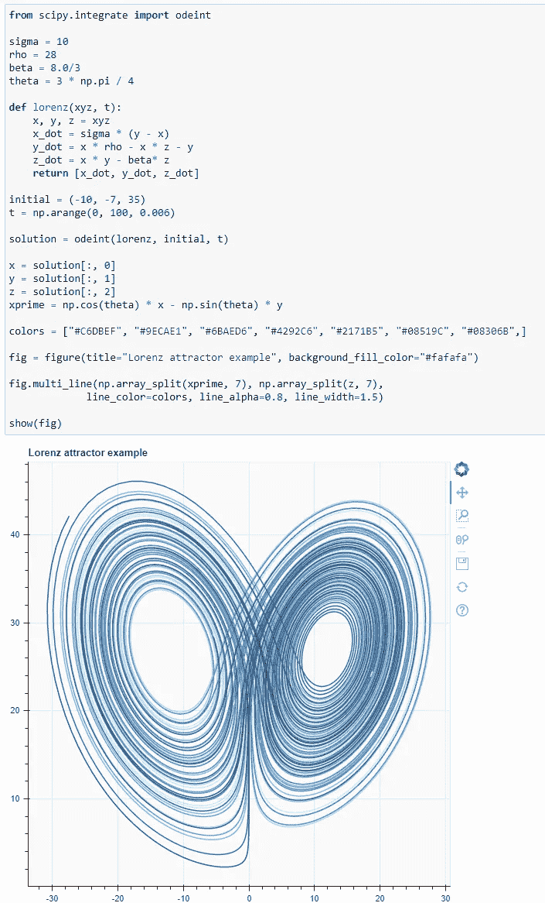

# 使用 Python 中的散景绘制漂亮的交互式折线图

> 原文：<https://towardsdatascience.com/draw-beautiful-and-interactive-line-charts-using-bokeh-in-python-9f3e11e0a16e?source=collection_archive---------24----------------------->



*作者使用散景拍摄的图片*

## 数据分析师/科学家必须了解的 Python 可视化库

折线图可能是展示两个维度之间关系的最基本但最有用的图表。通常用于连续显示变量`y`在时间轴`x`上的方差，其中 x 轴必须排序。

很容易从折线图中获得洞察力，如变量是增加、减少还是波动，以及获得其周期模式、峰值和尖峰。此外，我们可以在折线图上绘制多条线，以比较它们在同一时间窗口内的不同趋势，有时甚至可以了解它们如何相互影响。

在这篇文章中，我将演示如何使用 Bokeh，Python 中最流行的可视化库之一，来绘制一个漂亮的交互式折线图。

# 什么是散景？


[Benjamin Wong](https://unsplash.com/@ben_wong_31?utm_source=medium&utm_medium=referral) 在 [Unsplash](https://unsplash.com?utm_source=medium&utm_medium=referral) 上的照片

官网对散景的定义非常好，如下。

> Bokeh 是一个用于现代网络浏览器的交互式可视化库。它提供了优雅、简洁的通用图形结构，并在大型或流式数据集上提供了高性能的交互性。散景可以帮助任何人快速方便地制作交互式绘图、仪表盘和数据应用程序。

基本上，散景可以帮助我们在网页中生成可视化效果，可以用任何流行的浏览器查看。不过需要强调的是，它还支持 Jupyter 笔记本。因此，您不必每次都在浏览器上的单独选项卡中生成图表。它就像 Matplotlib 一样，可以把你笔记本上直接渲染的数据绘制出来。

# 安装和导入


照片由 K . I . I . A . N 拍摄📷 on [Unsplash](https://unsplash.com?utm_source=medium&utm_medium=referral)

安装散景非常容易。只需在命令行中运行`pip`就可以获得它。

```
pip install bokeh
```

大多数时候，我会如下导入散景，这只是将被利用的基本包。当然，当有一些定制的需求时，我们可能需要导入更多的功能。

```
from bokeh.plotting import figure, output_notebook, show
```

`figure`包是我们用来绘制数据的主要包。`show`包将在单独的网页中或者直接在笔记本上呈现图表。只有当我们想要在笔记本中渲染图表时，才需要`output_notebook`，所以在本教程中我们需要它。

一旦我们导入了`output_notebook`，我们只需要运行这个函数来启用“笔记本模式”。



现在我们应该开始了。

# 基本折线图


照片由 [Serghei Trofimov](https://unsplash.com/@sergeytrofimov?utm_source=medium&utm_medium=referral) 在 [Unsplash](https://unsplash.com?utm_source=medium&utm_medium=referral) 上拍摄

让我们从一些基本的开始。虽然 Matplotlib 也能很好地完成这项工作，但 Bokeh 让事情变得更直观，也更容易获得漂亮的效果。

首先，我们需要生成一些随机数据。

```
import numpy as np# Generate random data
x = np.arange(1, 11)
y = np.random.rand(10)
```

然后，初始化图形的“画布”。

```
# Generate canvas
fig = figure(title='Line Chart Example',
             x_axis_label='x',
             y_axis_label='y',
             width=800,
             height=400)
```

这里的`width`和`height`是实际像素，与 Matplotlib 不同。事实上，我喜欢使用这些像素，这对任何有一些 web 前端体验的人来说都更友好。

之后，让我们划清界限。

```
# Draw the line
fig.line(x, y, 
         line_alpha=0.8,
         legend_label='example value', 
         line_width=2)
```

如代码所示，我们可以使用`line_alpha`设置线条的透明度，设置图例标签以及线条宽度。

最后，我们需要调用`show(fig)`函数来渲染这个折线图。如果您正确运行了`output_notebook()`，图表应该绘制如下。



# 多行


萨姆·普林在 [Unsplash](https://unsplash.com?utm_source=medium&utm_medium=referral) 拍摄的照片

如果我们有多条线呢？散景提供了一个非常方便的功能`multi_line()`，可以一次绘制多条线。

我们可以继续使用`x`系列，但是生成两个不同的`y`系列。

```
# Generate two data series
y1 = np.random.rand(10)
y2 = np.random.rand(10) + 1
```

这里我只是在第二个`y2`数据上加 1，使其高于`y1`，没什么神奇的。

然后，让我们创建图形并绘制两条线。不要忘记“显示()”它。

```
# Multiple Lines
fig = figure(title='Multi-Line Chart Example', width=800, height=400)# Draw two lines
fig.multi_line([x, x], [y1, y2], 
               color=['blue', 'red'], 
               alpha=[1, 0.3], 
               line_width=2)# Show the figure
show(fig)
```



# 互动功能


[亚历山大·奈特](https://unsplash.com/@agkdesign?utm_source=medium&utm_medium=referral)在 [Unsplash](https://unsplash.com?utm_source=medium&utm_medium=referral) 上拍照

到目前为止，与 Matplotlib 相比没有太大的不同，除了散景更漂亮。但是等等，你有没有注意到图表右边有一个工具栏。默认工具包括

*   平移手势
*   框放大
*   鼠标滚轮放大/缩小
*   将图形保存为 PNG 图像
*   重置位置和缩放级别
*   帮助

生成图表时，可以启用更多支持的交互式功能。你可以参考官方文档来获得更多的细节，但是我相信这些默认工具对于大多数场景来说已经足够了。

# 高级定制


[JESHOOTS.COM](https://unsplash.com/@jeshoots?utm_source=medium&utm_medium=referral)在 [Unsplash](https://unsplash.com?utm_source=medium&utm_medium=referral) 上的照片

有时，出于某种原因，我们可能需要定制我们的折线图。在这一节中，我将提供一些例子。

比方说，我们想比较一些数学函数，以了解它们在 x 变大时的趋势。这些功能如下:

*   y=x
*   y=x
*   y=logx
*   y=10^x
*   y=e^x

让我们先生成数据。

```
# Generate functions and data
x = np.arange(0, 3, 0.1)
y1 = np.power(x, 2)
y2 = np.log(x)
y3 = np.power(10, x)
y4 = np.exp(x)
```

会有一些警告，因为 log0 是未定义的，但是不用担心，它将是 Numpy 数组中的一个`-inf`。此外，Bokeh 足够聪明，可以在渲染数据时忽略该值。

## y 轴刻度和数据点形状

现在，我们可以再次使用`multi_line()`函数来一次绘制所有的函数。但是，我想一个一个地做这件事，因为我认为把线和它们的配置分开会更清楚。当然，选择哪种方式取决于你。

```
fig = figure(title='Compare the Trends of Different Functions', width=800, height=400)
fig.line(x, x, legend_label='y=x', color='blue')
fig.line(x, y1, legend_label='y=x^2', color='red')
fig.line(x, y2, legend_label='y=logx', color='green')
fig.line(x, y3, legend_label='y=10^x', color='purple')
fig.line(x, y4, legend_label='y=e^x', color='brown')
show(fig)
```



嗯，它已经被正确地绘制出来了，但是它是不可用的。除了`y=10^x`这个功能，其他都挤在一起了。所以，用这个折线图，我们实际上不能比较趋势。

解决方法是修改 y 轴的比例。如果我们可以使 y 轴不是线性的，它应该能够更清楚地区分功能。通过将`y_axis_type`设置为`log`，散景可以非常容易地做到这一点。

```
# Generate figure object
fig = figure(title='Compare the Trends of Different Functions', width=800, height=600, y_axis_type='log')
```

还有一个问题。即使我们为这些功能使用了不同的颜色，仍然不容易区分它们。让我们也为不同函数的数据点添加不同的形状。

```
# Use blue colour and circle for y=x
fig.line(x, x, legend_label='y=x', color='blue', line_width=2)
fig.circle(x, x, legend_label='y=x', color='blue', fill_color='white', size=5)# Use red colour and triangle for y=x^2
fig.line(x, y1, legend_label='y1=x^2', color='red', line_width=2)
fig.triangle(x, y1, legend_label='y1=x^2', color='red', fill_color='white', size=5)# Use green colour and square for y=logx
fig.line(x, y2, legend_label='y2=logx', color='green', line_width=2)
fig.square(x, y2, legend_label='y2=logx', color='green', fill_color='white', size=5)# Use purple colour and diamond for y=10^x
fig.line(x, y3, legend_label='y3=10^x', color='purple', line_width=2)
fig.diamond(x, y3, legend_label='y3=10^x', color='purple', fill_color='white', size=5)# Use brown colour and hexgon for y=e^x
fig.line(x, y4, legend_label='y4=e^x', color='brown', line_width=2)
fig.hex(x, y4, legend_label='y4=e^x', color='brown', fill_color='white', size=5)
```



酷！现在，我们可以很容易地确定这些函数及其趋势。

## 图例位置和隐藏

这个图形现在看起来不错，但是如果我们能够将图例重新定位到左上角，那就更好了，因为那里什么也没有。此外，该图中仍然有太多的线条，我们可能希望隐藏其中的一些线条，以便我们可以一次只比较其中的几条。

是的，散景很容易做到这一点。实际上，我们甚至不需要再次生成那个数字。因为我们有了图形对象`fig`，我们可以直接修改它的属性来实现这些。

```
# Relocate Legend
fig.legend.location = 'top_left'
# Click to hide/show lines
fig.legend.click_policy = 'hide'
```



## 带工具提示悬停

现在，假设我们希望将鼠标悬停在这些线上以获取数据点的值。我们也可以在散景中轻松实现这一点。此外，我们不需要重新生成图形，因为我们可以向图形对象添加“工具提示”。

```
from bokeh.models.tools import HoverToolfig.add_tools(HoverTool(
    tooltips=[
        ('(x, y)', '([@x](http://twitter.com/x), [@y](http://twitter.com/y))')
    ]
))
```

我们需要导入`HoverTool`类，以便将其作为“工具”添加到 figure 对象中。请注意，散景使得自定义工具提示变得非常灵活。具体来说，我们可以将每行文本定义为一个元组。对于元组的第二个值，我们可以使用`@`符号来指代数据字段。在这个例子中，我只定义了一个元组。如果您用不同的格式和/或数据字段定义了多个元组，工具提示将显示它们。



## 用 HTML 模板定制工具提示

如果我们有更具体的要求呢？散景使得工具提示更加灵活，我们甚至可以使用 HTML 模板来定制工具提示。

```
fig.add_tools(HoverTool(
    tooltips='<font face="Arial" size="3">When x is [@x](http://twitter.com/x){0.0}, y is [@y](http://twitter.com/y){0.00}</font>',
    mode='vline'
))
```

请注意，我这次还加了`mode='vline'`。这将在相同的垂直 x 轴位置显示所有行的工具提示。因此，它将显示所有不同`y`的相同`x`的值，这样更便于比较。



# 洛伦兹吸引子

让我们用一个来自官方图库的花式折线图来完成这篇文章。散景确实很美。

```
from scipy.integrate import odeintsigma = 10
rho = 28
beta = 8.0/3
theta = 3 * np.pi / 4def lorenz(xyz, t):
    x, y, z = xyz
    x_dot = sigma * (y - x)
    y_dot = x * rho - x * z - y
    z_dot = x * y - beta* z
    return [x_dot, y_dot, z_dot]initial = (-10, -7, 35)
t = np.arange(0, 100, 0.006)solution = odeint(lorenz, initial, t)x = solution[:, 0]
y = solution[:, 1]
z = solution[:, 2]
xprime = np.cos(theta) * x - np.sin(theta) * ycolors = ["#C6DBEF", "#9ECAE1", "#6BAED6", "#4292C6", "#2171B5", "#08519C", "#08306B",]fig = figure(title="Lorenz attractor example", background_fill_color="#fafafa")fig.multi_line(np.array_split(xprime, 7), np.array_split(z, 7),
             line_color=colors, line_alpha=0.8, line_width=1.5)show(fig)
```



# 摘要


照片由[斯科特·格雷厄姆](https://unsplash.com/@sctgrhm?utm_source=medium&utm_medium=referral)在 [Unsplash](https://unsplash.com?utm_source=medium&utm_medium=referral) 上拍摄

在这篇文章中，我介绍了如何使用散景来绘制美丽的折线图。作为 Python 中最流行的可视化库之一，Bokeh 提供了许多开箱即用的可视化特性，如交互式工具集。当涉及到较低的水平，它也提供了非常灵活的功能，让我们自定义我们的数字。

[](https://medium.com/@qiuyujx/membership) [## 通过我的推荐链接加入 Medium 克里斯托弗·陶

### 作为一个媒体会员，你的会员费的一部分会给你阅读的作家，你可以完全接触到每一个故事…

medium.com](https://medium.com/@qiuyujx/membership) 

如果你觉得我的文章有帮助，请考虑加入 Medium 会员来支持我和成千上万的其他作者！(点击上面的链接)

# 参考

[1]散景最新文档，[https://docs.bokeh.org/en/latest/index.html](https://docs.bokeh.org/en/latest/index.html)

[2]散景画廊，洛伦兹吸引子，【https://docs.bokeh.org/en/latest/docs/gallery/lorenz.html 