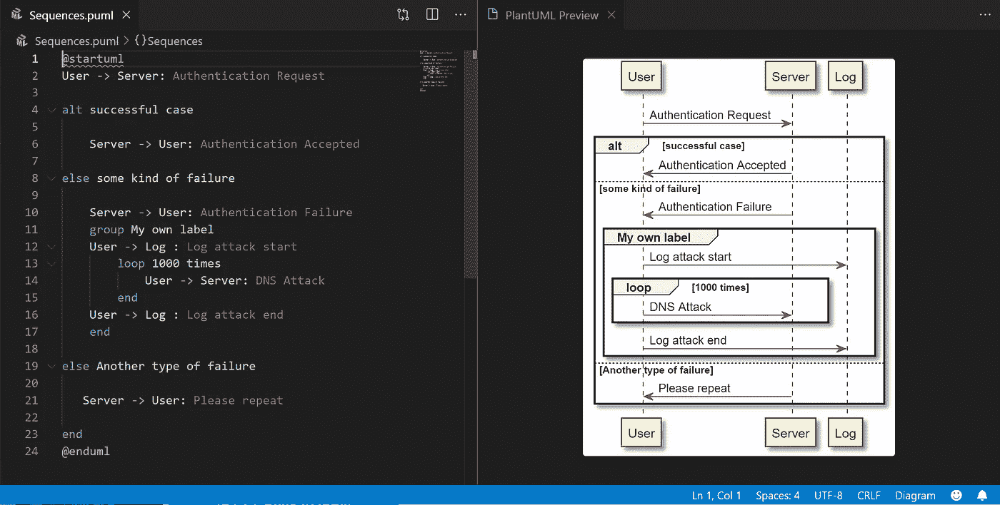
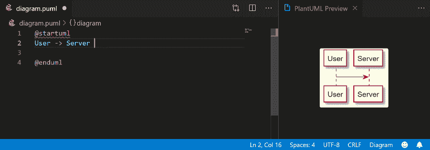
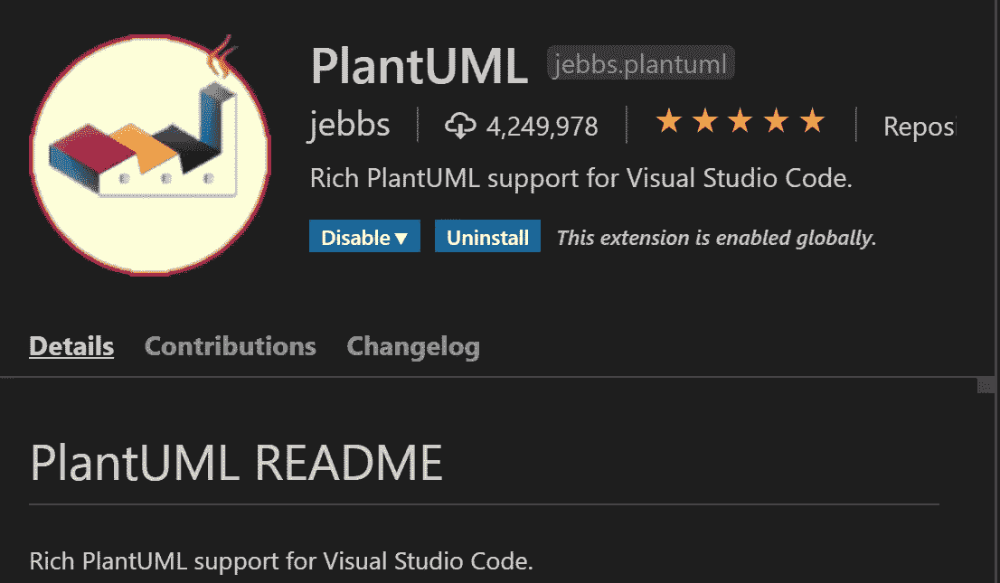
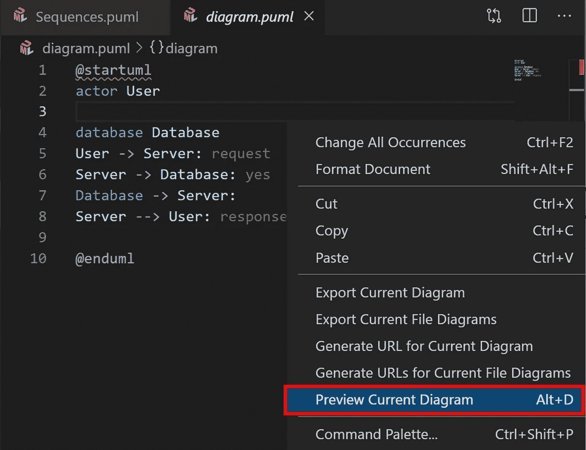
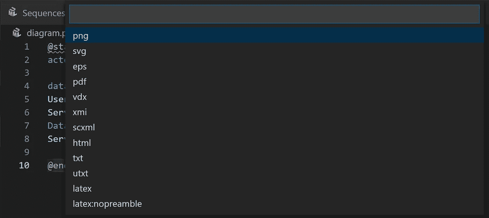

# 在 VS 代码中绘制 UML 图

> 原文：<https://towardsdatascience.com/drawing-a-uml-diagram-in-the-vs-code-53c2e67deffe?source=collection_archive---------4----------------------->

## 在 VS 代码中使用 PlantUML 扩展

**在 VSCode** 中编辑 PlantUML 序列图(作者)

在数据科学项目中，UML 图对于用组件图或类图说明问题领域的概念模型是非常重要的；或者展示你的机器和算法如何与序列图或活动图一起工作。你们中的一些人可能会定期在纸上画这个，或者使用一些软件，如 PWP 或 Adobe AI，如果你不是专家，这有时会让你头疼。

许多在线工具如 https://www.diagrams.net/的 T4 也允许你画图表，但有时会让你花很多时间去画一个复杂的图表。因此，这篇短文介绍了一种替代手工绘制的方法，展示了如何使用 plant UML([https://plantuml.com/](https://plantuml.com/))的纯文本(易于理解的脚本)来绘制图表。它是一个用于创建 UML 图的开源工具和语法。使用这个工具，您可以创建各种各样的 UML，从简单的流程图到复杂的图表。通过将 PlantUML 安装为 VS 代码扩展，您可以直接在 VS Code 软件中编辑它，如下面的 gif 动画示例所示。

**在 VSCode** 中创建一个简单的序列图(作者提供)

## 要求

*   安装 VS 代码
*   安装 PlantUML 扩展

**PlantUML 扩展**(作者截图自 VS 代码)

## 开始画你的第一张图

要开始绘制 UML 图，请检查来自[https://plantuml.com/](https://plantuml.com/)的语法文档。在主 PlantUML 主站点上有很多很好的语法例子，很容易理解。

在您了解 PlantUML 的语法之后，只需在 VS 代码中打开您的项目文件夹，并使用*创建一个文件。puml* 文件类型，并开始编写您的 uml 代码。您还可以通过右键单击 VS 代码脚本窗口并选择“预览当前图”或点击“Alt + D”来查看更新的实时变化(此选项在您编辑*时可用)。puml* 文件)。

**编辑 PlantUML 图时预览实时变化。**(作者)

## 导出您的图表

完成编辑后，您可以通过右键单击 VS 代码脚本窗口并选择“Export Current Diagram”来导出图表。然后会提示您选择所需的文件类型。如果你不确定选择哪一个，我建议你生成一个矢量文件类型。svg ，。 *eps* )总是给你最大的分辨率。

**导出 PlantUML 图。**(作者)

差不多就是这样！我希望您喜欢这篇文章，并且能够在您的数据科学或编程项目中应用这个 UML 工具。如果您有任何问题或意见，请随时告诉我。

我希望你喜欢它，并发现它对你的日常工作或项目有用。如果你有任何问题，请随时联系我。

关于我&查看我所有的博客内容:[链接](https://joets.medium.com/about-me-table-of-content-bc775e4f9dde)

**平安健康！**
**感谢阅读。👋😄**