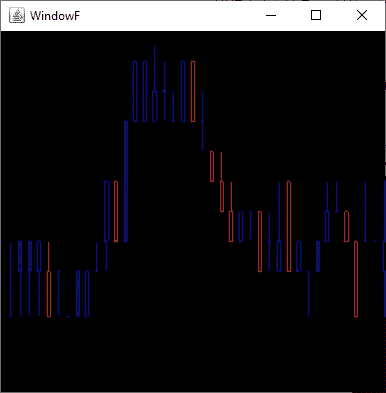

# 用 OpenGL 绘制金融股票行情图

> 原文：<https://towardsdatascience.com/drawing-financial-stock-market-charts-using-opengl-93254883bca7?source=collection_archive---------26----------------------->

## 利用 GPU 核心通过 GLSL 卸载 CPU


OpenGL 图表图像。来源:[维基共享资源](https://commons.wikimedia.org/wiki/File:Krita%27s_OpenGL_canvas_drawing_quality.png)。

# 介绍

我一直致力于将 OpenGL 作为显示图形的终极方式。在本文中，我将描述如何将数据从 CPU 转移到 GPU。虽然这是正常的方法，但我发现的所有信息都专注于提供与 3D 渲染过程直接相关的数据(位置、颜色、法线)，我花了很长时间来理解和定位关于如何将更高抽象数据移动到 GPU 的信息，比传统的 3D 模型点更远。在这种情况下，OpenGL 社区和可用的信息也没有多大帮助，因为大多数活跃在论坛中的人通常都参与 3D 引擎。

说白了，我正试图让 GPU 从与图形无关的数据中完成实际的图形模型，这似乎是一个不太常见的 OpenGL 任务。这可以认为是做纯渲染(OpenGL)和做纯计算(OpenCL)的中间步骤。我们正在将计算过程卸载到 GPU 中，但它仍然是与渲染相关的代码。

在我的例子中，我正在处理 2D 股票市场数据，我希望 GPU 负责处理所有的金融数据，以显示一切。对于那些不熟悉财务图表的人来说，举一个可能更容易理解的例子，假设您正在绘制一个有许多树的森林场景。您可能传递给 GPU 的信息包括树的位置、树的类型的整数(我们可能有不同类型的树要渲染)、树的高度和宽度。GPU 可以从这些简单的信息中为每棵树构建数百个图元。通过这样做，CPU 不需要将我们高度抽象的木材模型(位置、树的类型、宽度和高度)转换成可绘制的模型。性能的提升是巨大的，因为我们利用了 GPU 的大量内核。另一个好处是，我们还将图形部分从应用程序中分离出来，将所有的渲染和图形模型构建例程转移到 GLSL。

GPU 拥有强大的能力。由于我目前正在开发要求不那么高的 2D 应用程序，我已经使用旧的廉价 NVIDIA Quadro 卡在旧的 OpenGL 标准(3.3)中稳定了我的开发，这些卡在旧的交易工作站中很常见。我这样做是为了确保我的应用程序可以在遗留硬件中使用。我正在处理的卡有 16 个内核，这并不令人印象深刻，但现代卡现在有数百个内核(在撰写本文时，Nvidia GeForce RTX 2080 Ti 代表了 4352 个内核的最先进水平)。在一台经济实惠的电脑上搭载 4000 多枚内核简直太棒了。然而，与使用 CPU 在应用程序级别实现图形的传统方法相比，即使是普通的传统卡也能大大提高图形性能。作为一种权衡，编程 GLSL 并将图形卸载到 GPU 会使编程变得更加复杂:调试 GLSL 具有挑战性，有时甚至令人沮丧。

在这篇文章中，我将描述我遇到问题的地方，主要是因为我没有做非常传统的事情(比如将整数传递给顶点着色器)和理解步幅和偏移。我把注意力集中在令我烦恼的特定概念和代码部分。

# 顶点数据涉及任意数据

尽管顾名思义，你是在表示顶点(顺便提一下，这是最常见的用例)，但顶点只是你移入 GPU 的缓冲数据，特别是移入顶点着色器。这些数据可以包含绘制实际模型所需的任意信息。通常这将包括关于位置的某些信息，但是它可能意味着更高的抽象模型，其中位置由该抽象模型隐式地定义。

在我们的例子中，我们将制作一张简单的蜡烛图。因此，我们的输入数据将是:

```
open price, high price, low price, close price, volume, timestamp
```

除此之外，我们希望 GLSL 画出:



OpenGL 中绘制蜡烛的“hello world”

所以我们的顶点信息不包含传统意义上的 x/y 位置。并且它绝对不涉及图形元素(点/线/三角形)。我们只需将蜡烛信息移入 GPU，并让卡片完成所有绘图。通过这样做:

1.  应用程序现在更容易编码，因为它管理实际的现实生活数据(所有应用程序都应该尝试这样做)，绘制实际蜡烛的问题缩小到 GPU。
2.  性能的提升是巨大的，因为我们利用我们的 GPU 核心来执行构建图元时涉及的简单操作。
3.  我们已经在模型层和表示层之间做了最好的解耦——软件开发中的解耦是少数几个*几乎总是有意义的建议之一——*。

# GLSL 数据类型

与传统编程相比，使用 GLSL 编程 GPU 有一定的局限性。最后，我们正在处理为渲染而优化的小内核。GLSL 深受 C 语言的影响，所以它继承了一些 C 类型，但同时，它有特殊的类型用于处理多达 4 个元素的向量和矩阵。我仍然在研究可变大小的数组是否可以被移入 GPU，但目前我使用的是基本类型:

```
bool - boolean type (true/false)
float - 4 bytes
double - 8 bytes
int - 4 bytes signed integer
uint - 4 bytes unsigned integer
vec2 - 2 float vector (vec2.x, vec2.y)
vec3 - 3 float vector (vec3.x, vec3.y, vec3.z)
vec4 - 4 float vector (vec4.x, vec4.y, vec4.z, vec4.w)
ivec2 - 2 int vector (ivec2.x, ivec2.y)
ivec3 - 3 int vector (ivec3.x, ivec3.y, ivec3.z)
ivec4 - 4 int vector (ivec4.x, ivec4.y, ivec4.z, ivec4.w)
```

关于 GLSL 数据类型的全面而简明的指南可以在这里找到。

这意味着在我们的例子中，我们有 6 个整数值(我使用整数而不是双精度浮点数来表示价格，以保持精确值)，我们不能使用类似于`ivec6`的东西，因为它不存在。

我们的“Hello World”示例绘制了三根蜡烛

源代码(在 Java 中使用 JOGL，但在 C++中类似)创建了一个包含所有信息和三个 vbo(顶点缓冲对象)的数组。

这个数组将被用来为每个缓冲区提供数据。我们需要处理的信息是`stride`和`offset` ,这样 OpenGL 顶点着色器可以稍后定位数据。使用的具体`glVertexAttribPointers`有:

我们的“Hello World”示例定义了顶点属性，包括每个数据的步幅和偏移

注意我们是如何使用`glVertexAttribIPointer`而不是`glVertexAttribPointer`的，因为我们处理的是整数数据。出于某种原因，我没有能够传递负整数，即使使用了`GL_INT`而不是`GL_UNSIGNED_INT`。

Vertex 如何工作的一个很好的定义可以在这里[找到](https://www.khronos.org/opengl/wiki/Vertex_Specification)，它对我理解相关概念很有用。

# 顶点和几何体着色器

顶点着色器现在可以拾取全部数据:

顶点着色器代码

对于输入数据，位置布局属性定义了我们正在收集的具体属性，数字必须与`glVertexAttribIPointer`中使用的数字相匹配。该信息是使用变量`gs_ohlc`、`gs_volume`和`gs_timestamp`从几何着色器收集的。请注意顶点着色器中的输出变量名必须与几何着色器中的输入变量名相匹配。还要注意我们没有使用`gl_Position`,因为我们还没有处理任何位置，只是高级抽象数据。没有必要，您仍然可以将任意数据从顶点传递到几何着色器。

几何着色器收集高级数据并构建图元。它甚至根据蜡烛线是看涨还是看跌来给它们上色:

几何着色器代码

我们基于 OHLC 和时间戳数据构建原语(在本例中为 line_strips)。这个例子很粗糙，缺少绘制整个图表所需的所有额外细节。但是它说明了如何将抽象数据移入 GPU 来实现图形原语。

# 摘要

在本文中，我回顾了一些在 OpenGL 教程或文档中不常讨论的概念；不是因为它们没有被记录，而是因为它们不属于传递浮动顶点信息来执行 3D 渲染的最常见用例。

虽然代码并不完整，但对于那些已经在 OpenGL 中运行了第一个教程并希望更好地理解如何将数据移动到着色器的人来说，它是有用的。它也缺少绘制整个图表所需的其他方面，但它代表了令我感到麻烦的方面和 OpenGL 语法。

我仍在研究整个数据是否可以作为 6 个元素的数组传递，以包括可能的其他情况，我们可能希望将更大的数据块移动到 GPU。我还需要涵盖的东西，如滚动，缩放和缩放。GLSL 被证明是一个深思熟虑的从零开始学习的迷人话题。如前所述，我仍然有一些简单的问题，比如将负整数传入顶点着色器。这是一个明显的迹象，表明 GLSL 不像其他技术那样直观。事实上，大多数学习材料都集中在 3D 上，而我使用的是 Java JOGL(大多数材料使用 C++)，这也不利于这个过程。

GPU 的能力是惊人的，我也有动力在未来学习如何通过 OpenCL 或 CUDA 将这种能力用于一般计算。对于数据工程、回溯测试软件和 ML 等活动来说，这是一个非常好的选择。