# 在真实环境中使用 GauGAN 绘制故事的内心世界

> 原文：<https://towardsdatascience.com/drawing-the-inner-world-of-a-story-using-gaugan-in-a-real-environment-d8e303aaa2f9?source=collection_archive---------41----------------------->

## [*艾夫纳·佩莱德*](https://avner.js.org/) *和我正在分享*骨髓*发育阶段的经验教训。这篇文章着眼于我们如何在 360°环境中实时使用*[*GauGan*](https://blogs.nvidia.com/blog/2019/07/30/gaugan-ai-painting/)*。*

人工智能和交互式讲故事都是复杂和不可预测的系统。随着我们深入骨髓的设计过程，将这两个系统结合成一个连贯的体验的挑战变得明显。一方面，作为作者，我们开发了人工智能系统和实时交互来引导体验的流动。另一方面，我们希望讲述一个能激发参与者想象力和情感的故事。

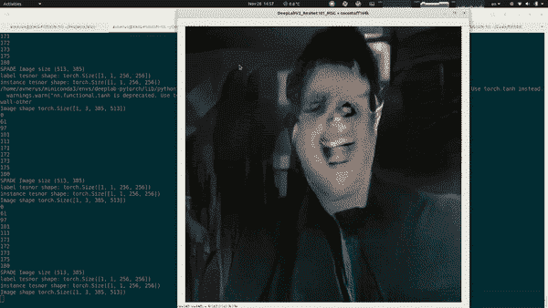

Avner Peled 在测试我们的 GauGan 系统时拍摄的截图；一瓶水换成了花

《骨髓》是一个关于机器学习模型中精神疾病可能性的故事，主要关注[生成性对抗网络](https://en.wikipedia.org/wiki/Generative_adversarial_network)(甘)。我们质疑在高级人工智能中会出现什么样的精神障碍，并邀请参与者在由甘操作的互动剧场场景中进行表演。他们一起扮演一个功能失调的人工智能家庭。由于我们正在处理非常抽象和复杂的概念，我们想探索多种方式来传达这个故事，而不仅仅是通过家庭成员之间的对话。我们的策略是让房间更加“生动”，反映出模特的精神状态。我们想消除参与者和环境之间的障碍；让他们慢慢沉浸在房间里不熟悉的魔法体验中。房间和晚餐的场景是一个邀请，让我们放手，沉迷于与其他三个陌生人的情感事件。

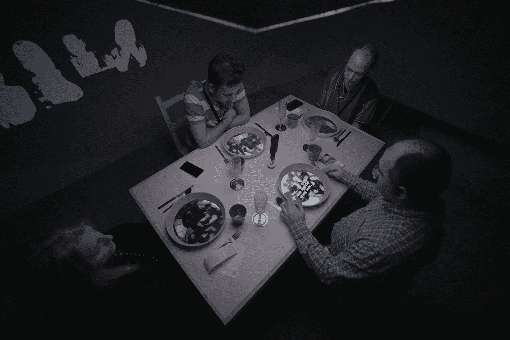

Andre Bendahan 在 NFB 实验室拍摄的照片 2020 版权所有

在实践中，这意味着我们必须实施经常与环境和参与者交互的 GAN 网络。由于 GAN 的训练过程不是实时发生的，这就变成了一个挑战，即操纵预训练 GAN 网络的输出以响应环境的实时变化。为了解释我们的解决方案，我们首先需要看看标准 GANs 和条件 GANs 之间的区别。

## **标准与有条件的 GANs**

在其基本形式中，GAN 被训练产生视觉上类似于训练集的新图像。如果我们使用人脸数据集，它会生成新的人脸。如果我们把它用在猫身上，它会产生新的猫。它可以通过采用输入“噪声”向量(本质上是一系列随机数)并使用它们作为输出图像的基础来保持可变性(不是每次都产生相同的图像)。因此，如果我们想要将 GAN 的输出与环境变化联系起来，我们需要根据这些变化来控制噪声矢量。然而，正如我们在[之前的文章](/a-tool-for-collaborating-over-gans-latent-space-b7ea92ad63d8)中所展示的，对于改变噪声向量会产生什么样的变化，几乎没有任何控制。

 [## 甘潜在空间的合作工具

### 2020 年 1 月，我们完成了骨髓的开发阶段。我和 Shirin Anlen 正在分享在…

towardsdatascience.com](/a-tool-for-collaborating-over-gans-latent-space-b7ea92ad63d8) 

我们可以将物理房间中的不同变量(如参与者的位置、物体的位置和参与者的情绪分析)与生成的输出联系起来，但缺乏对输出的精确控制导致了与环境的脆弱联系。

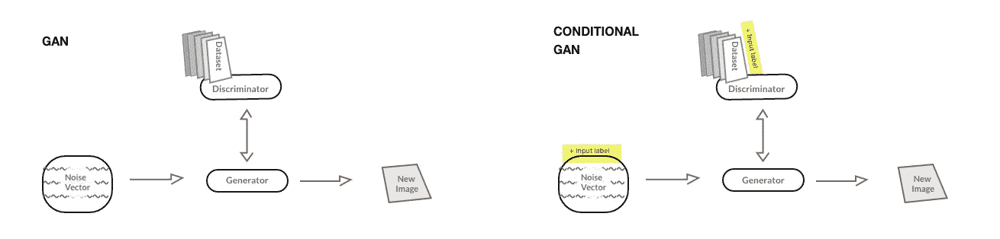

作者演示了标准 GAN 和条件 GAN 之间的差异

这就是*有条件的 GANs* 进入画面的地方。我们不是在一组图像上训练，而是在由一个图像和一个标签(数字输入)组成的*对*上训练网络，当呈现特定种类的标签时，该网络被调整为生成一种类型的图像。这使得用户可以完全控制 GAN 如何针对特定输入产生输出。与原始 GAN 一样，结果仍会随着噪声矢量的变化而变化。然而，现在作者可以创造与环境有意义的互动。最著名的条件 gan 之一是 [Pix2Pix](https://phillipi.github.io/pix2pix/) 。

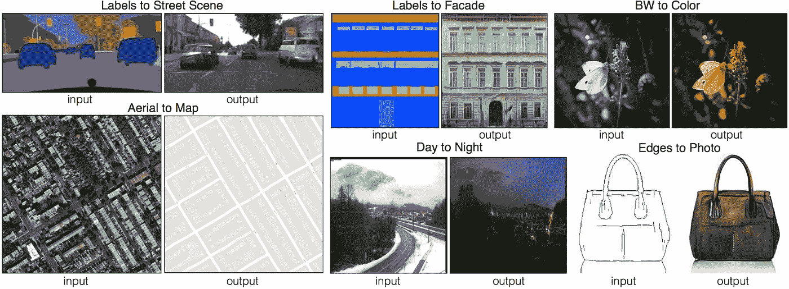

图片 f*rom*[*https://phillipi.github.io/pix2pix/*](https://phillipi.github.io/pix2pix/)

这是一个通用的图像到图像转换器。它可以根据任何类型的图像生成另一个图像。它分析两幅图像中的像素，学习如何从一种颜色转换到另一种颜色。Pix2Pix 的使用方式多种多样，比如将草图转化为画作，将色彩映射表转化为照片。我们还在我们的原型中使用它来将一个人的彩色姿势分析转换成一个从家庭照片中生成的人。

 [## 家庭 2 家庭:第一步

### 2018 年 11 月，我们呈现了《骨髓》的序幕:我一直在 IDFA 嫉妒别人的家庭…

沉浸.新闻](https://immerse.news/family2family-first-steps-5f085dc75666) 

## 高根

Pix2Pix 找到了自己的优势，作为一个从任何图像到任何图像的通用翻译器，它也有自己的弱点。仅仅依靠颜色会错过可以输入网络的元数据。该算法只查看形状和颜色。如果餐盘和飞碟在照片上看起来相似，它就无法区分它们。这就是 NVIDIA 的研究人员在创造 [*GauGAN*](https://arxiv.org/abs/1903.07291) *时所解决的问题。以后印象派画家保罗·高更的名字命名，GauGAN 也用彩色地图创作现实主义的图像。但是，它不是学习像素值，而是学习图像的*语义*数据。该项目也被称为 [SPADE](https://nvlabs.github.io/SPADE/) : *具有空间自适应归一化的语义图像合成*。GauGAN 学习哪里有草地和天空，而不是学习图片中绿色和蓝色的位置。*这是可能的，因为训练集中使用的图像，如通用数据库 [COCO-Stuff](https://github.com/nightrome/cocostuff) ，包含图片中不同元素的语义分类。然后，研究人员能够通过制作一种交互式绘画工具来展示 GauGAN 的能力，在这种工具中，颜色不仅仅是颜色，而且还有意义。当你在源草图上画绿色时，你是在告诉 GauGAN 这里有草。在这里自己试试。

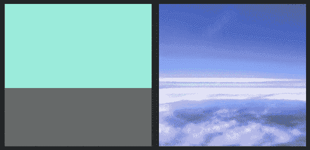

图片来自*[*https://www.nvidia.com/en-us/research/ai-playground/*](https://www.nvidia.com/en-us/research/ai-playground/)*

## ***将 GauGAN 连接到实时 360°环境***

*GauGAN 可以从手绘草图中生成真实感图像。我们的目标是让它与实时物理环境互动。解决这个问题就像拼拼图一样:*

1.  *我们知道 NVIDIA 对 GauGAN 进行了语义数据方面的培训:他们使用 [DeepLab v2 网络](https://github.com/kazuto1011/deeplab-pytorch)来分析 [COCO-Stuff](https://github.com/nightrome/cocostuff) 数据库并产生标签。*
2.  *我们知道 DeepLab V2 可以实时分割相机流。*
3.  *1+2:如果我们将 DeepLab 的相机流输出直接馈送给 GauGAN，我们应该会得到它的真实镜像状态。*

*代码本身相对简单，主要与两个网络之间的格式转换有关。我们还升级了 DeepLab 的网络摄像头代码，以从我们的 360°摄像头传输:[理光 THETA Z1](https://theta360.com/en/about/theta/z1.html) 。分割网络是如此强大，以至于我们可以将加宽的拼接图像直接馈送给分割和生成。结果出奇的准确。*

*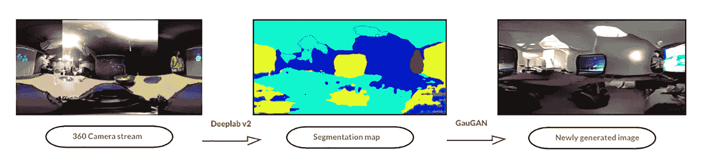*

*GauGAN 系统流程的作者插图*

## ***操纵甘的现实***

*我们现在有一个生成的镜像，描绘了甘(可可的东西)的版本，无论相机在房间里看到什么。但是我们想要更多；我们想要一个能根据故事变化的空间，并能模拟角色的精神状态。我们寻找产生与故事世界相联系的视觉效果的方法。为了找到单词之间的含义并吸引用户继续行动，四处移动物体，看到倒影，并想知道这是怎么回事。*

*我们意识到我们可以干预感知和生成的过程。就在 DeepLab 分析了相机流中的标签之后，为什么不用其他东西替换它们呢？例如，让我们将任何公认的碗映射到海洋。*

*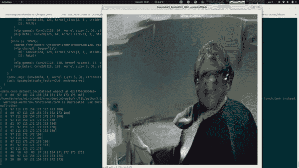*

*Avner Peled 在测试我们的 GauGan 系统时拍摄的截图；一个碗被替换为海洋纹理*

*我们开始寻找我们的角色的故事可以浮出水面的模式，以及物理空间可以支持整个视觉形式的模式:一张脸，一幅风景，一个物体，一朵花。故事是可识别的模式，在这些模式中，我们找到了意义。它们是噪音中的信号。*

*当我们最终到达实验室进行测试时，我们发现了物理环境的影响。我们通过排列(和重新排列)奇怪的元素和探索我们能达到的结果开始玩。我们开发了一个脚本平台，让我们可以轻松地将对象映射到其他对象。我们可以从场景中屏蔽某些对象，一次选择多个对象，或者反转选择来映射除指定对象之外的所有对象。例如:“餐桌”、“桌子”、“书桌”、“书桌用品”、“地板”、“床”、“汽车”——突然变成了同一个项目，并被映射成一片海洋，而其他所有东西都被丢弃了。虽然我们没有汽车，没有塑料，也没有床。或者“飞盘”、“纸”、“老鼠”、“金属”、“岩石”、“碗”、“酒杯”、“瓶子”——都映射到“岩石”。同样，有趣的是，我们在真实场景中没有鼠标、飞盘、金属、石头或纸张，但是网络检测到了它们。因此，我们也需要考虑它们。*

*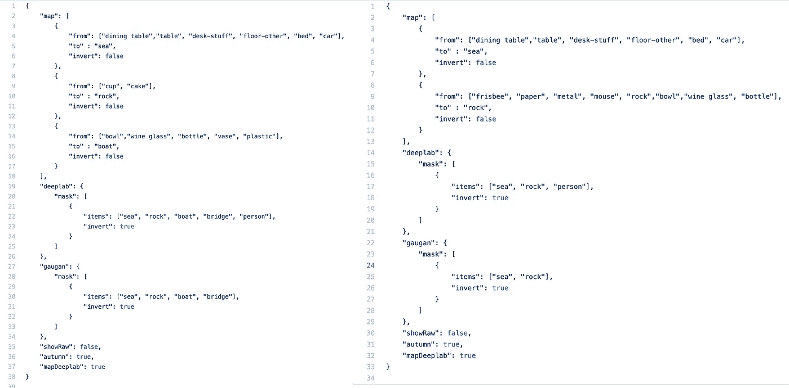*

*来自髓的 GitHub 的截图*

*如果这还不够，我们发现灯光、阴影和相机角度的变化每次都会产生不同的标签，这打乱了我们的贴图。在一个互动的讲故事框架中，这感觉既不可思议又可怕。在开幕之前，我们有不到十天的时间来完善空间和调试技术，同时了解我们刚刚开发的产品可以创造的各种可能性。*

*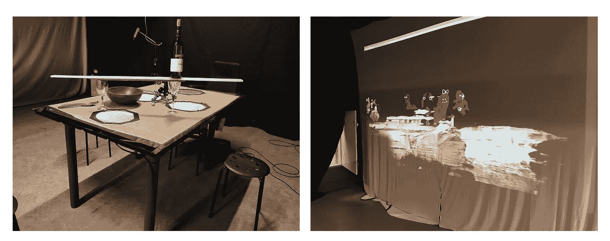*

*作者照片。第一个实验——左侧:我们如何排列物品。右侧:高根人是如何绘制和投射图像的。*

*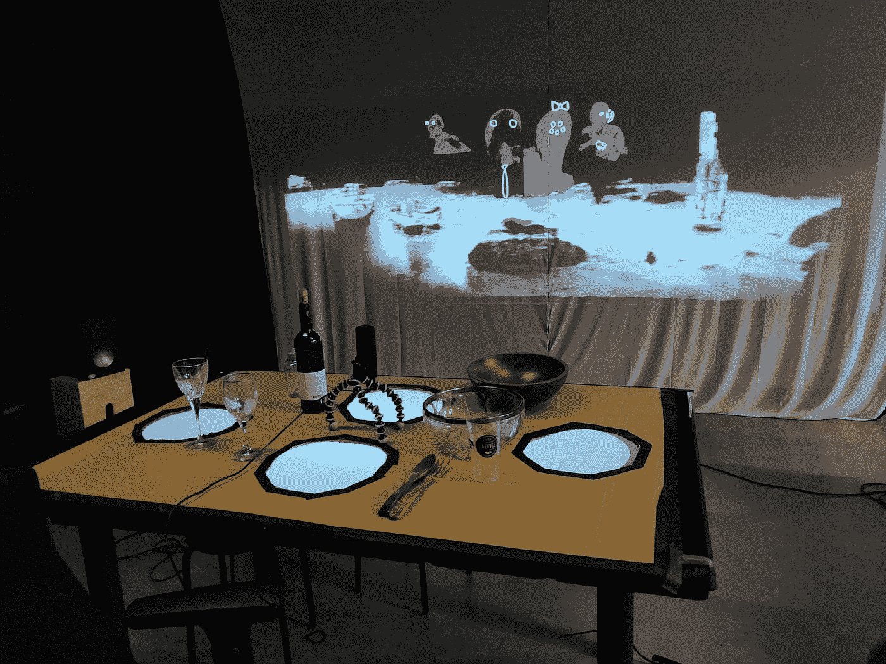*

*作者的照片展示了布景的原型:碗和瓶子变成了船，桌子变成了海洋。*

*我们和我们的网络一起玩，很少控制视觉效果，我们希望形象化我们角色的内心世界。*

*慢慢地，我们开始学习这个系统——什么可行，什么不可行，如何清理场景，如何稳定灯光。我们还决定投影这个过程的两个阶段，DeepLab 的彩色分段分析和 GAN 生成的输出。渐渐地，物理环境变得更加身临其境，可以与故事的文字联系起来。*

*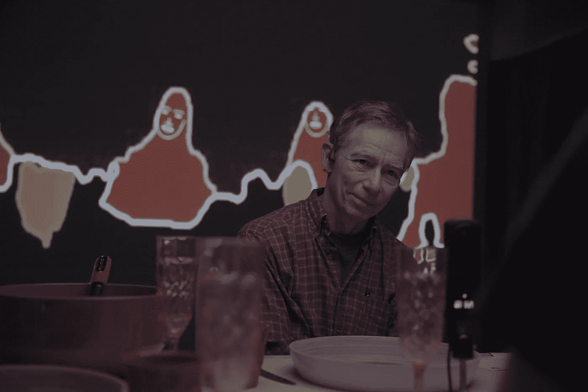*

*Andre Bendahan 在 NFB 实验室拍摄的照片 2020 版权所有*

## ***倒影***

*   *预训练的 SPADE/GauGan 网络的分辨率以较低的 256x256 分辨率生成图像。很难让人们参与到这种视觉中，并让他们理解他们所看到的。实现更高的分辨率需要我们在培训中投入更多的资源，这在当时是不可能的。*
*   *因为 GauGAN 具有语义意识，所以图像的上下文非常重要。例如，将一张桌子映射到大海，而将混凝土墙留在背景中，会生成一个昏暗的湖泊或池塘。但是把墙映射成蓝天，现在海看起来更像海洋了。*
*   *由于这种上下文感知，也很难用孤立的对象来传达意思。当我们完整地展示这些图像时，它们通常看起来是最好的。*

*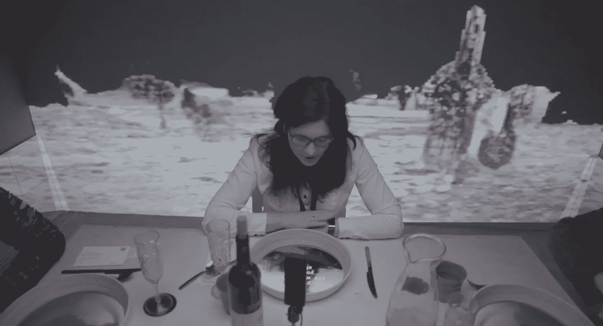*

*Andre Bendahan 在 NFB 实验室拍摄的照片 2020 版权所有*

*虽然我们仍然觉得围绕我们的故事还有很多实验和润色的空间，但这些结果让我们第一次看到了甘的“意识”，作为一个产生其内心世界的感知实体。这样的过程与人类意识的哲学产生共鸣。*

*伊曼纽尔·康德的[先验哲学](https://plato.stanford.edu/entries/kant-mind/#3.2)谈到了*综合的行为:*我们的表象一起行动，塑造一个统一的意识。在现代神经科学中，我们谈到了意识的[神经关联](https://en.wikipedia.org/wiki/Neural_correlates_of_consciousness)，它描述了意识所需的神经活动，不是作为物体识别的离散前馈机制，而是统一体验的长期持续反馈波。这也是我们希望在髓室设计的体验类型，最终的“编辑”发生在参与者的头脑中。*

*有一件事我们确信不会给这项创造性的工作带来伤害——那就是让更多的人使用它。除非你做了很多次，否则你不会知道你在做什么，尤其是在这种复杂的项目中。只是制造制造制造。*

***这里是项目的** [**开源 GitHub 库**](https://github.com/Marrow-AI/gan-deeplab-spade?fbclid=IwAR2yixniZbSSwbZY97zadd7wlMZ85OaEMFFpRMJn0AiiKpfQtTEqSHPmxcY) **。**请和我们分享你的制作和想法！*

> **开发阶段由音效师菲利普·兰伯特* *和动画师帕洛玛·道金斯* *合作完成。合拍中的* [*NFB 互动*](https://www.nfb.ca/interactive/marrow/)*[*图集五*](https://atlasv.io/ive-always-been)**