# 从头开始绘制变压器网络(第 1 部分)

> 原文：<https://towardsdatascience.com/drawing-the-transformer-network-from-scratch-part-1-9269ed9a2c5e?source=collection_archive---------14----------------------->

## 以有趣的方式获得变形金刚的心智模型

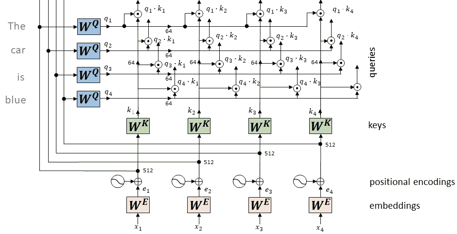

(图片由作者提供)

变形金刚神经网络——通常被称为“变形金刚”——是由谷歌领导的团队在 2017 年发表的一篇题为“注意力是你所需要的一切”的论文中介绍的。在接下来的工作中被很多人提炼推广。

像在它之前发明的许多模型一样，变压器有一个编码器-解码器架构。在这篇文章中，我们把重点放在编码器部分。我们将以自下而上的方式连续绘制它的所有部分。这样做有望让读者轻松地开发出变压器的“心智模型”。

下面的动画以快动作展示了我们将在本文中涉及的内容:

(图片由作者提供)

# 投入

转换器将单词序列作为输入，作为向量呈现给网络。在 NLP 任务中，通常使用一个词汇表(也称为字典)，其中每个单词被分配一个唯一的索引。该索引可以被表示为所谓的独热向量，其主要由 0 组成，在正确的位置具有单个“1”值。下图显示了一个简单的十个单词的词汇编码:

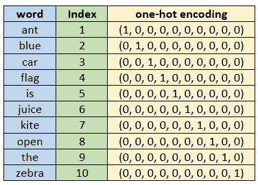

请注意，独热编码向量的大小与词汇表中的字数相同，在实际应用中至少为 10.000。此外，所有独热编码彼此之间具有相同的欧几里德距离√2。

# 单词嵌入

接下来，我们通过将独热编码向量乘以所谓的“嵌入矩阵”来降低它们的维数。由此产生的向量被称为单词嵌入。原始论文中单词嵌入的大小是 512。

单词嵌入的巨大好处是意思相似的单词被放在一起，例如单词“cat”和“kitty”最终具有相似的嵌入向量。

请注意，“嵌入矩阵”是一个普通的矩阵，只是有一个花哨的名字。

# 位置编码

所有的单词同时呈现给变压器。这与递归神经网络(例如 LSTMs)有很大的不同，在 lst ms 中，单词是连续输入的。然而，这意味着单词在输入序列中出现的顺序丢失了。为了解决这个问题，转换器向每个输入嵌入添加一个向量，从而注入一些关于相对或绝对位置的信息。

# 键和查询

最后，我们将单词嵌入乘以矩阵 WQ 和 WK，以获得“查询向量”和“关键向量”，每个向量的大小为 64。

到目前为止提到的所有组件都绘制在下面的动画中:

输入序列、单词嵌入、位置编码、键和查询(作者图片)

请注意，我们绘制单个元素的顺序与计算元素的顺序无关。

# 并行化

在我们继续之前，有一点需要强调，那就是 Transformer 适合并行化的方式。请注意，所有的单词嵌入都可以并行计算。一旦我们得到了嵌入，我们还可以同时计算所有嵌入的查询向量和关键向量。这种模式将贯穿整个架构。请注意。

# 点积

我们计算“查询向量”和“关键向量”的所有可能组合的点积。点积的结果是一个单一的数字，在后面的步骤中将用作权重因子。权重因子告诉我们，在输入句子的不同位置的两个单词相互依赖的程度。这在原论文里叫自我关注。自我关注的机制允许变压器学习困难的依赖性，即使在遥远的位置之间。

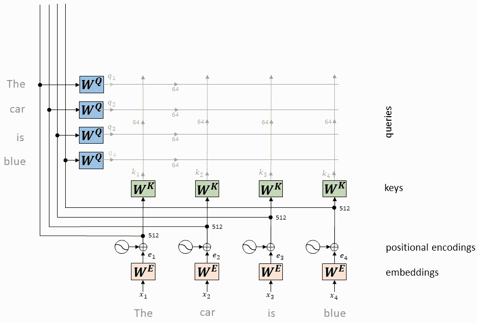

“查询向量”和“关键向量”的点积(图片由作者提供)

# 缩放比例

随后，所有权重因子除以 8(关键向量 64 的维数的平方根)。作者假设在训练期间，点积的大小可以变大，从而将 softmax 函数推到梯度极小的区域。除以 8 会产生更稳定的梯度。

# Softmax

缩放后的因子通过 softmax 函数进行归一化，因此它们都是正的，总和为 1。

在下面的动画中，我们对句子中第一个单词“the”的权重因子进行了缩放。请记住，属于第一个词的权重因子是点积:q1*k1，q1*k2，q1*k3，q1*k4。

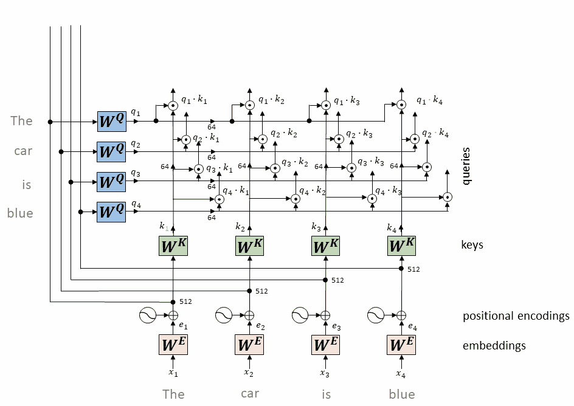

属于第一个单词“the”的权重因子的缩放和 softmax(图片由作者提供)

类似地，对于输入序列中的其他单词“car”、“is”和“blue ”,我们得到:

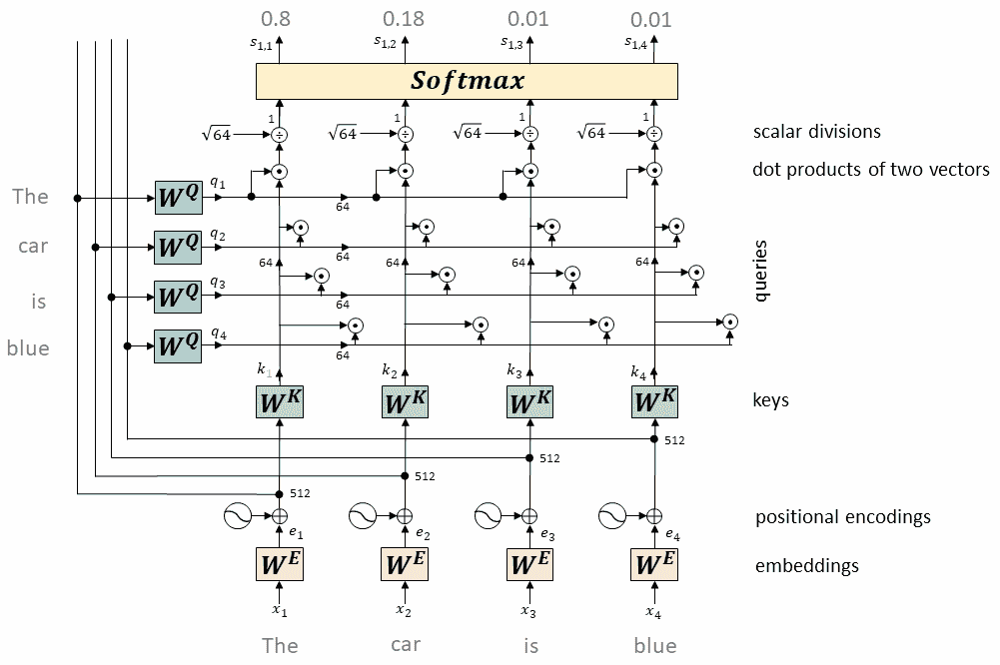

属于剩余单词“汽车”、“是”和“蓝色”的权重的缩放和 softmax(图片由作者提供)

这就完成了权重因子的计算。

# 价值观念

与“关键向量”和“查询向量”的计算相同，我们通过将单词嵌入乘以矩阵 WV 来获得“值向量”。值向量的大小也是 64。

# 额外的

现在，我们将每个“价值向量”乘以其对应的“权重因子”。如前所述，这样我们只保留我们想要关注的单词，而不相关的单词通过用像 0.001 这样的小数字加权来抑制

# 总和

现在我们将属于一个单词的所有加权“值向量”相加。这就在这个位置产生了自我关注层的输出。

在下一个动画中，我们将描述“值向量”的计算以及随后对输入序列中的第一个单词进行的加权和求和。

第一个单词“the”的值、权重和总和(图片由作者提供)

类似地，对于我们输入序列中的其他单词“汽车”、“是”、“蓝色”，我们得到:

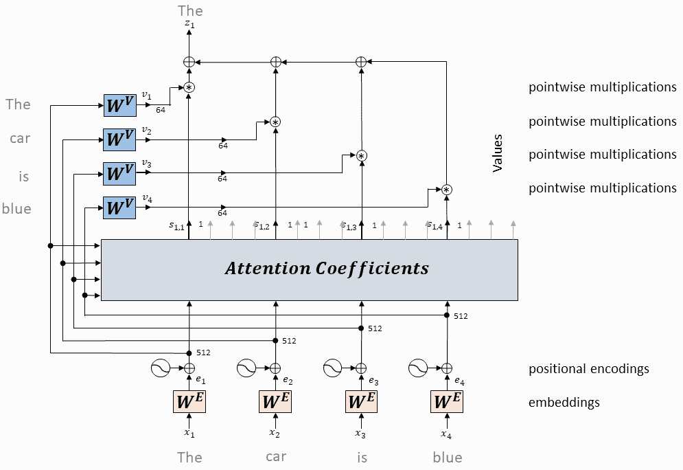

剩余单词“汽车”、“是”和“蓝色”的值、权重和总和(图片由作者提供)

自我关注的计算到此结束。自我关注层的输出可以被认为是上下文丰富的单词嵌入。根据上下文，一个词可能有不同的含义:

*   我喜欢清爽的秋天天气。
*   不要在去电车的路上**摔倒**。

请注意，底部的嵌入矩阵只对单个单词进行操作。因此，对于两个句子，我们会错误地获得相同的嵌入向量。自我关注层考虑到了这一点。

# 较短的句子

输入序列的长度应该是固定的，基本上是训练数据集中最长句子的长度。因此，参数定义了转换器可以接受的序列的最大长度。长度更长的序列会被截断。较短的序列用零填充。然而，填充词不应该有助于自我注意的计算。这可以通过在自我关注计算中的 softmax 步骤之前屏蔽相应的单词(将它们设置为-inf)来避免。这实际上将它们的权重因子设置为零。

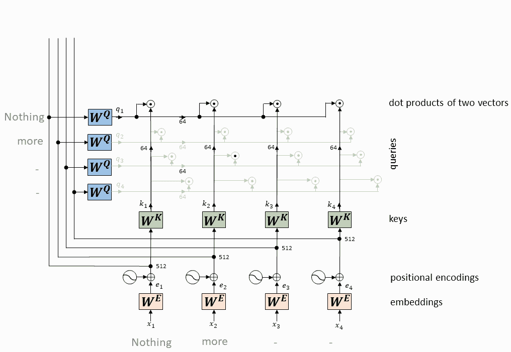

遮蔽未使用的位置(作者图片)

# 多头自我关注

不是执行单一的自我注意功能，作者使用了多个自我注意头，每个都有不同的权重矩阵。多头注意力允许模型在不同位置共同注意来自不同表征子空间的信息。原论文中的变压器使用了八个平行的注意头。注意头的输出被连接并再次乘以附加的权重矩阵 WO。

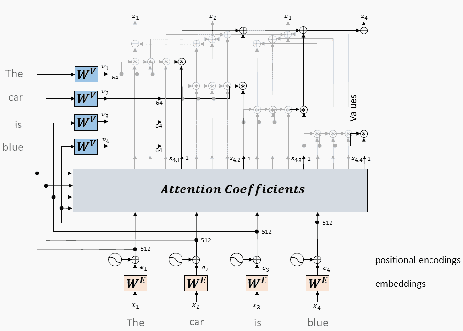

多头自我关注用 3 个头，原创论文用 8 个头(图片由作者提供)

# 添加并正常化

刚刚讲到的多头自关注机制是编码器的第一个子模块。它周围有一个剩余连接，然后是图层规范化步骤。图层标准化只是减去每个矢量的平均值，然后除以其标准偏差。

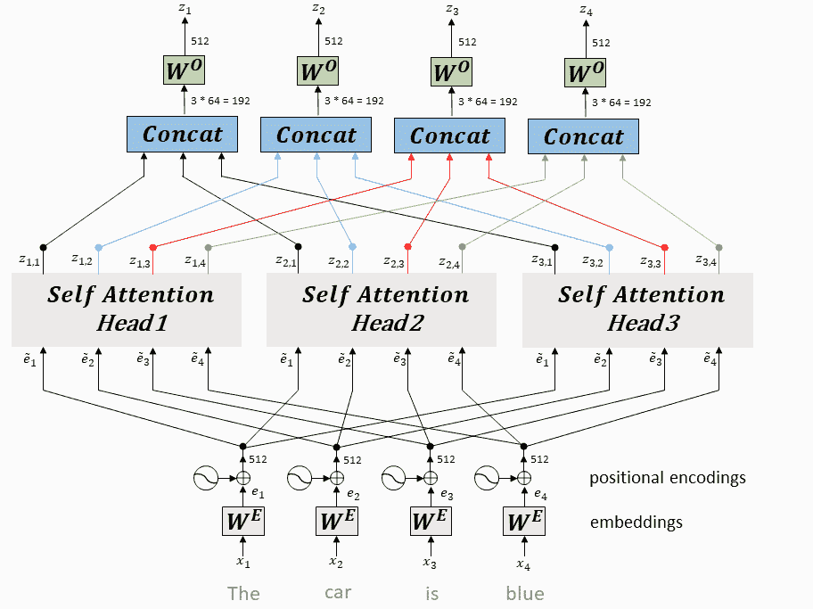

剩余连接，图层归一化(作者提供的图片)

# 正向输送

自我关注层的输出被馈送到完全连接的前馈网络。这由两个线性转换组成，中间有一个 ReLU 激活。输入和输出的维数是 512，内层的维数是 2048。完全相同的前馈网络独立地应用于每个位置，即输入序列中的每个单词。

接下来，我们再次在完全连接的前馈层周围采用剩余连接，然后进行层归一化。

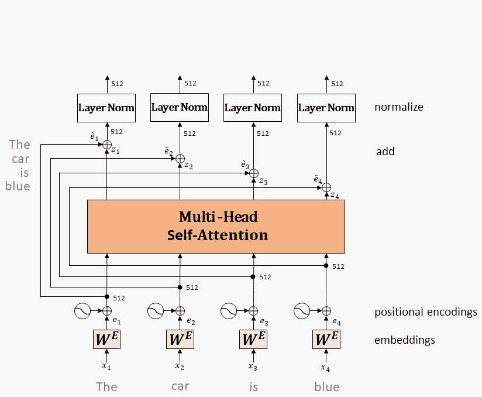

完全连接的前馈网络、剩余连接、层归一化(图片由作者提供)

# 编码器堆栈

整个编码组件是六个编码器的堆栈。这些编码器在结构上都是一样的，但它们不共享重量。

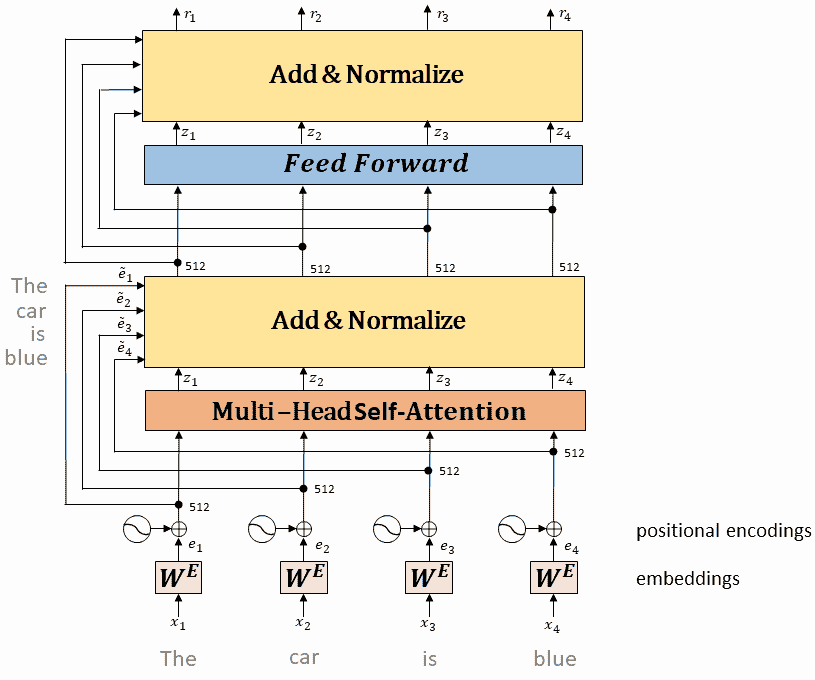

六个编码器的堆栈(图片由作者提供)

在下一篇文章中，我们将讨论变压器的解码器部分。这应该是非常直接的，因为大多数需要的概念已经在这篇文章中介绍过了。

# 参考

[原创论文](https://arxiv.org/pdf/1706.03762.pdf)
[图文并茂的变形金刚](http://jalammar.github.io/illustrated-transformer/)
[变形金刚解说](/transformers-explained-65454c0f3fa7)
[忙于文字嵌入](https://www.r-craft.org/r-news/get-busy-with-word-embeddings-an-introduction/)