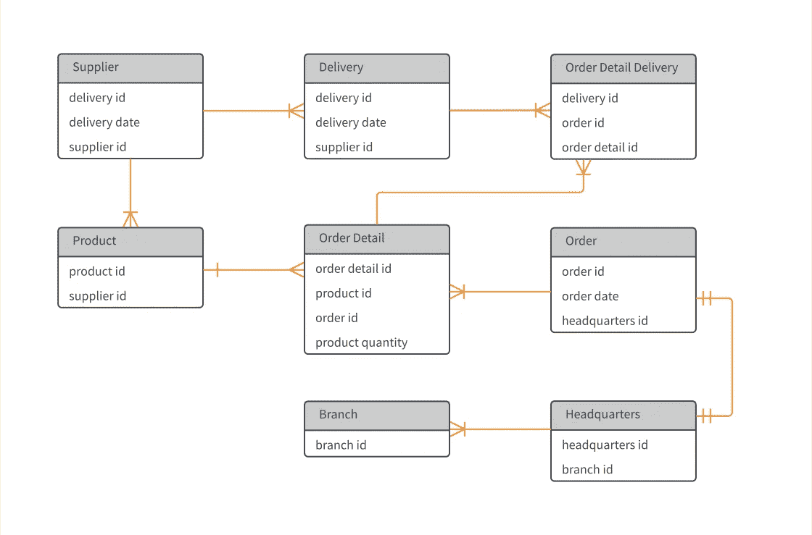
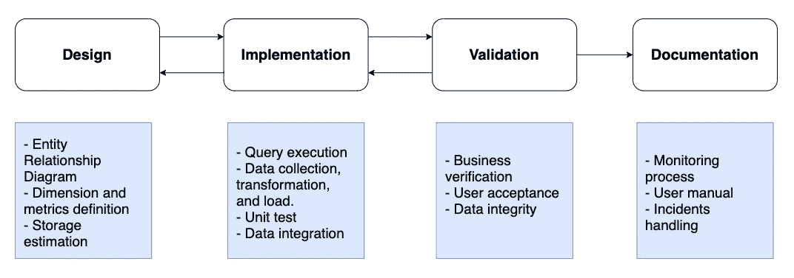
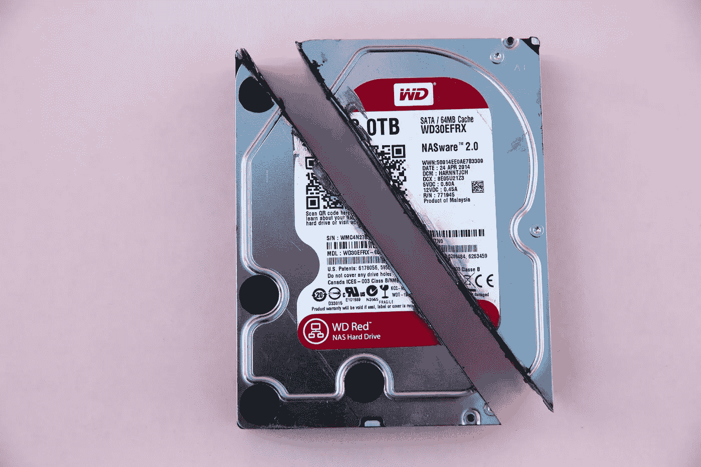
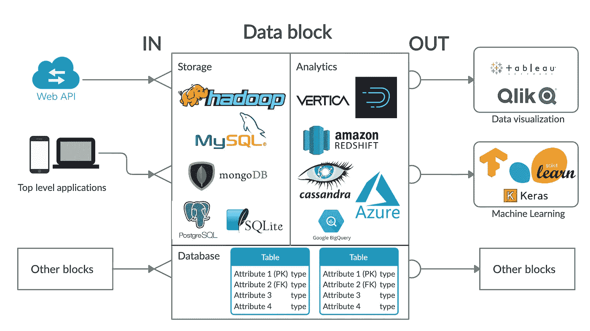

# 梦想成为大数据工程师？发现我们与软件工程师的不同之处

> 原文：<https://towardsdatascience.com/dream-of-becoming-a-big-data-engineer-discover-what-sets-us-apart-from-software-engineers-603c7f8c2c29?source=collection_archive---------19----------------------->

## 我们做的不是同一件事


照片由[詹姆斯·庞德](https://unsplash.com/@jamesponddotco?utm_source=unsplash&utm_medium=referral&utm_content=creditCopyText)在 [Unsplash](/?utm_source=unsplash&utm_medium=referral&utm_content=creditCopyText) 拍摄

工程是所有公司的基本要素。没有它，公司就无法创造、维护和升级他们的产品。技术企业依靠他们的工程部门在竞争激烈的世界中生存。

即便如此，并不是所有的工程师都执行相同的任务。在重技术型公司中，软件工程师是最关键的资源之一。他们构建程序，创建软件，并维护系统的功能。许多其他职业道路与软件工程不同。他们专攻某一特定学科。

在数据领域，企业面临着数据量的巨大增长。我们需要有人站出来承担管理这些数据的责任。这开启了[大数据工程师](https://www.edureka.co/blog/big-data-engineer-skills/)的曙光。大数据工程师可以从数据库管理员、数据架构师或数据分析师发展而来。

[](/a-day-in-the-life-of-a-big-data-engineer-a286e4a5ae29) [## 大数据工程师的一天

### 为巴黎的一家广告技术巨头工作

towardsdatascience.com](/a-day-in-the-life-of-a-big-data-engineer-a286e4a5ae29) 

大数据工程师和软件工程师的技能不同。尽管如此，许多公司倾向于将它们视为相同的实体。他们误用了[工作描述](https://www.toptal.com/big-data/job-description)中的术语。此外，他们在技术面试中会做出错误的假设。

在大多数情况下，软件工程师处理大数据工程师的工作。因此，他的职责变得复杂、模糊和多种多样。

作为一名大数据工程师，我强烈渴望巩固我们在公司层级中的地位。人们不得不把我们的职业视为一条与众不同的职业道路。要做到这一点，我们首先要定义我们是谁，以及我们与其他工程师有何不同。作为一个经常从事软件工作的人，我想指出我们与软件工程师不同的地方。

# 建模数据集

当需要数据的时候，就需要[数据建模](https://www.guru99.com/data-modelling-conceptual-logical.html)。这是我们定义表关系、命名列和测试查询的地方。

任何软件工程师都可以用少量的表创建一个数据库。大数据工程师可以管理数百个相互链接的表。解决各种问题需要一定的专业知识。我们如何连接表？这些栏目将采用什么格式？我们应该复制多少数据？


[万花筒](https://unsplash.com/@kaleidico?utm_source=unsplash&utm_medium=referral&utm_content=creditCopyText)在 [Unsplash](/@kaleidico?utm_source=unsplash&utm_medium=referral&utm_content=creditCopyText) 上拍摄的照片

一切都来自经验，数据建模也是如此。大数据工程师需要在构建数据集之前采取预防措施。一个错误就可能导致严重的性能问题或冗余数据存储。

大数据工程师不时处理数据建模请求。一个请求可以是简单的添加一列，也可以是复杂的为整个管道创建一个数据库。无论哪种情况，大数据工程师都需要首先[评估变更](https://www.credera.com/blog/technology-solutions/data-modeling-explained-in-10-minutes-or-less)对当前系统的影响。然后，他提出了一些优化来减轻这种影响。另一位熟练的大数据工程师将密切关注这一点，以[保持一切符合标准](https://www.alibabacloud.com/blog/a-comparison-of-data-modeling-methods-for-big-data_593761)。



数据建模中使用的 ERD-实体关系图的示例。来源: [Lucidchart](https://www.lucidchart.com/pages/templates/er-diagram/entity-relationship-diagram-template)

典型的数据建模过程始于设计阶段。大数据工程师收集所有业务和技术规范。这些因素包括可用收入、预期结果和一些限制因素。后续数据的一些草图将会派上用场。它可以向涉众展示我们将如何从源中检索数据，并组合它们以获得结果。

接下来是实施阶段。大数据工程师执行大量查询来验证其设计的可行性。我们会在合理的执行时间内完成查询吗？结果会包含想要的结果吗？一个严格、彻底和全面的设计阶段导致一个简单的实现。

如果现实与他的设计不符，大数据工程师会后退一步，审查他的解决方案。前前后后的评测需要几次迭代，直到正式发布。



典型的数据建模过程。作者署名

此阶段的成功允许大数据工程师进入[验证阶段](https://tdwi.org/articles/2016/02/19/six-validation-techniques-data-quality.aspx)。这是数据集建模的关键步骤。利益相关者一起评估他的模型产生的数据的完整性。

该值必须与系统的其余部分一致。命名约定应该遵循内部标准，以避免混淆。数据结构应该是全面的。验证阶段需要对业务需求和技术用途有深刻的理解。

数据建模过程的其余部分包括文档、监控和维护。大数据工程师构建持久的数据系统，因此他应该照顾好自己的遗产。他的初衷对他的继任者来说一定非常清楚。他通过文档、操作说明和适当定义的监控指标进行交流。他渴望他的数据模型能够经受住许多系统性的变化。

```
***Key takeaways:***- To become a big data engineer, you need to know how to create databases first.
- Data modeling is a continuous process with many iterations
- A big data engineer must comprehend how his data interacts.
```

# 大数据执行编程

大数据执行由许多操作组成。这些包括数据操作，如 ETL——提取、转换和加载。如今，有许多工具可以自动化这些操作。剩下的就是编写指令了。

写大数据执行没什么复杂的。关键概念在于使用流行框架的能力。

[Apache Hadoop](https://hadoop.apache.org/) 生态系统是首个成为行业主流的大数据框架。它的作业调度系统由 MapReduce 操作和一个资源协商器— [YARN](https://blog.cloudera.com/yarn-capacity-scheduler/) 组成。Hadoop 生态系统为我们提供了一个最小的 UI。它跟踪作业进度以及所使用的每个节点的系统日志。

[](/explain-hadoop-mapreduce-to-a-six-year-old-d338937c7f4b) [## 向六岁小孩解释 Hadoop MapReduce

### 好奇的头脑永远不知道自己的极限

towardsdatascience.com](/explain-hadoop-mapreduce-to-a-six-year-old-d338937c7f4b) 

另一个基于 MapReduce 作业操作的流行框架是 Apache Spark。由于其稀疏性和灵活性，它在大数据公司中越来越受欢迎。Spark 架构由一个主节点和几个工作节点组成。 [RDD](https://intellipaat.com/blog/tutorial/spark-tutorial/programming-with-rdds/) 或弹性分布式数据集是与原点的核心区别。

编写大数据执行属于大数据工程师的日常活动。构建新的数据集、构建新的数据管道或处理来自源的数据。在完成对执行的编程后，他会将作业提交给数据调度程序。

数据调度器是一个执行作业的计时器。您可以为作业设置频率，定义重试次数，或者创建作业之间的依赖关系。一个著名的开源数据调度器是 Airbnb 工程师开发的 [Apache Airflow](https://airflow.apache.org/) 。

Apache Airflow 的核心概念之一是 DAG — [有向无环图](https://en.wikipedia.org/wiki/Directed_acyclic_graph)。 [Airflow creators](https://airflow.apache.org/docs/stable/concepts.html) 将 DAG 解释为一种简单的表示工作流程的方式。工作流由一组任务及其依赖关系组成。一个 DAG 包含有限数量的元素。顶点代表一组任务，边对应于它们的交互。DAG 中的一个简单约束是它在工作流中不存在任何循环。这意味着我们不能在同一个上下文中执行一个任务两次。

下面是一个使用 Apache Airflow 的作业调度示例

阿帕奇气流作业的一个例子。作者署名

```
***Key takeaways:***- A big data engineer spends most of his time on ETL-Extract, Transformation, and Load operations.
- Big data engineers leverage open-source tools to automize data processing
```

# 优化数据存储

企业在数据存储方面必须精打细算。它不仅是一种有限的资源，而且会成为数据操作的瓶颈。使用基于云的架构，建立数据存储系统变得越来越便宜。但是维护一个从来都不是简单的事情。

我们需要一个由一名数据库管理员、两三名数据架构师和一些数据分析师组成的团队。大数据工程师可以扮演这三个角色。



由[马库斯·斯皮斯克](https://unsplash.com/@markusspiske?utm_source=unsplash&utm_medium=referral&utm_content=creditCopyText)在 [Unsplash](/?utm_source=unsplash&utm_medium=referral&utm_content=creditCopyText) 上拍摄

优化数据存储归结于对数据的理解。它从哪里来？它的本质是什么？我们将以何种格式存储它们？在将数据注入数据存储系统之前，分析数据从来都不是浪费时间。

大数据工程师已经掌握了预优化工具，但他需要更多。他承诺确保尽可能优化他的系统。他关心数据录取中的三件事:

*   ***数据格式:*** 数据可以是文本、图像、图形。Hadoop 生态系统倾向于将 [*拼花*](https://parquet.apache.org/) 作为一种高效的格式。其他传统的基于 MySQL 的系统支持[日志文件系统](https://www.tecmint.com/mysql-mariadb-performance-tuning-and-optimization/4/)。例如，镶木地板以紧凑而闻名，但在结构改变方面缺乏灵活性。
*   ***数据类型&压缩:*** [在 *int* 和 *tinyint* 下存储有四倍的 I/O 开销](https://severalnines.com/blog/guide-mariadb-columnstore-mysql-admins)。即使是同一类型，值的范围也会影响一个列在存储系统中占用的空间。具有连续相同值的列最适合基于列的数据存储。其他因素包括垂直/水平分区、压缩算法和基于行或基于列的数据库。
*   ***数据留存:*** 有些数据在我们的系统中是无法永恒存在的。旧的、不相关的和不合适的数据不应保留在存储中。我们通过保留策略来定义数据的生命周期。这取决于技术限制和业务需求来决定时间框架。不用说，存储中的冗余数据等于金钱损失。

公司经常忽视数据存储优化，因为它令人望而生畏且单调乏味。但是数据驱动的企业最好把数据当成他们的产品来对待。大数据工程师有助于保持健康的存储系统，并尽可能获取最大利润。

```
***Key takeaways:***- Data storage optimization equals to saving money
- Most of data storage engine are pre-optimized, but it requires another layer of comprehension to save more space.
```

# 创建数据管道

一个[数据管道](https://www.alooma.com/blog/what-is-a-data-pipeline)是一个数据流。数据通常从一个地方移动到另一个地方以服务于不同的目的。输出数据用于报告、机器学习模型培训和商业决策。

稳定、不间断和准确的数据传输是必不可少的。我们需要确保整个流程的一致性。我们不能容忍任何信息丢失。

要创建数据管道，大数据工程师需要将上述所有活动结合起来。数据管道是许多数据所有者实体之间的协作。他们可能没有相同的标准。因此，大数据工程师应该对他的输入和输出数据了如指掌。

[](/how-to-build-a-scalable-big-data-analytics-pipeline-7de18f8be848) [## 如何构建可扩展的大数据分析管道

### 大规模建立端到端系统

towardsdatascience.com](/how-to-build-a-scalable-big-data-analytics-pipeline-7de18f8be848) 

数据块是典型数据管道的最小可行元素。它包含数据库、存储/分析引擎和许多输入/输出连接器。这种模块化架构有助于打造一个灵活、稳健的数据管道。我们可以随意添加、删除、修改任何块，而不会严重影响整个系统。



一个数据块的例子。作者署名

大数据工程师构建持久的数据管道。维护和建设一样重要。我们能做些什么来创造一份持久的遗产呢？记录业务需求，跟踪查询执行情况，并省去事故手册。数据管道生命周期从产品规格开始，到报告仪表板，以及之后很长一段时间。

```
***Key takeaways:***- Data pipelines are the spine of a data system
- A modular-based architecture enables big data engineers to efficiently construct data pipelines
```

# 结论

我们了解了将大数据工程师与软件工程师区分开来的活动。尽管如此，他们还是有很多共同点。大数据工程师必须知道如何使用软件，正如软件工程师必须知道如何处理数据一样。

我叫 Nam Nguyen，我写关于大数据的文章。享受你的阅读？请在 Medium 和 Twitter 上关注我，了解更多更新。