# 做梦超过文字！

> 原文：<https://towardsdatascience.com/dreaming-over-text-f6745c829cee?source=collection_archive---------40----------------------->

## 把深梦的想法延伸到文字资料！

> “DeepDream 是一项将神经网络学习的模式可视化的实验。类似于当一个孩子观看云并试图解释随机形状时，DeepDream 过度解释并增强了它在图像中看到的模式。
> 
> 它通过网络转发图像，然后计算图像相对于特定层激活的梯度。然后图像被修改以增加这些激活，增强网络看到的模式，并产生一个梦一样的图像。这个过程被称为“创意主义”(指的是[创意网](https://arxiv.org/pdf/1409.4842.pdf)和[电影](https://en.wikipedia.org/wiki/Inception)盗梦空间)。"
> 
> 【https://www.tensorflow.org/tutorials/generative/dee】T4 警梦

让我给你分析一下。考虑一个卷积神经网络。

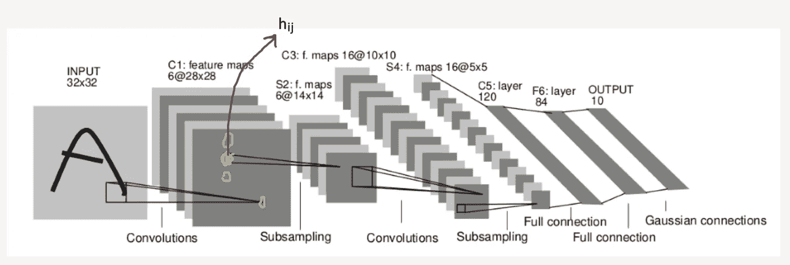

[LeNet-5 架构](http://vision.stanford.edu/cs598_spring07/papers/Lecun98.pdf)

假设我们想要检查当我们增加突出显示的神经元激活 *h_{i，j}* **，**时会发生什么，并且我们想要在增加这些激活时将这些变化反映到输入图像上。

换句话说，我们正在优化图像，以便神经元 *h_{i，j* }发出更多的信号。

我们可以把这个优化问题表述为:

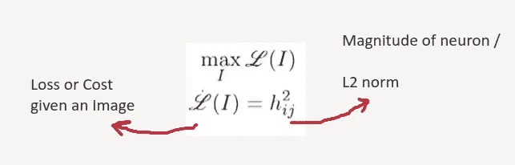

作者图片

也就是说，我们需要通过改变图像来最大化 *h_{i，j}* 的平方范数(简单来说就是幅度)。

当我们按照上面所说的去做时，会发生这样的事情。

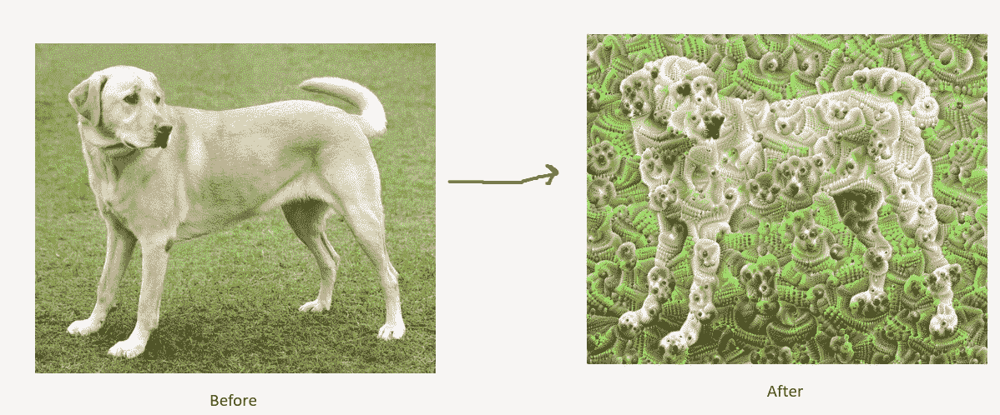

(**左**图片由 Von.grzanka | ( **右**)图片由 [Tensorflow 教程](https://www.tensorflow.org/tutorials/generative/deepdream)

这里的原因是，当 CNN 被训练时，中间层的神经元学会了看到一些模式(这里是狗脸)。当我们增加这些激活时，输入图像开始包含越来越多的狗脸，以最大化激活。

# 在文本上实现深度梦背后的直觉。

就像图像中的 deep dream，如果我们把任何一个隐藏层激活，并试图增加它的范数，文本输入会发生什么？
为了回答这个问题，采用了文本分类模型，并设置了损失函数来增加隐藏层的激活程度。我们希望看到这个隐藏层学习到的模式/表现。

## 嵌入层

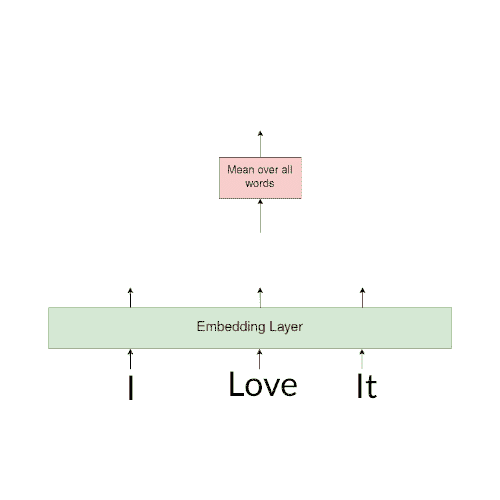

作者图像|计算句子嵌入的图像显示方法。

神经网络模型不能理解单词。为了将单词作为输入，这些单词被转换成一个称为**嵌入的 n 维数组。**每个单词转换成特定的 n 维数组。为了得到句子嵌入，我们简单地取句子的平均值，然后这个数组被作为输入馈送给模型。这种方法解决了句子长度可变的问题，可以与香草**人工** **神经网络**协同工作。

## 模型

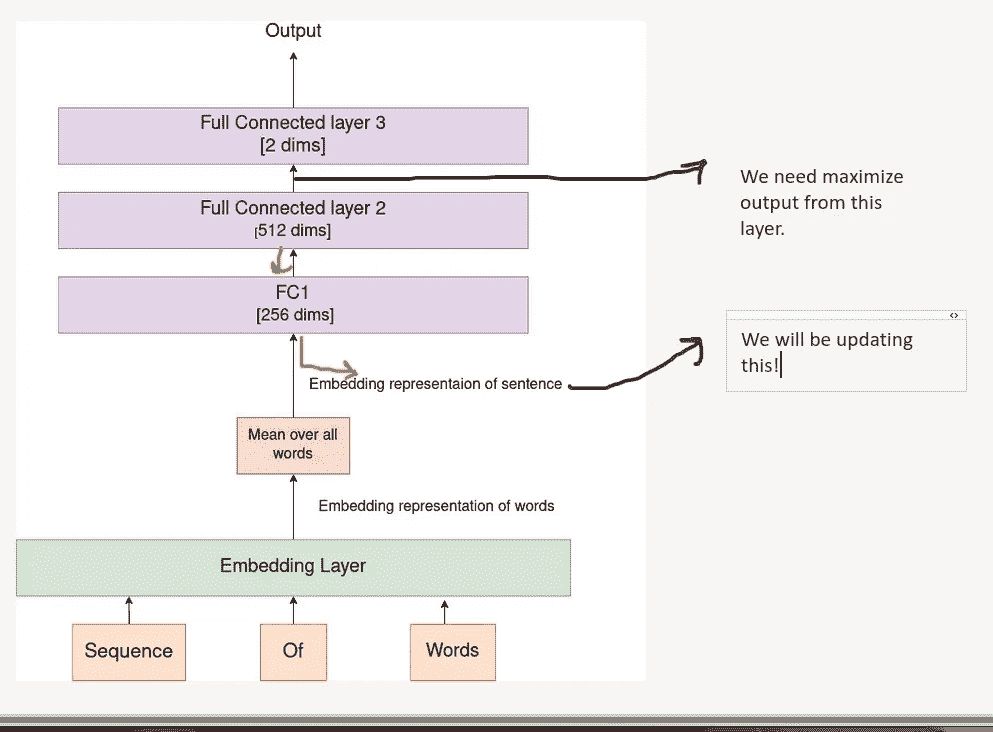

作者图片

使用了一个经过训练的模型来对 **IMDB 评论**进行分类。模型验证准确率达到 **80.10%** 。

设置该实验是为了捕捉由**全连接层 2** 或 **FC2** 给出的表示，简而言之，具有 **512** 尺寸。

使用的成本函数是 **fc2 输出**的标准。

**注意:**因为“单词序列”是*长张量，*它们不能被反向传播优化。相反，句子的嵌入表示被优化。

## 程序概要

步骤 1:将句子转换成张量。

第二步:获得**句子嵌入**。

第三步:通过 **fc2 层**，得到 **fc2 输出**。

第四步:优化**语句嵌入**到**增加 fc2 层输出**。

步骤 5:对于给定的迭代次数，用当前的句子嵌入重复步骤 2 到步骤 4。

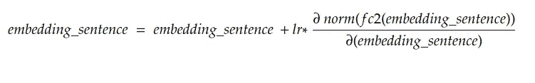

作者图片

# 结果

## 实验 1

**简单句**用于获取我们保存的分类结果及其对应的句子嵌入。

**比如:** *“我讨厌这样。”，“我爱这个节目。”*，我们用来分类。这些句子非常简单，分别传达了一种消极和积极的情绪。

**对这些嵌入进行了梦想或优化**，并记录了迭代激活图。

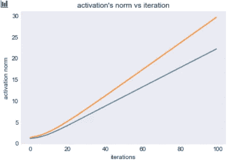

作者图片

这里可以观察到几件事情。

1.  对于这两个句子，隐藏层表征的激活几乎是线性增加的
2.  这些句子的激活是不同的，这意味着模型可以很容易地区分这两个句子。

**对于句子:*“我爱这个节目。”。*** 模型正确地将此预测为**。**

## *相似词测验*

*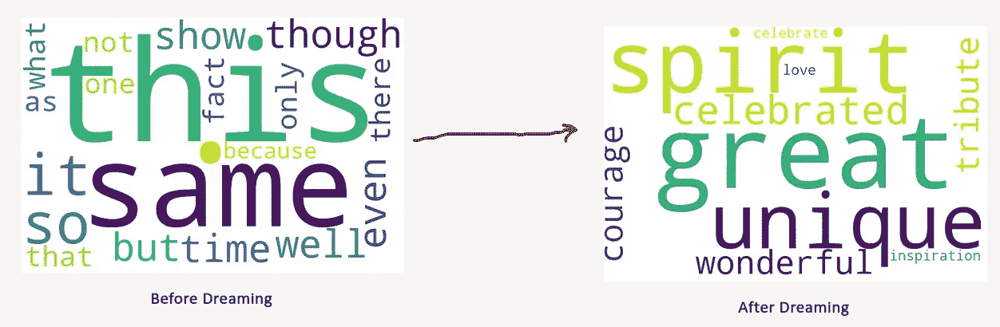*

*作者图片|基于相似度的词云。大字体意味着更相似。*

*最初，句子嵌入更类似于中性词，如“this，it，even same ”,但随着我们增加 fc2 激活的幅度，句子嵌入变得类似于积极的词，如“great，unique ”,这是有意义的，因为模型预测它是一个**积极的**句子。可视化迭代中的嵌入。*

*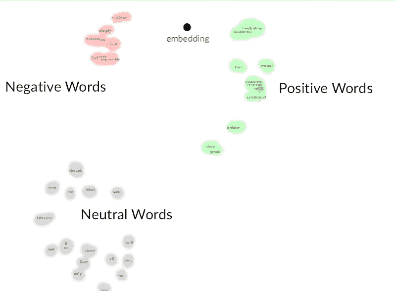*

*图片作者|动画展示了嵌入是如何从负面词汇走向正面词汇的。*

*作者视频|我们将肯定句的嵌入可视化。观察句子嵌入如何随步骤变化。*

*[***试嵌入此处***](https://projector.tensorflow.org/?config=https://gist.githubusercontent.com/mythrex/02f9d3b8575910943b89d9964e7fde56/raw/85e1d59d26662d8166d1fd0edeb2fc7d409f674a/Deep%2520dream%2520text%2520embeddings) ***在 Tensorflow 投影仪上****

*观察句子**嵌入如何从 **step_1** 开始**并移动到 **step_21。**句子嵌入开始于**肯定词**和**否定词**之间，随着算法的梦想，嵌入向肯定词移动。*

> *试试这些东西。*
> 
> *观察 3d 中的嵌入。*
> 
> *找到类似 **step_1** 的词。*
> 
> *找到类似 **step_21** 的单词。*

***对于句子:*“我讨厌这样”*** *。*模型正确预测此为 ***负*** *。**

## *相似词测验*

*首先，我们观察做梦前后与句子嵌入相似(余弦相似)的词有哪些。*

*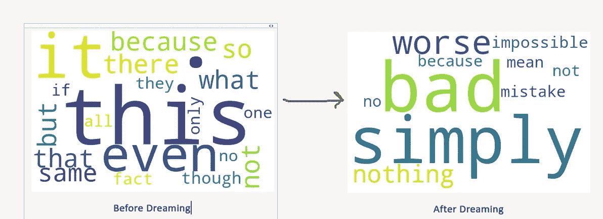*

*作者图片|基于相似度的词云。大字体意味着更相似。*

*最初，句子嵌入更类似于中性词，如“ *this，it，even，same* ”，但随着我们增加 **fc2 激活**的幅度，句子嵌入变得类似于单词“ *bad，nothing，bad*”，这传达了**否定**的意思，这是有意义的，因为模型预测它是**否定**句子。*

## *可视化迭代中的嵌入。*

*为了可视化迭代中的嵌入，使用 **TSNE** 算法将嵌入维数从 **100** 减少到 **2** 。这些嵌入被绘制在一个 2d 地图上，用**红点**作为**负面**词(如一个坏的、更坏的、卑鄙的、错误的词语)，用**绿点**作为正面词(如伟大的、著名的、美妙的词语)。*

***灰点**是句子嵌入的中间位置，**黑点**是句子嵌入的最终位置。*

*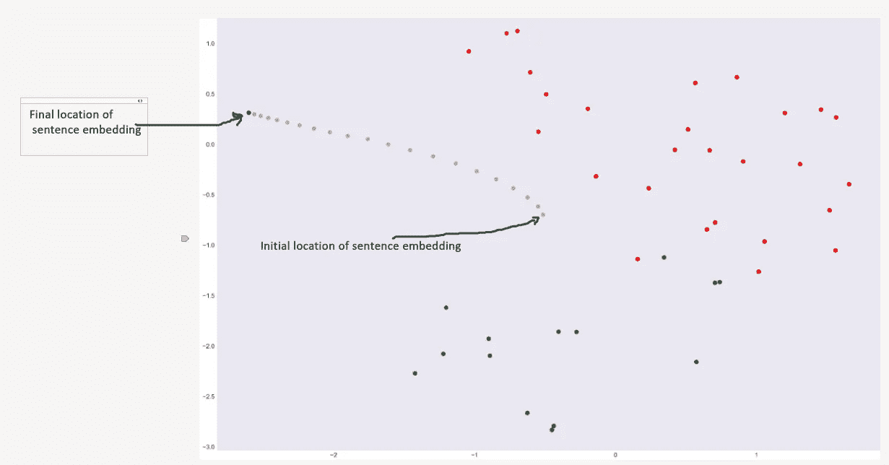*

*作者图片| 2d 空间上的 100 维嵌入*

> *[***试嵌入此处***](https://projector.tensorflow.org/?config=https://gist.githubusercontent.com/mythrex/f91d5aafd9dd5147784704a8ff295655/raw/c8389eee91ae2e3a05ac113296b58ddb699b85a5/Deep%2520dream%2520text%2520embeddings%2520negative) ***在 Tensorflow 投影仪上****

*该图清楚地显示了嵌入远离正面单词并接近负面单词，这与模型预测一致。而且最后的句子嵌入现在更像**红点(否定词)而不是绿点(肯定词)。***

*这里的关键观察是，最初，句子嵌入在正面和负面单词之间，但是随着做梦的进行，嵌入被推离负面单词。*

## *结论*

*做梦后的单词嵌入变得与“模型预测”中的单词相似，尽管如果我们观察初始嵌入的相似单词，它们对于两个句子或多或少是相同的，即使它们表达非常不同的意思，最终的句子嵌入显示出一些有趣的模式。*

*例如*

*1.**否定**预测被推近到像 ***错误、肮脏、恶劣*** 这样的词语*

*2.**正面的**预言被推近到像**的词语*独特的、伟大的、享有盛名的****

## *实验二*

*我们现在将使用难句。前半句表达一种情感，后半句改变情感的句子。*

*像这样的句子*

*   *这部剧很长很无聊，但是导演很棒。*
*   *我讨厌这部剧，因为里面有裸体，但表演很经典。*

*人类很难判断这些句子表达了什么样的情感。*

*我们将再次优化句子嵌入，以最大化 ***fc2 层的激活。****

*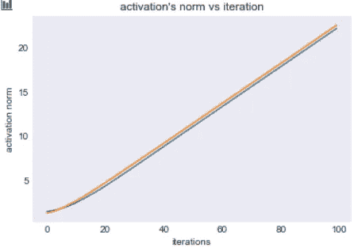*

*作者图片|作为迭代函数的 fc2 层激活标准*

*不像第一种情况。两个句子的激活差异不大，即这些句子的激活或多或少相似，这意味着模型对这些句子没有分类能力。
我们来看看这些句子做梦前后的近义词。*

*“这部戏很长很无聊，但是导演真的很棒。”，模型预测**为正***

***相似词测试***

*我们会发现类似于句首 vs 句尾嵌入的词。*

*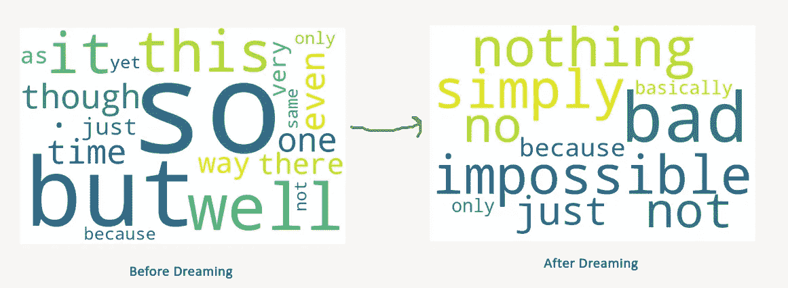*

*作者图片*

*嗯，即使这个句子被归类为积极的，类似于最后一句嵌入的词并没有反映任何积极的情绪。*

**“我讨厌这部剧，因为它的裸露，但它的表演真的很棒。”，*模型预测**为负***

***相似词测试***

*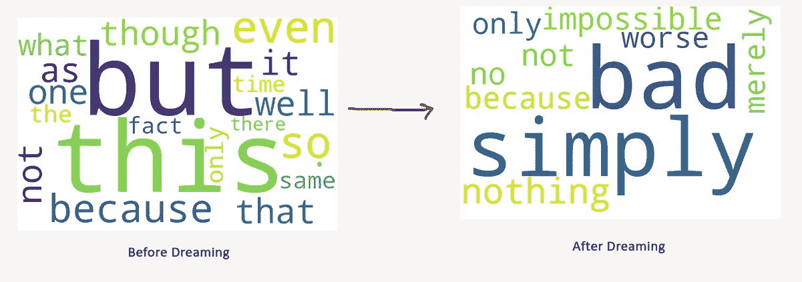*

*作者图片*

*这个句子被归类为**否定句，**梦后的嵌入反映了消极情绪。*

## *结论*

*由于模型对这些句子没有清晰的理解，所以做梦后这两个句子的句子嵌入几乎是相似的*(做梦后看相似的单词)。这是因为模型在其隐藏层中没有这些句子的丰富表示。**

*我们从研究图像上的深度梦如何工作开始，然后我们提出了如何在文本上实现深度梦。最后，我们展示了如何正确解释结果。这种方法可以用来理解语言模型已经学习了什么样的隐藏表示。*

*像这样的实验帮助我们更好地理解这些黑盒。*

*您可以在本笔记本中尝试一个[演示。](https://colab.research.google.com/github/mythrex/deep_dream_textual_data/blob/master/demo.ipynb#scrollTo=DiFimXLc-FK_)*

*所有相关代码可在 [my Github Repo](https://github.com/mythrex/deep_dream_textual_data) 获得。*

# *参考*

1.  *[基于梯度的学习应用于文档
    识别](http://vision.stanford.edu/cs598_spring07/papers/Lecun98.pdf)*
2.  *[https://ai . Google blog . com/2015/06/in ception ism-going-deep-into-neural . html](https://ai.googleblog.com/2015/06/inceptionism-going-deeper-into-neural.html)*
3.  *【https://www.tensorflow.org/tutorials/generative/deepdream】*
4.  *[https://youtu.be/YHAIrwRVvWg?list = plyqspqzte 6m 9 gcgajvqbc 68 hk _ JKGBAYT](https://youtu.be/YHAIrwRVvWg?list=PLyqSpQzTE6M9gCgajvQbc68Hk_JKGBAYT)*
5.  *[https://py torch . org/tutorials/初学者/text _ 情操 _ ngrams _ 教程. html](https://pytorch.org/tutorials/beginner/text_sentiment_ngrams_tutorial.html)*