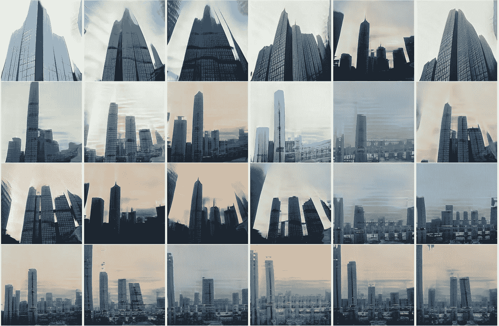
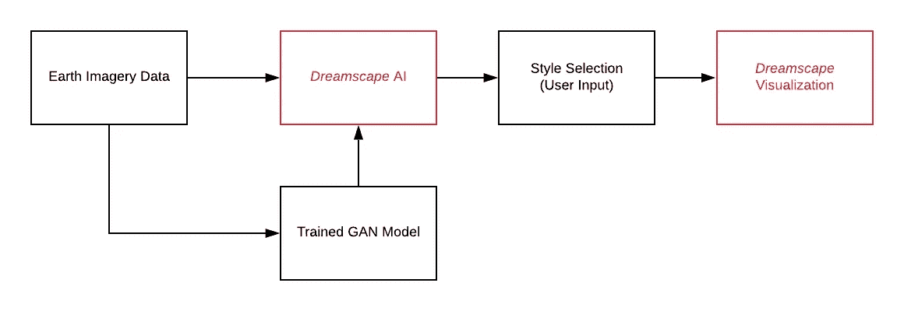

# dream scape——利用人工智能创造虚拟现实环境

> 原文：<https://towardsdatascience.com/dreamscape-using-ai-to-create-speculative-vr-environments-bdfedd32ae54?source=collection_archive---------22----------------------->

## 人工智能能让我们梦想另一个现实吗？

> Dreamscape 是一个探索数字城市的工具。基于对机器学习在建筑、城市化和游戏设计的虚拟空间中的生成能力的研究和调查。

# 摘要

随着人工智能(AI)越来越普及，它所带来的机会也越来越多。本文探索了机器学习工具，如生成性对抗网络，以及它们利用现实世界的数据推测新梦境的能力。我利用创造性的人工智能作为生成代理来推测城市景观，并在沉浸式虚拟现实( *VR)环境中可视化它们。导致了建筑调查工具“梦景”的产生。最后，我探索了未来视频游戏的设计是如何自我生成的，它们的图形是如何由用户驱动的。*

# 介绍

2010 年，[街机大火](https://www.everythingnow.com/)乐队为他们的歌曲 [*【我们曾经等待*](http://www.thewildernessdowntown.com/) 】推出了一个互动音乐视频。他们与谷歌合作，通过观众的过去精心制作了一个独特的情感之旅。在线体验首先要求观众在文本框中输入他们童年的地址，然后音乐视频开始播放，观众被神奇地传送到所述位置。通过展示空中和透视镜头，以富有节奏的歌曲为背景，这一街区变得栩栩如生。这个进入受试者生活的情感门户是谷歌地图技术的一个广受好评的创造性应用，让人们一瞥隐藏在收集和生成的大量数据中的创造性潜力。

图 1:仍然来自“市中心的荒野”,展示了用户童年家园的场景|来源:谷歌公司+街机火灾

随着最近遥感技术的进步，相机和用于将相机发射到太空的技术变得更加容易获得，导致数百个传感器被部署来点击来自太空的图片。而一队配备有 360 度视角相机的人、汽车和飞机帮助勘测所有七大洲的街道和岩层。谷歌地图和街景已经获得了前所未有的大量图片。街景平台已经成功捕捉到真实世界，并将其转化为数字化的虚拟空间。只需点击几下鼠标和一个人形图标，我们就能被传送到地球的任何一个地方。通过这一过程，谷歌科技试图将现实数字化。利用绘图和投影技术，我们的世界被抽象成数字世界。用户已经很好地适应了这个数字领域，在其中自如地导航，就好像它是真实的一样。在本文中，我将探索这些数据中潜在的创造性潜力，将其与生成工具结合起来，探索新的空间和形式。从图像失真开始，我们将把 AI 带入 VR 空间，以帮助推测游戏设计和架构。最后，通过这次探索，我创造了一个名为 *Dreamscape* 的工具，这是一种在虚拟现实环境中可视化城市景观的方法，将谷歌街景的*数字化现实*与 StyleGAN 的潜在空间融合在一起。在我们深入实验之前，我将提供一些关于网格、投影和风格转换的基本背景。如果您已经掌握了这些主题，请直接跳到方法。

图 2:谷歌地球三维视图|来源:作者

## 背景

谷歌通过从捕获的图像中提取数据来数字化我们的现实。他们使用一种叫做深度图分析和摄影测量的技术(从不同角度将同一物体的图像拼接在一起的过程)来生成一个三维网格。这个三维网格然后被纹理化，并在其上映射图像，使其看起来更真实。这类似于动画师为游戏和电影创造角色所使用的技术(见下面的图 3)。

图 3:左起:展开的 UV 纹理贴图、网格对象和纹理贴图网格|来源:作者

当一个纹理贴图被包裹到基础窗体上时，它的视觉质量会改变。如果不操作三维网格，可以通过扭曲基本纹理来改变外观。这是一个机会，可以将这项技术与人工智能图像生成技术的进步结合起来，使用[卷积神经网络](https://pathmind.com/wiki/convolutional-network) (CNN)和[生成对抗网络](https://searchenterpriseai.techtarget.com/definition/generative-adversarial-network-GAN) (GAN) *。*

图 4:风格转换示例，来自使用卷积神经网络的图像风格转换|来源: [Leon A. Gatys](http://openaccess.thecvf.com/content_cvpr_2016/papers/Gatys_Image_Style_Transfer_CVPR_2016_paper.pdf)

使用 CNN 的物体识别和表示语义信息(允许从风格中分离图像上下文)的进步成为导致创造性人工智能代理发明的不可或缺的过程。创造性人工智能中最早和最流行的自生成图像工具之一是神经风格转移。2016 年，Leon A. Gatys 写了一篇论文，概述了使用 CNN 计算图像到图像风格转换的框架。用最简单的话来说，它使用图像 A 的风格(纹理、颜色等)并将其嫁接到图像 b 上。这导致了一些工具来复制著名艺术家如毕加索的绘画的外观和感觉，这在风格转移实验中很受欢迎。通过训练 AI 来识别图像 A 的图案和纹理，同时将其与图像 b 中识别的对象和特征混合来存档。例如，在下面的示例中，中间一组图像描绘了猫图像的风格转移过程。标记为输出的图像显示了样式图像的纹理和色调如何转移到内容图像的结构上。结果是一种混合，其中猫的轮廓是可见的，而颜色，色调和纹理是显着不同的。

图 5:使用样式转换的三维纹理操作|来源:作者

在上述风格转换和纹理映射原理中发现的过程的基础上，图 5 中的实验试图通过操纵基础图像来扭曲 3D 形式。通过在基础纹理图像上运行风格转换，并将其映射回胸部。与原始半身像相比，生成的网格在特征和分辨率方面有所损失，同时创建了新的细节和折痕。在我制作 *Dreamscape* 的早期，我试图在这个基本测试的基础上，探索风格转换如何被用来扭曲来自谷歌街景的数据。

# 方法:创造性人工智能中的实验

虚构的世界和景观作为建筑投机和游戏的背景。在某些情况下，精心设计的世界被忽略了，通常是为其他行为和交互提供和创建沉浸式环境。在某些情况下，它们设计得如此之好，以至于它们看起来和感觉上都像我们自己的环境，通过用户的动作成为无缝集成虚拟和现实的空间载体。随着大量数据被收集并输出到公共领域，我们探索其潜力；从二维图像平面，扩展到使用人工智能的第四维模拟。

> 等等，他是说第四维吗？这是真的吗？
> 
> —本实验中的第四维指的是时间、空间、生长和/或运动。

在过去的几年里，人工智能研究的快速发展导致了新平台的出现，这些平台提供了用户友好的机器学习工具。像[谷歌 Colab](https://colab.research.google.com/notebooks/intro.ipynb) 这样的平台和像 [RunwayML](https://runwayml.com/) 这样的预包装软件解决方案，使得探索人工智能创造性方面的能力变得简单得多。在这项调查中，我探索了展示创造性人工智能潜力的四种方法:

> (1)探索图像生成的风格；
> 
> (2)梦境生成器——虚拟现实中的人工智能测试
> 
> (3)虚拟现实中的潜在空间探索
> 
> (4)从可视化中提取三维数据的工作流程。

## 1)使用 StyleGAN 探索二维空间。

在这一节中，我测试了 StyleGAN 来生成独特的、虚构的地图、风景和城市图像。StyleGAN 是一个生成性的对抗网络，它基于在训练图像中发现的特征来构造新的图像

图 RunwayML 上的 style gan |来源:作者

数据集。这是 NVIDIA 团队在 2018 年末创造的一种方法。例如，在来自*闪烁*的人脸数据集上训练的 StyleGAN 将开始从训练数据集生成具有相似特征的新人脸。然而，来自 GAN 的每个结果都是唯一的，并且与原始数据集中的任何图像都不相同。根据训练数据集的大小，GAN 模型可以产生极其相似和令人信服的结果。目前，在公共领域有许多预先训练的模型，从星云到卧室内部。图 6(上图)显示了一个运行 StyleGAN 的示例，它形成了一个对 10，000 幅风景图像进行训练的模型，从而产生了独特的虚拟世界。一旦经过训练，GAN 就能够在几分钟内创建具有不同相似度的图像(当被赋予所需的处理能力时)。图 6 中 35 幅图像的网格花了 92 秒生成。把新的能力交给数字艺术家，作为探索的工具。

图 RunwayML 上生成的城市景观图片来源:作者

对于观察者来说，GAN 的每个输出都是一幅图像，但是对于机器来说，它只不过是一系列数字，范围从负 1 到 1。这串数字可以保存为一个 JSON 文件。如果我再次通过 StyleGAN 模型反馈相同的字符串，我们将得到相同的图像。当我们编辑字符串并把它放回模型时，我们得到不同的图像。这是通过访问保存在经过训练的 GAN 模型的*潜在空间*中的信息来完成的(我将在下面进一步解释潜在空间)。因此，如果组成我们图像的这串数字以小步骤递增地编辑并反馈到系统中，那么结果图像将与原始输出相似，而如果我们显著地改变变量串，则输出将完全不同。我们可以使用 [P5](https://p5js.org/) (处理的[的在线版本)自动调整变量字符串，并在 RunwayML 中运行它。逐步改变变量将有助于生成具有相似特征但仍然独特的图像，当输出以视频格式排列在一起时，它为我们提供了一系列连续的视觉效果。一幅图像与另一幅图像融合在一起，形成了一个无缝而美丽的转变。这种形式的输出基于对潜在空间的插值过程。](https://processing.org/)

> **插值，那是什么？**
> 
> 源自数学，插值是两个数据点之间的一种估计，并在它们之间创建一个平均数据点。在计算机图形中，这被用作在两个关键帧之间创建填充帧的一种方式。通常用于提高帧速率，使用半自动处理。

图 8:潜在空间的插值。来源:黑客月[潜在空间可视化](https://hackernoon.com/latent-space-visualization-deep-learning-bits-2-bd09a46920df)

> [**潜伏空间**](/understanding-latent-space-in-machine-learning-de5a7c687d8d) **，那是什么？**
> 
> 潜在的定义意味着隐藏。潜在空间压缩数据的可视化。压缩的[可视化](https://hackernoon.com/latent-space-visualization-deep-learning-bits-2-bd09a46920df)发生在神经网络的各层内，在学习过程中提取维数减少的表示作为特征。我把它想象成 GAN 的记忆库，我们通过编码和解码来访问它。它是“空间”的想法很有趣也很重要，正如在上面的实验中所看到的，具有潜在空间的相似物品被放置得更近，而不相似的物品被放置得更远。重要的是要记住(不)相似性是 GAN 从训练数据集中学习到的结果，对我们来说似乎显而易见的东西对训练的模型来说可能不是。

图 9:卷积神经网络的描述。来源:Hackernoon 潜在空间可视化。

回到实验，图 10(下图)中的结果显示了插值是如何帮助探索潜在空间的。随着视频的播放，新的形式从旧的形式中涌现出来，并随着时间逐渐变化。最终的架构建立在自身之上。这个场景有一种统一和发展的感觉，随着逻辑的建立而扩展开来。新的空间从空间中出现，展示了过多的构造可能性。从白天到夜晚，从亮到暗，从行驶的汽车的窗户里，景色不断变化。奇异的图像被赋予生命，不再是一次性的；而是一个超越静止的连续体，进入一个具有多重空间可能性的新的维度领域。坚持维度的想法，下一个测试通过在 3d 环境中测试 StyleGAN 来进一步探索前景。

图 10:城市景观生成|来源:作者

## 2)将人工智能带入虚拟现实——梦境创造

利用 StyleGAN 和潜在空间，项目的下一阶段导致了使用可用的人工智能工具创建沉浸式体验的探索。像[虚幻引擎](https://www.unrealengine.com/en-US/)和 [Unity](https://unity.com/) 这样的软件是为虚拟现实生成和可视化空间而设计的。作为起点，原始数据来自谷歌街景，下载 360 度的图像，这些图像将构成可视化的基础。该图像通过 StyleGAN 进行处理，旨在在 Oculus、HTC Vive 或谷歌 DayDream 等沉浸式浏览器中体验。我们将使用上面讨论的沉浸式组件作为一种方式来测试如何使用潜在空间的插值来模拟运动的假设。

图 11:曼哈顿上的球形图像|来源:作者

为了探索在沉浸式环境中查看这些图像这一看似简单的任务。当我们开始实验时，一些挑战出现了。首先，球形图像的纵横比是 2∶1。而大多数预训练模型的比例为 1:1(通常为 512 X 512 像素或 1024 X 1024)，或 4:3(高清比例)。重要的是要注意，当一个人训练新模型时，它们是建立在现有模型之上的。这个过程被称为迁移学习。它有助于节省时间和处理能力，与训练一个全新的数据集相比，它减少了四分之一。图像上的鱼眼失真也是一个挑战，对用户来说不是很大，因为我们知道这是一个展开的图像，但对机器来说更是如此。与深度学习的内在逻辑——模式识别与特征提取*——**不懂失真。这限制了工具集的当前功能。然而，通过一些变通办法，我们可以回到手头的任务，在虚拟现实中探索 StyleGAN。*

> *dreamscape——一个导航谷歌街景数字化现实的工具，可以选择不同的风格来变形和改变背景。*

*图 12:梦景演示:曼哈顿|来源:作者*

*我们使用一种被称为盒子投影的技术，一种打破我们特殊图像的过程。用最简单的话来说，想象你(观众)在一个盒子里，如果一个图像被投射到盒子的所有侧面，在角落里是无缝和不间断的，我们可以想象整个空间是连续的。使用这种盒子投影技术，我们能够继续并检验假设。使用这个工作流程，我为 *Dreamscape* 创建了原型。一个导航谷歌街景的*数字化现实*的工具，能够选择风格来变形和改变上下文。在上面的演示中，(图 12)观众从投射的现实进入一个虚构的世界。他们轻松地从一个地方移到另一个地方。在下一个实验中，我们将前两种技术结合起来，创造一个能够动态变化的梦境。*

**

*图 13: Dreamscape 工作流程*

**

*图 14:植物生长时间周期|来源: [Tarninabarn](https://giphy.com/gifs/water-green-tree-3o7btNUijQYS0WAcwg)*

## *3)虚拟现实中的潜在空间*

*本节探讨在 VR 中使用插值的潜力。这样做的潜力是将身临其境的环境带入生活。它可以用来模拟时间的维度和/或模拟运动。通过改变我们看到的图像来改变视觉空间。这方面的一个简单例子可以在左边的延时 gif 中看到。植物的生长赋予我们所看到的形象以生命。*

*为了开始测试这个假设，我们首先创建我们的盒子投影图像。我们训练 styleGAN，并从所述图像开始创建插值，并对它们进行操作。有了合适的设备和实时渲染功能，我们可以使用 Unity 构建一个系统，并指定触发器(如头部的移动)来开始和暂停插值。一个有待未来实验检验的概念。但是现在，下面的下一个方法将探索从这个维度空间中提取正式数据的能力。*

***4)从维度空间提取三维数据。***

*到目前为止的探索集中在与背景相关的问题上。这个实验试图使背景生动起来，并利用产生的数据。为了占据这些数据并在游戏空间和建筑设计中探索它，下面的实验推测了从潜在空间提取 3-D 信息的方法。如果掌握了，这将是在短时间内创造大量虚拟空间的强大工具。使用像[边缘检测](https://arxiv.org/pdf/1902.10903.pdf)、[分割](https://missinglink.ai/guides/computer-vision/image-segmentation-deep-learning-methods-applications/)和特征识别(如下所述)这样的工具，我形成了操纵基本三维几何图形所需的输入。我推测一个工作流程，将导致从潜在空间的三维形式的创作。*

**

*图 15:3d 数据提取的 Dreamscape 工作流程*

## *深度分析:*

*在 3-D 计算机视觉中，深度图是一个图像或图像通道，它包含与场景对象的表面离视点的距离相关的信息。深度分析成为一个使用 AI 投射到图像中收集信息并从中创建深度图的过程。对于包括场景理解和重建在内的许多应用来说，这是一个基本的过程。在这个实验中，它帮助创建一个给定图像的空间层次。分割出前景和背景，有助于创建过程中的第一步。*

**

*图 16:左起—原始图像，深度分析，边缘提取|来源:作者*

## *细分:*

*分割是识别给定图像中不同元素的过程。例如，检测建筑物、狗、人类，在它们周围创建轮廓，并将其分离出来。它是对象检测和边缘分析的结合，帮助我们分解图像的组成部分。*

**

*图 17: DeepLab V3 图像分割|来源:谷歌公司。*

## *特征识别:*

*与分割类似，特征识别分解并识别图像中的元素。在这种特殊情况下，它进一步分解了已识别的元素，例如在建筑物分离出窗户、门和墙的情况下，为我们提供有关特征的形式和位置的特定信息。*

**

*图 18:立面提取|来源: [Wolff，Collins &刘](http://openaccess.thecvf.com/content_cvpr_2016/papers/Wolff_Regularity-Driven_Facade_Matching_CVPR_2016_paper.pdf)*

*结合这些过程，我们可以收集数据来开始操作基本表单。使用 unity 中的脚本，可以在 3D 空间中重新创建可视化的场景。这对于建筑设计师来说是一个有用的工具，是推进设计的投机过程之后的下一步。*

# *结果*

*上述实验有助于分解从 2D 图像移动到人工智能工具生成的潜在空间的方法，特别是 StyleGAN。超越平坦的 2D 平面有助于打开使用这项技术可以实现的新的可能性。利用框映射技术，在 VR 中实现 StyleGAN 的沉浸式体验是可能的。它有助于产生我称之为*梦境*的东西，一个从现实世界数据中诞生的看不见的世界。*

*这些实验确实暴露了一些限制，首先也是最关键的限制是处理能力。为了实时运行这样的*梦境*，需要巨大的处理能力，但随着技术的进步，这将变得更加可行。输出的分辨率和清晰度将是第二个障碍，但这也与处理能力和预训练数据的处理有关。这就把我们带到了策展的第三个问题，一个更容易解决的问题，策展在这种情况下也与我们可以接触到的风格数量有关。如果你有 10，000 张以上的图片，就有可能创造新的风格和训练一个 GAN。这是可能的，但是需要处理时间和大量的精选训练数据。也就是说，这项技术的可能实现范围很广。他们从讲故事的新的创造性形式到建筑思考，以及游戏图形仅仅是个开始。在下一节中，我将讨论这些可能性，同时思考当前的趋势和已经在使用类似技术的例子。*

# *结论和未来的可能性*

*2016 年，一个程序团队创造了一款名为 [*无人天空*](https://galacticatlas.nomanssky.com/) 的游戏，这是一款程序生成的游戏，诞生于 60 万行编造行星、宇宙和星系的代码。玩家被丢到其中一个星球上，那里有 18，446，744，073，709，551，616 个独特的星球可供探索。玩家在游戏中的唯一目的就是探索那些植物。*

**

*图 19:无人区|来源:Hello Games*

*无论玩家在哪里，他们总是在中心，即使有大约 18 万亿个行星；游戏只渲染玩家的周围环境，因此除非有人类见证，否则什么都不存在。*无人的天空*的强大之处在于，它不仅是一个生成性的人工智能，而且突出了用户/观察者/观众的重要性。*

*人工智能是一种工具，有可能在我们的一生中彻底改变设计和艺术的过程，然而，它也可以只是作为一种代理人来帮助我们进行思考和创造。Dreamscape 是一个工具，让用户能够根据个人喜好控制图形——增强游戏和其他*数字化现实的体验*。在论文的最后一部分，我探索了作为游戏设计师和建筑师代理人的*梦境*的含义。*

> *“人工智能是一种工具，有可能在我们的一生中彻底改变设计和艺术的过程，然而，它也可以被用作一种代理，帮助我们进行推测和创造。”*

## *游戏设计:*

*人工智能在游戏设计中的应用非常丰富，从机器生成的世界到通过前卫渲染模块可视化的新故事体验。使用计算机视觉中的深度学习将运动数据从物理模型移植到虚拟模型上得到很好的研究。而甘的探索则让游戏角色的开发利用了迁移学习(比如甘生成了[动漫](https://arxiv.org/pdf/1708.05509.pdf)人物)。现在，深度学习的新领域显示了在完整的游戏环境中风格转移的潜力。其示例见 [Chintan Trivedi](https://towardsdatascience.com/@chintan.t93?source=post_page-----2f9d339dcdb0----------------------) 的演示，用于将[堡垒之夜转换为 PUBG](/turning-fortnite-into-pubg-with-deep-learning-cyclegan-2f9d339dcdb0) 。为游戏提供不同的图形包供用户选择，并赋予用户自己定制的能力。*

**

*图 20:将堡垒之夜变成 PUBG |来源: [Chintan Trivedi](https://towardsdatascience.com/@chintan.t93?source=post_page-----2f9d339dcdb0----------------------)*

*人工智能的另一种可能性是作为一种手段，从现实世界中产生新的看似熟悉的背景。如果我们在 *Dreamscape，*的第一次实验中切换输入和输出，我们可以开始将游戏中的背景变成用户已知的设置/位置。例如，想象一下玩一个类似 GTA 的游戏——你体验的不是洛斯桑托斯，而是达拉斯、迈阿密或纽约。把*的潜在空间插值成*的组合*的*自有一套可能性。它们可以成为创造不断变化的背景的一个不可或缺的工具，从而产生永无止境的自我生成游戏的可能性。游戏中的背景可能会变得动态——根据玩游戏的用户的行为和性格而变化、学习和发展。在虚拟现实中，插值提供了模拟成长的可能性，甚至可能是时间和运动的元素。这些例子指向了对视频游戏中渲染模块的重新评估，我们可能会脱离传统方式，进入一个人工智能作为渲染代理的世界，根据用户的需求和心情召唤出实时渲染。*

**

*图 21:梦境|来源:作者*

## *建筑和城市化:*

*在建筑和城市规划中，GANs 的使用为思考和实践开辟了新的方法。他们正在变成设计的创意代理人和助手。使用预先训练的 GAN 模型，人们能够快速呈现出数百个具有特定风格和类型的选项。并且通过在潜在空间上的*插值，可以进一步开发和探索那些方案。这并不局限于城市景观或门面。例如，图 22(如下所示)描述了一个 GAN 改造现有平面图的可视化。机器通过各种可能性运行，而设计师则被留下来管理输入并选择最成功的迭代。**

**

*图 22:甘生成的平面布置图|来源:[作者](https://issuu.com/rishabjn95/docs/sp17_4b_jain_rishab)*

*在这篇论文的前面，人工智能的其他建筑机会被回避使用 *Dreamscape* 。*梦景、*(顾名思义)*、*的最初应用是帮助人们梦想新现实的可能性。它的目的是帮助想象和推测超越当前的世界和条件。梦想或想象是走向改变的第一步。梦想和想象变化是一种奢侈，大多数人都没有，但一旦他们可以想象，它就进入了可能性的领域。Dreamscape 是一个工具，让人们、社区和设计师能够推测新的可能性，想象现有环境之外的变化，希望能够想象出不同的未来。随着 VR + ML 的出现，建筑师和人们将能够参与完全沉浸式的设计可视化，这将快速生成并实现。他们将能够提供与类型和风格相对应的输入，同时能够在 VR 环境中以一对一的比例可视化结果。*

*这项调查让我进一步探索人工智能创造新世界的能力。在创造性人工智能的可能性领域，我们仅仅触及了表面。使用插值作为工具探索潜在空间的研究似乎很有希望。GAN 的隐藏层和压缩的潜在空间是如何被进一步访问和创造性地使用的，这将是令人着迷的。以及虚拟现实在未来为创造性人工智能打开的大门。*

# *文献学*

*[基于风格的生成式对抗网络生成器架构](https://arxiv.org/pdf/1812.04948.pdf)*

*[人工智能生成的视频游戏图形 NVIDIA](https://www.theverge.com/2018/12/3/18121198/ai-generated-video-game-graphics-nvidia-driving-demo-neurips)*

*[视频游戏人工智能概述](https://aifrontiers.com/2018/09/20/an-overview-of-artificial-intelligence-for-video-games/)*

*[揭开神经类型转移的神秘面纱](https://arxiv.org/pdf/1701.01036.pdf)*

*[谷歌地球令人难以置信的 3D 图像，解释](https://blog.google/products/earth/google-earths-incredible-3d-imagery-explained/)*

*[人工智能将如何革新视频游戏的开发和游戏方式](https://www.theverge.com/2019/3/6/18222203/video-game-ai-future-procedural-generation-deep-learning)*

*[使用卷积神经网络的图像风格转换](https://www.cv-foundation.org/openaccess/content_cvpr_2016/papers/Gatys_Image_Style_Transfer_CVPR_2016_paper.pdf)*

*[潜在空间可视化深度学习](https://hackernoon.com/latent-space-visualization-deep-learning-bits-2-bd09a46920df)*

*[神经 3D 网格渲染器](https://arxiv.org/pdf/1711.07566.pdf)*

*[规则性驱动的建筑立面在鸟瞰图和街景之间的匹配](http://openaccess.thecvf.com/content_cvpr_2016/papers/Wolff_Regularity-Driven_Facade_Matching_CVPR_2016_paper.pdf)*

*[从自然图像中自我监督学习 3D 对象](https://arxiv.org/abs/1911.08850)*

*[理解机器学习中的潜在空间](/understanding-latent-space-in-machine-learning-de5a7c687d8d)*

# *提及次数:*

> *达纳·卡沃斯(Dana Karwas)耶鲁大学艺术与媒体合作中心主任*
> 
> ****鲍比·贝里***[耶鲁大学艺术与媒体合作中心](https://ccam.yale.edu/) (CCAM)创新研究员*
> 
> *耶鲁大学[数字人文实验室](https://dhlab.yale.edu/)的实验室经理凯瑟琳德罗斯 。*
> 
> ****道格拉斯·杜海姆*** ，耶鲁大学[数字人文实验室](https://dhlab.yale.edu/)的全栈开发者。*
> 
> *同学们，机械神器——2020 年春天，耶鲁大学*

****如有疑问或合作，请联系*** [***作者***](mailto:rishabjn95@gmail.com) ***。在*** [***上找到我***](https://www.linkedin.com/in/rishab-jain-b541411aa/) ***。****