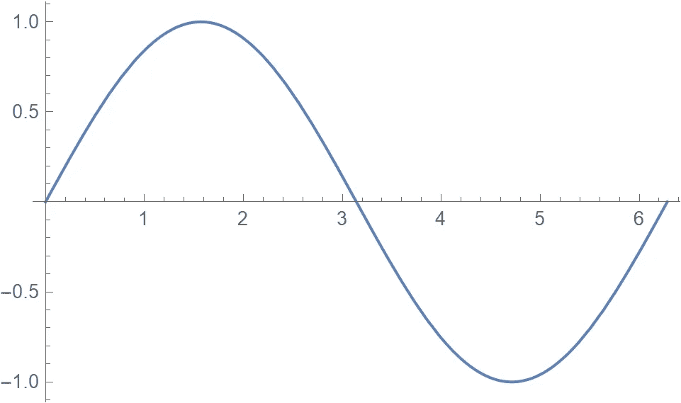
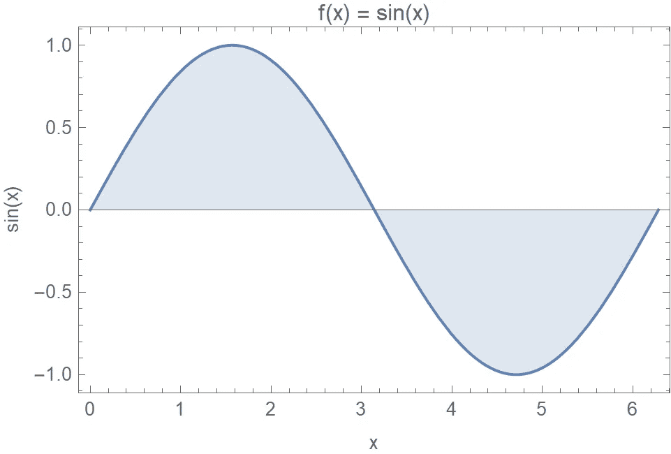
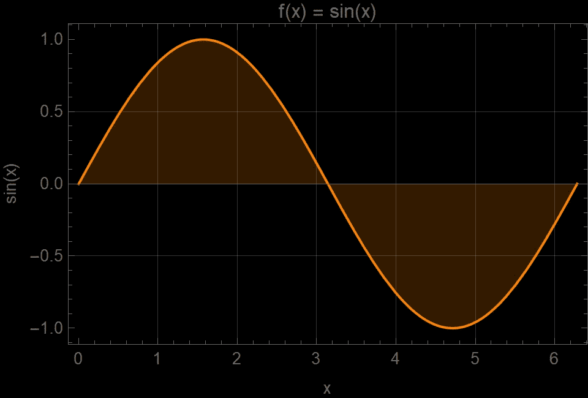
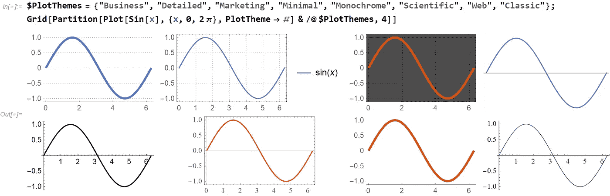
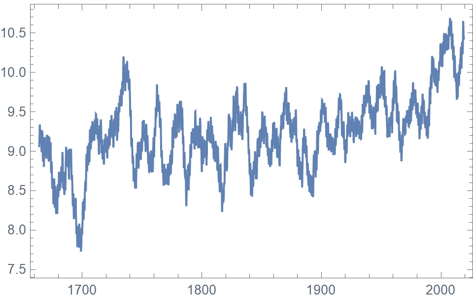
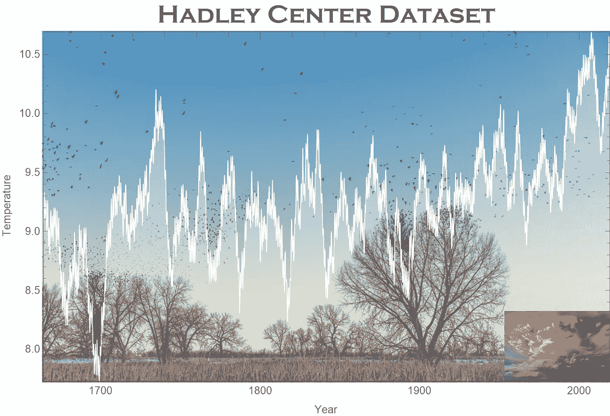

# 学习 Wolfram:装扮您的数据可视化

> 原文：<https://towardsdatascience.com/dressing-up-your-data-visualization-da7b41b15c6f?source=collection_archive---------45----------------------->

## 如何把一个基础剧情变成一个牛逼剧情


(图片由作者使用[周](https://unsplash.com/@cszys888?utm_source=unsplash&utm_medium=referral&utm_content=creditCopyText)和 [NOAA](https://unsplash.com/@noaa?utm_source=unsplash&utm_medium=referral&utm_content=creditCopyText) 在 [Unsplash](https://unsplash.com/s/photos/weather?utm_source=unsplash&utm_medium=referral&utm_content=creditCopyText) 上拍摄的照片)

数据可视化可能是一件棘手的事情。您希望您的数据光彩夺目，但是大多数编程语言(包括 Wolfram 语言)都提供了非常基本的默认可视化外观。装扮一个形象以最大化其吸引力的过程通常是一个试错的过程。这个故事探讨了如何使用一些技巧和窍门来使事情变得简单，从而制作一个吸引人的可视化。

让我们从最简单的图开始，一个简单的 sin(x)图，其中 x 的范围从 0 到 2π:

```
Plot[ Sin[x], {x,0,Pi} ]
```



(图片由作者提供)

显然，这是一个有用和有效的正弦图渲染，但它有点裸露。添加框架、标签和填充为可视化提供了上下文，并有助于查看者理解什么是重要的:

```
Plot[Sin[x], {x, 0, 2 Pi}, 
 Frame -> True, Filling -> Axis, 
 PlotLabel -> "f(x) = sin(x)", FrameLabel -> {"x", "sin(x)"}]
```



(图片由作者提供)

最后，添加网格线和改变颜色使绘图具有自定义外观，并易于嵌入具有给定样式的在线仪表板中:

```
Plot[Sin[x], {x, 0, 2 Pi}, 
 Frame -> True, Filling -> Axis,
 PlotLabel -> "f(x) = sin(x)", FrameLabel -> {"x", "sin(x)"},
 GridLines -> Automatic, Background -> Black, PlotStyle -> Orange]
```



(图片由作者提供)

为了使这更容易，Wolfram 语言预装了八个主题。每个主题都有一组独特的外观设置来创建常见的地块样式:



让我们更进一步，使用一个实际的数据集。我使用 [Wolfram 数据仓库](https://datarepository.wolframcloud.com/)来选择一个。这个知识库有超过 800 个数据集，由 Wolfram 及其用户社区提供。我挑选了一个非常好的数据集，名为“英格兰中部哈德利中心温度(HadCET)”:

 [## 哈德利中心英格兰中部温度(HadCET)数据集

### CET 数据集是世界上最长的气温仪器记录

datarepository.wolframcloud.com](https://datarepository.wolframcloud.com/resources/dzviovich_Hadley-Center-Central-England-Temperature-HadCET-Dataset) 

您可以通过简单地引用它的名称来获得这个数据集。为了减少图中的抖动，我通过移动平均计算来运行数据:

```
data = ResourceData["Hadley Center Central England Temperature (HadCET) Dataset"];
data = MovingAverage[data, Quantity[5, "Years"]]
```

结果是一个 **TimeSeries** 对象，它可以直接用于可视化功能，如 **DateListPlot** :


(图片由作者提供)

与之前的**图**一样，基本的**日期列表图**非常简单:

```
DateListPlot[data]
```



(图片由作者提供)

我们可以添加与之前正弦图相同的样式，但是有两个更有趣的选项，叫做**序言**和**结尾**。 **Prolog** 选项允许您在渲染轴和帧之后、绘制数据之前插入图形元素(线条、多边形、图像)。 **Epilog** 选项允许你绘制最终的图形图元，这些图元位于包括数据层在内的所有其他图形的顶部。

```
DateListPlot[data, 
 PlotStyle -> {White, AbsoluteThickness[1]}, 
 Prolog -> Inset[image1, Center, Center, Scaled[{1.2, 1.2}]],
 Epilog -> Inset[image2, Scaled[{1, 0}], {Right, Bottom}, Scaled[{0.2, 0.2}]],
 Filling -> Axis,
 FillingStyle -> Opacity[.3],
 PlotLabel -> Style["Hadley Center Dataset", Bold, 24, FontFamily -> "Copperplate Gothic"],
 FrameLabel -> {"Year", "Temperature"},
 PlotRangePadding -> None
]
```

这里的**图 1** 和**图 2** 分别是:


(图片由作者使用[周](https://unsplash.com/@cszys888?utm_source=unsplash&utm_medium=referral&utm_content=creditCopyText)和 [NOAA](https://unsplash.com/@noaa?utm_source=unsplash&utm_medium=referral&utm_content=creditCopyText) 在 [Unsplash](https://unsplash.com/s/photos/weather?utm_source=unsplash&utm_medium=referral&utm_content=creditCopyText) 上拍摄的照片)

结果图显示了各个层:



(图片由作者使用[周](https://unsplash.com/@cszys888?utm_source=unsplash&utm_medium=referral&utm_content=creditCopyText)和 [NOAA](https://unsplash.com/@noaa?utm_source=unsplash&utm_medium=referral&utm_content=creditCopyText) 在 [Unsplash](https://unsplash.com/s/photos/weather?utm_source=unsplash&utm_medium=referral&utm_content=creditCopyText) 上的照片)

就这么简单！有关所有 Wolfram 语言数据可视化功能的更多详细信息，请查看[参考文档](https://reference.wolfram.com/language/)中的[本指南页面](https://reference.wolfram.com/language/guide/DataVisualization.html)。