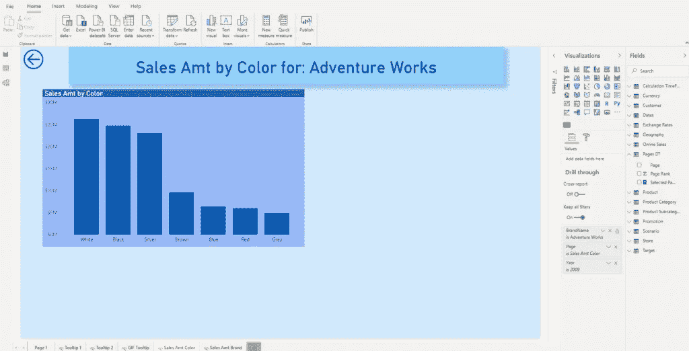

# 像 Power BI 中的专家一样钻取

> 原文：<https://towardsdatascience.com/drillthrough-like-a-pro-in-power-bi-ed92effcfe72?source=collection_archive---------27----------------------->

## 使用按钮的动态格式为您的 Power BI 报告创建出色的用户体验


照片由来自 [Pexels](https://www.pexels.com/photo/acoustic-amplifier-artist-audio-114820/?utm_content=attributionCopyText&utm_medium=referral&utm_source=pexels) 的[迈克](https://www.pexels.com/@mikebirdy?utm_content=attributionCopyText&utm_medium=referral&utm_source=pexels)拍摄

我必须承认，Power BI 开发团队的工作非常出色！每个月(甚至更少，像四月和五月的 BI 桌面更新)，他们都在超越和引入奇妙的新功能。

2020 年 3 月，微软宣布*页面导航*作为按钮的一个动作普遍可用，同时引入了按钮的*钻取*动作作为预览功能。这听起来真的很吸引我，因为我有很多用户不知道“右键单击”钻取功能，所以我必须创建不同的解决方法，如工具提示，以便让用户在报表中使用钻取。

## 救援按钮

随着新的按钮钻取操作现在普遍可用，让我们尝试充分利用并为我们的用户提供难忘的体验…

和往常一样，我将使用 Contoso 示例数据库进行演示。在继续之前，与按钮相关的另一个非常有趣的功能是，现在您可以自定义按钮的**禁用**状态(到目前为止，您可以自定义按钮的**默认**、悬停时的**和按下时的**状态)。****

**让我们看看这在现实中是如何工作的:**

****

**我添加了一个空白按钮，并将其格式化为禁用状态(灰色)。**

## **动态调整按钮文本**

**接下来我要做的是，因为我的报表中有多个钻取页面，所以我可以让我的用户知道他们希望看到什么样的详细信息。在我的例子中，他们可以选择查看“每个品牌的销售额”或“每个颜色的销售额”。**

**为此，我需要创建一个新表来保存钻取页面的相关数据。转到数据功能区下的*输入数据*，只需输入钻取页面的名称(**表中的值与钻取页面的名称**完全匹配非常重要)。我还添加了一个排名栏，以防万一我想以不同于字母顺序的顺序对页面进行排序。**

****

**现在，只需在画布上拖动切片器，并将页面名称列放入*字段的*值中。还有一个改善用户体验的小技巧:根据用户的选择，我们希望动态调整按钮上的文本，该文本将用于钻取操作。**

**因此，我创建了一个简单的 DAX 度量，它捕捉用户的选择:**

```
Selected Page = "Open "& SELECTEDVALUE('Pages DT'[Page])
```

**这将动态改变按钮上的文本:**

****

**要实现这一点，在按钮的格式选项下，选择*按钮文本*并选择右边的选项:**

****

**选择按字段值设置格式，并选择我们新创建的测量，选择页面。**

## **请开拍！**

**下一步是根据用户的选择，指示我们的按钮做什么。转到按钮的*动作*属性，再次选择右边的选项，并在“基于字段”下拉菜单中选择页面，将“默认优先”作为摘要类型。因为我们在一个切片器中专门为一个值定义了用户选择(通过打开单选)，所以我们不需要担心—无论用户选择什么，这都将是第一个(也是唯一的)选择…**

****

**最后要做的一件事是格式化按钮*的填充*属性，这样用户就可以识别它何时可以向下钻取。正如我前面提到的，按钮在禁用状态下是灰色的。但是，只要我从表中选择一个数据点，看看会发生什么！**

****

**我们的按钮变成蓝色，现在用户可以与它交互并点击它，以便导航到钻取页面，该页面包含 2009 年 6 月的*销售额*的详细信息。多酷啊！**

**一旦我们返回主页，并在“钻取页面切片器”下选择“销售金额颜色”,该按钮将返回禁用状态，系统将通知我们，如果我们要钻取包含每个品牌颜色的数据的页面，则需要选择一个品牌。**

**所以，让我们来看看它是如何工作的:**

****

**我已经在品牌名称视觉销售额中选择了 *Adventure Works* 品牌，我的按钮再次准备就绪！点击后，我将被导航到一个页面，该页面显示了 *Adventure Works* 品牌的每种产品颜色的数据:**

****

**和前面的例子一样，当我回到主页时，按钮又变灰了。**

**总而言之，下面是我们按钮的完整行为:**

****

## **结论**

**通过动态格式化按钮和调整操作来启用不同的钻取页面，您可以真正为 Power BI 报表创建出色的用户体验，避免使用多个书签的复杂性。**

**[成为会员，阅读 Medium 上的每一个故事！](https://datamozart.medium.com/membership)**

**订阅[此处](http://eepurl.com/gOH8iP)获取更多有见地的数据文章！**