# R 中黄金回报的驱动因素

> 原文：<https://towardsdatascience.com/drivers-of-gold-returns-in-r-3f47bc10d466?source=collection_archive---------45----------------------->

在 [Unsplash](https://unsplash.com?utm_source=medium&utm_medium=referral) 上由 [Felipe Simo](https://unsplash.com/@felipesimo?utm_source=medium&utm_medium=referral) 拍照

***来自《走向数据科学》编辑的提示:*** *虽然我们允许独立作者根据我们的* [*规则和指导方针*](/questions-96667b06af5) *发表文章，但我们并不认可每个作者的贡献。你不应该在没有寻求专业建议的情况下依赖一个作者的作品。详见我们的* [*读者术语*](/readers-terms-b5d780a700a4) *。*

作为终极价值储存手段，黄金在过去 18 个月里大幅升值；从 2019 年 3 月的约 1300 美元涨到 9 月 18 日的 1954 美元；增长了 33.4%。事实上，黄金作为一种资产类别，在过去 20 年中表现非常好，明显超过股票；尽管这伴随着长期的表现不佳。

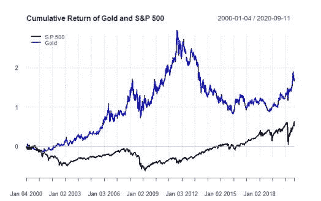

黄金价格最近的波动始于实际利率的下降，但随着新冠肺炎和经济状况的迅速恶化而加速。目前，对经济最糟糕的担忧似乎已经避免，但它需要前所未有的货币和财政支持。随着世界各国央行争相扩大资产负债表以支撑资产价值和消费者价格，许多风险最终可能会被社会化。

美联储的资产负债表在过去 10 年中相对稳定，占名义 GDP 的 25%，但最近几个月已经膨胀到 40%。鉴于对未来几年长期复苏和数万亿美元赤字支出的预期，这一比例预计将会增长，因为美联储将越来越需要将联邦债务货币化，以保持较低的名义利率。这可能会与旨在进一步刺激经济的进一步量化宽松措施相结合。

简而言之，金融抑制的时代以超乎寻常的规模回归，这让许多投资者想知道这对通胀、美元和黄金的未来意味着什么。

在这篇文章中，我的目的是调查黄金价格的主要驱动因素。具体来说，我将研究黄金作为金融资产的作用。重点将放在哪些金融变量主要解释黄金价格和黄金回报。

该分析将在 R 中使用大量可用的软件包库进行，包括: [PerformanceAnalytics](https://cran.r-project.org/web/packages/PerformanceAnalytics/index.html) 和 [quantmod](https://cran.r-project.org/web/packages/quantmod/index.html) 。所有的数据都可以从[雅虎免费获得金融](https://finance.yahoo.com/)和圣路易斯美联储银行[弗雷德数据库](https://fred.stlouisfed.org/)。

# 任务和设置

在本案例研究中，我们将调查黄金作为金融资产的用途。用金融术语来说，黄金被认为在投资组合中有四个主要用途:

1.  由于黄金的供应是固定的，法定货币的供应(或多或少)是任意的，通货膨胀通常是积极的，黄金被认为比其法定货币更能有效地保存财富。
2.  **对冲美元疲软:**美元是世界上事实上的储备货币，并隐含着“值钱”的保证。大部分国际贸易(特别是石油)都是以美元进行的，基于美元的融资对于新兴经济体和跨国公司来说非常重要，显然，美元是进入美国资本和商品市场所必需的。因此，汇率代表了美元供求之间的复杂动态。当全球经济状况良好或美国利率较低时，美元被认为会相对于其他主要货币走软。
3.  **防范经济形势恶化:**当全球经济形势疲软时，比如 2008 年或最近的新冠肺炎，黄金被视为终极避险资产。
4.  **对冲市场波动:**用黄金对冲股市波动可以说是黄金更具投机性的用途之一。然而，战术性地使用黄金来对冲市场风险是一个可能的用例。

本研究的目标是评估每种拟议使用案例对黄金价格的影响，并证明是否/何时观察到最强烈的影响。

有几种不同的方法来进行分析，也有不同的方法可以借鉴。为了全面了解黄金价格的本质，我将同时运用四种技术。具体来说，

1.  线性回归
2.  归因分析
3.  聚类分析
4.  数据可视化

希望通过结合使用这些方法，我们将揭示一个更深入和全面的黄金定价模型。

# 数据采集、清理和处理

我将使用金融和经济变量来衡量不同来源的黄金风险和回报。我们将使用从 2003 年 1 月 29 日到 2020 年 9 月 2 日的数据。如前所述，所有的数据都可以从雅虎免费获取！金融和弗雷德。

我们将从弗雷德的数据开始。在每个变量旁边，我放置了唯一的标识符，您可以从数据库中查询。

弗雷德数据:

*   黄金价格:黄金固定价格，伦敦金条市场。(GOLDAMGBD228NLBM)
*   实际利率:10 年期美国国债收益率。(DFII10)
*   10 年期美国国债和 10 年期美国国债的名义收益率之差。(T10YIE)
*   美元对欧元的汇率。(DEXUSEU)

该模型将基于双周数据。但是，FRED 以最高的可用频率检索数据，因此每日数据总是以每日形式出现。此外，数据是从系列的开始检索的，所以您最终会得到许多 NAs。因此，在我们继续之前，我们需要做一些清理工作。

下面的 R 代码段展示了如何将标识符加载到变量中，并分别对 FRED 进行查询。数据被重新索引并转换为两周一次。我已经尽可能多地注释了代码，这样你就可以看到发生了什么。

r 代码:弗雷德数据

如果用例 4 是真的，那么我们可以预期黄金价格会对一般资本市场指数和波动性的变化做出反应。我们将从历史悠久的雅虎获得这两个变量的数据。金融:

*   市场:标准普尔 500 指数(^GSPC)
*   波动性:波动率指数(^VIX)

r 码:雅虎！金融数据

# 建模

以下是黄金和我们提出的一组变量的相关矩阵:

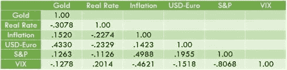

我们观察到，黄金和利率变量之间的相关性不是特别强，实际利率和美元对欧元的汇率是最突出的。

下图显示了黄金价格与负的 10 年期 TIPS 收益率的关系(回想一下，我们使用 TIPS 收益率作为实际利率的代表)。我已选择将 TIPS 上的收益率显示为负值。因为相关性是负的，所以系列会彼此反向移动，将收益率显示为负有助于展示趋势。

我们观察到，在该系列的早期，相关性较弱，但在过去 10 年中，尤其是最近，相关性非常紧密。

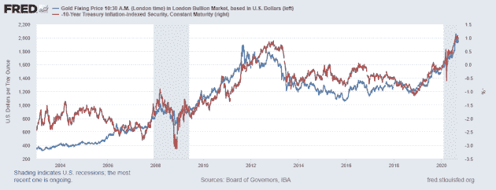

我们可以在下图中看到黄金价格和美元/欧元汇率之间的关系。从 2003 年到 2010 年，黄金和欧元同时升值，在 2010 年的大部分时间里总体呈下降趋势，但最近又开始回升。美元/欧元落后于黄金的涨势，但在撰写本文时，美元/欧元处于两年多来的最高水平。

这两者之间的相关性在 2010 年之后的系列早期更明显，但这可能是意料之中的。过去 10 年，欧洲一直在应对危机，包括 2011 年的主权债务危机和 2016 年的英国退出欧盟危机。欧盟一直受到经济增长乏力的困扰，因此欧元和黄金经历脱钩时期也就不足为奇了。

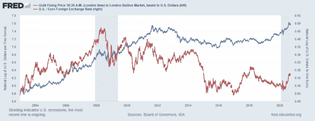

我对黄金价格和解释变量进行了简单的回归，以评估不同的影响，并提供进一步研究的线索。提议的模型如下:

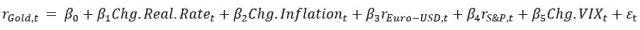

其中:

*   *rGold，t* =黄金在时间‘t’的价格回报
*   *Chg。实际利率*= 10 年实际利率的水平变化
*   *Chg。通胀*= 10 年通胀预期的水平变化
*   *欧元兑美元* =欧元兑美元汇率的回归
*   *rS&P*= S&p500 的价格回报
*   *Chg。VIX*= VIX 的水位变化

严格*回报*变量(欧元兑美元和 S & P)产生*弹性*。弹性是对一个经济变量的*百分比*变化响应另一个经济变量的*百分比*变化的度量。数学上，弹性定义如下:

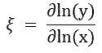

相比之下，代表*水平变化*的变量产生*半弹性。*半弹性衡量一个经济变量对另一个经济变量的*单位*变化的百分比变化。半弹性计算如下:

由于实际利率、通胀预期和 VIX 已经被定义为百分比，它们各自的系数被解释为:给定解释变量 1 个百分点的变化，黄金价格(即回报)的百分比变化。如果你熟悉债券交易，这与修正期限的解释是一样的，修正期限给出了收益率变化 1 个百分点时债券价格的预期百分比变化。

r 代码:回归和归因分析

回归的输出如下:

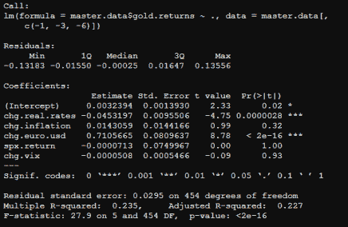

我们立即看到，实际利率的水平变化和美元对欧元汇率的百分比变化(即回报率)在统计上非常显著，而通胀预期的水平变化、标准普尔 500 的回报率和 VIX 的水平变化则明显不显著。实际利率变动系数-.045 可以解释为，假设实际利率上升/下降 1 个百分点，我们预计黄金价格下降/上升 4.5%；这证实了我们先前所预期的*先验*。欧元系数被解释为，如果美元对欧元汇率上升/下降 1%，我们预计黄金价格将上升/下降 0.71%(71 个基点)。

调整后的 R 平方为 0.23，表明模型中仍存在相当大的可变性。考虑到提出的 5 个变量中只有 2 个具有统计意义，这仍然为我们提供了相当多的有用信息。

将我们的注意力集中在作为我们感兴趣的变量的实际利率和欧元对美元的汇率上之后，我们可以更深入一点来评估这两个变量在模型中的相对重要性。为了做到这一点，我使用了 r .*relimpo*中可用的包，它提供了一套函数，用于将回归的方差分解为模型回归元所做的相对贡献。我将使用**排序的平均顺序平方和**方法来执行分解。这种特殊的技术递归地对模型中的变量进行重新排序，并记录初始的 R 平方，当添加一个变量时 R 平方如何变化，并计算平均值。

为了方便起见，我们将从模型中去掉无关紧要的变量，这样就只需要考虑两种排序:

1.  实际利率>>>欧元-美元
2.  欧元-美元>>>实际利率

顺序平方和分解的结果如下:

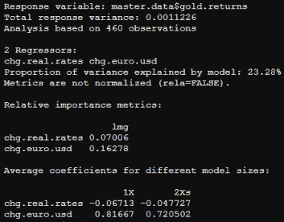

从分解中获得的 R 平方约为 23%,这与之前的模型结果相匹配。在这 23%中，7%的差异是由实际利率的变化造成的，16%是由汇率的变化造成的。换句话说，30%的解释差异归因于利率，其余 70%归因于汇率。因此，美元对欧元的汇率是解释黄金价格的主要变量。

如果我们参考本文的开头，我们提出黄金的两个功能是 1)对冲美元的变化(特别是美元疲软)，和 2)对冲广泛恶化的经济条件。我们的结果似乎证实了这些观点。实际利率的下降通常与经济状况的恶化有关，在这种情况下，我们预计黄金会升值。同样，美元疲软*往往*与全球经济其他地区的经济状况改善有关，在这种情况下，我们预计黄金会升值。

为了形象化这些影响，我分别绘制了黄金收益率与美元/欧元汇率的实际收益率和收益率的变化，以及置信区间和预测区间。对于黄金对美元/欧元的图表，我们看到一个非常一致的上升趋势和紧密的配合。汇率的任何一个方向的变动都会引起黄金相应的反应。对于黄金与实际收益率，我们观察到一条向下的斜线，正如我们所料，但斜率似乎因收益率的极端变动而加剧。

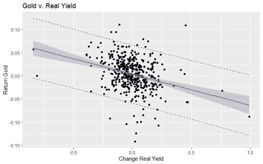

r 代码:带置信区间和预测区间的图

# k-均值聚类分析

到目前为止，我们已经单独研究了实际利率和汇率变化对黄金的影响。需要注意的是，利率和汇率之间的关系很复杂。理论表明，随着实际利率的下降/上升，以美国为基础的资产变得相对不那么/更有吸引力，这将推动以美元计价的汇率的下降/上升。然而，在重大全球经济压力时期(如 08-09 年和最近的 COVID)，美国资产(特别是美国国债)被投资者视为“安全港”资产，这(违反直觉)压低利率并推高美元。此外，实际利率是名义利率和通胀预期的函数。如果通胀预期比名义汇率下降得更快，我们可以看到实际汇率实际上在上升，即使经济崩溃了；这相当于在经济衰退时收紧货币政策，与你想做的事情完全相反。

为了试图理清这些混杂的影响，我采用了聚类分析。聚类分析是一套广泛的技术，用于在数据集中查找观察值的子组。我选择使用的具体方法是 *k-means* 聚类。k-means 聚类的基本思想包括定义聚类，以使总的类内变化(称为总的类内变化)最小化。有几种 k 均值算法可用。我将使用的 k-means 方法的具体实现将总的类内变化定义为观察值和相应质心之间的平方距离欧几里得距离之和:

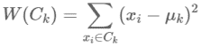

其中:

*   *xi* =是属于该集群的数据点
*   *uk* =分配给聚类的点的平均值

我们将总体组内变化定义如下:

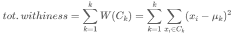

总的类内平方和度量了类的紧凑性(即良好性),我们希望它尽可能小。

选择质心(即平均值)的数量有点棘手，需要一些数据挖掘，但是我们可以使用一些诊断工具来帮助。下面的代码显示了我的过程。注意，运行 k-means 聚类所需的所有函数在 base R 中都有。

重要的是要弄清楚我们事先并不知道质心的“真实”数量。为了初始化模型，我使用了三个，但是建议可以有五个质心。对于迭代 1 到 5，我记录了平方和(BSS)与总平方和(TSS)的比值。这个比率告诉我们总方差的多大比例是由聚类数解释的。随着集群数量的增加，这个比率将开始接近 1；如果聚类数 C 等于观察数，则它等于 1。目标是在解释的方差和聚类数之间取得平衡，因为这给我们提供了更一般的结果。

为了有效地做到这一点，我使用了一个侧影图，它描绘了簇的数量与 BSS/TSS 比率的关系。一般来说，您希望在开始看到图趋于平稳的点上选择聚类数。这意味着大量的差异是由少量的聚类来解释的，增加更多的聚类对模型的解释力没有有意义的贡献。从下图中我们可以看到，对于群集 1–3，BSS/TSS 比率急剧上升，在群集 4 时增益开始减速，在群集 5 时趋于平稳。

r 代码:k-均值聚类分析

下表显示了不同集群规模的 BSS/TSS 比率，以及随着集群规模的增加而增加的比率:

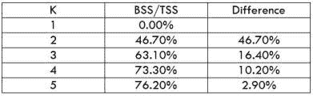

聚类分析表明，大部分数据可以用 4 个聚类来解释；超过这个数目，收益就小了。不可否认，很难判断是 3 个集群还是 4 个集群更合适，但对我来说 4 个集群更合适。

每个聚类的大小(即观察次数)和质心如下:

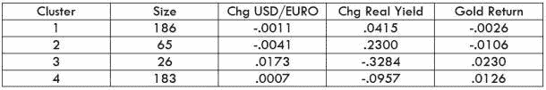

结果非常符合我们的预期。对于第 1 类和第 2 类，黄金价格的下跌与美元升值和实际收益率的上升是相称的。对于第 3 组和第 4 组，黄金价格的上涨伴随着美元贬值和实际汇率的下降。聚类 2 和 3 是最有趣的(对我来说),因为它们包含最少的观察值，并代表了解释变量和黄金价格的极端运动。

有了这些结果，我们就可以绘制数据，用颜色对数据进行分类，以便将相互作用可视化。为此，我们将利用软件包[散点图 3D](https://cran.r-project.org/web/packages/scatterplot3d/index.html) 。在下图中，聚类颜色如下:

*   聚类 1 =黑色
*   集群 2 =绿色
*   集群 3 =蓝色
*   聚类 4 =浅粉色

我为这个情节呈现了两个不同的天使。第一个在 x 轴上绘制汇率，第二个在 x 轴上绘制实际收益率。我还用回归平面覆盖了相应的图表，这样我们就可以看到数据的趋势。

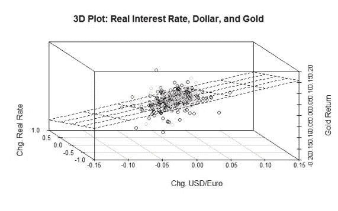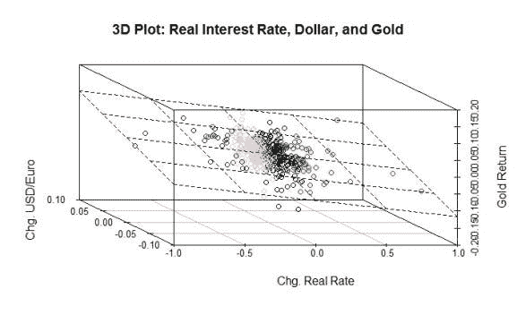

r 代码:3D 散点图

# 结论

在这篇文章中，我们深入探讨了黄金以及对其影响最大的经济变量。我们使用回归分析和优势归因来确定黄金主要受美元相对强势(以美元/欧元汇率为代表)和实际利率的影响。此外，我们发现黄金相对不受其他金融和经济变量的影响，如标准普尔 500、波动性或通货膨胀。

其次，我们使用 k-means 聚类分析来检验利率、美元和黄金之间的联合关系。基于聚类分析的结果，我们确定，实际利率的下降/上升确实与美元的疲软/走强相关，这将对黄金价格产生重大影响，尤其是在走势极端的情况下。

在这个过程中，我展示了我使用的 R 代码和包，以便您可以将它们应用到自己的项目中。

希望这篇文章已经让你想到了一点(很多！)更多关于黄金及其在你的投资组合中的用途。

下次见，感谢阅读！

王高·莱克丝。

*原载于 2020 年 9 月 25 日*[*http://light finance . blog*](http://lightfinance.blog/drivers-of-gold-returns-in-r/)*。*