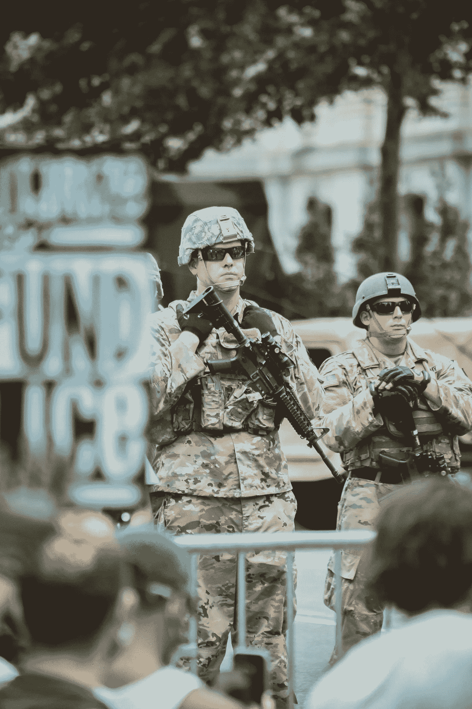
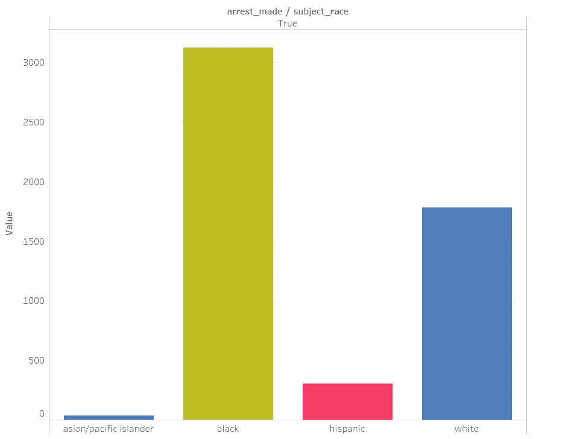
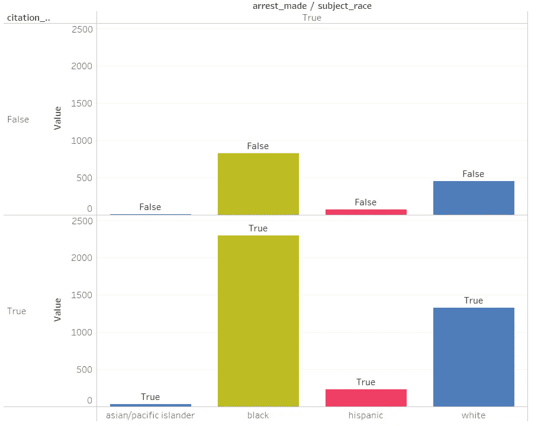
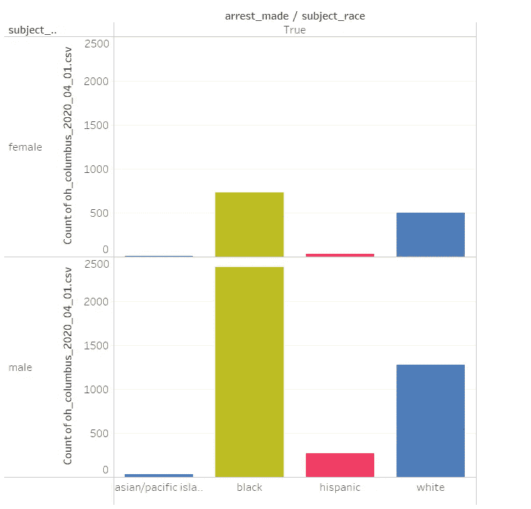
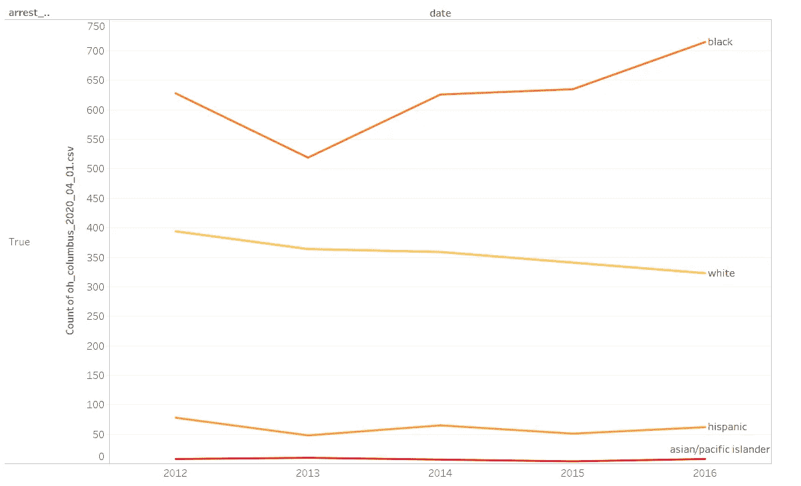
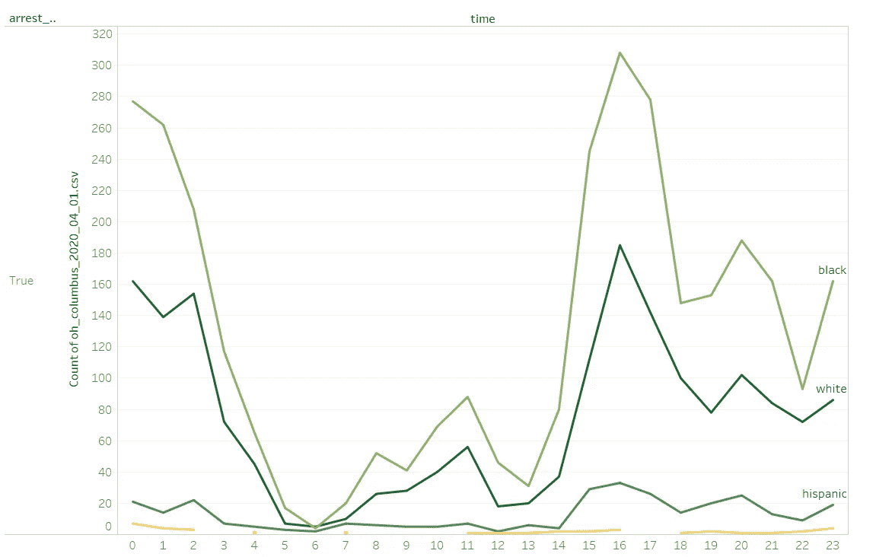

# 黑人开车——数据说明了什么？

> 原文：<https://towardsdatascience.com/driving-while-black-what-does-the-data-say-e77cac9ab15b?source=collection_archive---------35----------------------->

## 统计数据显示，黑人司机被警察拦下并逮捕的频率更高，而不法行为的证据却更少

克里斯·亨利在 [Unsplash](https://unsplash.com/s/photos/police-brutality?utm_source=unsplash&utm_medium=referral&utm_content=creditCopyText) 上的照片

系统性种族主义是一种影响我们社会结构的种族主义。

乍一看，可能很难察觉。

自从唐纳德·特朗普当选以来，仇恨犯罪的数量有所增加。白人至上主义者有恃无恐，反移民情绪加剧。

然而，系统性的种族主义是不同的。这不是关于暴力和仇恨犯罪，而是关于那些甚至不认为自己是种族主义者的人所做的日常决定。

系统性的种族主义无处不在。它存在于学校、法院、办公室和警察局。

我们需要做得更好，积极地识别和呼唤它。

## 在这篇文章中，我使用了来自[斯坦福开放警务项目](https://openpolicing.stanford.edu/#:~:text=The%20Open%20Policing%20Project&text=We%2C%20the%20Stanford%20Open%20Policing,explanatory%20power%20of%20data%20journalism.)的数据来理解刑事司法系统中的系统性种族主义。

斯坦福开放警务项目旨在帮助研究人员和政策制定者调查和改善警察与公众之间的互动。

他们从全国执法机构的数百万个交通站点收集并分析数据。

所有的数据都已经免费向公众开放，任何人都可以进入并对现有的数据进行分析。

他们的网站上有来自许多不同城市的大量数据集。为了这篇文章，我对俄亥俄州哥伦布市的警察拦截进行了分析。

# 数据结果

## 按种族逮捕:

在这个数据集中，白人的比例比其他任何种族都高。

然而，黑人被逮捕的人数要比白人多得多，黑人为 3，123 人，白人为 1，781 人。

## 逮捕，种族，并发出传票

即使没有发出传票，黑人司机也比其他种族的司机更容易被逮捕。

## 逮捕、种族和性别

黑人男性和女性比其他种族的男性和女性更有可能被警察逮捕。

## 按年份逮捕的人数

随着时间的推移，在警察局被逮捕的白人数量有所减少。相比之下，自 2013 年以来，被捕的黑人人数大幅增加。

## 随着时间的推移逮捕

下午 4 点左右似乎是逮捕人数的高峰。然而，种族和逮捕时间之间似乎没有任何明显的关联。

这一分析的结果表明，警务工作中存在显著的种族差异。

然而，重要的是要记住，这项分析仅使用了大约 10 万条记录，可能需要更多的数据才能得出具有统计意义的结论。

如果你想看看更多的数据，了解警察拦截中的种族差异，我建议访问[斯坦福开放警务项目网站](https://openpolicing.stanford.edu/findings/)。

他们拥有上亿次交通警察拦截的数据，并展示了对这些数据进行大规模统计分析的结果。