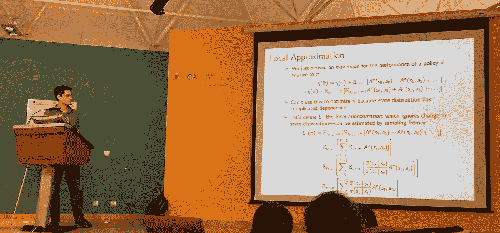
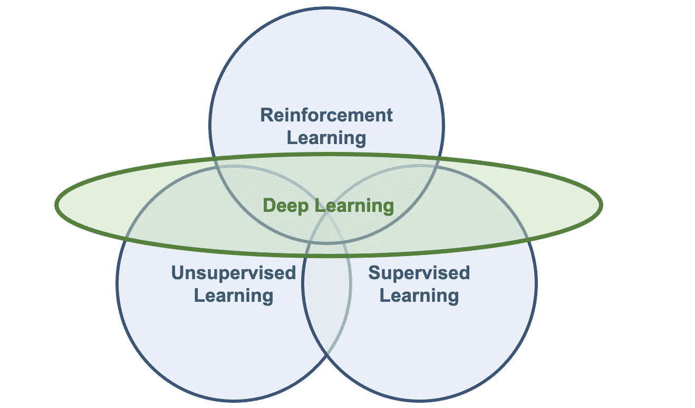
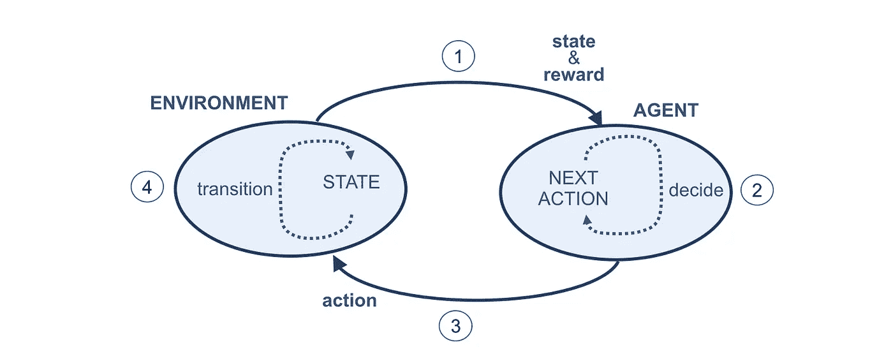
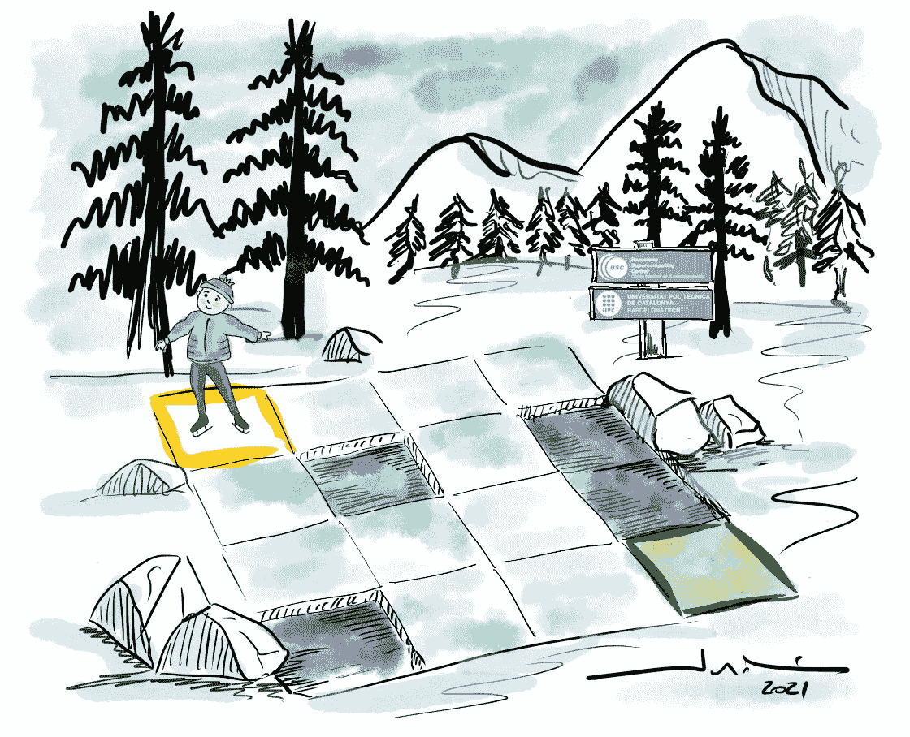
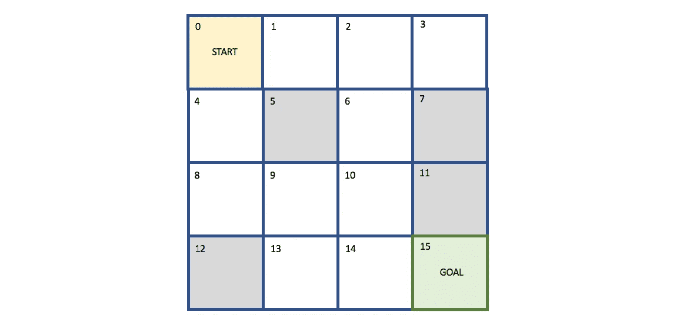
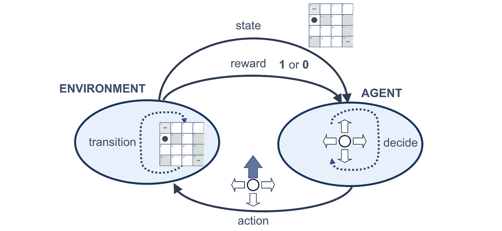
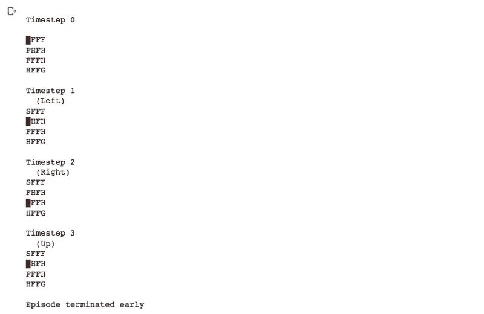

# 深度强化学习的温和介绍

> 原文：<https://towardsdatascience.com/drl-01-a-gentle-introduction-to-deep-reinforcement-learning-405b79866bf4?source=collection_archive---------0----------------------->

## [深度强化学习讲解— 01](https://towardsdatascience.com/tagged/deep-r-l-explained)

## 学习强化学习的基础知识


> 这是“[深度强化学习讲解](https://torres.ai/deep-reinforcement-learning-explained-series/)”系列的第一篇帖子；一个介绍性的[系列](https://torres.ai/deep-reinforcement-learning-explained-series/)逐渐地用一种实用的方法向读者介绍现代深度强化学习中使用的基本概念和方法。

> [本出版物的西班牙语版本](https://medium.com/aprendizaje-por-refuerzo/1-introducción-al-aprendizaje-por-refuerzo-92c9239aed90):

[](https://medium.com/aprendizaje-por-refuerzo/1-introducci%C3%B3n-al-aprendizaje-por-refuerzo-92c9239aed90) [## 1.介绍难民的生活

### 请访问第 1 页的自由介绍

medium.com](https://medium.com/aprendizaje-por-refuerzo/1-introducci%C3%B3n-al-aprendizaje-por-refuerzo-92c9239aed90) 

深度强化学习(DRL)是一个发展非常迅速的领域，是强化学习和深度学习的结合。它也是最具趋势的机器学习类型，因为它可以解决广泛的复杂决策任务，这些任务以前是机器无法用类似人类的智能解决现实世界问题的。

今天，我开始了一个关于深度强化学习的系列，这将使这个主题更加贴近读者。目的是回顾该领域，从专业术语和术语到该领域的基本概念和经典算法，新手不会在开始这个惊人的领域时迷路。

我第一次认真接触深度强化学习是在加的斯(西班牙)，2016 年[机器学习暑期学校](https://learning.mpi-sws.org/mlss2016/)期间。我参加了[约翰·舒尔曼](http://joschu.net/index.html)(当时来自[加州大学伯克利分校](http://www.cs.berkeley.edu/)和 [OpenAI](http://www.openai.com/) 的联合创始人)关于深度强化学习的为期三天的研讨会。



([约翰·舒尔曼](http://joschu.net/index.html)在 2016 年[机器学习暑期学校](https://learning.mpi-sws.org/mlss2016/)的研讨会上(作者提供照片)

这太棒了，但我也不得不承认，对我来说，理解约翰的解释非常困难。从那以后已经很久了，感谢和 Xavier Giró以及 Victor Campos 和 MPh 这样的博士生一起工作。D.am Bellver，我已经能够向前迈进，享受这个主题。

但是即使几年过去了，我真诚地相信他提出的不同强化学习方法的分类法仍然是初学者组织知识的好方法。

动态编程其实是课本上大多数强化学习课程开始的。我会这样做，但在此之前，正如约翰在他的研讨会上所做的那样，我将介绍交叉熵方法，一种进化算法，尽管大多数书都没有涉及它。在强化学习中引入深度学习的第一种方法会非常好，深度强化学习，因为这是一种简单易行的方法，而且效果惊人。

通过这种方法，我们将能够在进入更经典的处理 RL 问题的方法之前，方便地回顾深度学习和强化学习如何合作，而不考虑 DL，例如*动态编程*、*蒙特卡洛*、*时间差异学习*遵循关于该主题的绝大多数学术书籍的顺序。然后，我们将把本系列的最后一部分作为*策略梯度方法*致力于 DL + RL 的最基本算法(不是最先进的，因为它很普遍)。

具体来说，在这第一份出版物中，我们将简要介绍什么是深度强化学习，以及在这一研究和创新领域使用的基本术语。

我认为深度强化学习是人工智能中最令人兴奋的领域之一。它将深度神经网络的力量和能力结合起来，以表达和理解世界，并根据这种理解采取行动。让我们看看我是否能分享这种兴奋。开始了。

# 1.背景

**人工智能** (AI)中的振奋人心的新闻，近几年才刚刚发生。例如，AlphaGo 在围棋比赛中击败了最好的职业人类选手。或者去年，例如，我们的朋友 Oriol Vinyals 和他在 DeepMind 的团队展示了 AlphaStar 代理在星际争霸 2 的游戏中击败了职业选手。或者几个月后，OpenAI 的 Dota-2-playing bot 成为第一个在电子竞技比赛中击败世界冠军的 AI 系统。所有这些系统的共同点是，它们使用深度强化学习(DRL)。但是什么是人工智能和 DRL 呢？

## 1.1 人工智能

我们必须退一步来看看学习的类型。有时术语本身会让我们对基本原理感到困惑。人工智能是计算机科学的主要领域，**强化学习** (RL)也属于其中，它是一门与创建显示类似人类“智能”的计算机程序有关的学科。

当我们谈论人工智能时，我们指的是什么？人工智能(AI)是一个广阔的领域。即使是权威的人工智能教科书*人工智能，由 [Stuart Rusell](https://en.wikipedia.org/wiki/Stuart_J._Russell) 和 [Peter Norvig](https://en.wikipedia.org/wiki/Peter_Norvig) 撰写的现代方法*，也没有给出精确的定义，并从不同的角度讨论人工智能的定义:

> 人工智能:现代方法(AIMA)第三版，Stuart J Russell 和 Peter Norvig，Prentice Hall，2009 年。国际标准书号 0–13–604259–7

毫无疑问，这本书是对这个主题有一个全球视野的最好起点。但是，为了尝试一种更通用的方法(本系列的目的)，我们可以接受一个简单的定义，其中人工智能是指机器显示的智能，与人类的自然智能相反。从这个意义上说，人工智能的一个可能的简明而概括的定义可能是将通常由人类执行的智力任务自动化的努力。

因此，人工智能领域是一个广阔的科学领域，涵盖了与机器学习相关的许多知识领域；甚至更多的方法并不总是被编目，因为机器学习被我的大学同事们包括在内，他们是该领域的专家。此外，随着时间的推移，随着计算机越来越能够“做事情”，被认为“智能”的任务或技术也在发生变化。

此外，自 20 世纪 50 年代以来，人工智能经历了几波乐观情绪，随后是失望和失去资金和兴趣(被称为 [AI winter](https://en.wikipedia.org/wiki/AI_winter) 的时期)，随后是新方法、成功和融资。此外，在其历史的大部分时间里，人工智能研究一直基于技术考虑或具体的数学工具动态地划分为子领域，并且研究社区有时相互之间没有充分沟通。

## 1.2 机器学习

机器学习(ML)本身就是一个很大的研发领域。特别是，机器学习可以被定义为人工智能的子领域，它赋予计算机学习的能力，而不需要显式编程，也就是说，不需要程序员指出完成任务必须遵循的规则；电脑会自动完成。

概括地说，我们可以说机器学习包括为每个问题的特定用例开发预测“算法”。这些算法从数据中学习，找到模式或趋势，以理解数据告诉我们什么，并以这种方式建立一个模型来预测和分类元素。

鉴于机器学习研究领域的成熟，有许多成熟的机器学习方法。它们中的每一个都使用不同的算法结构来基于接收到的数据优化预测。机器学习是一个广泛的领域，具有复杂的算法分类，通常分为三个主要类别:

*   **监督学习**是从标记数据中学习的任务，它的目标是*去泛化*。我们的意思是，当我们用于训练的数据包括期望的解决方案时，学习受到监督，称为“标签”。这一类别中一些最流行的机器学习算法是线性回归、逻辑回归、支持向量机、决策树、随机森林或神经网络。
*   **无监督学习**是从无标签数据中学习的任务，其目标是*压缩*。当训练数据不包括标签时，我们称之为无监督学习，算法将尝试自己对信息进行分类。这一类别中一些最著名的算法是聚类(K-means)或主成分分析(PCA)。
*   **强化学习**是通过试错学习的任务，其目标是*行动*。这个学习类别允许它与其他类别相结合，它现在是一个非常活跃的研究领域，我们将在这个系列中看到。

## 1.3 深度学习

与这种分类正交的是，我们可以考虑一种强大的 ML 方法，称为**深度学习** (DL)，这是我们在以前的帖子中广泛讨论过的主题。请记住，深度学习算法是基于人工神经网络的，其算法结构允许由多个处理层组成的模型学习各种抽象级别的数据表示。

DL 不是一个独立的 ML 分支，所以它不是一个不同于上面描述的任务。DL 是使用神经网络解决 ML 任务的技术和方法的集合，可以是监督学习、非监督学习或强化学习。我们可以在图 1 中用图形表示它。



图 1:深度学习和机器学习类别的可视化关系。

## 1.4 深度强化学习

深度学习是我们今天处理非结构化环境的最佳工具之一；他们可以从大量数据中学习或发现模式。但这不是决策；这是一个认知问题。强化学习提供了这一特性。

强化学习可以使用各种 ML 方法和技术来解决问题，从决策树到支持向量机，再到神经网络。但是，在这个系列中，我们只使用神经网络；毕竟，这就是 DRL 的“深”的部分。然而，神经网络不一定是所有问题的最佳解决方案。例如，神经网络非常渴求数据，很难解释。然而，毫无疑问，神经网络是目前可用的最强大的技术之一，其性能往往是最好的。

# 2.强化学习

在本节中，我们提供了 RL 的第一种简单方法，因为它对于很好地理解深度强化学习(一种特殊类型的 RL)至关重要，深度强化学习具有用于状态表示和/或用于值函数、策略等的函数近似的深度神经网络。

## 2.1 通过互动学习

当我们思考学习的本质时，通过与环境互动来学习可能是我们想到的第一种方法。这是我们凭直觉判断婴儿学习的方式。我们知道，这种互动无疑是人们一生中关于我们的环境和我们自己的重要知识来源，而不仅仅是婴儿。例如，当我们在学习驾驶汽车时，我们完全意识到环境对我们所做的反应，我们也试图通过我们的行动来影响我们环境中发生的事情。从互动中学习是几乎所有学习理论的基础，也是强化学习的基础。

与其他机器学习方法相比，强化学习方法更侧重于从交互中进行目标导向的学习。学习实体没有被告知要采取什么行动，而是必须通过“试错法”来测试，自己发现哪些行动产生了最大的回报，即其目标。此外，这些行为不仅会影响即时回报，还会影响未来的回报，即“延迟回报”，因为当前的行为将决定未来的情况(在现实生活中如何发生)。这两个特征，“试错”搜索和“延迟奖励”，是强化学习的两个显著特征，我们将在这一系列文章中讨论。

## 2.2 强化学习的关键要素

强化学习(RL)是一个受各种其他成熟领域影响的领域，这些领域解决不确定性下的**决策问题。例如，*控制理论*研究控制复杂的已知动力系统的方法；然而，我们试图控制的系统的动力学通常是预先知道的，不像 DRL 的情况，它不是预先知道的。另一个领域是*运筹学*，它也研究不确定情况下的决策，但通常会考虑比 RL 中常见的更大的行动空间。**

因此，这些领域之间存在协同作用，这对科学进步无疑是积极的。但是它也带来了一些术语、符号等方面的不一致。这就是为什么在这一节中，我们将详细介绍我们将在整个系列中使用的术语和符号。

> 强化学习本质上是一个决策问题的数学形式化，我们将在本系列的后面介绍。

## 代理和环境

强化学习有两个核心组成部分:

*   一个 **Agent** ，代表“解决方案”，是一个计算机程序，它的单一作用是做出决策(行动)来解决不确定情况下的复杂决策问题。
*   一个**环境**，那是一个“问题”的表示，是在代理人决定之后出现的一切。环境对这些行为的结果作出反应，这些结果是观察或状态，以及奖励，有时也称为成本。

比如井字游戏，我们可以考虑代理人是其中一个玩家，环境包括棋盘游戏和另一个玩家。

这两个核心部分不断地相互作用，因此主体试图通过行动影响环境，而环境对主体的行动作出反应。环境如何对特定动作作出反应是由模型定义的，该模型可能为代理所知，也可能不为代理所知，这区分了两种情况:

*   当代理知道模型时，我们将这种情况称为基于模型的 RL 。在这种情况下，当我们充分了解环境后，可以通过[动态规划](https://en.wikipedia.org/wiki/Dynamic_programming)找到最优解。这不是这篇文章的目的。
*   当代理人不知道模型时，需要用不完全信息进行决策；做*无模型 RL，*或者尝试明确学习模型作为算法的一部分。

## 状态

环境由一组与问题相关的变量来表示(非常依赖于我们想要解决的问题的类型)。这组变量和它们可能取的所有值被称为**状态空间**。一个**状态**是状态空间的一个实例，一组变量取值。

## 观察

由于我们考虑到代理无法访问环境的实际完整状态，所以通常称之为**观察**，即代理可以观察到的那部分状态。然而，我们会经常在文献中看到观察和状态被互换使用，所以我们将在这一系列的文章中这样做。

## 动作和转换功能

在每个状态，环境提供一组可用的**动作**，代理将从中选择一个**动作**。代理通过这些动作影响环境，并且环境可以作为对代理动作的响应而改变状态。负责这种映射的函数在文献中称为状态间的**转移函数**或**转移概率**。

## 报酬

环境通常具有明确定义的任务，并且可以向代理提供**奖励**信号，作为对代理行为的直接回答。这种奖励是对最后一个行动有助于完成环境要执行的任务的反馈。负责该映射的函数被称为**奖励函数**。正如我们将在后面看到的，代理人的目标是最大化其获得的整体回报，因此回报是代理人以期望的行为行动的动机。

## 强化学习周期

让我们在下图中总结一下之前在强化学习周期中介绍的概念:



图 2:强化学习周期。

> 一般来说，强化学习基本上就是把这个数字变成一种数学形式主义。

这个循环始于代理观察环境(步骤 1)并接收状态和奖励。代理使用这个状态和奖励来决定下一步要采取的行动(步骤 2)。代理然后向环境发送动作，试图以有利的方式控制它(步骤 3)。最后，环境转换，并且由于先前的状态和代理的动作，其内部状态也随之改变(步骤 4)。然后，循环重复。

## 插曲

代理人试图解决的任务可能有也可能没有自然的结局。有自然结局的任务，比如游戏，被称为**情节任务**。相反，没有完成的任务被称为**连续任务**，例如学习向前运动。从一个情节任务的开始到结束的**时间步长**的序列被称为一个**情节**。

## 返回

正如我们将看到的，代理可能需要几个时间步骤和情节来学习如何解决任务。单集收集的奖励总和称为**回报**。代理商通常被设计成最大化回报。

其中一个限制是，这些奖励直到一集结束才透露给代理人，我们之前介绍的是“**延迟奖励**”。例如，在井字游戏中，每个动作的奖励直到游戏结束才知道。如果代理人赢得了游戏(因为代理人已经达到了整体期望的结果),它将是正奖励；如果代理人输掉了游戏，它将是负奖励(惩罚)。

## 探索与开发

强化学习的另一个重要特征和挑战是“**探索**”和“**利用**”之间的权衡。为了获得更多的奖励，一个代理人必须更喜欢他过去尝试过的行为，并且知道这些行为会有效地产生奖励。但矛盾的是，为了发现这种行为，它必须尝试以前从未选择过的行为。

总之，一个代理人必须利用他已经经历过的事情来获得尽可能多的回报，但同时，他也必须探索在未来做出更好的选择。**勘探开发困境**是一个至关重要的课题，也是一个尚未解决的研究课题。我们将在本系列的后面讨论这种权衡。

# 3.冰湖的例子

让我们通过看一个简单的例子来加强对强化学习的理解，一个冰冻的湖(非常滑),我们的代理可以在这里滑冰:



作者的图纸。

我们将使用的冰湖环境是一个溜冰场，分为 16 个单元(4x4)，如下图所示，一些单元已经破冰。名为 Agent 的滑冰者从左上方的位置开始滑行，它的目标是到达右下方的位置，避免掉入轨道中的四个洞。

描述的例子被编码为来自[体育馆](https://gym.openai.com)的[冰湖](https://gym.openai.com/envs/FrozenLake-v0/)环境。通过这个环境示例，我们将回顾并澄清到目前为止介绍的 RL 术语。这个例子对于本系列的后续文章也很有用。

## 3.1 健身房工具包

OpenAI 是一个人工智能(AI)研究机构，它提供了一个名为 [Gym](https://gym.openai.com) 的著名工具包，用于训练一个强化学习代理来开发和比较 RL 算法。Gym 为训练一个 RL 代理提供了各种各样的环境，从经典的控制任务到 Atari 游戏环境。我们可以训练我们的 RL 代理在这些模拟环境中使用各种 RL 算法进行学习。在整个系列中，我们将使用 Gym 工具包来构建和评估用于几个经典控制任务的强化学习算法，例如车杆平衡或登山车攀爬。

Gym 还提供了 59 个雅达利游戏环境，包括 Pong、太空入侵者、空袭、小行星、蜈蚣、吃豆人女士等。训练我们的强化学习代理玩 Atari 游戏是一项有趣且具有挑战性的任务。在这个系列的后面，我们将训练我们的 DQN 强化学习代理在 Atari Pong 游戏环境中进行游戏。

让我们介绍一个最简单的环境作为例子，叫做[冰湖](https://gym.openai.com/envs/FrozenLake-v0/)环境。

## 3.2 冰湖环境

当代理生活在大小为 4x4(有 16 个单元)的网格中时，冰湖环境来自所谓的网格世界类别，这意味着在网格世界的 *i，j* 坐标中由 16 个状态(0–15)组成的**状态空间**。

在冰湖中，**代理**总是从左上角位置开始，它的目标是到达网格的右下角位置。网格的固定单元格中有四个洞，如果代理人进入那些洞，**集**结束，获得的**奖励**为零。如果代理到达目的地细胞，它将获得+1 的**奖励**，并且**集**结束。下图显示了冰湖环境的可视化表示:



图 3:冰湖环境的可视化表示。

为了达到目标，代理有一个由四个方向运动组成的**动作空间**:上、下、左、右。我们还知道湖的周围有栅栏，所以如果代理人试图离开网格世界，它只会反弹回它试图离开的单元格。

因为湖面结冰，世界很滑，所以代理人的行动并不总是像预期的那样——有 33%的可能性会滑向右边或左边。例如，如果我们想让代理向左移动，那么它有 33%的概率会向左移动，有 33%的概率会出现在上面的单元格中，有 33%的概率会出现在下面的单元格中。

环境的这种行为反映在前面介绍的**转移函数**或**转移概率**中。然而，在这一点上，我们不需要进入这个函数的更多细节，留待以后。

作为总结，我们可以在下图中直观地表示所有这些信息:



图 4:冰湖例子的强化学习循环的示意图。

## 3.3 环境编码

我们来看看这种环境在 Gym 中是如何表现的。我建议使用 Google 提供的[*Colab*](https://colab.research.google.com/)*来执行这篇帖子中描述的代码(已经安装了 Gym 包)。如果你喜欢使用你的 Python 编程环境，你可以使用这里[提供的步骤](https://github.com/openai/gym)来安装 Gym。*

*第一步是导入健身房:*

```
*import gym*
```

*然后，从健身房指定你想使用的游戏。我们将使用冰湖游戏:*

```
*env = gym.make('FrozenLake-v0')*
```

*游戏的环境可以被重置到初始状态，使用:*

```
*env.reset()*
```

*为了查看游戏状态，我们可以使用:*

```
*env.render()*
```

*由`render()`渲染的表面使用如下网格呈现:*

**

*其中突出显示的字符表示代理在当前**时间步长**中的位置，并且*

*   *“S”表示起始单元(安全位置)*
*   *“F”表示冰冻表面(安全位置)*
*   *“H”表示一个洞*
*   *“G”:表示目标*

*官方文档可以在这里[找到](http://gym.openai.com/docs/)查看健身房工具包的详细用法和解释。*

## *3.4 代理人编码*

*目前，我们将创建一个最简单的代理，它只执行随机操作。为此，我们将使用从动作空间中随机抽取动作的`action_space.sample()`。*

*假设我们最多允许 10 次迭代；以下代码可以成为我们的“哑”代理:*

```
*import gymenv = gym.make("FrozenLake-v0")
env.reset()for t in range(10):
   print("\nTimestep {}".format(t))
   env.render()
   a = env.action_space.sample()
   ob, r, done, _ = env.step(a)
   if done:
      print("\nEpisode terminated early")
      break*
```

*如果我们运行这段代码，它将输出类似下面这样的内容，在这里我们可以观察时间步长、操作和环境状态:*

**

*总的来说，如果不是几乎不可能，找到一集我们的“哑”代理，在随机选择的行动中，它可以克服障碍并到达目标细胞，这是具有挑战性的。那么，我们如何建立一个代理来实现它呢？。这是我们将在本系列的下一部分中介绍的内容，我们将进一步形式化这个问题，并构建一个新的代理版本，它可以学习到达目标单元。*

# *4.强化学习与其他学习模式有何不同*

*为了结束这篇文章，让我们回顾一下强化学习的基础，将其与其他学习方法进行比较。*

## *4.1 强化学习与监督学习*

*在监督学习中，系统从由一对带标签的输入和输出组成的训练数据中学习。因此，我们使用训练数据训练模型(代理),使得模型可以将其学习推广到新的看不见的数据(输入和输出的标记对指导模型学习给定的任务)。*

*让我们用一个例子来理解监督学习和强化学习的区别。想象一下，我们想要训练一个模型使用监督学习来下棋。在这种情况下，我们将使用一个训练数据集来训练模型进行学习，该数据集包括玩家在每个状态下可以做出的所有移动，以及指示这是否是一个好移动的标签。然而在 RL 的情况下，我们的代理将不会被给予任何种类的训练数据；相反，我们只是为代理执行的每个操作提供奖励。然后，代理将通过与环境的交互来学习，它将根据它获得的奖励来选择它的行动。*

## *4.1 强化学习与无监督学习*

*与监督学习类似，在无监督学习中，我们基于训练数据来训练模型。但是在无监督学习的情况下，训练数据不包含任何标签。这导致了一个常见的误解，即 RL 是一种无监督的学习，因为我们没有标签作为输入数据。但事实并非如此。在无监督学习中，模型学习输入数据中的隐藏结构，而在 RL 中，模型通过最大化奖励来学习。*

*一个经典的例子是电影推荐系统，它想向用户推荐一部新电影。通过无监督学习，模型(代理)将找到与用户(或与用户具有相似简档的用户)之前观看的电影相似的电影，并向用户推荐新电影。相反，通过强化学习，代理不断地接收来自用户的反馈。这个反馈代表奖励(奖励可以是看电影的时间、看预告片的时间、他连续看了多少部电影等等)。基于奖励，RL 代理将理解用户的电影偏好，然后相应地建议新电影。重要的是要注意，RL 代理可以知道用户的电影偏好是否改变，并根据用户改变的电影偏好动态地建议新电影。*

## *4.3 强化学习中的数据在哪里？*

*我们可以认为我们在强化学习中没有监督或无监督学习中的数据。然而，数据实际上是环境，因为如果你与这个环境互动，那么数据(轨迹)可以被创建，这是观察和行动的序列。然后我们可以在上面做一些学习，这基本上就是强化学习的核心。*

*有时，我们可以使用来自现有的人或轨迹的额外数据，例如在[模仿学习](https://medium.com/@SmartLabAI/a-brief-overview-of-imitation-learning-8a8a75c44a9c)中。我们实际上可能只是观察一群玩游戏的人，我们不需要知道环境是如何运作的。有时我们已经明确给出了一个数据集，作为一种监督数据集，但在纯强化学习设置中，唯一的**数据是环境**。*

# *5.RL 的应用*

*强化学习在过去几年里发展迅速，应用广泛。这种演变的主要原因之一是强化学习和深度学习的结合。这就是为什么我们把这个系列的重点放在介绍基本的最先进的深度强化学习算法(DRL)上。*

## *5.1 Real 的实际应用*

*媒体倾向于关注 DRL 在游戏中击败人类的应用，比如我在本文开头提到的例子:AlphaGo 在围棋比赛中击败了最好的职业人类选手；AlphaStar 在星际争霸 2 的游戏中击败了职业选手；OpenAI 的 Dota-2 游戏机器人在一场电子竞技比赛中击败了世界冠军。*

*幸运的是，DRL 在现实生活中有很多应用。其中一个著名的领域是无人驾驶汽车。在制造业中，使用 DRL 训练智能机器人将物体放置在正确的位置，从而降低劳动力成本，提高生产率。RL 的另一个流行应用是动态定价，它允许根据需求和供应来改变产品的价格。此外，在推荐系统中，RL 用于构建推荐系统，其中用户的行为不断变化。*

*在当今的商业活动中，DRL 被广泛用于供应链管理、需求预测、库存管理、处理仓库业务等。DRL 还广泛用于金融投资组合管理、预测和商业交易市场的交易。DRL 常用于一些自然语言处理任务，如抽象文本摘要、聊天机器人等。*

*许多最近的研究论文提出了 DRL 在医疗保健、教育系统、智能城市等领域的应用。总而言之，没有一个行业不受 DRL 的影响。*

## *5.2 的安全和安保*

*DRL 特工有时可以控制危险的现实生活环境，如机器人或汽车，这增加了做出错误选择的风险。有一个名为 **safe RL** 的重要领域试图应对这种风险，例如，学习一种在预定义的安全约束内操作时实现回报最大化的策略。*

*此外，像任何其他软件系统一样，DRL 代理也面临着被攻击的风险。但是 DRL 在传统的机器学习系统之上增加了一些新的攻击手段，因为总的来说，我们正在处理的系统要复杂得多，难以理解和建模。*

*考虑到 DRL 系统的安全性超出了本文的介绍范围。不过，我希望读者能够意识到这一点，如果将来您将 DRL 系统投入运行，请记住，您应该更深入地对待这一点。*

## *5.3 我们不能逃避我们的责任*

*人工智能肯定正在渗透社会，就像电一样，我们会期待什么？我们将“发明”的未来是我们共同做出的选择，而不是偶然发生的事情。我们处于有利地位。有了 DRL，我们有权力和权威来自动化决策和整个战略。*

*这很好！但正如生活中的大多数事情一样，有光的地方就会有阴影，而 DRL 技术落入坏人之手是危险的。我问你，当工程师考虑我们正在建造的东西时:我们的 DRL 系统会意外地增加偏见吗？这对个人有什么影响？。或者，我们的解决方案会因其能源消耗而对气候产生怎样的影响？我们的 DRL 解决方案会被意外使用吗？还是用？。或者，根据我们的伦理，它能有一种我们认为邪恶的用途吗？*

*我们必须仔细考虑即将采用的人工智能及其影响。如果我们继续建设人工智能，而不考虑我们防止其滥用的责任，我们永远也不能指望看到人工智能帮助人类繁荣。*

*我们所有正在研究或想要研究这些课题的人都不能回避我们的责任，否则，我们将来会后悔的。*

# *6.摘要*

*我们通过理解 RL 的基本思想开始这篇文章。我们了解到，强化学习是一个反复试验的学习过程，而强化学习的发生是基于奖励的。我们提出了 RL 和其他 ML 范式之间的差异。最后，我们研究了 RL 在现实生活中的一些应用，并思考了 DRL 的安全性、安全性和伦理性。*

*在[的下一篇文章](/drl-02-formalization-of-a-reinforcement-learning-problem-108b52ebfd9a)中，我们将了解马尔可夫决策过程(MDP)以及如何将 RL 环境建模为 MDP。接下来，我们将回顾 RL 中涉及的几个重要的基本概念。下一期[见](/drl-02-formalization-of-a-reinforcement-learning-problem-108b52ebfd9a)！*

> *帖子更新于 2020 年 8 月 12 日*

# *深度强化学习讲解系列*

***由** [**UPC 巴塞罗那理工**](https://www.upc.edu/en) **和** [**巴塞罗那超级计算中心**](https://www.bsc.es/)*

*一个轻松的介绍性[系列](https://torres.ai/deep-reinforcement-learning-explained-series/)以一种实用的方式逐渐向读者介绍这项令人兴奋的技术，它是人工智能领域最新突破性进展的真正推动者。*

*[](https://torres.ai/deep-reinforcement-learning-explained-series/) [## 深度强化学习解释-乔迪托雷斯。人工智能

### 本系列的内容](https://torres.ai/deep-reinforcement-learning-explained-series/) 

# 关于这个系列

我在 5 月份开始写这个系列，那是在巴塞罗那的封锁期。老实说，由于封锁，在业余时间写这些帖子帮助了我。感谢您当年阅读这份刊物；它证明了我所做的努力。

**免责声明** —这些帖子是在巴塞罗纳封锁期间写的，目的是分散个人注意力和传播科学知识，以防对某人有所帮助，但不是为了成为 DRL 地区的学术参考文献。如果读者需要更严谨的文档，本系列的最后一篇文章提供了大量的学术资源和书籍供读者参考。作者意识到这一系列的帖子可能包含一些错误，如果目的是一个学术文件，则需要对英文文本进行修订以改进它。但是，尽管作者想提高内容的数量和质量，他的职业承诺并没有留给他这样做的自由时间。然而，作者同意提炼所有那些读者可以尽快报告的错误。*