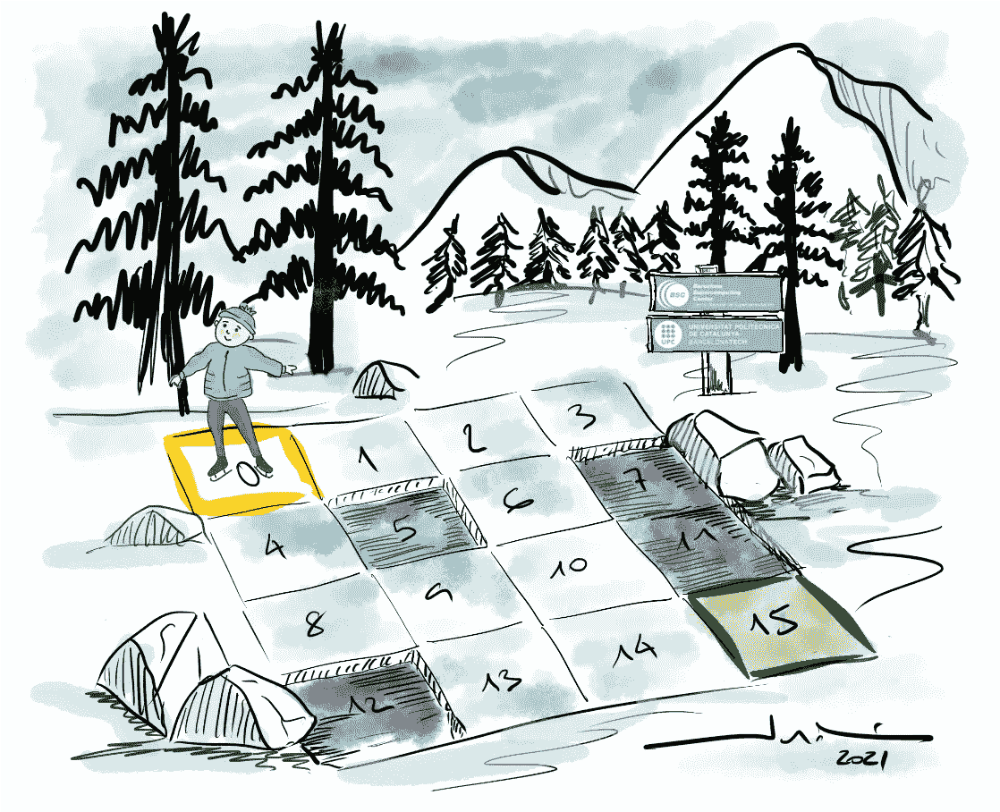
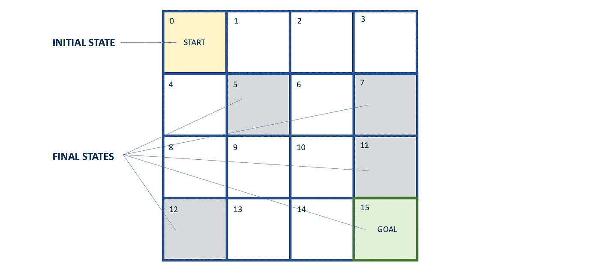
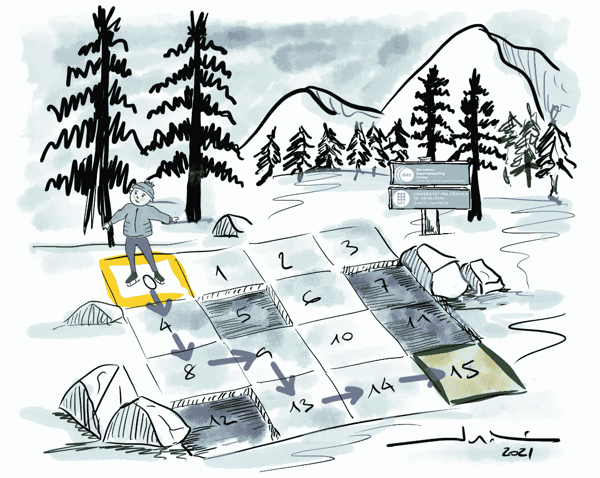
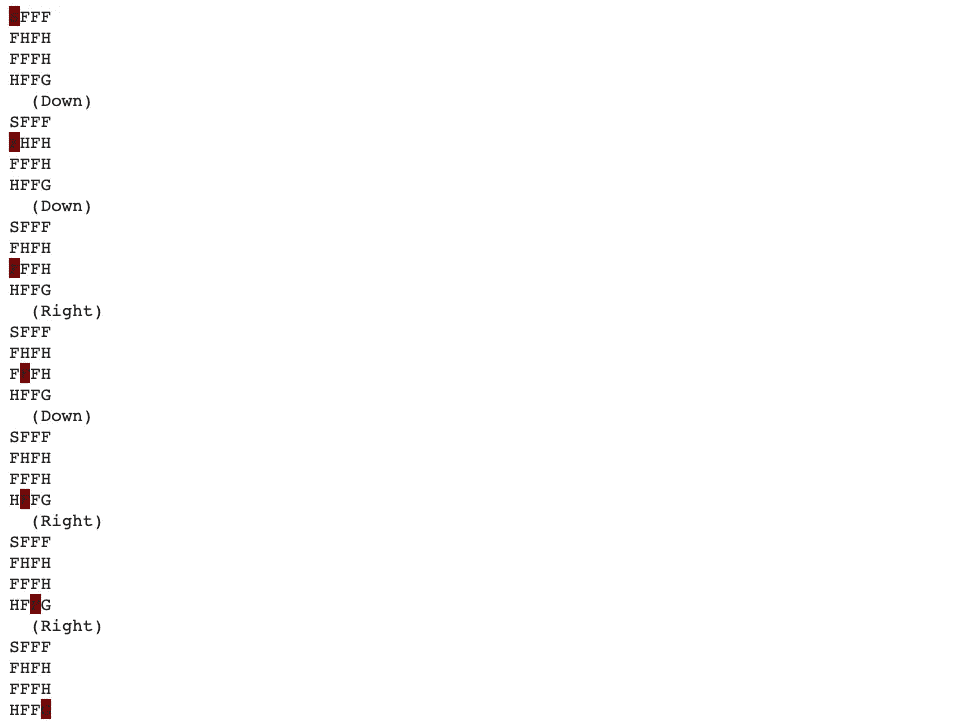
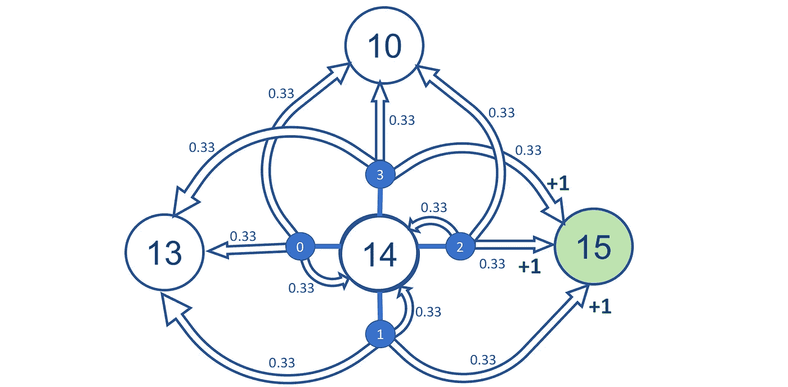
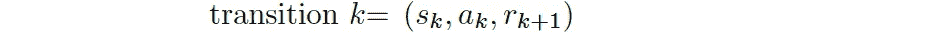
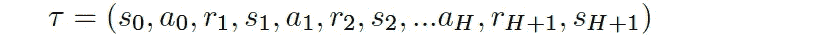
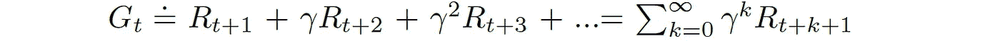
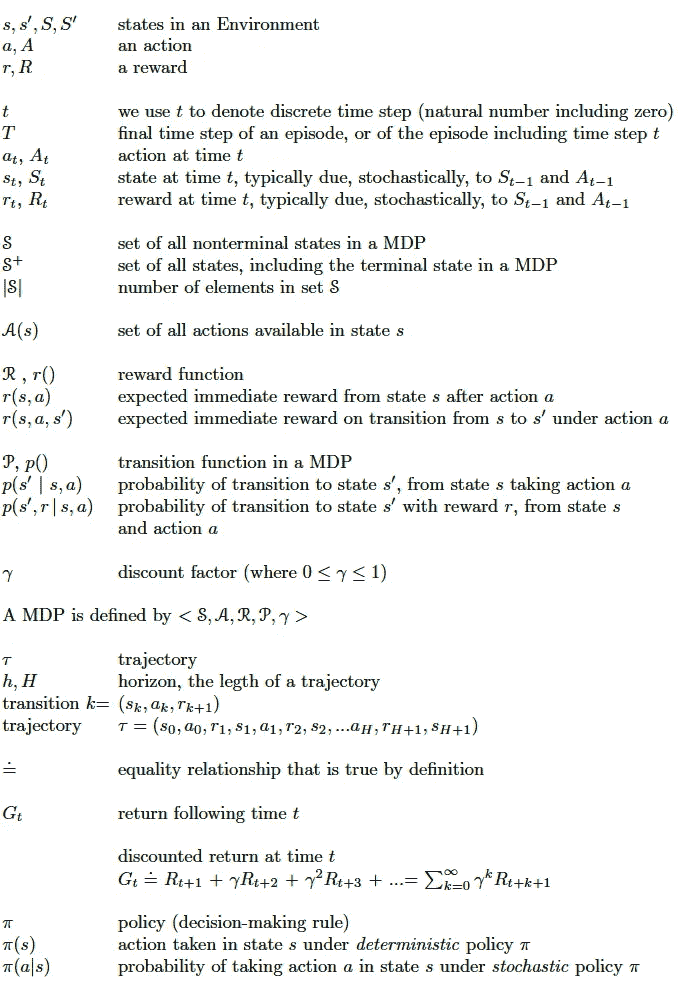

# 强化学习问题的形式化

> 原文：<https://towardsdatascience.com/drl-02-formalization-of-a-reinforcement-learning-problem-108b52ebfd9a?source=collection_archive---------9----------------------->

## [深度强化学习讲解— 02](https://towardsdatascience.com/tagged/deep-r-l-explained)

## **马尔可夫决策过程中的主体-环境相互作用**


> *今天我们从系列文章的第二篇开始*[深度强化学习讲解](https://torres.ai/deep-reinforcement-learning-explained-series/)*。正如我们在* [*第一帖*](/drl-01-a-gentle-introduction-to-deep-reinforcement-learning-405b79866bf4) *中所宣布的，这个系列的一个主要方面就是它对实践的导向；但是，在开始编码之前，我们需要一些理论知识。在本帖中，我们将探索特定假设和抽象的严格数学形式。不要慌；你的耐心会得到回报的！*

在这里，我们将向读者介绍在前一篇文章中提出的概念的数学表示和符号，这将在本系列中重复使用。实际上，读者将学会使用一个被称为**马尔可夫决策过程** (MDP)的数学框架来表示这些类型的问题，该框架允许对几乎任何复杂的环境进行建模。

通常，环境的动态变化是隐藏的，对代理人来说是不可访问的；然而，正如我们将在以后的文章中看到的，DRL 代理不需要知道问题的精确 MDP 来学习健壮行为。但是，了解 MDP 对读者来说是必不可少的，因为代理通常是基于这样的假设设计的，即 MDP 即使不可访问，也是在引擎盖下运行的。

> [本出版物的西班牙语版本](https://medium.com/aprendizaje-por-refuerzo/2-formalización-del-aprendizaje-por-refuerzo-9ab5bcbc8602):

[](https://medium.com/aprendizaje-por-refuerzo/2-formalizaci%C3%B3n-del-aprendizaje-por-refuerzo-9ab5bcbc8602) [## 2.难民救济委员会

### 访问第 2 卷第 2 页的自由介绍

medium.com](https://medium.com/aprendizaje-por-refuerzo/2-formalizaci%C3%B3n-del-aprendizaje-por-refuerzo-9ab5bcbc8602) 

# 1.马尔可夫决策过程

马尔可夫决策过程 (MDP)为解决 RL 问题提供了一个数学框架。几乎所有的 RL 问题都可以建模为 MDP。为了理解 MDP，首先，我们需要了解马尔可夫性质和马尔可夫过程。

马尔可夫性质表明未来只取决于现在而不取决于过去。马尔可夫过程由一系列严格遵守马尔可夫特性的状态组成。

当一个 RL 问题满足马尔可夫性质，即未来只依赖于当前状态 ***s*** 和动作 ***a*** ，而不依赖于过去，则公式化为**马尔可夫决策过程** (MDP)。

目前，我们可以认为 MDP 基本上由五元组 ***< S、A、R、p、γ >*** 组成，其中符号的含义是:

*   ***S*** —一组状态
*   *—一套动作*
*   ****R*** —奖励功能*
*   ****p*** —过渡功能*
*   ****γ*** —折现系数*

*下面我们来分别描述一下；然而，在继续之前，我们需要澄清一下本系列中使用的数学符号。*

## *1.1 关于数学符号*

*鉴于本系列的实践性和介绍性，我将尝试让普通读者理解这个解释，而不要求他们严格遵循数学公式。*

*然而，对于那些想了解数学细节的读者，我会尽量保持公式的严谨性。但由于 Medium.com 编辑器对编写公式和不同的字体类型有一定的限制，这并不容易。*

*所以，在课文中，我们会对记谱法的使用稍有松懈。例如，媒体编辑器不允许使用*下标*。在这种情况下，当我们要引用代理在时间 t 、的**、*状态时，我们将使用符号**、*、*、**。****

*类似地，在提到一个状态、行为或奖励时，我们会使用大写和小写字母，以便于阅读。*

*我会尽最大努力让这篇课文易懂。在某些情况下，我将包含数学符号和公式作为用 Latex 创建的图像，以弥补媒体编辑器的缺点。*

*在任何情况下，在继续之前，为了充分的数学严谨性，请参考本文的附录(在最后)。*

## *1.2 国家*

*一个**状态**是问题的一个独特且独立的配置。所有可能状态的集合被命名为**状态空间**。有单独的状态作为开始状态或结束状态**。***

*在上一篇文章中使用的冰湖示例中，环境的状态空间由 16 个状态组成，如图所示:*

**

*作者的画*

*从编程的角度来看，我们可以更正式地获得它们，如下所示:*

```
*print(“State space: “, env.observation_space)State space: Discrete(16)*
```

*例如，在冰湖环境中，只有一个起始状态(状态 0)和五个结束状态(状态 5、7、11、12 和 15):*

**

*图 1:冰湖环境的状态空间。(图片由作者提供)*

## *1.3 行动*

*在每个状态，环境提供一组可用的动作，一个**动作空间**，代理将从中选择一个**动作**。代理通过这些动作影响环境，并且环境可以作为对代理所采取的动作的响应而改变状态。该环境使所有可用动作的集合提前为人所知。*

*在冰湖环境中，所有状态下都有四种可用的动作:向上、向下、向右或向左:*

```
*print(“Action space: “, env.action_space)Action space: Discrete(4)*
```

*现在我们已经介绍了状态和动作，我们可以记住马尔可夫属性。下一个状态 ***St+1*** 的概率，给定当前状态*和当前动作 ***在给定时间********t***，将和你给它的整个交互历史一样。换句话说，也就是说，给定相同的动作，在两个不同的场合从一个状态移动到另一个状态的概率是相同的，而不管在该点之前遇到的所有先前的状态或动作。在冰湖的例子中，我们知道代理只能从状态 2 转换到状态 1、3、6 或 2，不管代理的前一个状态是 1、3、6 还是 2 都是如此。也就是说，您不需要代理所访问的州的历史记录。****

**我们在这里要说明的是，我们可以将动作空间分为两种类型:**

*   ****离散动作空间**:当我们的动作空间由离散的动作组成时。例如，在冰湖环境中，我们的动作空间由四个离散的动作组成:上、下、左、右，因此它被称为离散动作空间。**离散环境**是指环境的动作空间是离散的。**
*   **连续动作空间:当我们的动作空间由连续的动作组成时。例如，当我们开车时，我们的行为有连续的值，比如汽车的速度，或者我们需要转动方向盘的角度，等等。在我们的系列中，我们将使用连续动作空间作为 CartPole 环境的例子。**连续环境**是环境的动作空间连续的环境。**

# **2.转移函数**

**从一个状态移动到代理将到达的另一个状态(并且环境改变其状态)由**转移函数**决定，该转移函数指示从一个状态移动到下一个状态的概率，并且由 ***p* 表示。**表示环境的一步动态，即给定当前状态和当前动作，下一个状态和奖励的概率。**

**记住环境在时间步 ***t*** 对代理做出响应；它只考虑前一时间步 ***t-1*** *的状态和动作。*它不关心在多一步之前呈现给代理的是什么状态。它不查看代理在最后一个操作之前采取的操作。最后，它获得多少奖励对环境选择如何回应代理人没有影响。**

**正因为如此，我们可以像这里所做的那样，通过指定转移函数 ***p*** 来完整地定义环境如何决定状态和奖励。函数 ***p*** 定义了 MDP 的**动态**。**

**作为总结，要强调的是，当我们心中有一个真正的问题时，我们将需要指定 MDP 作为一种正式定义问题的方式，因此函数 ***p*** 。代理将知道状态、行动和奖励，以及折扣系数。但是函数 ***p*** **对于代理**来说将是未知的。尽管没有这些信息，代理仍然必须从与环境的交互中学习如何完成它的目标。**

**根据环境的不同，代理可以确定性地或随机地选择动作。让我们看看两种情况下的转移函数是怎样的。**

## **2.1 确定性环境的转移函数**

**想象一下冰湖的例子，它不是一个光滑的表面。我们可以用参数`is_slippery=False`创建这个环境，以确定性模式创建环境:**

```
**env = gym.make('FrozenLake-v0', is_slippery=False)**
```

**在这种情况下，给定当前状态***【St】***和在 的动作 ***，下一状态 ***St+1*** 在时间 ***t*** 的概率总是 1。换句话说，在一个确定性的环境中，总是有一个可能的下一个行动状态。在这种情况下，我们可以将转移函数视为二维矩阵(2D)的简单查找表。在我们的冰冻湖例子中，我们可以用`env.env.P`获得它，它将函数输出为一个字典:*****

```
*{
0: {0: [(1.0, 0, 0.0, False)],
    1: [(1.0, 4, 0.0, False)],
    2: [(1.0, 1, 0.0, False)],
    3: [(1.0, 0, 0.0, False)]},
1: {0: [(1.0, 0, 0.0, False)],
    1: [(1.0, 5, 0.0, True)],
    2: [(1.0, 2, 0.0, False)],
    3: [(1.0, 1, 0.0, False)]},
.
.
.
14: {0: [(1.0, 13, 0.0, False)],
     1: [(1.0, 14, 0.0, False)],
     2: [(1.0, 15, 1.0, True)],
     3: [(1.0, 10, 0.0, False)]},
15: {0: [(1.0, 15, 0, True)],
     1: [(1.0, 15, 0, True)],
     2: [(1.0, 15, 0, True)],
     3: [(1.0, 15, 0, True)]}
}*
```

*在这个输出中，`env.P`返回所有的状态(为了清楚起见，去掉了很多，请查看笔记本以获得完整的输出)，其中每个状态都包含一个字典，如果我们采取了某个动作，该字典会将所有可能的动作(0，1，2，3)从该状态映射到下一个状态。此外，每个动作包括一个列表，其中列表的每个元素是一个元组，显示转换到状态、下一个状态、奖励以及游戏是否在那里终止的概率(如果下一个状态是洞或目标，则 done= `True`)。*

*例如，在这种“不滑”的环境中，如果我们执行下一张图中所示的序列/计划(我称之为“好计划”)，代理将最终安全到达:*

**

*图 2:冰湖例子的“好计划”。(作者制图)*

*我们可以用下面的代码检查这是一个允许代理实现目标的计划:*

```
*actions = {‘Left’: 0, ‘Down’: 1, ‘Right’: 2, ‘Up’: 3 }good_plan = (2*['Down']) + ['Right'] + ['Down'] + (2*['Right'])env = gym.make(“FrozenLake-v0”, is_slippery=False)
env.reset()
env.render()for a in good_plan:
    new_state, reward, done, info = env.step(actions[a])
    env.render()
    if done:
       break* 
```

**

*这里，环境对代理的动作做出确定性的反应，但是如果我们还记得上一篇文章，原始环境对代理的动作做出随机的反应来模拟滑倒。*

## *2.2 随机环境的转移函数*

*我们介绍了代理将到达哪个状态是由**转移函数**决定的。但是在随机环境中，在时间 ***t*** 时，转移函数 ***p*** 将一个转移元组 ***(St，at，St+1)***映射到从源状态*到目标状态 ***St+1*** 的转移概率**

***现在，为了捕捉关于环境的所有细节和对主体行为的可能反应，转移函数不能像在确定性环境的情况下那样表示为 2D 矩阵。在这种情况下，我们需要一个具有维度*源状态*、*动作、*和*目标空间*的 3D 矩阵，其中每个元素表示从源状态 ***St*** 到目标状态 ***St+1*** 给定动作**的转移概率。*****

****为了验证我们谈论的是一个 3D 矩阵，我们可以像以前一样获得转移函数，但是现在对于光滑的环境:****

```
****env = gym.make(“FrozenLake-v0”)
print(env.env.P{
0: {0: [(0.3333333333333333, 0, 0.0, False),
        (0.3333333333333333, 0, 0.0, False),
        (0.3333333333333333, 4, 0.0, False)],
    1: [(0.3333333333333333, 0, 0.0, False),
        (0.3333333333333333, 4, 0.0, False),
        (0.3333333333333333, 1, 0.0, False)],
    2: [(0.3333333333333333, 4, 0.0, False),
        (0.3333333333333333, 1, 0.0, False),
        (0.3333333333333333, 0, 0.0, False)],
    3: [(0.3333333333333333, 1, 0.0, False),
        (0.3333333333333333, 0, 0.0, False),
        (0.3333333333333333, 0, 0.0, False)]},
.
.
.
**14: {0: [(0.3333333333333333, 10, 0.0, False),
         (0.3333333333333333, 13, 0.0, False),
         (0.3333333333333333, 14, 0.0, False)],
     1: [(0.3333333333333333, 13, 0.0, False),
         (0.3333333333333333, 14, 0.0, False),
         (0.3333333333333333, 15, 1.0, True)],
     2: [(0.3333333333333333, 14, 0.0, False),
         (0.3333333333333333, 15, 1.0, True),
         (0.3333333333333333, 10, 0.0, False)],
     3: [(0.3333333333333333, 15, 1.0, True),
         (0.3333333333333333, 10, 0.0, False),
         (0.3333333333333333, 13, 0.0, False)]},**
15: {0: [(1.0, 15, 0, True)],
     1: [(1.0, 15, 0, True)],
     2: [(1.0, 15, 0, True)],
     3: [(1.0, 15, 0, True)]}
}****
```

****该转换函数实现了有 33.3%的机会我们将转换到预期的单元(状态)，并且有 66.6%的机会我们将转换到正交方向。如果在墙边，我们也有机会反弹回我们原来的状态。****

****将环境可视化表示为用节点表示状态和边的图，用概率(和奖励)标记，表示从一个状态到另一个状态的可能转换，这可能是有帮助的。为了简单明了，我在下图中只添加了状态 14 的所有动作的转换函数。这种状态子集允许在没有太多混乱的情况下说明所有可能的转换。****

********

****图 3:状态 14 的部分转换图。(图片由作者提供)****

****现在，如果我们多次执行“好计划”行动的相同序列，我们可以看到它不以确定的方式运行，给出非常不同的结果。我们将在以后的文章中回到这个例子。****

# ****3.奖励函数和折扣因子****

****一旦采取了行动，环境就使用**奖励函数**提供一个**奖励**作为对转变有益的度量。什么是奖励函数？****

## ****3.1 奖励功能****

****奖励函数通常用 ***r(s，a)*** 或 ***r(s，a，s’)来表示。*** 代表我们的代理人在执行一个动作*时，从状态 ***s*** 过渡到状态*s’时获得的奖励。它只是代理在每个时间步(或每个固定数量的时间步)从环境中获得的标量值(可以是正的或负的，大的或小的)。******

*****值得注意的是，“强化”和“强化学习”这个词最初来自行为科学。它指的是在行为发生后立即给予的刺激，以使该行为更有可能在未来发生。这个名字被借用并不是巧合。我们应该把奖励设计成一种反馈机制，告诉代理人它已经选择了适当的行动。奖励将是我们告诉代理人它做得“好”或“差”的方式。换句话说，就是告诉我们的代理它表现得有多好。*****

*****例如，考虑一个想要学习逃离迷宫的代理人。哪些奖励信号会促使代理尽快逃离迷宫？代理在迷宫中每走一步，奖励可以是-1。一旦特工逃脱，获得+10 奖励，本集终止。现在，考虑一个想学习在头上平衡一盘食物的代理人。哪些奖励信号会鼓励代理人尽可能长时间地保持盘子平衡？例如，对于代理保持盘子在她头上平衡的每个时间步长，可以有+1 的奖励。如果盘子掉了，这一集就结束了。我希望通过这两个简单的例子，读者已经直观地理解了奖励如何有助于“强化”主体的学习。*****

*****总的来说，奖励给代理人关于其成功的反馈，获得的奖励应该以积极或消极的方式强化代理人的行为。然而，它仅反映了代理最近活动的成功，而不是代理到目前为止取得的所有成功。代理人试图实现的是在其行动序列中最大的累积回报，我们需要另一个反馈，即**回报**。但是在介绍收益之前，让我介绍一下 MDP 的最后一个组成部分，贴现因子。*****

## *****3.2 折扣系数*****

*****我们已经说过，代理人试图解决的任务可能有也可能没有自然的结局。有自然结局的任务，比如游戏，被称为情节任务。一个情节任务从开始到结束的时间步骤序列称为一个情节。冰湖环境呈现出阶段性的任务，因为存在最终状态；有明确的目标和失败状态。相反，没有自然结束的任务被称为持续任务，例如学习向前运动。*****

*****由于时间步长的无限序列的可能性，我们需要一种方法来贴现回报随时间的价值；也就是说，我们需要一种方法来告诉代理，越早得到+1 越好。所以，我们通常用小于 1 的正实值来指数贴现未来回报的价值。我们得到的回报越往后，它在当下就越不值钱。*****

*****该参数称为**折现因子**、**γ，或用**γT7 表示的折现率**，其范围为【0，1】。代理使用折扣系数来随着时间的推移调整奖励的重要性。代理人收到奖励越晚，他们就越不愿意给出计算结果。换句话说，代理人更感兴趣的是获得更快、更有可能获得的回报，而不是更晚、更不可能获得的回报。*******

# *****4.问题设置*****

*****在[的上一篇文章中，](/drl-01-a-gentle-introduction-to-deep-reinforcement-learning-405b79866bf4)我们展示了强化学习周期，在这个周期中，一个 RL 代理随着时间的推移与一个环境进行交互。总而言之，在每个时间步 ***t*** ，代理接收一个状态 ***s*** ，并选择一个动作*，遵循一个策略(一个策略)**。**根据环境动态，智能体收到一个标量奖励 ***r*** ，过渡到下一个状态***s’***。在偶发问题中，这个过程会一直持续到代理达到终止状态，然后重新启动。******

## ****4.1 情节和轨迹****

****代理通过执行一些动作与环境交互，从初始状态开始并到达最终状态。这种从初始状态 ***S0*** 开始直到最终状态的主体-环境交互被称为**情节。******

****但是有时我们可能只对交互代理环境的一部分感兴趣。在任意时间步 ***t*** ，代理和 MDP 环境的交互已经演化为状态、动作和奖励的序列。每一步都被定义为一个**转换**:****

********

****我们定义一个**轨迹**，仅仅是一集的一部分，由一系列过渡组成。轨迹比一集稍微灵活一些，因为它的长度没有限制；它可以对应于完整的一集或只是一集的一部分。我们用 ***τ:*** 表示一个轨迹****

********

****我们用 ***H*** *(或 h)* 来表示轨迹的长度，其中 *H* 代表*地平线。*****

## ****4.2 折扣回报****

****我们在第 1 篇的[文章中介绍过，一般来说，代理人被设计成从长期来看能获得最大的累积回报。现在我们已经介绍了 gamma，我们可以定义如何根据 gamma 和连续任务的奖励(以及临时任务的奖励)来计算回报。我们定义**贴现收益，**表示为 ***Gt，*** 在时间步长 ***t*** ，作为这个量:](/drl-01-a-gentle-introduction-to-deep-reinforcement-learning-405b79866bf4)****

********

****对于每一个时间步 ***t*** ，我们计算贴现回报 ***Gt*** 作为后续奖励的总和，但是更远的奖励要乘以贴现因子提升到我们离开的步数的幂。如果 gamma 等于 1，那么贴现回报就等于所有后续回报(累积回报)的总和，即回报。如果 gamma 等于 0，回报将只是即时奖励，没有任何后续状态。****

****当我们将折扣因子设置为一个较小的值(接近于 0)时，我们更重视眼前的回报，而不是未来的回报。当我们将折扣因子设置为一个高值(接近 1)时，这意味着我们更重视未来的回报而不是眼前的回报。极值仅在极限情况下有用，大多数时候，gamma 设置在两者之间。****

****代理人根据任务重视当前和未来的奖励。在某些任务中，未来的回报比眼前的回报更令人向往，反之亦然。例如，在国际象棋比赛中，目标是击败对手的国王。让我们更重视直接的回报，这是通过行动获得的，如我们的棋子击败任何对手的棋子。代理可能会学习执行这个子目标，而不是学习重要目标。****

****行动有短期和长期的后果，行动者需要了解其行动对环境的复杂影响。正如我们将在这个系列中看到的，贴现收益将帮助代理人完成这项任务:代理人总是会选择一个行动来实现收益最大化的目标。但正如我们将会看到的，一般来说，一个代理人不能完全确定地预测未来的回报可能是什么，因此贴现回报，所以它必须依赖于预测或估计，这取决于我们将用来学习的方法家族。这就是政策功能和价值功能的关键概念发挥作用的地方。****

## ****4.3 政策****

****让我们来看看代理人如何做出决策来满足其目标:找到一系列行动来最大化一集期间的贴现回报 ***G*** 。换句话说，代理必须有一个**计划**，即从开始状态到目标状态的一系列动作。****

****我们之前介绍了一个关于冰湖例子的“好计划”,它看起来是直觉上最好的。但是，当我们在随机环境中运行它时，即使是最好的计划也会失败，因为采取的行动并不总是按照我们预期的方式进行。请记住，在冰湖环境中，无意的行动影响有更高的概率:66.6%对 33.3%。****

****特别是，由于环境的随机性，我们的特工降落到了一个不在我们计划范围内的小区。然后呢？怎么办？嗯，我们需要的是一个针对所有可能状态的计划，一个“通用计划”，一个涵盖所有可能状态的**政策**。****

****一个**策略**定义了代理在一个环境中的行为。It 是代理用来基于当前状态确定下一个动作的策略(例如，某组规则)。典型地由 **𝜋表示，**一个策略**一个策略**是一个函数，它决定给定一个状态*下一个动作*。******

*****我们刚刚在开头提到的策略被称为**确定性策略**。一个确定性策略，**【𝜋(𝑠】**告诉代理在状态*下执行一个特定的动作*。因此，确定性策略将状态映射到一个特定的动作。*******

*****但总的来说，我们将处理更一般的政策，并将被定义为概率而不是具体行动。换句话说，就是一个**随机策略**，它对代理在给定状态下可以采取的行动有一个概率分布。因此，代理不是每次访问州时都执行相同的动作，而是每次根据随机策略返回的概率分布执行不同的动作。随机策略通常用 **𝜋(𝑎|𝑠)** 来表示。*****

*****正如我们将在本系列后面看到的，随着代理在学习过程中获得更多的经验，策略可能会改变。例如，代理可以从随机策略开始，其中所有动作的概率是一致的；与此同时，代理将有希望学会优化其策略，以达到更好的策略。在初始迭代中，这个代理在每个状态下执行一个随机动作，并试图根据获得的奖励来学习该动作是好是坏。经过一系列的迭代，代理将学习在每个状态下执行好的动作，这给出了积极的奖励。最后，代理将学习一个好的策略或最优策略。*****

*****我们可以将随机策略分为两种类型:*****

*   *******分类策略:**当动作空间离散时，策略使用动作空间上的分类概率分布进行选择。例如，在冰湖环境中，我们基于分类概率分布(离散分布)选择动作，因为环境的动作空间是离散的。*****
*   *******高斯策略:**当我们的动作空间是连续的，并且该策略使用动作空间上的高斯概率分布来选择。我们将在以后的文章中讨论这类政策。*****

*****即使对于相当简单的环境，我们也可以有各种各样的策略。那么我们需要一种方法来自动寻找最优策略。**最优策略**是使代理人获得良好报酬并帮助代理人实现目标的策略。它告诉代理在每个状态下执行正确的动作，这样代理就可以得到很好的奖励。这就是价值函数发挥作用的地方。*****

## *****4.4 预测期货回报:价值函数*****

*****一个**价值函数**，它决定了什么对代理人长期有利，而不是眼前的回报。我们有两种类型的价值函数，**状态-价值函数**和**动作-价值函数，**帮助学习和寻找代理的最优策略。*****

*******状态值函数**也称为 **V 函数**，测量每个状态的良好程度。它告诉我们，如果我们从那个状态开始，我们在未来可以期望的总回报。换句话说，当我们遵循某个政策时，根据贴现回报 *G* 处于某个特定状态的好坏。然而，贴现回报数量在实践中并不是很有用，因为它是为每一个特定的情节定义的，所以它可以有很大的不同，即使是在同一个州。但是，如果我们走极端，计算数学期望𝔼[.]通过对大量事件进行平均，我们将获得 V 函数的更有用的值。*****

****此外，我们可以扩展状态-值函数的定义，为每个状态-动作对定义一个值，这被称为**动作-值函数，**也被称为 **Q 函数。**它告诉我们，从我们所处的状态中可以选择的一系列行动中，采取一个特定的行动是好是坏。****

****估计状态-值函数和动作-值函数是强化学习方法的基本组成部分。**在本系列的后续文章中，我们将更详细地讨论并涵盖计算和估计这些函数的不同方法。******

# ****5.摘要****

****我们已经到达这篇文章的结尾了！。一个不假装是一个完整的理论框架的帖子将引入最少的形式主义，我们将在整个系列中引入我们需要的新公式。我们理解了 RL 中涉及的几个重要的基本概念。****

****在接下来的三篇帖子([帖 3](/deep-learning-basics-1d26923cc24a) 、[帖 4](/deep-learning-with-pytorch-a93b09bdae96) 、[帖 5](/pytorch-performance-analysis-with-tensorboard-7c61f91071aa) )中，我们将回顾强化学习问题中编程 Agents 所需的深度学习概念(以及 PyTorch)。如果你之前有深度学习、PyTorch 和 TensorBoard 的知识，你可以跳过这三个帖子，去找[帖子 6](/solving-a-reinforcement-learning-problem-using-cross-entropy-method-23d9726a737) 。用交叉熵方法解决强化学习问题。****

> ****帖子更新于 2020 年 11 月 12 日****

# ****附录:数学符号****

****一般来说，我们倾向于使用理查德·萨顿和安德鲁·g·巴尔托所著的《强化学习:导论》中的符号。这本书是一个优秀的强化学习基础介绍的经典文本。****

> ****博士 [**Richard S. Sutton**](https://en.wikipedia.org/wiki/Richard_S._Sutton) 是 [DeepMind](https://en.wikipedia.org/wiki/DeepMind) 的杰出研究科学家，也是[阿尔伯塔大学](https://en.wikipedia.org/wiki/University_of_Alberta)的著名计算科学教授。萨顿博士被认为是现代计算强化学习的创始人之一。安德鲁·g·巴尔托博士是马萨诸塞大学的荣誉退休教授，也是萨顿博士的博士生导师。****

****与本文相关的系列文章中，我们将使用的主要定义和数学符号如下:****

********

# ****深度强化学习讲解系列****

******由** [**UPC 巴塞罗那理工大学**](https://www.upc.edu/en) **和** [**巴塞罗那超级计算中心**](https://www.bsc.es/)****

****一个轻松的介绍性[系列](https://torres.ai/deep-reinforcement-learning-explained-series/)以一种实用的方式逐渐向读者介绍这项令人兴奋的技术，它是人工智能领域最新突破性进展的真正推动者。****

****[](https://torres.ai/deep-reinforcement-learning-explained-series/) [## 深度强化学习解释-乔迪托雷斯。人工智能

### 本系列的内容](https://torres.ai/deep-reinforcement-learning-explained-series/) 

# 关于这个系列

我在五月开始写这个系列，在巴塞罗那的**封锁期。**老实说，由于封锁，在业余时间写这些帖子帮助了我 [**#StayAtHome**](https://twitter.com/hashtag/StayAtHome?src=hashtag_click) 。感谢您当年阅读这份刊物；它证明了我所做的努力。

**免责声明** —这些帖子是在巴塞罗纳封锁期间写的，目的是分散个人注意力和传播科学知识，以防对某人有所帮助，但不是为了成为 DRL 地区的学术参考文献。如果读者需要更严谨的文档，本系列的最后一篇文章提供了大量的学术资源和书籍供读者参考。作者意识到这一系列的帖子可能包含一些错误，如果目的是一个学术文件，则需要对英文文本进行修订以改进它。但是，尽管作者想提高内容的数量和质量，他的职业承诺并没有留给他这样做的自由时间。然而，作者同意提炼所有那些读者可以尽快报告的错误。****