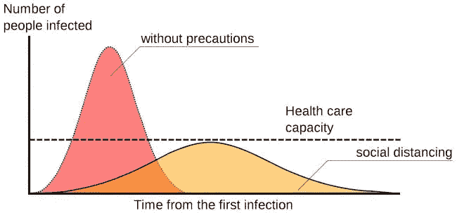
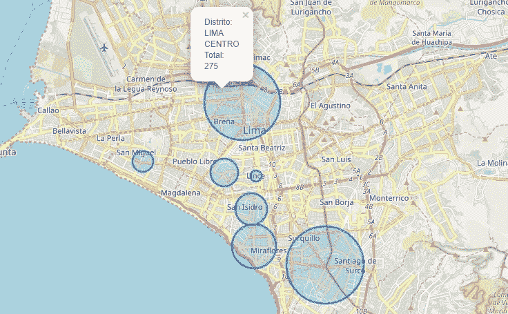

# 无人机和人工智能在新冠肺炎疫情期间加强社会隔离

> 原文：<https://towardsdatascience.com/drones-and-artificial-intelligence-to-enforce-social-isolation-during-covid-19-outbreak-783434b7dfa7?source=collection_archive---------38----------------------->

## 使用计算机视觉和无人驾驶车辆抗击冠状病毒的关键传播

由于缺乏疫苗，到目前为止，受新冠肺炎影响的国家的多个政府采取的最有效的建议之一是社会距离或隔离，以“拉平曲线”，这意味着可以通过避免公共场所和拥挤的地方来减缓传播，在特定的时间范围内达到较低的新病例数量，较低的感染率意味着医疗保健系统压力较小，每天较少的医院就诊和较少的病人被拒绝。

有和没有社会距离的样本流行曲线。(图片鸣谢:Johannes Kalliauer/ CC BY-SA 4.0)

在一些国家(比如我住在秘鲁的利马),强制性社会隔离的条件是呆在家里，除非你在特殊情况下必须外出，比如**补充食物、家庭或医疗紧急情况**。为了遵守这一模式，[秘鲁政府于 3 月 15 日发布了为期 15 天的全国紧急状态和边境关闭令(随后延长至 4 月 12 日)。然而，实施这一措施需要大量的](https://elcomercio.pe/lima/seguridad/emergencia-por-coronavirus-inicio-el-periodo-de-inmovilizacion-social-obligatoria-covid-19-toque-de-queda-martin-vizcarra-noticia/)[警察和军官在隔离期间 24/7](https://elcomercio.pe/lima/coronavirus-en-peru-toque-de-queda-las-calles-de-lima-quedaron-vacias-tras-medida-dictada-por-el-gobierno-fotos-pandemia-covid-19-nndc-noticia/?foto=6) 在街上巡逻，并且考虑到根据传染率的变化可能会延长这一措施。这可能需要相当高的时间和成本，此外还有街上巡逻人员的传染风险。

部署在利马街头的军事人员。来源:[https://elcomercio . PE/Lima/suce SOS/Estado-de-emergencia-Muertos-por-冠状病毒-cambios-en-El-minsa-y-otros-hechos-noticios-de-la-semana-fotos-nndc-noticia/？foto=5](https://elcomercio.pe/lima/sucesos/estado-de-emergencia-muertos-por-coronavirus-cambios-en-el-minsa-y-otros-hechos-noticiosos-de-la-semana-fotos-nndc-noticia/?foto=5)

一个想法是通过结合不同的人工智能技术，如无人机捕捉的图像处理和分类(计算机视觉),我们可以有效地加强这些措施。无人机是一种无人驾驶的交通工具，可以远程操作或配置为遵循预定义的路线，这样我们可以安全地在街上捕捉信息，减少官方人员传播的可能性，例如:

在将图像识别算法应用于视频并获得当前对象后，我们可以构建这些信息，并使用它来分析街道上的人、汽车、自行车或其他人的流量。现在有了这些结构化的信息，我们就可以制定战略和计划。

按地区显示检测到的人、汽车和自行车的数据。*重要提示:上面显示的数字仅用于演示目的，它们不是真实的，也不代表现实。

使用这些信息，我们可以实现以下一些目标:
**1)** 优化负责街道和大道的巡逻队的部署
**2)** 最大限度地降低 24/7 全天候监视的运营成本
**3)** 降低步行巡逻的传染风险
**4)** 覆盖因存在传染或高犯罪率而难以进入的区域
**5)** 将不合规区域之间的数据与社会隔离措施结合起来

我们必须用这一代人拥有的新武器来对抗这个疫情，其中一个也许是今天最重要的武器是我们可以用技术和现有算法生成的大量数据，这些数据赋予人工智能系统生命。

使用 OpenCV 的利马中心街道(原始视频:[https://www.youtube.com/watch?v=0myE-TDPqlI](https://www.youtube.com/watch?v=0myE-TDPqlI)

**技术细节:**

1.  第一个视频是用一架[泰洛无人机](https://www.ryzerobotics.com/tello)录制的
2.  我使用了一个 [YoloV2](https://pjreddie.com/darknet/yolov2/) 架构进行图像识别，并用 [COCO 数据集](http://cocodataset.org/)预先训练权重
3.  [叶子](https://python-visualization.github.io/folium/)供图

还有…学习的时候别忘了享受乐趣…

我自己训练的寻找蝙蝠侠的模型！

相关链接:

 [## 利用无人机技术和深度学习构建面罩监控系统- neptune.ai

### COVID19 的爆发让世界措手不及，影响了全球的政府、公司和个人。的…

海王星. ai](https://neptune.ai/blog/building-a-facemask-surveillance-system-with-drone-technology)  [## 紧急情况下，冠状病毒的死亡，在卫生部和其他地方的通知…

### 利马政治、司法和社会领域的各种问题。

elcomercio.pe](https://elcomercio.pe/lima/sucesos/estado-de-emergencia-muertos-por-coronavirus-cambios-en-el-minsa-y-otros-hechos-noticiosos-de-la-semana-fotos-nndc-noticia/?foto=5)  [## 两名罗文校友被困在秘鲁，作为对新冠肺炎宣布戒严令的回应

### 马丘比丘风景如画、连绵起伏的群山看起来就像是梦境。对于一个新的四人组…

thewhitonline.com](http://thewhitonline.com/2020/03/news/two-rowan-alumni-trapped-in-peru-as-martial-law-is-declared-in-response-to-covid-19/)  [## 冠状病毒:什么是“拉平曲线”，它会起作用吗？

### 努力完全控制新型冠状病毒——造成数十万人感染的疫情病毒

www.livescience.com](https://www.livescience.com/coronavirus-flatten-the-curve.html)  [## 计算机视觉的温和介绍-机器学习掌握

### 计算机视觉的最后更新，通常缩写为 CV，被定义为寻求发展的研究领域…

machinelearningmastery.com](https://machinelearningmastery.com/what-is-computer-vision/)