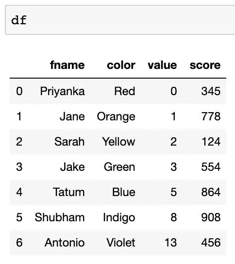
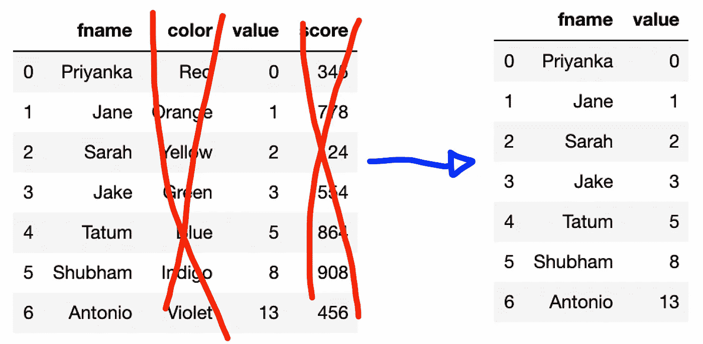
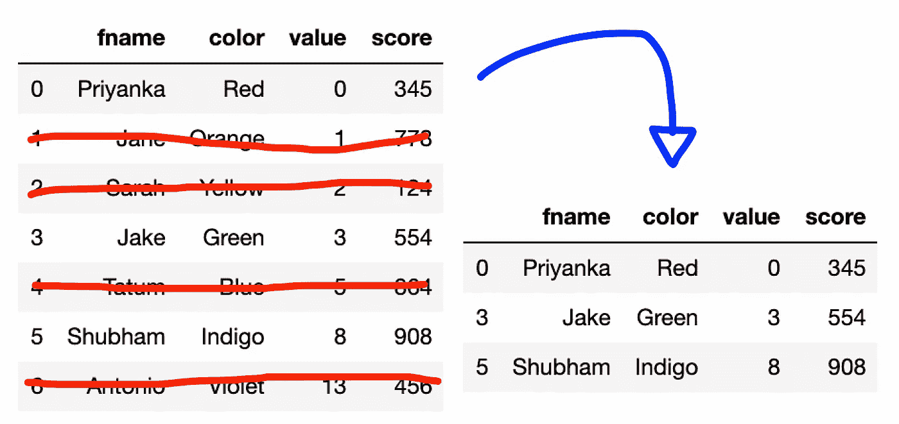
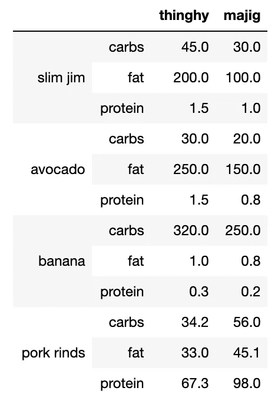
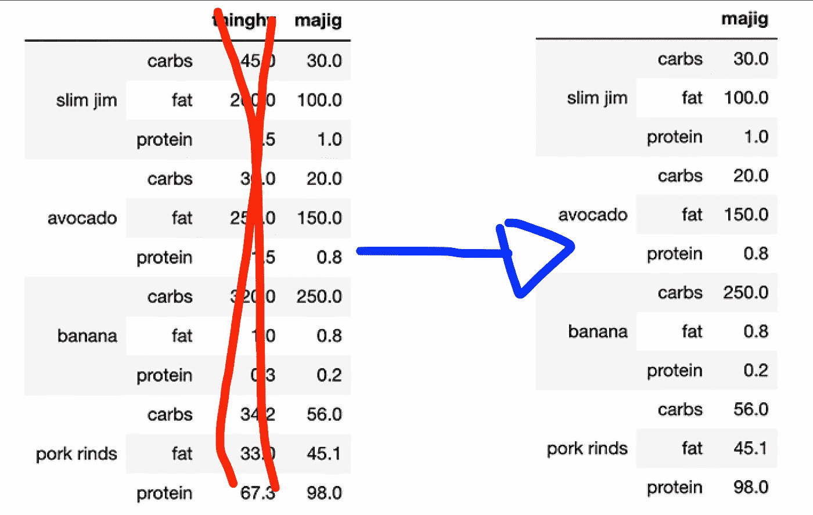
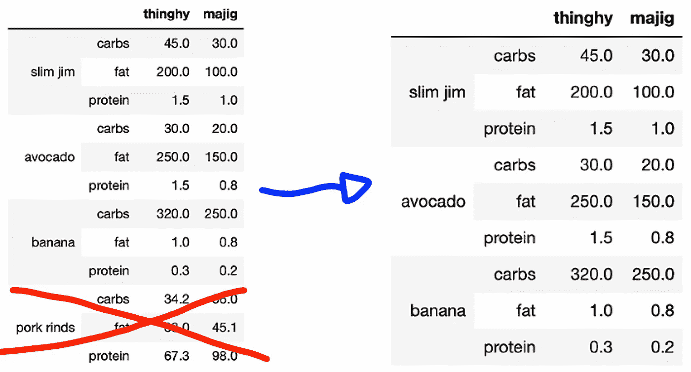
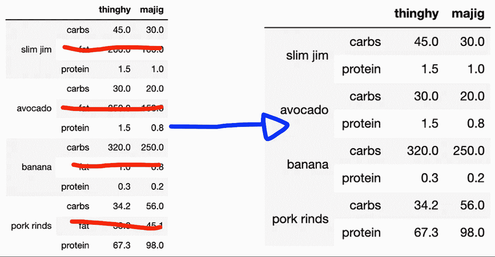
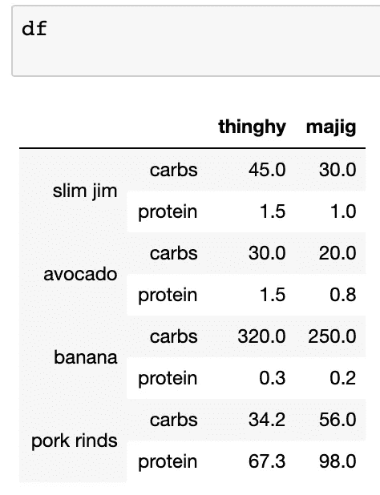

# 像热的一样放下它

> 原文：<https://towardsdatascience.com/drop-it-like-its-hot-82a5264c75d6?source=collection_archive---------54----------------------->

## 数据科学/ Python 代码片段

## 了解熊猫。DataFrame.drop 文档。

[爱默生·彼得斯](https://unsplash.com/@spemble?utm_source=unsplash&utm_medium=referral&utm_content=creditCopyText)在 [Unsplash](https://unsplash.com/s/photos/hot-charcoal?utm_source=unsplash&utm_medium=referral&utm_content=creditCopyText) 上拍摄的照片

我有一个经常性的梦，来自一个编码训练营的老师会不断地用尺子敲打我的头，告诉我去阅读一个包或库的文档。因此，作为过去，我会发现自己在钻研 Python 或 Panda 的文档。

*今天，我发现自己迷上了熊猫。drop()函数。因此，在这篇文章中，我将尝试理解熊猫为曾经著名的* `*.drop()*` *所写的文档。*

# 家政

让我们导入熊猫并创建一个样本数据框架。

如果我们在 Jupyter notebook 的一个单元格中键入`df`,就会得到完整的数据帧:

# 一级数据帧操作

现在让我们去掉一些列。

上面的代码只是告诉 Python 去掉`axis=1`中的`'color'`和`'score'`，这意味着在列中查找。或者，我们也可以很容易地不使用命名参数轴，因为它令人困惑。所以，现在让我们试试:

上述两种方法都会导致以下结果:

接下来，我们将删除一些行(或记录)。

上面，我们只是告诉 Python 去掉索引为 1、2、4 和 6 的行。请注意，索引是作为列表`[1, 2, 4, 6]`传递的。这将导致以下结果:

# 多索引数据帧操作

在下一轮中，我们将使用多索引数据框架。让我们来设置一下:

多索引数据帧如下所示:

现在，让我们去掉`'thinghy'`列:

这是我们得到的结果:

接下来，让我们去掉`'pork rinds'`，因为我不喜欢他们:

这是我们得到的结果:

最后，让我们削减脂肪:

以上，`level=1`简单来说就是第二级(因为第一级是从 0 开始的)。在这种情况下，它的碳水化合物，脂肪和蛋白质水平。通过指定`index='fat'`，我们告诉 Python 去掉`level=1`中的脂肪。

以下是我们得到的结果:

# 原地不动

到目前为止，通过我们所做的所有播放，不知何故，如果我们在单元格中键入`df`，我们将得到的输出是未经修改的原始数据帧。这是因为我们所做的所有更改只在显示屏上生效。

但是如果我们想让这些改变永久化呢？进入:*原地*。

上面，我们在参数中添加了`inplace=True`。这向 Python 发出了信号，我们希望更改能够生效，这样当我们输出`df`时，我们将得到如下结果:

我们已经永久性地切除了脂肪。LOL！

感谢您的阅读！今天到此为止。

*敬请期待！*

你可以通过 [Twitter](https://twitter.com/ecdedios) 或 [LinkedIn](https://www.linkedin.com/in/ednalyn-de-dios/) 联系我。