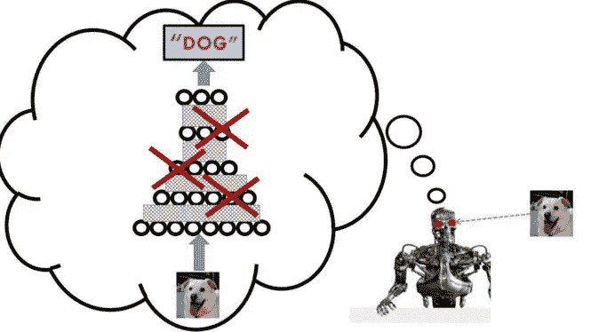
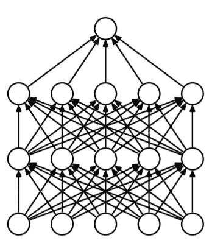
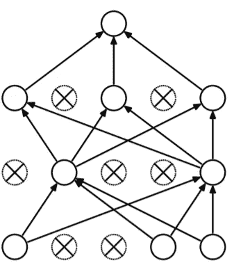

# 辍学直觉

> 原文：<https://towardsdatascience.com/dropout-intuition-87df344fce43?source=collection_archive---------29----------------------->

[图像来源](https://www.google.com/url?sa=i&source=images&cd=&cad=rja&uact=8&ved=2ahUKEwiNz5_ws4znAhVXVH0KHXOsDUYQjRx6BAgBEAQ&url=https%3A%2F%2Fwww.learningmachines101.com%2Flm101-030-how-to-improve-deep-learning-performance-with-artificial-brain-damage-dropout-and-model-averaging%2F&psig=AOvVaw1VuJRI12uFt901oQyaJq1F&ust=1579410681263607)

这篇文章的目的是提供一个非常简单的介绍背后的神经网络辍学的基本直觉。

当神经网络(NN)完全连接时，NN 中的所有神经元都投入工作，而不管它们在特定任务中是否有用。

全连接图层(图片来源— [链接](http://jmlr.org/papers/volume15/srivastava14a.old/srivastava14a.pdf)

假设我们将 100 个神经元放入一个神经网络来完成一个分类任务，但实际上，只有 50 个神经元足以完成同样的任务。现在，因为我们已经让所有的神经元开始工作，它们将会做它们的工作来提取它们认为对分类是必要的特征。

这些特征可以分为 3 种类型:

1.  最重要的功能(MSF)
2.  次要特征(LSF)
3.  噪声特征(NF)

## 最重要的特征

这些是数据中真正重要的部分，它们将极大地帮助我们对数据进行分类和归纳。有了它们，我们应该能够体面地进行分类。我们的神经网络需要提取这些特征。

## 不太重要的功能

这些是有好处的，但在分类中不起主要作用的。光靠他们，我们可能做不好分类。如果我们忽略了这些特征，也没关系。

## 噪声特征

这些是不好的特征，也不应该被神经网络拾取。这些特征对分类没有任何帮助。通过选取这些特征，神经网络将使数据过度拟合，而不会泛化。

因为我们已经让所有的神经元工作，并使用了梯度下降、随机梯度下降等方法来确保所有的神经元都工作，所以我们的神经元没有选择，只能从数据中选择所有类型的特征(MSF、LSF、NF)。这将导致过度拟合，并且神经网络不会泛化。

为了减少神经网络的过拟合和泛化，我们可以执行以下任一操作:

1.  找到分类所需的最佳神经元数量
2.  使用辍学技术

在我们的例子中，分类所需的最佳神经元数量是 50。但是，如果数据集发生变化，所需神经元的最佳数量也会发生变化。每次数据集改变时，寻找所需神经元的最佳数量是非常繁琐和不切实际的。因此，我们需要使用退出技术。

在 Dropout 中，我们在训练阶段随机丢弃 NN 中的一些神经元。假设我们随机丢弃神经网络中 50%的神经元。现在，分类的工作必须由剩下的 50%的神经元来完成。并且这些神经元不能懈怠并拾取不太重要和有噪声的特征，因为它们不会帮助我们分类，并且如果拾取的特征对分类没有帮助，梯度下降之类的东西会更多地惩罚 NN。因此，这些剩余的神经元被迫选择最重要的特征，这将减少过度拟合并更好地概括。

Dropout(图像源— [链接](http://jmlr.org/papers/volume15/srivastava14a.old/srivastava14a.pdf))

因此，在深度神经网络中，过度拟合的可能性非常高。因此，辍学作为一个正则化神经网络。要丢弃的神经元百分比是一个超参数，可以根据数据的过度拟合量进行调整。

这大致就是漏失如何在模型的泛化中发挥作用并提高其性能的。

# 参考

1.  [http://jmlr . org/papers/volume 15/srivastava 14 a . old/srivastava 14 a . pdf](http://jmlr.org/papers/volume15/srivastava14a.old/srivastava14a.pdf)