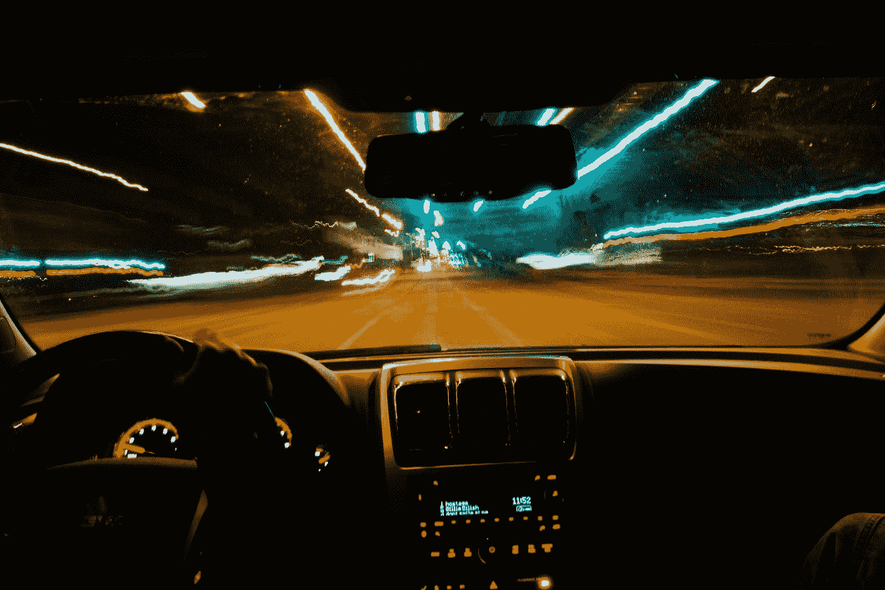
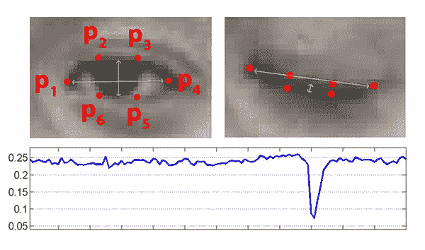
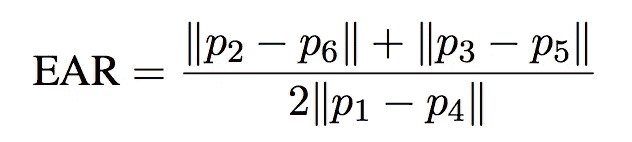
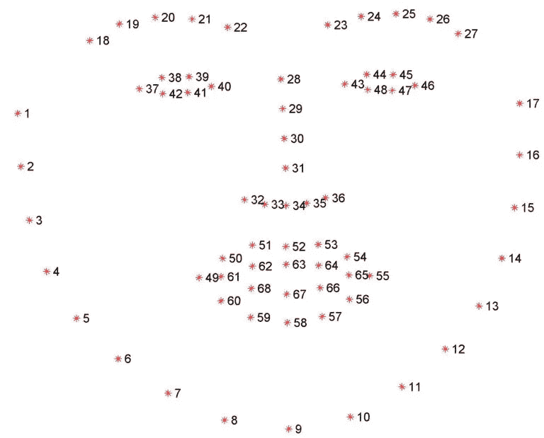
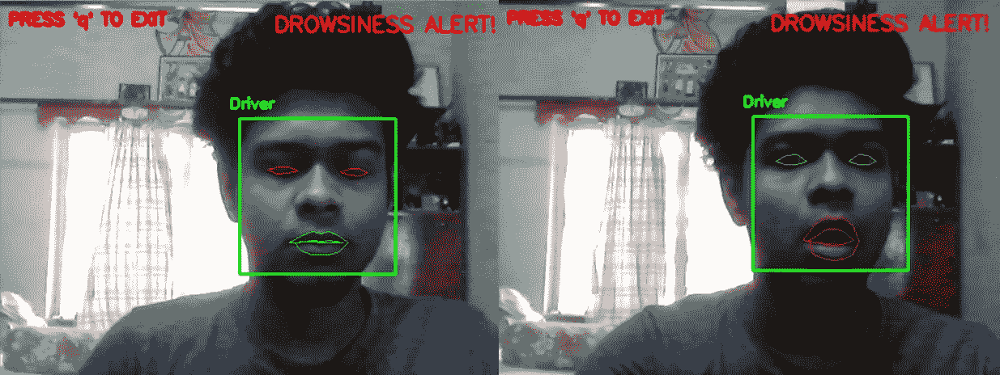
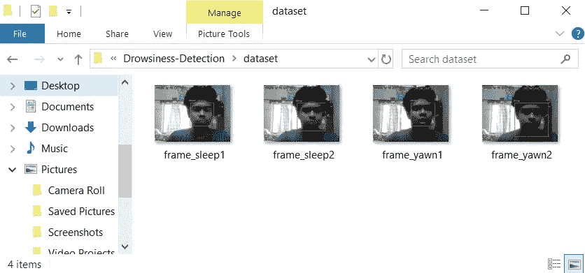
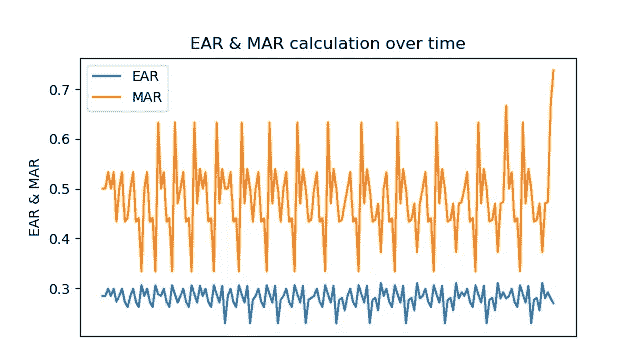

# 使用 OpenCV 和 Flask 的实时睡意检测系统。

> 原文：<https://towardsdatascience.com/drowsiness-detection-system-in-real-time-using-opencv-and-flask-in-python-b57f4f1fcb9e?source=collection_archive---------10----------------------->

## *本文概述了一种系统，该系统可检测一个人在驾驶时是否困倦，如果是，则通过使用语音信息实时提醒他。该系统使用网络摄像头和手机摄像头进行实时传输。*

由 [Gabe Pierce](https://unsplash.com/@gaberce?utm_source=medium&utm_medium=referral) 在 [Unsplash](https://unsplash.com?utm_source=medium&utm_medium=referral) 上拍摄

# **动机**

根据美国国家公路交通安全管理局的数据，每年大约有 100，000 起警方报告的交通事故与疲劳驾驶有关。这些事故导致超过 1550 人死亡，71000 人受伤。然而，实际数字可能要高得多，因为很难确定司机在撞车时是否困倦[1]。所以，为了让司机在任何此类事故发生前有所察觉，我们制定了这个系统。它预测眼睛和嘴巴的标志，以便通过检查一个人是闭着眼睛还是在打哈欠来识别他是否睡着了。

# **工作**

该系统的工作可分为两部分:

1.  检测或定位面部。
2.  预测检测到的人脸中重要区域的标志。

一旦预测了界标，我们仅使用眼睛界标和嘴巴界标来确定眼睛纵横比(耳朵)和嘴巴纵横比(MAR ),以检查人是否困倦。

EAR 和 MAR 的计算如下所示:

耳朵和标记计算。

现在，既然我们有了代码，让我们来理解这个代码是如何工作的:

dlib 库中预先训练的面部标志检测器用于估计映射到面部的面部结构的 68-(x，y)坐标的位置[2]。这些 68-(x，y)坐标代表面部的重要区域，如嘴、左眉、右眉、左眼、右眼、鼻子和下巴。其中，我们只需要左眼、右眼和嘴的(x，y)坐标。这是通过以下方式完成的:

提取左眼、右眼和嘴的索引。

现在，每只眼睛由一组 6-(x，y)坐标表示，从眼睛的左角开始(就好像你正在看着这个人)，然后围绕该区域的其余部分顺时针工作[3]:

*左上:*眼睛睁开时眼睛标志的可视化。*右上:*眼睛闭合时的眼睛标志。*底部:*绘制眼睛纵横比随时间的变化。眼睛纵横比的下降表示眨眼[3](soukupová和 ech 的图 1)。[4]

基于该论文， [***使用面部标志点的实时眨眼检测***](http://vision.fe.uni-lj.si/cvww2016/proceedings/papers/05.pdf) ，【5】然后我们可以导出反映这种关系的等式，称为*眼睛纵横比*(耳朵):

眼睛纵横比(EAR)方程。

利用这个概念，我们计算了嘴的长宽比:

用 68-(x，y)坐标表示面部。

正如我们看到的，嘴由一组 20-(x，y)坐标表示。因此，我们使用坐标 62、64、66 和 68，以与 EAR 计算相同的方式来计算它们之间的距离。

# 结果

当人困倦或打哈欠时发出警报。

此外，为了保留证据，我们保存了人感到昏昏欲睡的帧。

相框存放在单独的文件夹中作为凭证。

显示 EAR 和 MAR 随时间变化的图表。

使用网络摄像头通过流媒体进行系统演示:

使用手机摄像头通过流媒体进行系统演示:

GitHub 链接的源代码可从这里获得:

 [## 恐惧上帝/睡意探测

### 点击这里看演示根据美国国家公路交通安全管理局，每年约 10 万…

github.com](https://github.com/fear-the-lord/Drowsiness-Detection) 

# **参考文献**

[1]司机们在方向盘后面睡着了。疲劳驾驶事故的发生率:[https://www . NSC . org/road-safety/safety-topics/疲劳驾驶](https://www.nsc.org/road-safety/safety-topics/fatigued-driving)

【2】用 dlib、OpenCV 和 Python 实现的面部地标:[https://www . pyimagesearch . com/2017/04/03/face-landmarks-DLI b-OpenCV-Python/](https://www.pyimagesearch.com/2017/04/03/facial-landmarks-dlib-opencv-python/)

[3]利用 OpenCV、Python 和 dlib 进行眨眼检测:[https://www . pyimagesearch . com/2017/04/24/Eye-blink-detection-OpenCV-Python-dlib/](https://www.pyimagesearch.com/2017/04/24/eye-blink-detection-opencv-python-dlib/)

[4]使用 OpenCV 的睡意检测:[https://www . pyimagesearch . com/2017/05/08/瞌睡检测-opencv/](https://www.pyimagesearch.com/2017/05/08/drowsiness-detection-opencv/)

[5]使用面部标志的实时眨眼检测:[http://vision . Fe . uni-LJ . si/cvww 2016/proceedings/papers/05 . pdf](http://vision.fe.uni-lj.si/cvww2016/proceedings/papers/05.pdf)

# 访问我的作品集:

[https://souvik-portfolio-website.herokuapp.com/](https://souvik-portfolio-website.herokuapp.com/)