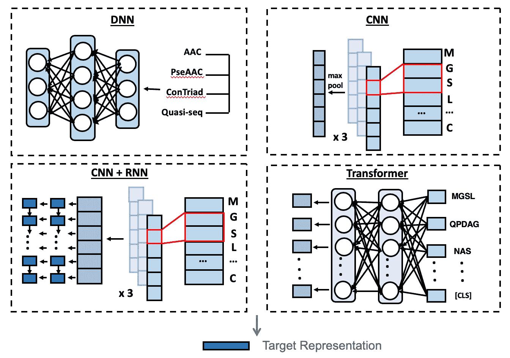
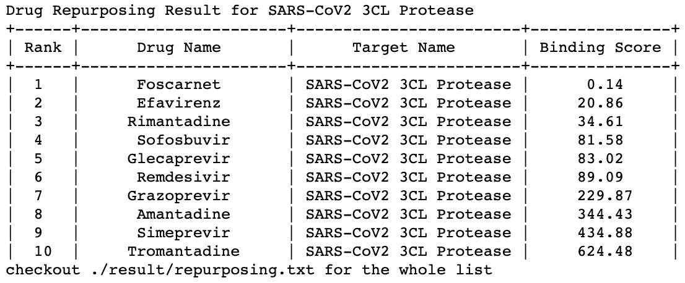

# 深度学习的药物发现。在 10 行代码之下。

> 原文：<https://towardsdatascience.com/drug-discovery-with-deep-learning-under-10-lines-of-codes-742ee306732a?source=collection_archive---------13----------------------->

## 介绍 DeepPurpose，这是一个基于深度学习的工具包，用于药物-靶标相互作用预测、药物再利用和虚拟筛选。

**TL；博士**:深度学习正在彻底改变药物研发行业。在这篇文章中，我将展示如何使用 DeepPurpose toolkit 来解锁 50 多个用于药物-靶标相互作用(DTI)预测的模型，这是药物发现中的一项基本任务，只使用了 scikit-learn 风格的几行代码。DeepPurpose 还提供了一个简单的界面来完成 DTI 预测的两个重要应用:虚拟筛选和药物再利用。

由[乔舒亚·科尔曼](https://unsplash.com/@joshstyle?utm_source=medium&utm_medium=referral)在 [Unsplash](https://unsplash.com?utm_source=medium&utm_medium=referral) 上拍摄的照片

**简介**

发现一种新药需要超过 10 年的时间，花费超过 26 亿美元。最近，许多用于药物发现的人工智能初创公司涌现出来，并成功应用深度学习技术来帮助药物发现研究，并大大缩短时间/节省成本[2，3]。因此，这是一个非常令人兴奋和蓬勃发展的领域💥！

然而，数据科学家社区对用于药物发现的深度学习的兴趣虽然增长迅速，但仍远远落后于其他深度学习应用，如 NLP 和图像。一个可能的原因是缺乏开源工具阻止了许多数据科学家探索这个令人兴奋的领域。现有的工具包，如 DeepChem、OpenChem、MoleculeNet 等。，极大地普及了深度学习在生命科学中的应用。在这篇文章中，我描述了一个名为 DeepPurpose 的新功能，它专门用于药物-靶标相互作用预测，这是药物发现过程的一项基本任务。所有数据科学家都喜欢 scikit-learn。因此，我们将 DeepPurpose 设计为一个 scikit-learn-fashion 框架，它用不到 10 行代码包装了 50 多个模型😇！

DeepPurpose 徽标。作者图片。

**背景**

先说一些生物化学的概念。疾病的主要类别通常归因于疾病途径中的靶蛋白。发现了一种调节靶蛋白的药物。通过这种疾病相关蛋白的调节，疾病可以被治愈。药物作用机制的主要范例之一是“锁和钥匙”理论[4]。蛋白质是一把“锁”🔒而药物发现就是找到正确的“钥匙”🔑以解开靶标(即，调节蛋白质的正确药物)。这种适合度被称为结合亲和力。

药物-靶标相互作用的“锁和钥匙”理论。Christopher Vakoc 授予的图像许可。

药物-靶标相互作用(DTI)测量药物分子与蛋白质靶标的结合亲和力。因此，我们很容易想象，一个准确的 DTI 深度学习模型可以大大有利于药物发现过程[5]。更具体地说，虚拟筛选和药物再利用是基于 DTI 的两个主要应用。虚拟筛选有助于识别可以与感兴趣的蛋白质结合的配体候选物，而药物再利用则为现有药物找到新的治疗目的。

任务说明。作者图片。

**深层目的概述**

DeepPurpose 将 DTI 模型公式化为一个编码器-解码器框架，它包括了大多数以前的作品[6，7，8，9，10]以及更多。两个编码器分别生成药物和蛋白质的嵌入，然后将它们连接到解码器，在解码器中预测结合亲和力得分。

一个编码器-解码器框架。作者图片。

DeepPurpose 使用最容易访问的输入数据格式。输入是药物靶标对，其中药物使用简化的分子输入行输入系统(SMILES)字符串，靶标使用氨基酸序列。输出是指示药物-靶标对的结合活性的分数。

药物和靶蛋白的表达。作者图片。

对于药物，我们提供 8 个编码器:四个经典的化学信息学指纹(摩根，Pubchem，Daylight 和 RDKit 2D)，上面有深度神经网络(DNN)；微笑字符串上的 1D 卷积神经网络(CNN ):CNN 之上的递归神经网络以平衡顺序次序；子结构分区指纹上的变压器编码器[11]；分子图上的信息传递神经网络。

药物编码器。作者图片。

对于目标蛋白质，我们有 7 个编码器:在四个经典计算生物学指纹(AAC，PseAAC，联合三联体，准序列)之上的 DNN；CNN 上的氨基酸序列；CNN 上面的 CNN 和变换子序列指纹。

目标编码器。作者图片。

组合起来，有 56 个(8 乘以 7)药物靶标编码模型！此外，大多数模型都很新颖🆕！

**深度目的框架**

现在，在我们对 DTI 和 DeepPurpose 有了概念性的概述之后，我开始介绍 DeepPurpose 编程框架。这个框架由几个步骤组成，每个步骤由一行代码组成:

*   数据加载
*   编码器规格
*   数据编码和分割
*   模型配置生成
*   模型初始化
*   模特培训
*   再利用/筛选
*   模型保存和加载

让我们回顾一下每一步！为了获得更好的学习体验，建议在您自己的 Jupyter 笔记本文件中或浏览[博客帖子笔记本](https://github.com/kexinhuang12345/DeepPurpose/blob/master/Tutorial_1_DTI_Prediction.ipynb)时遵循这些步骤。要安装 DeepPurpose，您可以使用 [DeepPurpose 活页夹云笔记本](https://mybinder.org/v2/gh/kexinhuang12345/DeepPurpose/master) ( *只需点击链接！*)或者使用本地的 DeepPurpose 环境。安装说明可以在[这里](https://github.com/kexinhuang12345/DeepPurpose#install--usage)找到，你也可以在这里找到[视频安装教程](https://youtu.be/bqinehjnWvE)。

**数据加载**

DeepPurpose 接受一个 NumPy 数组的药物微笑字符串(`X_drugs`)、一个 NumPy 数组的目标蛋白氨基酸序列(`X_targets`)和一个 NumPy 数组的标签(`y`)，它们可以是表示相互作用结果的二进制 0/1，也可以是表示结合亲和力值的实数。输入药物和目标阵列应该配对，即`y[0]`是`X_drugs[0]`和`X_targets[0]`的分数。DeepPurpose 将*根据数据集自动*在二元分类任务或回归任务之间切换。

除了通过自己的一些数据争论转换成 NumPy 数组之外，DeepPurpose 还提供了基准数据集加载器(DAVIS/KIBA/BindingDB)来简化预处理。例如，在本文中，我们将使用戴维斯数据集:

您还可以使用`dataset.read_file_training_dataset_drug_target_pairs`函数从 txt 文件加载您自己的数据集，其中每一行都是一个药物微笑字符串、一个目标氨基酸序列和结合分数。

**编码器规格**

获得所需的数据格式后，我们需要首先指定用于药物和蛋白质的编码器。在这里，我们尝试将`MPNN`用于药物，将`CNN`用于目标。**请注意，您可以通过更改编码名称来切换编码器。**此处列出了编码器的完整列表[。](https://github.com/kexinhuang12345/DeepPurpose#encodings)

(如果你正在使用 CPU 运行这篇博文，你会发现`MPNN`和`CNN`有点大，你可以尝试更小的编码器，比如用于药物的`Morgan`和用于蛋白质的`Conjoint_triad` 。)

**数据编码和拆分**

现在，我们需要使用`utils.data_process`函数为不同的编码器准备数据编码方案。在此功能中，我们可以指定训练/验证/测试分割分数、随机种子，以确保相同的数据分割具有重现性，并且还支持数据分割方法，如`cold_drug`和`cold_protein`，这些方法对药物/蛋白质进行分割以进行模型稳健性评估，从而测试未知的药物/蛋白质。该函数输出训练、验证和测试集 Pandas 数据帧。

**模型配置生成**

现在，我们用它的配置初始化一个模型。在此功能中，您几乎可以修改任何超参数(例如，学习率、时期、批量大小)、模型参数(例如，隐藏维度、过滤器大小)。此处的[链接](https://github.com/kexinhuang12345/DeepPurpose/blob/e169e2f550694145077bb2af95a4031abe400a77/DeepPurpose/utils.py#L486)中列出了支持的配置。

对于这篇博文，我们将纪元大小指定为 3，这样您就可以在 CPU 和 GPU 上快速运行，并可以继续下一步。有关参考参数，请查看[演示](https://github.com/kexinhuang12345/DeepPurpose/tree/master/DEMO)文件夹中的笔记本。

**模型初始化**

接下来，我们使用上述配置初始化模型:

**模特培训**

现在，只需输入`model.train`函数，它就可以开始训练了！

训练损耗曲线会自动打印出来。此外，如果任务是二元分类任务，测试集 ROC-AUC 和 PR-AUC 曲线也将打印出来。

自动生成的损耗曲线。作者图片。

**再利用/筛选**

训练完模型后，我们可以使用`models.repurpose`和`models.virtual_screening`函数简单地重新调整用途和筛选:

例如，假设我们想从一组抗病毒药物中重新确定一种新冠肺炎靶向 3CL 蛋白酶的用途。我们已经在`dataset`包装器中提供了相应的数据。

自动生成并打印出候选药物的排序列表:

自动生成重新调整结果的排序列表。作者图片。

接下来，我们展示如何对来自 BindingDB 数据集的数据样本进行虚拟筛选，然后使用`virtual_screening`函数生成具有高结合亲和力的药物-靶标对的列表。如果没有提供药物/目标名称，则使用药物/目标列表的索引。将生成一个类似的排序列表。

**模型保存和加载**

最后，保存和加载模型也非常容易。加载功能还会自动检测模型是否在多个 GPU 上进行了训练。保存和加载我们刚刚训练的模型的示例:

我们还提供了一个预训练模型的列表，您可以在[列表](https://github.com/kexinhuang12345/DeepPurpose#pretrained-models)下找到所有可用的模型。例如，要加载在 BindingDB Kd 数据集上预先训练的`MPNN+CNN`模型:

就是这样！现在，您可以为药物-靶标相互作用预测任务训练一个最先进的深度学习模型👏！

DeepPurpose 还支持许多更多的功能，例如，这个[演示](https://github.com/kexinhuang12345/DeepPurpose/blob/master/DEMO/Drug_Property_Pred-Ax-Hyperparam-Tune.ipynb)展示了如何使用 Ax 平台在 DeepPurpose 上进行贝叶斯优化等最新的超参数调优方法。

最后但并非最不重要的是，许多现实世界的药物开发涉及化验数据，这意味着数据仅由药物分子和与目标或细菌的结合分数组成。这个问题也被称为药物性质预测任务。DeepPurpose 还通过仅使用药物编码器来预测结合分数来支持这项任务。该框架与 DTI 预测非常相似，如下所示:

更详细的分步说明，你可以在这里找到这篇博文的笔记本:[ [DTI 预测](https://github.com/kexinhuang12345/DeepPurpose/blob/master/Tutorial_1_DTI_Prediction.ipynb) ][ [药性预测](https://github.com/kexinhuang12345/DeepPurpose/blob/master/Tutorial_2_Drug_Property_Pred_Assay_Data.ipynb) ]。

这就结束了我们关于 DeepPurpose 和 DTI 预测的博文！我希望你喜欢它，并对深度学习和药物发现的令人兴奋的交叉感兴趣，如果你还没有的话！我们还呼吁数据科学家为这个开源项目做出贡献！

**了解更多，这里有** [**论文**](http://arxiv.org/abs/2004.08919) **和** [**Github 资源库**](https://github.com/kexinhuang12345/DeepPurpose) **，请明星、分享、投稿！**

**这是傅天凡、卢卡斯·格拉斯、马林卡·兹尼克、和孙的合作作品。**

**如果您有任何问题或反馈，请随时通过*kexinhuang@hsph.harvard.edu*联系我；或者干脆在推特上 PM 我**[***@ kexinhuang 5***](https://twitter.com/KexinHuang5)**！**

**参考**

[1] Mullard，a .新药开发花费了 26 亿美元。*《自然评论》药物发现* (2014)。

[2]弗莱明，Nic。人工智能如何改变药物发现？*性质* (2018)。

[3]斯马利，e .人工智能驱动的药物发现引起了制药公司的兴趣。*《自然生物技术》* (2017)。

[4] Gschwend DA，好 AC，昆茨 ID。面向药物发现的分子对接。*分子识别杂志:跨学科杂志* (1996)。

[5] Mayr，Andreas，等. ChEMBL 上药物靶点预测的机器学习方法大规模比较。*化学科学* (2018)。

[6]ZTürk H，Ozkirimli E. DeepDTA:深层药物-靶点结合亲和力预测。*生物信息学* (2018)。

[7] Nguyen，Thin，Hang Le 和 Svetha Venkatesh。GraphDTA:使用图形卷积网络预测药物-靶标结合亲和力。 *BioRxiv* (2019)。

[8]椿、正史、健太郎富井和濑濑纯。化合物-蛋白质相互作用预测，对图形和序列的神经网络进行端到端学习。*生物信息学* (2019)。

[9] Lee，Ingoo，Jongsoo Keum 和 Hojung Nam。DeepConv-DTI:通过对蛋白质序列进行卷积的深度学习来预测药物与靶标的相互作用。 *PLoS 计算生物学* (2019)。

[10]陈，邢等.药物-靶标相互作用预测:数据库、网络服务器和计算模型.*生物信息学简报* (2016)。

[11]黄 K，肖 C，黄 T，格拉斯 L，孙 j .卡斯特:用化学亚结构表示法预测药物相互作用。AAAI (2020)。