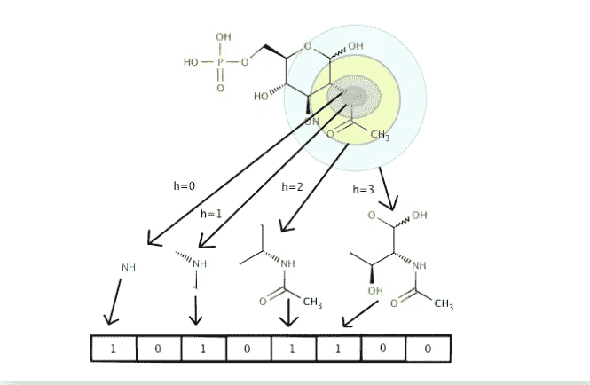
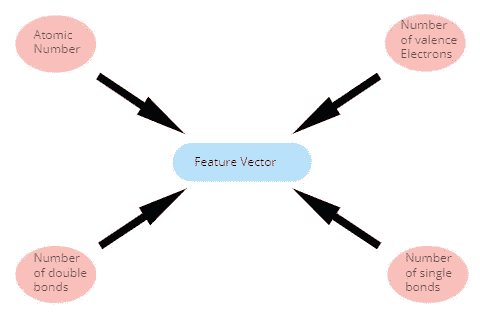

# 图形神经网络药物发现—第一部分

> 原文：<https://towardsdatascience.com/drug-discovery-with-graph-neural-networks-part-1-1011713185eb?source=collection_archive---------17----------------------->

## 预测溶解度

## 了解如何使用生命科学的深度学习库 Deepchem 通过 GNNs 预测分子溶解度。

米拉德·b·法库里安在 [Unsplash](https://unsplash.com?utm_source=medium&utm_medium=referral) 上的照片

## **相关材料**

*   [Jupyter 笔记本作文章](https://github.com/KacperKubara/ml-cookbook/tree/master/drug_discovery_with_gnns)
*   [利用图形神经网络进行药物发现—第二部分](/drug-discovery-with-graph-neural-networks-part-2-b1b8d60180c4)
*   [利用图形神经网络进行药物发现—第三部分](/drug-discovery-with-graph-neural-networks-part-3-c0c13e3e3f6d)
*   [化学信息学简介](/introduction-to-cheminformatics-7241de2fe5a8)
*   [图形的特征提取](https://medium.com/me/stats/post/625f4c5fb8cd)
*   [走向可解释图神经网络](/towards-explainable-graph-neural-networks-45f5e3912dd0)
*   [图上的机器学习任务](/machine-learning-tasks-on-graphs-7bc8f175119a)

## 目录

*   介绍
*   药物开发和机器学习之间的特殊化学
*   为什么分子溶解度很重要
*   用图形神经网络解决问题
*   Deepchem 的实际操作部分
*   关于我
*   参考

# 介绍

这篇文章是药物发现背后的理论，图形神经网络和 Deepchem 库的实用部分的混合。第一部分将讨论机器学习在药物开发中的潜在应用，然后解释哪些分子特征可能对图形神经网络模型有用。然后，我们深入到编码部分，创建了一个可以预测分子溶解度的 GNN 模型。我们开始吧！

# 药物开发和机器学习之间的特殊化学

丹尼斯·约翰逊在 [Unsplash](https://unsplash.com?utm_source=medium&utm_medium=referral) 上拍摄的照片

药物开发是一个耗时的过程，可能需要几十年才能批准药物的最终版本[1]。它从药物发现的初始阶段开始，在此阶段它识别可能成为药物的某些分子组。然后，它经过几个步骤来排除不合适的分子，最后在现实生活中进行测试。在药物研发阶段，我们关注的重要特征是 **ADME** ( **A** 吸收、 **D** 分布、 **M** 代谢和 **E** 代谢)特性。我们可以说，药物发现是一个优化问题，我们预测 ADME 性质，并选择那些可能增加开发安全药物可能性的分子[2]。高效的计算方法可以发现具有理想特性的分子，从而加速药物开发过程，并提供相对于其他研发公司的竞争优势。

机器学习应用于药物发现只是时间问题。这允许以前所未有的速度和精度处理分子数据集[3]。然而，为了使分子结构适用于机器学习，必须执行许多复杂的预处理步骤，例如将 3D 分子结构转换为 [1D 指纹向量](/introduction-to-cheminformatics-7241de2fe5a8)，或者从分子中的特定原子提取数字特征。

# 为什么分子溶解度很重要

ADME 的特性之一，吸收，决定了药物是否能有效地到达患者的血流中。吸收背后的因素之一是水溶性，即某种物质是否可溶于水。如果我们能够预测溶解度，我们也可以很好地了解药物的吸收特性。

# 用图形神经网络解决问题

为了将 GNNs 应用于分子结构，我们必须将分子转换成模型可以理解的数字表示。这是一个相当复杂的步骤，它将根据 GNN 模型的具体架构而变化。幸运的是，大部分预处理被外部库覆盖，比如 [Deepchem](https://deepchem.readthedocs.io/en/latest/featurizers.html) 或 [RDKit](https://www.rdkit.org/docs/source/rdkit.Chem.Descriptors.html) 。

在这里，我将快速解释预处理分子结构的最常见的方法。

## 笑容

SMILES 是分子 2D 结构的字符串表示。它将任何分子映射到一个特殊的字符串，这个字符串(通常)是唯一的，可以映射回 2D 结构。有时，不同的分子可以映射到同一个微笑字符串，这可能会降低模型的性能。

## 指纹

将分子结构转换成圆形指纹。[【来源】](https://chembioinfo.wordpress.com/2011/10/30/revisiting-molecular-hashed-fingerprints/)

指纹是一个二元向量，其中每一位代表分子的某个*亚结构*是否存在。它通常很长，可能无法包含一些结构信息，如*手性*。

## 邻接矩阵和特征向量

另一种预处理分子结构的方法是创建一个*邻接矩阵*。邻接矩阵包含关于原子连接性的信息，其中“1”表示它们之间有连接，“0”表示没有连接。邻接矩阵是稀疏的，并且通常很大，这可能不是非常有效的工作。

CH4(甲烷)转换成邻接矩阵(右上)、特征向量的向量(右中)和特征对向量的矩阵(右下)。邻接矩阵为我们提供了原子间连接性的信息，例如碳 **C** 连接到自身和所有其他 **H** 原子(邻接矩阵的第一行)。单个特征向量，假设为 v0，包含关于特定原子的信息。单个特征对向量包含关于两个相邻原子的信息，并且它通常是一个函数(和、平均等)。)的两个特征向量。

有了这个矩阵，我们可以以矢量的形式向 GNN 模型提供关于每个单个原子的信息和关于相邻原子的信息。在每个原子的特征向量中，可以有关于原子序数、价电子数或单键数的信息。当然还有更多，幸运的是它们可以由 RDKit 和 Deepchem 生成，

特征向量通常包含关于特定原子的信息。这个向量通常是通过使用 RDKit 或 Deepchem 包中的功能生成的。

## 溶解度

我们要预测的变量叫做 *cLogP* 和也被称为辛醇-水分配系数。基本上，值越低，它在水中的溶解度越大。 *clogP* 是一个对数比，因此值的范围从-3 到 7 [6]。

还有一个描述溶解度*对数*的更通用的等式:

溶解度方程。 ***MP*** 是熔点(摄氏度)。 **logKow** 是辛醇-水分配系数，又名。 **cLogP**

这个等式的问题是 MP 很难从分子的化学结构中预测出来。所有可用的溶解度数据集仅包含 *cLogP* 值，这也是我们将要预测的值。

# Deepchem 的实际操作部分

[*可以自己跑的 Colab 笔记本来了。*](https://github.com/KacperKubara/ml-cookbook/tree/master/drug_discovery_with_gnns)

[Deepchem](https://github.com/deepchem/deepchem) 是一个面向生命科学的深度学习库，构建在 Tensorflow、Numpy 或 RDKit 等少数几个包之上。对于分子数据，它提供了方便的功能，如数据加载器、数据拆分器、特征化器、指标或 GNN 模型。根据我的经验，设置起来很麻烦，所以我建议在我提供的 Colab 笔记本上运行它。我们开始吧！

首先，我们将下载 Delaney 数据集，它被认为是溶解度预测任务的基准。然后，我们使用 *CSVLoader* 类加载数据集，并指定一个包含 *cLogP* 数据的列，该数据被传递到 *tasks* 参数中。在 *smiles_field 中，必须指定带有 smiles 字符串的列的名称。我们选择一个 ConvMolFeaturizer，它将按照我们将要使用的 GNN 模型所要求的格式创建输入要素。*

随后，我们使用 *RandomSplitter* 分割数据集，并将数据分为训练集和验证集。我们还对 *y* 值进行了归一化处理，因此它们的平均值和单位标准偏差为零。

在这个例子中，我们将使用一个 GraphConvModel 作为我们的 GNN 模型。这是一个由 Duvenaud 等人创建的架构。你可以在这里找到他们的论文[。](https://arxiv.org/pdf/1509.09292.pdf)作为 Deepchem 软件包的一部分，还有其他 GNN 模型，如 WeaveModel 或 DAGModel。您可以在此找到带有所需特征的型号的完整列表[。](https://deepchem.readthedocs.io/en/latest/models.html)

在这个代码片段中，还定义了一个人的 R2 分数。简单来说，这个值越接近 1，模型越好。

Deepchem 型号使用 Keras API。用 *fit()* 函数训练*图形 _conv* 模型。您也可以在这里指定历元的数量。我们用 *evaluate()* 函数得到分数。这里必须传递规格化器，因为在计算指标分数之前，需要将 *y* 值再次映射到之前的范围。

仅此而已！你可以用 Deepchem 做更多有趣的事情。他们创建了一些教程来展示你还可以用它做什么。我强烈建议过目一下。你可以在这里找到它们。

*感谢您阅读本文，希望对您有用！*

# 关于我

我是阿姆斯特丹大学的人工智能硕士学生。在我的业余时间，你可以发现我摆弄数据或者调试我的深度学习模型(我发誓这很有效！).我也喜欢徒步旅行:)

如果你想了解我的最新文章和其他有用的内容，以下是我的社交媒体资料:

*   [中等](https://medium.com/@kacperkubara)
*   [领英](https://www.linkedin.com/in/kacperkubara/)
*   [Github](https://github.com/KacperKubara)
*   [个人网站](https://kacperkubara.com/)

# 参考

[1] **早期药物发现:化学信息学和计算技术在识别先导序列中的应用:**[https://www . science direct . com/science/article/ABS/pii/s 0968089612003598](https://www.sciencedirect.com/science/article/abs/pii/S0968089612003598)

**[https://www.cambridgemedchemconsulting.com/resources/ADME/](https://www.cambridgemedchemconsulting.com/resources/ADME/)ADME 属性**

**[3] **化学信息学和药物发现中的机器学习**:[https://www . science direct . com/science/article/pii/s 1359644617304695](https://www.sciencedirect.com/science/article/pii/S1359644617304695)**

**[4]**QSAR 和药物设计研究中的分子拓扑**:[https://www . research gate . net/publication/236018587 _ Molecular _ topology _ in _ QSAR _ and _ drug _ design _ studies](https://www.researchgate.net/publication/236018587_Molecular_topology_in_QSAR_and_drug_design_studies)**

**[5] **重访分子哈希指纹**:[https://chem bio info . WordPress . com/2011/10/30/重访-分子哈希指纹/](https://chembioinfo.wordpress.com/2011/10/30/revisiting-molecular-hashed-fingerprints/)**

**[6] **山本浩司博士讲座笔记:**[http://www . piri ka . com/ENG/TCPE/logP-theory . html #:~:text = Definition % 3A，% 2Dphase %辛醇% 2f 水% 20 系统。&text = Values % 20 of % 20 kow % 20 is % 20 thus % 2C % 20 无单位。&text = Values %20 of % 20 kow % 20 通常为% 20，(20% 20 或%2025'C.](http://www.pirika.com/ENG/TCPE/logP-Theory.html#:~:text=Definition%3A,%2Dphase%20octanol%2Fwater%20system.&text=Values%20of%20Kow%20are%20thus%2C%20unitless.&text=Values%20of%20Kow%20are%20usually,(20%20or%2025'C.)**

**【7】**预测水溶性——比看起来难**:[http://practical chem informatics . blogspot . com/2018/09/Predicting-hydro-Solubility-its . html](http://practicalcheminformatics.blogspot.com/2018/09/predicting-aqueous-solubility-its.html)**