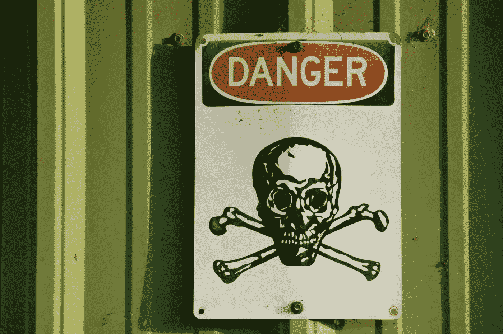
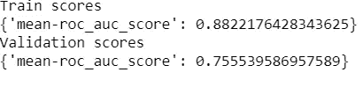

# 图形神经网络药物发现—第二部分

> 原文：<https://towardsdatascience.com/drug-discovery-with-graph-neural-networks-part-2-b1b8d60180c4?source=collection_archive---------30----------------------->

## 预测毒性

## 了解如何使用 Deepchem(生命科学的深度学习库)预测 GNNs 的毒性。

马修·T·雷德在 [Unsplash](https://unsplash.com?utm_source=medium&utm_medium=referral) 上的照片

## 相关材料

*   [朱庇特笔记本作文章](https://github.com/KacperKubara/ml-cookbook/blob/master/drug_discovery_with_gnns/toxicity.ipynb)
*   [用图形神经网络发现药物—第一部分](/drug-discovery-with-graph-neural-networks-part-1-1011713185eb)
*   [利用图形神经网络进行药物发现—第三部分](/drug-discovery-with-graph-neural-networks-part-3-c0c13e3e3f6d)
*   [化学信息学简介](/introduction-to-cheminformatics-7241de2fe5a8)
*   [图形的特征提取](https://medium.com/me/stats/post/625f4c5fb8cd)
*   [走向可解释图神经网络](/towards-explainable-graph-neural-networks-45f5e3912dd0)
*   [图上的机器学习任务](/machine-learning-tasks-on-graphs-7bc8f175119a)

## 目录

*   介绍
*   用图形神经网络解决问题
*   Deepchem 的实际操作部分
*   关于我
*   参考

# 介绍

在本文中，我们将涵盖另一个决定药物能否通过安全性测试的关键因素— **毒性**。事实上，毒性占被拒绝的候选药物的 30%，使其成为药物开发阶段考虑的最重要因素之一[1]。机器学习在这里将被证明是非常有益的，因为它可以在药物发现过程的早期阶段筛选出有毒的候选药物。

我假设你已经阅读了我的上一篇文章，它解释了我将在这篇文章中使用的一些主题和术语:)让我们开始吧！

# 用图形神经网络解决问题

特征工程部分与本系列的第 1 部分中的[非常相似。为了将分子结构转换为 GNNs 的输入，我们可以创建分子指纹，或者使用邻接矩阵和特征向量将其输入到图形神经网络中。这个特性可以由外部软件自动生成，如 RDKit 或 Deepchem，所以我们不必太担心它。](https://medium.com/me/stats/post/1011713185eb)

## 毒性

最大的区别在于机器学习任务本身。毒性预测是一项**分类**任务，与溶解度预测相反，溶解度预测是一项回归任务，我们可能还记得上一篇文章。有许多不同的毒性效应，如致癌性、呼吸毒性、刺激/腐蚀等[2]。这使得工作变得稍微复杂了一些，因为我们可能还要处理不平衡的班级。

幸运的是，毒性数据集通常比溶解度数据集大得多。例如，当用于溶解度预测的 Delaney 数据集只有大约 3k 训练样本时，Tox21 数据集具有大约 12k 训练样本。这使得神经网络架构成为一种更有前途的方法，因为它可以捕捉更多隐藏的信息。

## Tox21 数据集

[Tox21 数据集](https://tripod.nih.gov/tox21/challenge/about.jsp)是作为一个项目创建的，该项目挑战研究人员开发机器学习模型，以在给定数据上实现最高性能。它包含 12 种不同的标签，每一种都表示不同的毒性效应。总体而言，该数据集有 12，060 个训练样本和 647 个测试样本。

这一挑战的获胜方法是 DeepTox [3],这是一种深度学习管道，利用化学描述符来预测毒性类别。它高度表明深度学习是最有效的方法，图形神经网络有潜力实现更高的性能。

# Deepchem 的实际操作部分

[*可以自己跑的 Colab 笔记本来了。*](https://github.com/KacperKubara/ml-cookbook/blob/master/drug_discovery_with_gnns/toxicity.ipynb)

首先，我们导入必要的库。*这里没有什么新东西* —我们将使用 Deepchem 根据 Tox21 数据训练一个 GNN 模型。GraphConvModel 是由 Duvenaud 等人创建的架构。它使用指纹算法的修改版本，使它们具有可区分性(因此我们可以进行梯度更新)。这是第一个 GNN 体系结构，被设计用来处理图形的分子结构。

Deepchem 包含了一个方便的 API 来为我们加载 Tox21。 *load_tox21* 功能。我们选择一个特征器作为 *GraphConv* —它将创建化学描述符(即特征)来匹配我们模型的输入要求。由于这是一项分类任务，ROC AUC 分数将被用作一项指标。

Deepchem 的美妙之处在于模型使用了类似 Keras 的 API。我们可以用。*拟合*函数。我们将 *len(tox21_tasks)* 传递给模型的参数*、*，这是一些标签(本例中是 12 个)。这将设置最终层的输出大小为 12。我们使用 32 的批量大小来加快计算时间，并指定模型用于分类任务。该模型需要几分钟时间在 Google Colab 笔记本上进行训练。

训练完成后，我们可以评估模型。这一点也不难——我们仍然可以使用 Keras API 来完成这一部分。ROC AUC 分数通过*获得。评估*功能。

在我的病例中，训练 ROC AUC 得分高于验证 ROC AUC 得分。这可能表明模型对某些分子过度拟合。

你可以用 Deepchem 做更多的事情。它包含几个不同的 GNN 模型，像本教程一样易于使用。我强烈建议看看他们的教程。对于毒性任务，他们收集了几个用不同模型运行的不同例子。你可以在这里找到[。](https://github.com/deepchem/deepchem/tree/master/examples/tox21)

*感谢您阅读本文，希望对您有用！*

# 关于我

我是阿姆斯特丹大学的人工智能硕士学生。在我的业余时间，你可以发现我摆弄数据或者调试我的深度学习模型(我发誓这很有效！).我也喜欢徒步旅行:)

如果你想了解我的最新文章和其他有用的内容，以下是我的社交媒体资料:

*   [中等](https://medium.com/@kacperkubara)
*   [领英](https://www.linkedin.com/in/kacperkubara/)
*   [Github](https://github.com/KacperKubara)
*   [个人网站](https://kacperkubara.com/)

# 参考

**【1】“制药业能降低流失率吗？”:【https://pubmed.ncbi.nlm.nih.gov/15286737/[T21](https://pubmed.ncbi.nlm.nih.gov/15286737/)**

**【2】“使用机器学习方法和结构警报对药物设计的化学毒性进行计算机预测”:**[https://www.ncbi.nlm.nih.gov/pmc/articles/PMC5826228/](https://www.ncbi.nlm.nih.gov/pmc/articles/PMC5826228/)

**【3】Deep tox:利用深度学习进行毒性预测:**[https://www . frontier sin . org/articles/10.3389/fenvs . 2015.00080/full](https://www.frontiersin.org/articles/10.3389/fenvs.2015.00080/full)