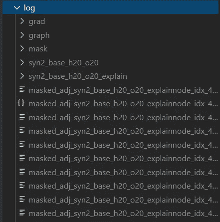

# 用图形神经网络发现药物——第三部分

> 原文：<https://towardsdatascience.com/drug-discovery-with-graph-neural-networks-part-3-c0c13e3e3f6d?source=collection_archive---------43----------------------->

## GNN 解释方法实用教程

GNNExplainer 的可视化

# 相关材料

*   [用图形神经网络发现药物—第一部分](/drug-discovery-with-graph-neural-networks-part-1-1011713185eb)
*   [用图形神经网络发现药物—第二部分](/drug-discovery-with-graph-neural-networks-part-2-b1b8d60180c4)
*   [走向可解释图神经网络](/towards-explainable-graph-neural-networks-45f5e3912dd0)
*   [图形的特征提取](https://medium.com/me/stats/post/625f4c5fb8cd)
*   [面向可解释图的神经网络](/towards-explainable-graph-neural-networks-45f5e3912dd0)
*   [图上的机器学习任务](/machine-learning-tasks-on-graphs-7bc8f175119a)

# 目录

*   什么是解释技巧
*   我们为什么要烦恼呢？
*   GNN 解释方法的工具
*   GNNExplainer 的实际操作部分
*   关于我
*   参考

# 什么是解释技巧

类别映射的一个例子——卷积神经网络的解释方法之一。[【来源】](http://cnnlocalization.csail.mit.edu/)

解释技巧帮助我们理解模型的行为。例如，解释方法被用于形象化图像的某些部分，或者观察它如何对某个输入做出反应。这是一个成熟的机器学习领域，具有许多不同的技术，可以应用于深度学习(例如，类激活图、梯度属性)和其他机器学习算法(例如，LIME)。

然而，只有少数人试图为图形神经网络(GNNs)创建解释方法。大部分在深度学习中开发的“重用”方法，并试图将其应用于图形领域。

如果你想了解更多关于可解释 GNNs 的最新研究，我强烈推荐你看看我以前的文章。在这里，我将保持理论简短，并集中于如何使用现有的 GNN 解释包，GNNExplainer。

# 我们为什么要烦恼呢？

深度学习模型可以有数百万个参数，它们经常以黑盒的形式出现在我们面前[1]。很难说这个模型将如何对新数据做出反应，以及为什么它会在给定特定输入的情况下做出某些预测。

通过解释方法，我们希望在模型中建立信任。它们从模型中提供了额外的见解，使模型更加透明和可解释。通过发展对模型的信任，我们可以安全地部署模型以供更广泛的使用。

# GNN 解释方法的工具

不幸的是，对 GNNs 解释方法的研究相当新，所以没有很多现成的工具和研究论文。Duvenaud 等人在[2]中完成了关于该主题的第一批工作之一。他设法创造了一种梯度归因方法，突出了触发预测的某些分子亚结构。例如，他们的方法可以突出使分子有毒或可溶于水的分子亚结构。

突出显示了触发溶解度预测的分子亚结构。[【来源】](https://arxiv.org/abs/1509.09292)

幸运的是，斯坦福大学的研究人员开发了一种模型不可知的 GNN 解释方法，GNNExplainer [3]。在本文的剩余部分，我们将探索如何使用他们的工具。

如果你没有时间阅读关于 GNNExplainer 实现的整篇文章，但是你仍然想对它的工作原理有一个直观的了解，看看[我的文章](/towards-explainable-graph-neural-networks-45f5e3912dd0)。

# GNNExplainer 的实际操作部分

[你可以在这里找到 GNNExplainer 知识库。](https://github.com/RexYing/gnn-model-explainer)

[通过我的个人笔记链接到安装说明。](https://github.com/KacperKubara/ml-cookbook/blob/master/drug_discovery_with_gnns/gnn_explainer_setup.md)

GNNExplainer 的交互式可视化。在“Syn2”数据集上运行。

GNNExplainer 实际上是第一个模型无关的开源工具，可用于 GNN 解释。斯坦福大学的研究人员做了大量工作来创建这个通用工具，但它包含很少的错误，并且相当难以设置。在本指南中，我将讨论我在安装过程中遇到的一些问题，并指导你如何创建如上图的 GNN 解释。

## 装置

***请注意:*** *我的设置是支持 CUDA 的 GPU 的 Windows OS。安装说明可能不适用于不同的设置。但是，我将尝试指出您可能需要调整的步骤，以使其适用于其他操作系统需求。如果你只是好奇这个包是如何工作的，没有时间安装，请跳过这个说明。*

要安装 GNNExplainer，先决条件是[已经安装了 conda】。他们资源库的安装说明也可以在](https://docs.conda.io/en/latest/miniconda.html) [Github](https://github.com/RexYing/gnn-model-explainer/blob/master/INSTALLATION.md) 上找到。它们不适合我的设置，也没有什么错误，所以我花了一些时间根据我的需要调整安装说明。我的设置的工作说明如下。如果您有不同的操作系统，您可能需要更改 cudatoolkit 版本，或者安装没有 CUDA 支持的 Pytorch。

## 如何培养 GNN 模式

作者提供了一个 GNN 模型和几个图形数据集作为示例。这是一个很好的起点，可以测试一切是否正常工作，并对软件包有更多的了解。

安装软件包后，运行:

这将在示例 syn2 数据上训练所提供的 GNN 模型。它甚至可能需要半个小时，所以做好准备！Syn2 是一个由作者创建的合成数据集，称为“具有社区特征的随机 BA 图”。GNNExplainer 模型的基本事实是一个“类似房子”的结构(看上面的 GIF)。这是 GNNExplainer 将尝试查找的一组节点。

## 如何使用解释器

要使用在 Syn2 数据集上训练的模型运行 GNNExplainer，请运行:

这将创建一个解释文件，然后可以使用 Jupyter 笔记本可视化。我在运行它的时候遇到了一个错误。在脚本结尾保存准确性/损失数字时出现问题。所需的解释是在这一步之前计算的，所以这个问题并不重要。如果你还想解决这个问题并保存图，用修改保存路径的[我的要点](https://gist.github.com/KacperKubara/d8f3d729e90499871541267ac426921c)替换 *explain.py* 文件。它们将位于 *log/* 文件夹中。

## 如何可视化结果

作者为我们提供了两个笔记本来可视化结果。它们几乎是一样的，但是交互式笔记本包含了额外的交互式解释示例。

在您从*笔记本/* 文件夹中启动选定的笔记本之前，您必须再进行一次调整。转到 *log/* 文件夹，将从 *masked_* 开始的所有文件移动到*syn 2 _ base _ h20 _ 020 _ explain/*文件夹。这将确保我们不必更改笔记本代码中的任何路径。

将所有被屏蔽的 _*文件移动到 syn2_base_h20_020_explain 文件夹

这个笔记本非常简单，你只需要运行所有的单元格来生成图。对于 syn2 数据集，它们应该类似于下图:

运行*GNN-解释者-即 ipynb 笔记本后的示例结果。*

## 如何在分子数据上运行 GNNExplainer？

您可以潜在地使用该软件来运行 Tox21、致突变性或自定义图表数据集。为了做到这一点，请看一下原始的存储库说明。

我成功地在 Tox21 数据集上训练了 GNN 模型。然而，看起来软件中有错误，模型在训练后没有保存，这使得无法运行解释器。希望他们能尽快修好它。

## PyTorch 几何中的 GNNExplainer

GNNExplainer 也是 [PyTorch 几何软件包](https://pytorch-geometric.readthedocs.io/en/latest/_modules/torch_geometric/nn/models/gnn_explainer.html)的一部分。然而，它只支持节点解释，并且没有原始包提供的可视化工具。不管怎样，还是值得一查的。

*感谢您阅读本文，希望对您有用！*

# 关于我

我是阿姆斯特丹大学的人工智能硕士学生。在我的业余时间，你可以发现我摆弄数据或者调试我的深度学习模型(我发誓这很有效！).我也喜欢徒步旅行:)

如果你想了解我的最新文章和其他有用的内容，以下是我的社交媒体资料:

*   [中等](https://medium.com/@kacperkubara)
*   [领英](https://www.linkedin.com/in/kacperkubara/)
*   [Github](https://github.com/KacperKubara)
*   [个人网站](https://kacperkubara.com/)

# 参考

**【1】深度学习中的解释方法:用户、价值观、关注点和挑战:**[https://arxiv.org/pdf/1803.07517.pdf](https://arxiv.org/pdf/1803.07517.pdf)

**【2】****用于学习分子指纹的图上卷积网络:**[https://arxiv.org/abs/1509.09292](https://arxiv.org/abs/1509.09292)

**【3】gnnexplaner:为图形神经网络生成解释:**[https://arxiv.org/abs/1903.03894](https://arxiv.org/abs/1903.03894)