# DS 项目:如何预测 Google Apps 评分？

> 原文：<https://towardsdatascience.com/ds-project-how-to-predict-google-apps-rating-618ebc77cad?source=collection_archive---------18----------------------->

## 通过练习本练习，丰富您的数据科学知识。


在这篇文章中，我与你分享我在分析和预测 Google Apps 评分方面的经验。这是我在数据科学面试中必须解决的测试之一。我必须指出，这是一种个人解决问题的方式，它可以帮助你得出自己的推理。

与任何其他 DS 项目一样，我们从从[这里](https://bit.ly/3mAnlYG)下载数据文件开始。

**你可以从** [**这里**](https://github.com/anasselhoud) **在我的 Github 上可视化这个项目的 Jupyter 笔记本，查看我在这个项目中使用的代码。**

事不宜迟，我们走吧！

# 开始使用数据

第一步是数据预处理。我们根据数据的格式和类型清理、播放和转换所有元素和列。正如我们所看到的，我们的数据具有以下格式:

```
apps = pd.read_csv('GooglePlayApp-ELHOUD.csv')
apps.info()
```

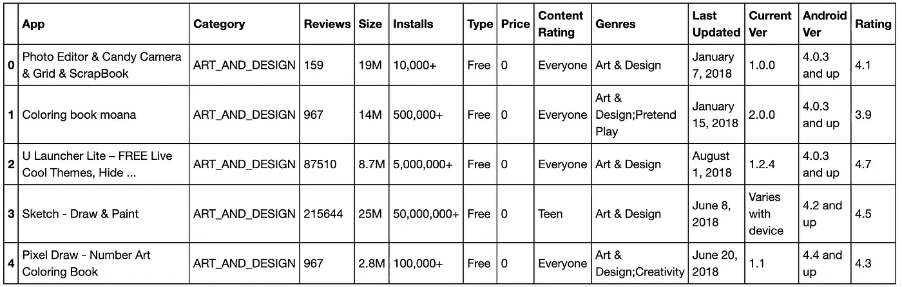

数据帧包含 13 个不同的列和 8281 行。列“ **Rating** ”代表我们模型的 Y 向量:我们试图预测的内容。我们将“**评级**的不同值形象化:

```
apps['Rating'].value_counts()
```

在可视化“**评级**的值时，我们注意到在我们的数据(19.0)中有一个**不合理的评级**。一般来说，应用程序的评级在 0 到 5 星之间。我们删除了这个值，以避免我们的模型出现偏差。如果我们认为这是一个打字错误，我们可以用 1.9 替换它，但由于我们无法确定，并且我们与数据所有者没有直接联系，所以最好将其删除。

之后，我们会检查所有重复的应用程序并删除它们:

```
print('Number of apps at the beginning:', len(apps))
apps.drop_duplicates(subset='App', inplace=**True**) 
print('Number of apps after removing duplicates:', len(apps))
```

我认为建议删除这三列(**当前版本**、 **Android 版本、**和**上次更新**)，因为这三列对于我们的分析来说是不必要的，并且对评级没有直接影响(之后可视化相关性)。

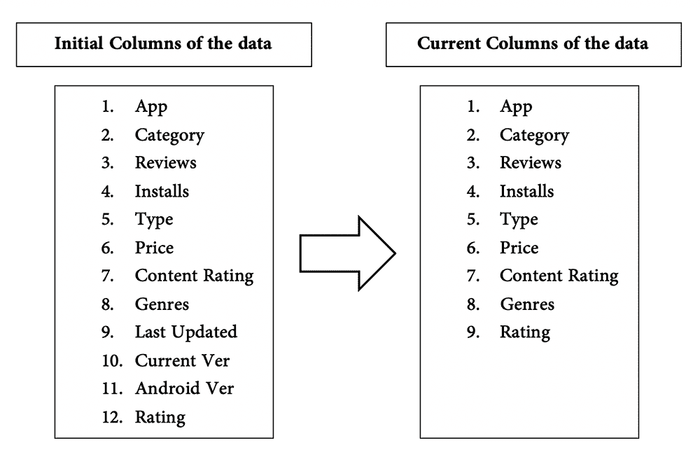

为了使数据形象化，我们必须把它转换成数字。转换是通过替换所有的字符串并以不同的方式将它们转换成数字格式来完成的。在下图中，我们概括了所有的清洁、缩放和转换步骤。

我在下图中概括了所有的步骤:

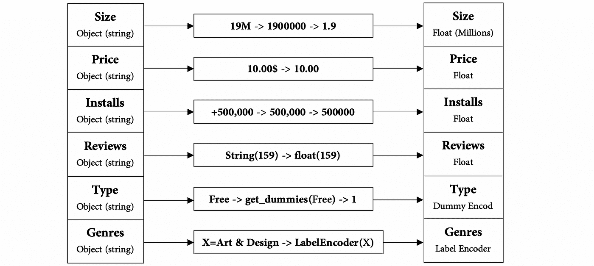

我使用的转换代码的所有部分都设置在我的 Github 库上。

# 数据可视化

一旦我们完成了所有的转换，我们在开始时使用 Seaborn 可视化“**应用评级**的分布和“**应用大小**的分布。因此，让我们来看看它，检查是否正常，并尝试纠正它，否则:

```
sns.distplot(apps['Rating'],fit=norm)
print('- Total number of ratings:', len(apps['Rating']))
print('- Mean of distribution of rating :', np.mean(apps['Rating']))
print('- Standard deviation:', np.std(apps['Rating']))
```

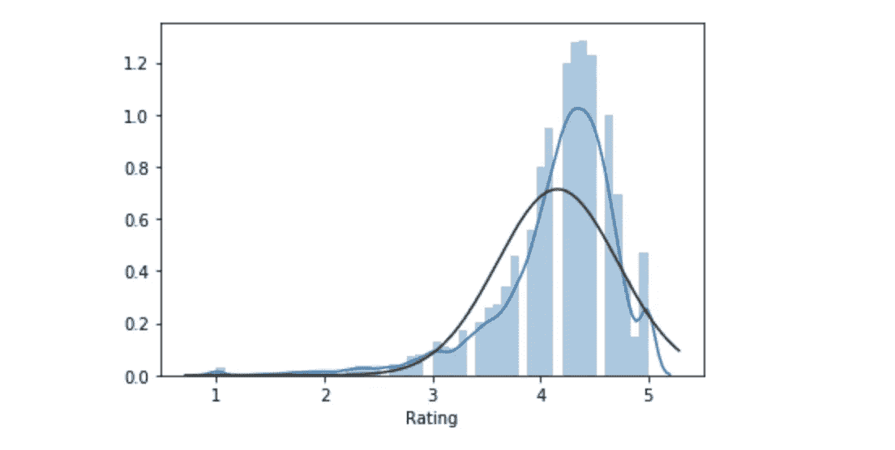

我们注意到数据集**评级**的“拟合度”从技术上讲并不符合均值为 4.16、标准差为 0.559 的正态分布。这些信息将有助于以后定义和开发模型。让我们检查一下概率图:

```
**from** **scipy** **import** stats fig = plt.figure() 
prob = stats.probplot(apps[‘Rating’], plot=plt)
```

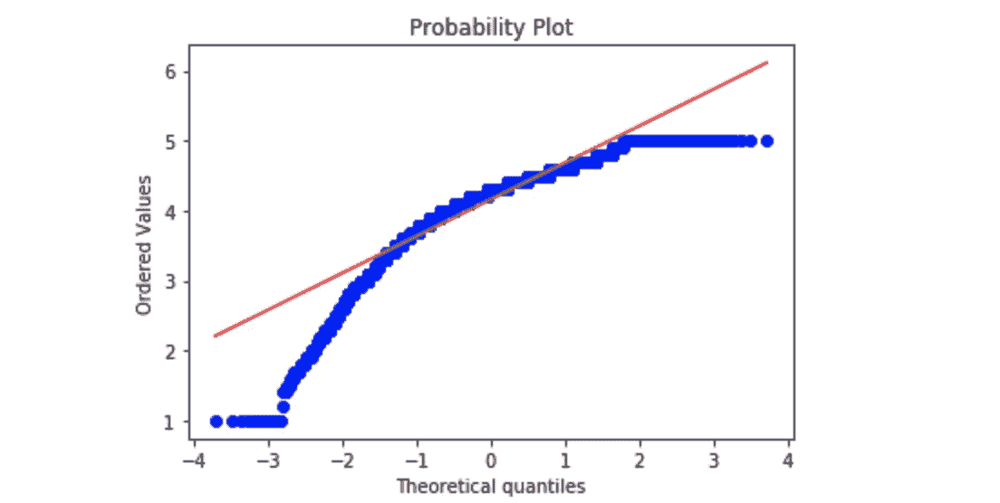

所以，肯定不正常:我们有偏斜。

我想做一些变换，以适应高斯分布。让我们对数据进行 Box-Cox 变换，看看会发生什么…**Box-Cox 变换**表示如下:

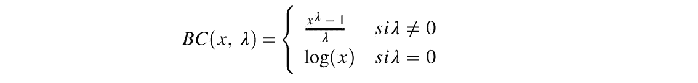

之后，我们重新设想转型后“**应用评分**的分布情况:

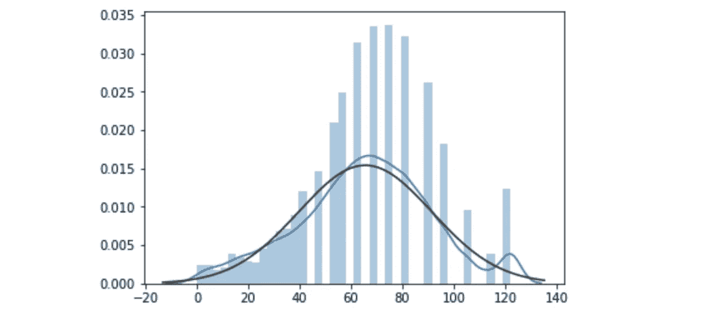

更像高斯(正态)分布！我们将在这个项目的剩余部分使用这个转换。

接下来，我们想象不同的相关性。这是帮助我们选择模型重要特性的关键一步。相关矩阵如下所示:

```
apps.corr()
```

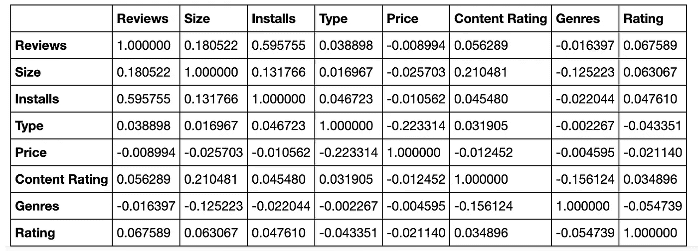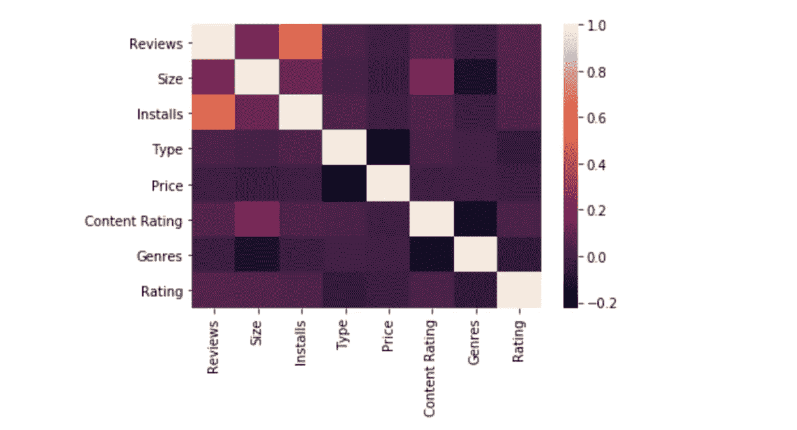

**与相关性相关的一些备注:**

*   很明显，安装数量与评论数量高度相关(k=0，59)。
*   价格越高，评级越低，相关系数为 0.02。

# **预测模型**

我们建立了两个模型:

*   随机森林回归量

```
**from** **sklearn.ensemble** **import** RandomForestRegressor
**from** **sklearn.metrics** **import** auc, accuracy_score, mean_absolute_error, mean_squared_errorchosen_features = ['Reviews', 'Size', 'Installs', 'Type','Category', 'Price', 'Content Rating', 'Genres']
X = apps[chosen_features]
y= bcx_target *#transformed rating*
X_train, X_test, y_train, y_test = train_test_split(X, y, test_size = 0.33, random_state=10)rf_reg = RandomForestRegressor()
rf_reg.fit(X_train,y_train)
y_rfpred = rf_reg.predict(X_test)
```

对于一个简单的 RF 回归器(带有转换后的评级)，我们得到:

*   均方差:0.269
*   平均绝对误差:0.352

在下图中，我们可以更好地看到随机森林回归的实际和预测评级。：

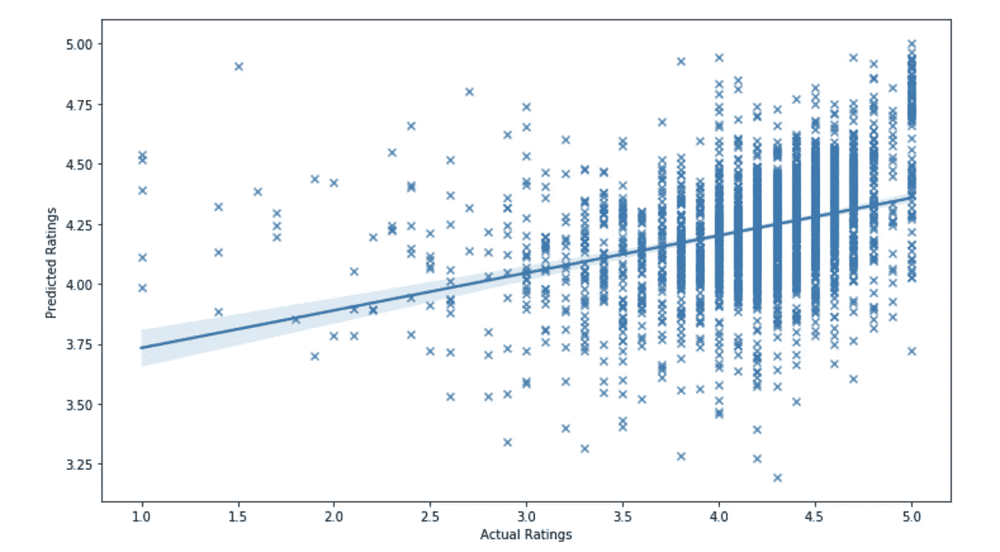

现在，让我们想象一下随机森林的估计数对 MSE 的影响:

```
estimators = np.arange(10, 500, 10)
mse_list = []
**for** i **in** estimators:
    rf_reg.set_params(n_estimators=i)
    rf_reg.fit(X_train, y_train)
    y_rfpred = rf_reg.predict(X_test)
    mse_list.append(mean_squared_error(inv_boxcox(y_test,lam), inv_boxcox(y_rfpred,lam)))
plt.figure(figsize=(10, 5))
plt.xlabel("No. of Estimators")
plt.ylabel("MSE")
plt.title("Effect of Number of Estimators")
plt.plot(estimators, mse_list)
```

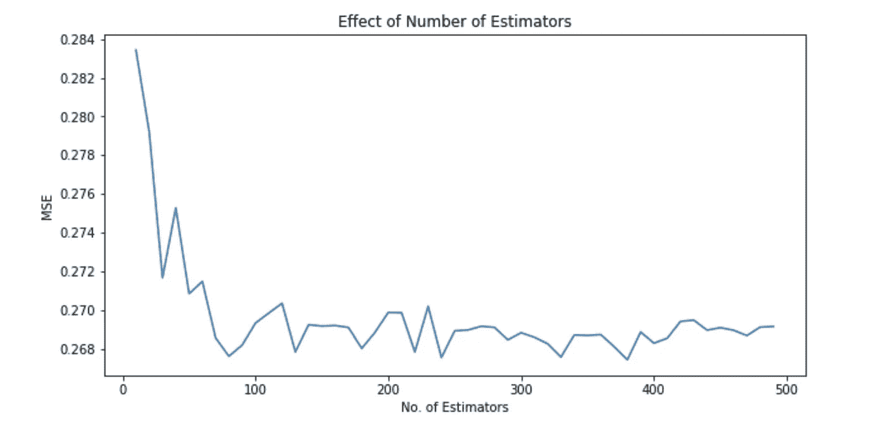

我们得到了大约 **370** 的一些估计量的最小均方误差。最低 MSE 大约等于 **0，2697** 。

*   XGBoost 回归器

```
y_xgpred = xgb_model.predict(X_test)
mse=mean_squared_error(inv_boxcox(y_test,lam), inv_boxcox(y_xgpred,lam))
print('Mean Squared Error:',mse)
```

XGboost 的 MSE 近似等于 **0，2695** 。

在下图中，我们比较了两个模型(Random Forest 和 XGboost)的预测性能。

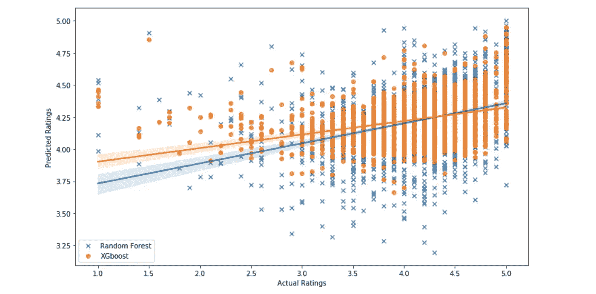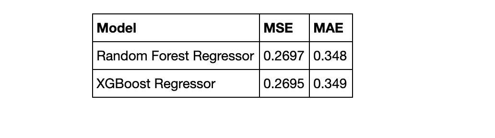

# 观点

为了不使开发时间过长，我在这里停了下来。虽然，如果我想在这方面更进一步，我会尝试这两个想法:

*   尝试一些神经网络模型(使用 Keras)。我相信如果我们为这个问题选择了最好的架构，我们会得到好的结果。
*   我还将着手处理数据集的第二部分，并应用 NLP(自然语言处理)来根据用户的评论预测应用程序的评级(通过使用所有的 NLP 技术，如标记化、文本分段……)

**我建议您查看我在这个项目中使用的代码，方法是从** [**这里**](https://github.com/anasselhoud) **在我的 Github 上可视化这个项目的 Jupyter 笔记本，并关注更多相关文章和项目。**