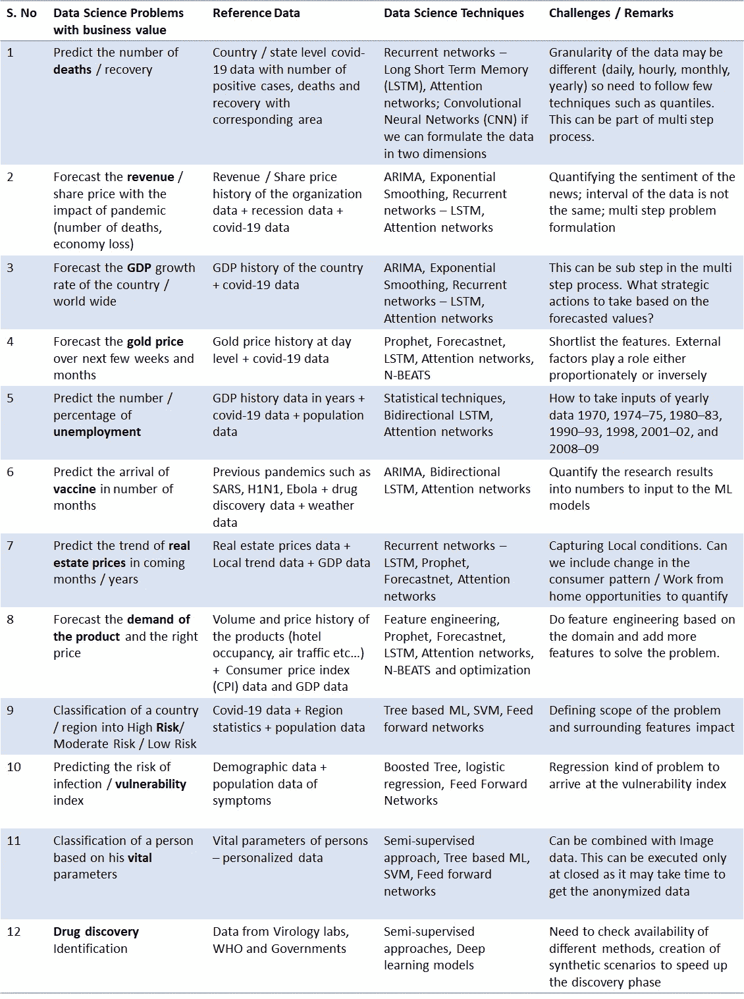
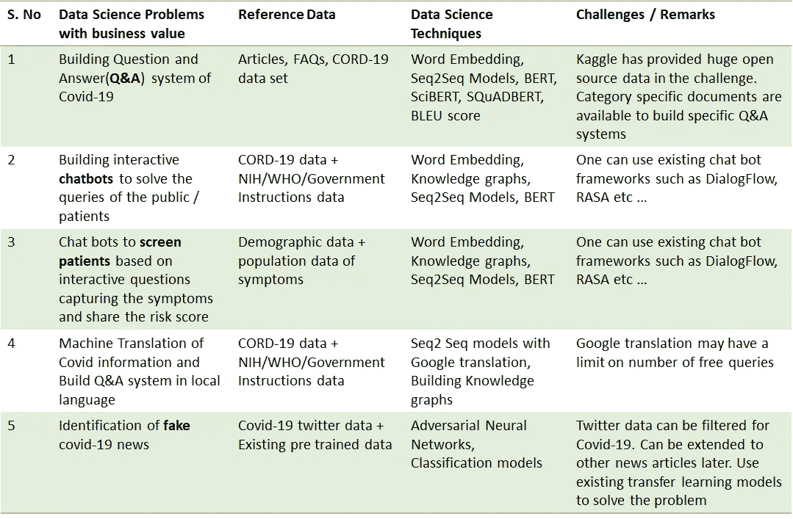
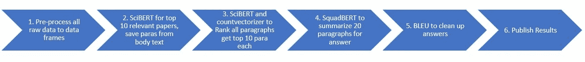
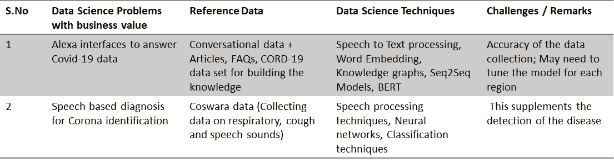
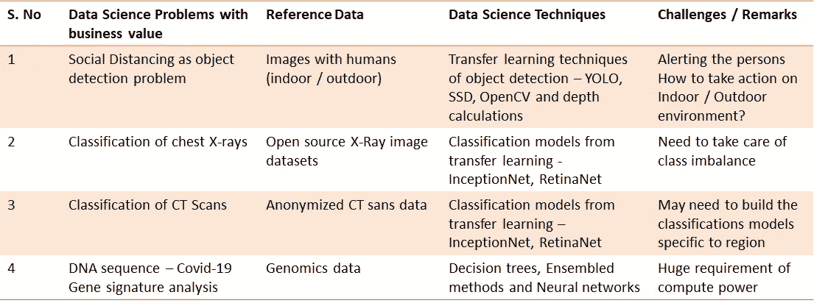
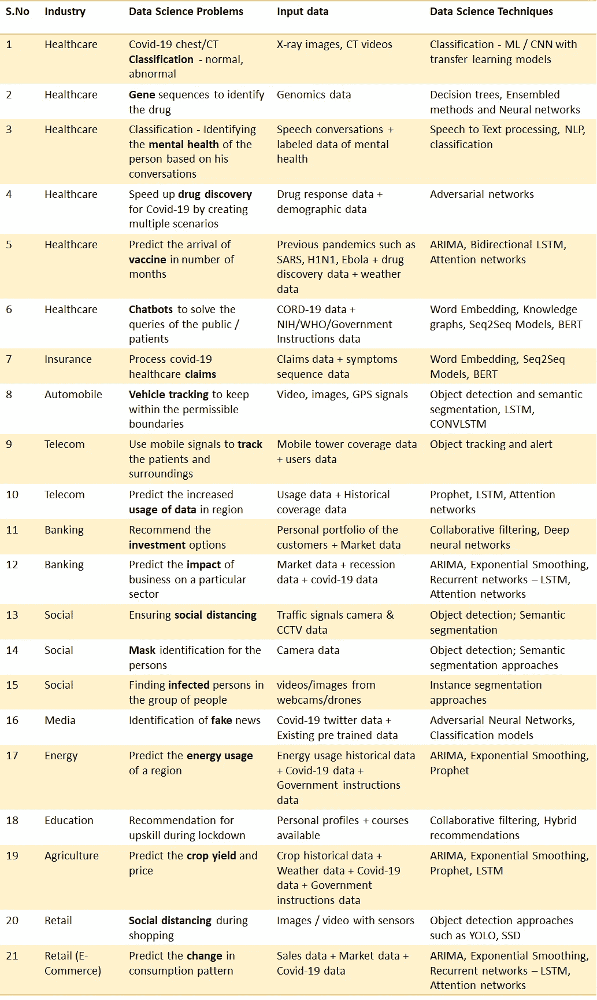

# ds4 ovid-19:在新冠肺炎，数据科学需要解决哪些问题？

> 原文：<https://towardsdatascience.com/ds4covid-19-what-problems-to-solve-with-data-science-amid-covid-19-a997ebaadaa6?source=collection_archive---------33----------------------->

## 探索 7 种类型的数据和行业垂直行业、数据集链接、数据科学技术和挑战的 40 个业务问题

在本文中，我希望分享我对我们能够解决的具有挑战性的数据科学问题的想法，这些问题在新冠肺炎有商业价值。新冠肺炎是小说《T2》的主人公，他是 20**19**【1】的后裔。本文对*数据科学发烧友*识别、制定和解决业务问题很有用，对*领导*指导他们的团队解决与其业务相关的数据科学问题也很有用。我观察到了业内两大趋势。

○我们遇到了业务问题，但不确定哪些数据有助于解决该问题？

○我们有数据，但是使用这些数据可以解决哪些业务问题？

在这两种情况下，起点是不同的。然而 ***在数据科学世界中，业务问题和解决业务问题的相关数据*** 同等重要。文章的重点是:

> 需要解决哪些业务问题？
> 
> 与新冠肺炎相关的不同数据集有哪些？
> 
> 什么样的机器学习/深度学习/统计技术可以用来解决这些问题和挑战？
> 
> 总结特定行业垂直行业需要解决的问题

正如我在前面的文章[2]中提到的，有 7 种类型的数据即 ***数字、分类、文本、图像、视频、语音和信号*** 不分行业/领域来构建数据科学的问题。

# 使用数值和分类数据要解决的问题:

表-1 总结了 ***数值型、*** 分类型数据要解决的问题类型、要使用的数据科学技术以及解决这些问题的挑战。需要解决的核心业务问题是” ***新冠肺炎对我的业务有什么影响？*、**、**、*我们感染新冠肺炎病毒的风险有多大？*** 。这些业务问题被表述为多步骤数据科学问题，如表-1 所示。

表-1:在新冠肺炎使用数值和分类数据要解决的问题列表

以下是解决上述问题的可用数据集列表。除了这些数据集，您可能还需要使用您有权访问的特定于您的组织的数据。您可以直接将原始开源数据加载到您的代码(python 笔记本)中或下载。csv 文件，然后加载它们进行进一步处理。

*   **新型冠状病毒**(新冠肺炎)病例，由(JHU)约翰·霍普斯金大学系统科学与工程中心(CSSE)提供:

https://github.com/CSSEGISandData/COVID-19

*   新冠肺炎受影响病例的日水平信息:

[https://www . ka ggle . com/sudalairajkumar/novel-corona-virus-2019-dataset](https://www.kaggle.com/sudalairajkumar/novel-corona-virus-2019-dataset)

*   新冠肺炎印度公司的具体数据可以通过该网址访问，该网址每天更新。您可以参考您所在国家/地区的具体数据进行进一步分析。

[https://api.covid19india.org/](https://api.covid19india.org/)

*   确诊、死亡、康复病例的时间序列数据:

[https://data . hum data . org/dataset/novel-coronavirus-2019-ncov-cases](https://data.humdata.org/dataset/novel-coronavirus-2019-ncov-cases)

有一些有趣的文章可以处理[3]中提到的加载数据。

*   **GDP 增长率**增长率/衰退数据参考:

[https://datahub.io/core/gdp#data](https://datahub.io/core/gdp)

[https://tradingeconomics.com/country-list/gdp-growth-rate](https://tradingeconomics.com/country-list/gdp-growth-rate)

[https://data.worldbank.org/topic/economy-and-growth](https://data.worldbank.org/topic/economy-and-growth)

*   **消费物价指数**数据可从以下网址下载:

[https://datahub.io/core/cpi#data](https://datahub.io/core/cpi)

*   **就业**数据参考:

[https://datahub.io/core/employment-us#data](https://datahub.io/core/employment-us)

*   **人口**数据可从以下网址下载:

[https://datahub.io/core/population](https://datahub.io/core/population)

*   **黄金**历史价格:

[https://datahub.io/core/gold-prices](https://datahub.io/core/gold-prices)

*   **天气**数据集:

[https://www.kaggle.com/muthuj7/weather-dataset](https://www.kaggle.com/muthuj7/weather-dataset)

*   **房地产** /房价数据:

[https://datahub.io/core/house-prices-us#data](https://datahub.io/core/house-prices-us)

*   新冠肺炎**脆弱性指数**数据与参考文献[4]:

【https://github.com/closedloop-ai/cv19index 

*   **新冠肺炎药物研发**数据集:

[https://www . ka ggle . com/jaisimha 34/covid 19-drug-discovery/data](https://www.kaggle.com/jaisimha34/covid19-drug-discovery/data)

# 使用自然语言处理解决文本数据的问题:

如果您熟悉文本处理，那么这些问题可能会让您感兴趣。表 2 总结了一系列问题、相应的文本数据、解决这些问题的技术以及一系列挑战。来自变压器的双向编码器表示(BERT)的最新进展在解决这类问题中起着至关重要的作用。

表 2:新冠肺炎文本数据需要解决的问题列表

可用的数据集链接如下:

*   新冠肺炎开放研究数据集( **CORD-19** )数据来自 Kaggle，包含 50，000 多篇文章:

[https://www . ka ggle . com/Allen-institute-for-ai/CORD-19-research-challenge](https://www.kaggle.com/allen-institute-for-ai/CORD-19-research-challenge)

*   **政府措施**数据集:

[https://www.acaps.org/covid19-government-measures-dataset](https://www.acaps.org/covid19-government-measures-dataset)

*   **假新闻检测器**数据和模型可从以下网址获取:

[https://github.com/yaqingwang/EANN-KDD18](https://github.com/yaqingwang/EANN-KDD18)

在最近的一次 Kaggle 挑战赛中，我和我的爱立信同事一起解决了构建问答系统的问题。管道中遵循的步骤以及代码和结果在以下 Kaggle URL 中共享:

[https://www . ka ggle . com/robin Liu bin/ericsso n-cord-19-challenge-task-6](https://www.kaggle.com/robinliubin/ericsson-cord-19-challenge-task-6)

图 1:解决疫情数据问答系统的管道

图 1 显示了解决问题的高级步骤，包括使用单词嵌入、BERT 方法的预处理，以及最终使用双语评估替角分数(BLEU)对结果进行排序。我的爱立信同事在这篇博客中讨论了各种实现方法。

[https://www . ericsso n . com/en/blog/2020/4/ai-data-solutions-helping-fight-corona virus](https://www.ericsson.com/en/blog/2020/4/ai-data-solutions-helping-fight-coronavirus)

# 语音数据要解决的问题:

表 3 总结了问题列表、参考语音数据、要使用的数据科学技术以及挑战列表。

表 3:新冠肺炎语音数据需要解决的问题列表

关于呼吸、咳嗽和语音声音的 Coswara 数据的详细信息(在数据收集阶段，您可以做出贡献并在以后用于建立模型)可从以下 URL 获得。咳嗽样本的诊断在[5]中有描述。

https://coswara.iisc.ac.in/

# 图像、视频数据要解决的问题:

表 4 总结了需要解决的问题、参考图像/视频数据、需要遵循的技术以及面临的挑战。

表 4:新冠肺炎图像、视频数据需要解决的问题列表

让我们检查可用的数据资源来解决上述问题。

*   **X 光、CT** 影像数据集:

[https://github.com/ieee8023/covid-chestxray-dataset](https://github.com/ieee8023/covid-chestxray-dataset)

[https://www.kaggle.com/bachrr/covid-chest-xray](https://www.kaggle.com/bachrr/covid-chest-xray)

[https://towards data science . com/新冠肺炎-成像-数据集-胸部-x 光-CT-注释-协作-5f6e076f5f22](/covid-19-imaging-dataset-chest-xray-ct-for-annotation-collaboration-5f6e076f5f22)

使用 Keras 在 X 射线图像中检测新冠肺炎的示例代码可参考[6]。

*   **基因序列**新冠肺炎的鉴定:

[https://datascience.nih.gov/covid-19-open-access-resources](https://datascience.nih.gov/covid-19-open-access-resources)

[https://www.ncbi.nlm.nih.gov/genbank/sars-cov-2-seqs/](https://www.ncbi.nlm.nih.gov/genbank/sars-cov-2-seqs/)

以下网址提供了有趣的资源，可以开始我们在基因组学和病理学领域的分析。提到了可用的计算资源，因为基因序列建模需要大量的计算能力。请利用现有资源，展示你的计算机视觉和其他机器学习技能。

[https://datascience.nih.gov/covid-19-open-access-resources](https://datascience.nih.gov/covid-19-open-access-resources)

[https://covid19pathology.nih.gov/](https://covid19pathology.nih.gov/)

# 按照行业垂直领域总结要解决的业务问题:

表 5 总结了新冠肺炎疫情各种垂直行业需要解决的数据科学问题列表。这个列表是所有垂直行业的常见业务问题的补充，例如“新冠肺炎对我的业务/股价/收入有什么影响？”。

表 5:根据行业垂直领域需要解决的具体问题列表

表 5 中介绍的数据科学技术包括 LSTM-长短期记忆、SSD-单次检测、YOLO-你只看一次、ARIMA-自回归综合移动平均、BERT-来自变压器的双向编码器表示、Seq2Seq 模型-序列到序列模型、CNN-卷积神经网络、CONVLSTM-卷积长短期记忆、NLP-自然语言处理。

我们的当务之急是安全离开疫情，然后努力实现业务连续性。COVID(公元前)前和 COVID(公元前)后的生活可能不一样。正如我们在历史上所见证的那样，每一次疫情都给人类行为和商品消费模式带来了一些变化。 ***捕捉消费者行为的变化*** 是各行各业的关键。能够提前抓住这一趋势的公司将是这一旅程的最大受益者。

# 结论:

在本文中，我主要关注数据科学家在数据可用的情况下可以解决的一系列问题。我收集了 40 个问题、相应的数据以及参考 URL 和数据科学技术来解决这些问题。这 40 个问题首先按数据类型排列，然后按行业垂直排列。具有多种数据类型(数字+文本+图像)的异构数据可用于解决进一步的一系列问题，如多模态聊天机器人、构建新冠肺炎助手等。在参考资料中共享的其他文章[7，8，9]中，可提及一些更有趣的问题。

**参考文献:**

[1][https://www . who . int/India/emergencies/novel-coronavirus-2019](https://www.who.int/india/emergencies/novel-coronavirus-2019)

[2][https://medium . com/@ sunil . vuppala/enabling-variable-type-of-health care-data-to-build-top-10-dl-applications-f5c 6 f 45 eddba](https://medium.com/@sunil.vuppala/enabling-various-types-of-healthcare-data-to-build-top-10-dl-applications-f5c6f45eddba)

[3][https://towards data science . com/新冠肺炎-数据处理-58aa 3663 F6](/covid-19-data-processing-58aaa3663f6)

[https://arxiv.org/pdf/2003.07347.pdf](https://arxiv.org/pdf/2003.07347.pdf)

[5][https://arxiv.org/pdf/2004.01275.pdf](https://arxiv.org/pdf/2004.01275.pdf)

[6][https://www . pyimagesearch . com/2020/03/16/detecting-x-ray-images-with-keras-tensor flow-and-deep-learning/](https://www.pyimagesearch.com/2020/03/16/detecting-covid-19-in-x-ray-images-with-keras-tensorflow-and-deep-learning/)

[7][https://www . Forbes . com/sites/bernardmarr/2020/03/13/coronavirus-how-artificial-intelligence-data-science-and-technology-is-used-to-fight-the-the-the-疫情/#e58ebba5f5fc](https://www.forbes.com/sites/bernardmarr/2020/03/13/coronavirus-how-artificial-intelligence-data-science-and-technology-is-used-to-fight-the-pandemic/#e58ebba5f5fc)

[8][https://www . data revenue . com/en-blog/machine-learning-新冠肺炎](https://www.datarevenue.com/en-blog/machine-learning-covid-19)

[https://covid19.iisc.ac.in/](https://covid19.iisc.ac.in/)

*期待早日走出新冠肺炎，生活在更加健康美好的世界后新冠肺炎。请在评论区分享您的反馈。*