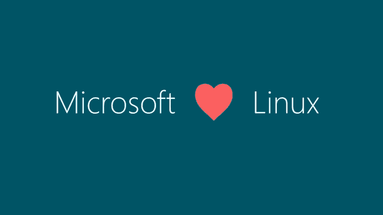
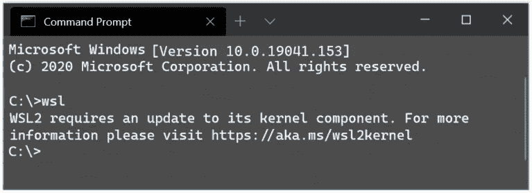
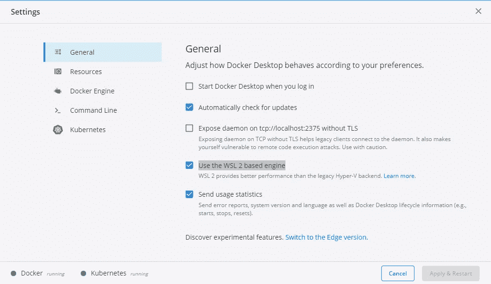
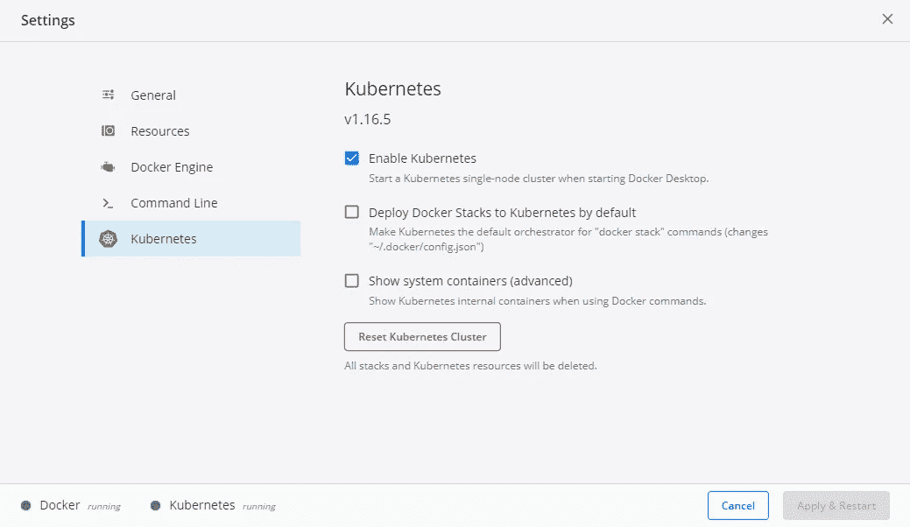
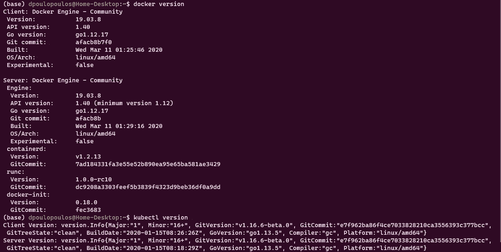
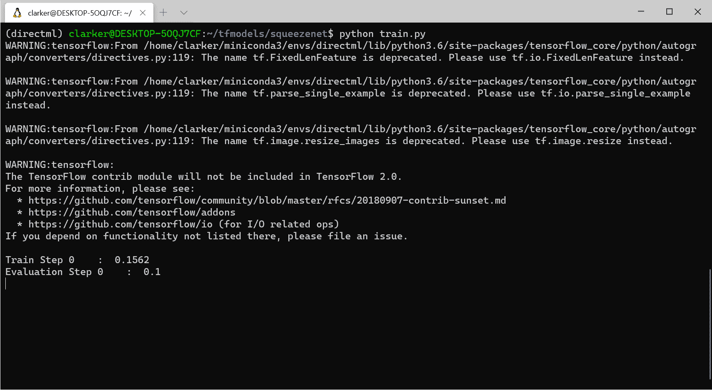
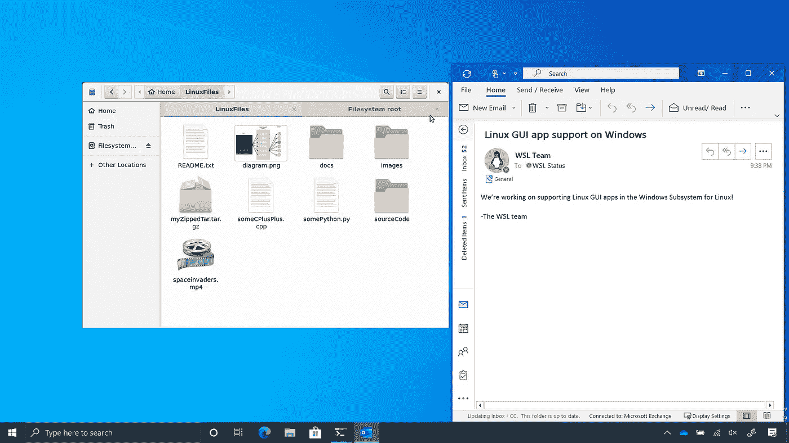

# 双重引导已死:Windows 和 Linux 现在合二为一了

> 原文：<https://towardsdatascience.com/dual-boot-is-dead-windows-and-linux-are-now-one-27555902a128?source=collection_archive---------0----------------------->

## 用 WSL 2 把你的 Windows 机器变成一个开发者工作站。


图片来自 [Pixabay](https://pixabay.com/?utm_source=link-attribution&utm_medium=referral&utm_campaign=image&utm_content=159784)

我曾经有一台苹果笔记本电脑作为我的日常司机。在那里我几乎可以做任何事情；开发、提案写作、音乐创作等。但是，对供应商锁定的恐惧，对我依赖苹果的奇思妙想和恶习的担忧——可以说这是非常昂贵的——促使我寻求一种新的解决方案。

参见第二部分:

[](/dual-boot-is-dead-the-post-mortem-cee4db42d059) [## 双重引导已死:验尸

### 只需一个命令，就可以将任何机器变成开发人员工作站。

towardsdatascience.com](/dual-boot-is-dead-the-post-mortem-cee4db42d059) 

我开始建立一个机器学习工作站；一个伟大的 CPU，大量的内存和一个称职的 GPU，等等。我选择的几乎所有操作系统都是 Ubuntu，除了我需要微软 Office 来写提案。Office online 还没有出现，让我们面对现实吧，LibreOffice 是一场灾难。所以，解决方案是双启动 Ubuntu 和 Windows 10。你体验到的从苹果转移到 Ubuntu 的自由是无与伦比的，你拥有的构建自己的 PC 的选项几乎是无限的。

很长一段时间里，双靴都是答案。一百万次上下文切换之后，WSL 来了。因此，我开始将部分工作流程转移到 Windows 上。但是，仍然有许多东西不见了。然而， **WSL 2 似乎是一个游戏改变者。** **在这个故事中，我将向您展示如何将您的开发工作流程迁移到 Windows 10 和 WSL 2，它的新功能以及在不久的将来可以期待什么。**

> [学习率](https://www.dimpo.me/newsletter)是我每周给那些对 AI 和 MLOps 世界好奇的人发的简讯。你会在每周五收到我关于最新人工智能新闻、研究、回购和书籍的更新和想法。在这里订阅！

# 什么是 WSL 2

WSL 2 是 WSL 架构的新版本。这个版本有几个变化，决定了 Linux 发行版如何与 Windows 交互。



**在这个版本中，您可以获得更高的文件系统性能和完整的系统调用兼容性。**当然，您可以选择以 WSL 1 或 WSL 2 运行您的 Linux 发行版，而且，您可以随时在这两个版本之间切换。WSL 2 是对底层架构的重大改进，使用虚拟化技术和 Linux 内核来支持其新特性。但是微软处理本质细节，所以你可以专注于重要的事情。

# 装置

微软承诺在不久的将来 WSL 2 会有一个流畅的安装体验，并且能够通过 Windows updates 更新 Linux 内核。现在，安装过程有点复杂，但没什么可怕的。

在这个例子中，我们将在 Windows 10 上安装 Ubuntu 20.04。但是这个过程对于微软商店中的任何发行版都是一样的。首先，您应该启用 Linux 的 *Windows 子系统*可选特性。以管理员身份打开 PowerShell，并运行以下命令:

```
dism.exe /online /enable-feature /featurename:Microsoft-Windows-Subsystem-Linux /all /norestart
```

下一步，我们将把我们的系统更新到 WSL 2。为此，Windows 10 必须更新到 2004 版，并且必须在 BIOS 设置中启用英特尔的虚拟化技术。以管理员身份启动 PowerShell，并运行以下命令:

```
dism.exe /online /enable-feature /featurename:VirtualMachinePlatform /all /norestart
```

重新启动您的机器以完成 WSL 安装并更新到 WSL 2。然后，在安装新的发行版时，您需要将 WSL 2 设置为我们的默认版本。为此，以管理员身份打开 PowerShell 并运行以下命令:

```
wsl --set-default-version 2
```

运行命令`WSL 2 requires an update to its kernel component. For information please visit [https://aka.ms/wsl2kernel](https://aka.ms/wsl2kernel.)` [后，您可能会看到这条消息。](https://aka.ms/wsl2kernel.)按照这个链接，从那个页面安装 MSI，在您的机器上安装一个 Linux 内核，供 WSL 2 使用。安装内核后，再次运行该命令，它应该会成功完成，而不会显示消息。



最后但同样重要的是，我们应该安装一个 Linux 发行版。打开微软商店，搜索 [Ubuntu 20.04 LTS](https://www.microsoft.com/store/apps/9n6svws3rx71) 。安装后，你应该可以在我们的开始菜单上找到一个新的 Ubuntu 应用程序。启动它并按照说明(主要是创建一个新的 UNIX 用户)来完成安装。

要检查您的 Linux 发行版是否安装在 WSL 2 上，运行`wsl --list --verbose`。如果结果表明它使用 WSL 1，您可以通过运行`wsl --set-version <distribution name> <versionNumber>`来改变它。

仅此而已。你现在有一个完整的 Ubuntu 发行版在 Windows 10 中运行了！

# 开发人员工作站

安装好 Ubuntu 后，你就可以安装任何你需要的东西了。例如，如果您是数据科学家，您可以安装最新的 Anaconda 发行版，如果您是前端工程师，您可以安装 angular 和 npm 等等。但是有两个工具我想重点介绍一下:Visual Studio 代码和 Docker + Kubernetes。

## Visual Studio 代码

Visual Studio 代码是许多开发人员的首选 IDE。现在我们已经启用了 WSL 2，VS 代码绝对必要的扩展是[远程开发](https://marketplace.visualstudio.com/items?itemName=ms-vscode-remote.vscode-remote-extensionpack)。

这个插件支持针对 WSL 2、容器映像甚至是通过 SSH 的远程 VM 上的源代码进行远程开发。因此，我们现在可以在运行于 WSL 2 上的 Linux 发行版中创建项目文件夹，并使用安装在 Windows 10 上的 Visual Studio 代码编辑器作为我们的 ide。

所有的特性都在那里:对 IntelliSense 的全面语言支持，git 集成，我们知道并喜欢的 Visual Studio 代码扩展，调试器和终端。所以，把手弄脏，开始编码吧！

## Docker + Kubernetes

Docker for Windows 不错，但并不伟大。这是我最想念的东西，每当我需要为我的代码构建 docker 映像时，它就让我在 Windows 和 Ubuntu 之间切换。但是 WSL 2 提供了完整的 docker 支持，在我看来，这甚至比纯 Linux 体验更好。

要启用它，导航到 Docker 桌面设置并启用`Use the WSL 2 based engine`选项。



为 WSL 2 启用 Docker

此外，您可以运行本地 Kubernetes 集群，方法是导航到设置的`Kubernetes`部分并勾选复选框。



在 WSL 2 上启用 Kubernetes

你现在可以返回到 WSL 2 上的 Ubuntu，运行`docker version`或`kubectl version`并看到这两个已经启动并运行了。



运行在 WSL 2 上的 Docker 和 Kubernetes

## 额外收获:新的 Windows 终端

额外的好处是，你可以安装新的 [Windows 终端](https://www.microsoft.com/en-us/p/windows-terminal/9n0dx20hk701?activetab=pivot:overviewtab)。商店描述将新的 Windows 终端定义为一个现代的、快速的、高效的、强大的和多产的终端应用程序，供命令行工具和 Shell(如命令提示符、PowerShell 和 WSL)的用户使用。它的主要功能包括多个选项卡，窗格，Unicode 和 UTF-8 字符支持，GPU 加速文本渲染引擎，以及自定义主题，样式和配置。

此外，它非常漂亮，您可以通过它的可访问设置(只是一个 JSON 文件)来设计它的风格。在这里寻找灵感！有关新 Windows 终端的更多信息，请点击此处:

[](/new-windows-terminal-the-best-you-can-have-9945294707e7) [## 新的 Windows 终端:你不能要求更多

### 新的 Windows 终端在一个智能和高度可定制的包中结合了一切。

towardsdatascience.com](/new-windows-terminal-the-best-you-can-have-9945294707e7) 

# 路标

仍然缺少一些特性，但是 WSL 2 已经走上了正确的道路。在接下来的几个月里，您将能够用一个命令安装 WSL。只需打开一个 Windows 终端，输入`wsl.exe --install`。此外，首次安装时，WSL 2 将是新的默认设置。

但是有两个特性是开发者最期待的:GPU 支持和 GUI app 支持。

自 WSL 1 发布以来，向 WSL 添加 CUDA 和/或 GPU 计算支持是最受欢迎的特性。在过去的几年里，WSL、虚拟化、DirectX、Windows 驱动程序团队和其他合作伙伴一直在努力开发这一工程特性。敬请关注！



在 WSL 2 上训练深度学习模型(启用 CUDA)

此外，对 Linux GUI 应用程序的支持也即将到来。例如，您将能够在已经安装的 Linux 环境中运行您首选的 Linux GUI 文本编辑器或 IDE。你甚至可以在你的 Windows 机器上开发 Linux GUI 应用程序！



WSL 2 的 Linux GUI 支持

# 结论

在这个故事中，我们看到了 WSL 2 如何将您的 Windows PC 变成运行 Linux 发行版的开发人员工作站。速度已经有了，功能也有了，更多的功能即将出现，因此，我认为双引导已经死了！

> [学习率](https://www.dimpo.me/newsletter)是我每周给那些对 AI 和 MLOps 世界好奇的人发的简讯。你会在每周五收到我关于最新人工智能新闻、研究、回购和书籍的更新和想法。在这里订阅！

## 关于作者

我叫 [Dimitris Poulopoulos](https://www.linkedin.com/in/dpoulopoulos/) ，我是一名为 [BigDataStack](https://bigdatastack.eu/) 工作的机器学习研究员。我也是希腊比雷埃夫斯大学的博士生。我曾为欧洲委员会、欧盟统计局、国际货币基金组织、欧洲中央银行、经合组织和宜家等主要客户设计和实施人工智能和软件解决方案。

如果你有兴趣阅读更多关于机器学习、深度学习、数据科学和数据操作的帖子，请在 twitter 上关注我的 [Medium](https://medium.com/@dpoulopoulos) 、 [LinkedIn](https://www.linkedin.com/in/dpoulopoulos/) 或 [@james2pl](https://twitter.com/james2pl) 。