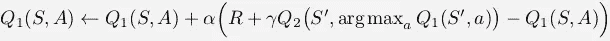
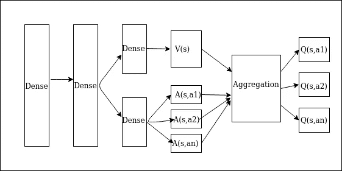

# 使用 Tensorflow 2.x 决斗双深度 Q 学习

> 原文：<https://towardsdatascience.com/dueling-double-deep-q-learning-using-tensorflow-2-x-7bbbcec06a2a?source=collection_archive---------21----------------------->

## 用 TensorFlow 2.x 实现决斗式双深度 q 学习

在本文中，我们将了解决斗双深度 q 学习的概念和代码。这涉及到一些应用于深度 Q 学习方法的改进技术。让我们首先理解这个方法背后的概念，然后我们将研究代码。

## 双 DQN

这种方法解决了 DQN 高估的问题。这种高估是由于在 Q 学习更新等式中存在下一个状态的最大 Q 值。Q 值上的最大值算子导致最大化偏差，这可能导致代理在某些环境中的不良性能，在这些环境中，真实值的最大值为零，但是代理的最大估计值为正。

双 Q 学习更新，图像通过强化学习:
理查德·萨顿和安德鲁·g·巴尔托介绍

我们将在代码中使用上述等式的深度 RL 版本。

## 决斗 DQN

在决斗 DQN，有两种不同的估计如下:

1.  估计给定状态的值:这估计代理处于该状态有多好。
2.  对一个状态中每个动作的优势进行估计。

我们的 DDDQN

这两个估计值可以汇总为[Q = V+A-所有 A 的平均值]

# 使用 Tensorflow 2.x 的代码

## 神经网络:

1.  我们从使用 TensorFlow 子类 API 定义 DDDQN 类开始，注意我们使用了两个密集层，因为我们有数字输入。您不需要指定任何输入形状。
2.  请注意，我们的调用函数的状态值为“v ”, advantage 为“and Q 是聚合。
3.  我们还为动作选择定义了一个优势方法。

## 体验回放:

1.  我们的经验重放类包含两个方法，一个用于存储经验，另一个用于获取训练样本。
2.  我们首先将内存定义为全零初始化的 numpy 数组。请注意，数据类型应该根据环境而定。
3.  我们有一个指针，从零开始，每次存储经验时递增。请注意，索引是通过取模来定义的，因为索引永远不会超过缓冲区的大小。
4.  在采样方法中，我们首先检查缓冲区是否已满，并且仅从可用的经验中进行采样。这是因为我们不想采样零值进行训练。

## 代理人:

我们的代理类包含以下方法:

初始值设定项:

1.  我们首先定义所有需要的变量，并编译我们的目标网络和 q 网络。
2.  self.trainstep 用零初始化，它记录我们的 q 模型被训练的次数。
3.  self.replace 用于在目标网络中复制 q 个网络权重。我们将在培训方法中使用这一点。

行动选择方法:

1.  我们希望我们的代理选择当时的最佳行动，但我们也希望我们的代理探索其他行动的优化。为此，我们采取随机行动，直到随机值小于或等于ε。
2.  如果随机值大于ε，我们通过使用模型中的优势方法采取最佳行动。

更新 _ε，更新 _ 记忆，更新 _ 目标:

1.  update_epsilon 用于每次训练后更新 epsilon 值。请注意，epsilon 的最小值可以是 0.01，就像前面在 __init__ 方法中指定的那样。
2.  Update_mem 充当连接器 b/w 代理，并在体验重放中存储体验方法。
3.  Update_target 用于用 q 个网络权重更新我们的目标模型。

DDDQN 训练方法:

1.  训练方法用于为 q 值训练我们的 q 网络。
2.  该方法以一个条件开始，即直到经验缓冲区具有至少批量大小的足够数量的经验，训练才会开始。
3.  下一个条件在 q 网络被训练自替换次数后，每次更新目标网络。
4.  然后我们抽样一批经验。这些样本批次是状态、动作、奖励、下一个状态和完成变量 numpy 数组。
5.  然后由 Q 网络和目标网络分别预测当前状态和下一状态的 Q 值。用于执行此任务的代码将一组状态作为输入，并返回一组预测。
6.  然后我们用 q 网络计算下一个状态的 q 值最大的动作。**注意，我们没有使用优势法。**
7.  然后，我们计算批索引并执行更新操作。**注意** **本次更新使用双 DQN 更新，即我们根据下一状态下的 q 网络，为具有最大 q 值的动作放置由目标网络预测的 q 值，而不是下一状态的最大 q 值。**
8.  更新等式乘以 done 变量，因为对于终端状态，q 值总是零。
9.  然后，我们训练模型，更新ε，并增加训练步长。

> 重要提示:这里使用了 numpy 数组，不需要循环。
> 
> 重要提示:我们没有在训练方法中使用优势方法。我们只对动作选择而不是 q 值使用优势方法。

## 代理培训:

1.  在下面的代码中，代理与环境交互并进行更新。

你可以在这里找到这篇文章的代码。为了更好地理解，您还可以在同一个存储库中查找 DQN 文件。

感谢你阅读我的文章，希望你喜欢并且能够理解我想要解释的东西。希望你阅读我即将发表的文章。哈里奥姆…🙏

# 参考资料:

 [## 强化学习，第二版

### 显着扩大和更新的广泛使用的文本强化学习的新版本，最…

mitpress.mit.edu](https://mitpress.mit.edu/books/reinforcement-learning-second-edition)  [## 菲尔的机器学习

### 你好。在 Neuralnet.ai，我们涵盖了各种主题的人工智能教程，从强化…

www.youtube.com](https://www.youtube.com/channel/UC58v9cLitc8VaCjrcKyAbrw)  [## 用于深度强化学习的决斗网络架构

### 近年来，在强化学习中使用深度表征取得了许多成功。尽管如此，许多…

arxiv.org](https://arxiv.org/abs/1511.06581)